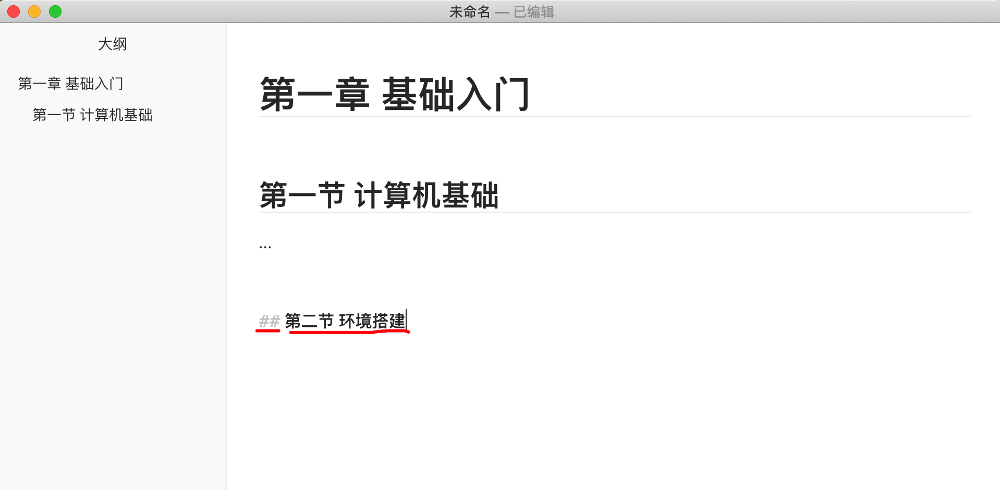
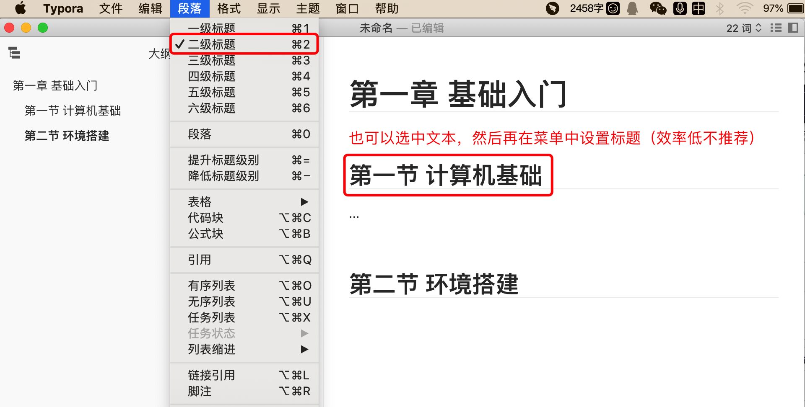
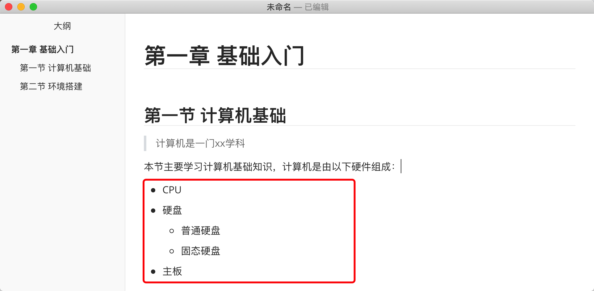
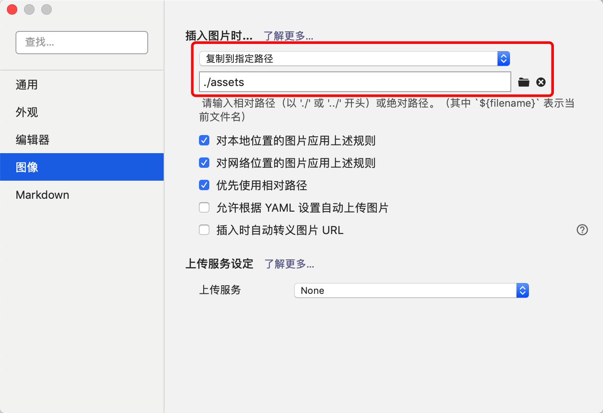
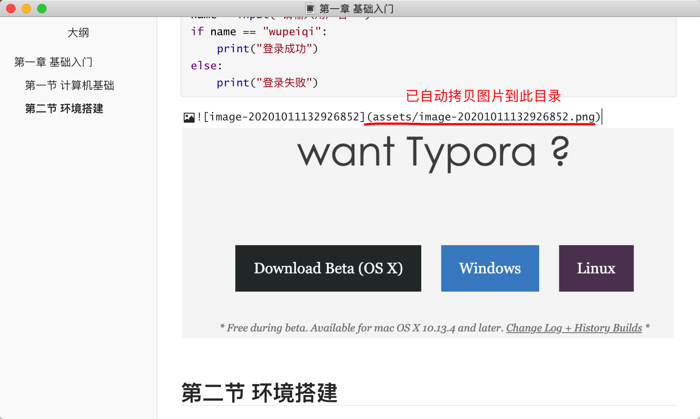

# 学习须知

在正式开始学习前，带大家先来了解下路飞学城的授课和学习模式，这是结合众多学员的学习感受并根据我们多年课程开发经验制定出来，让你可以快速并高效的掌握授课内容。


## 1. 授课须知

- 模块闯关式教学，每个模块都【笔试】&【线上面试】的考核，只有考核通过之后才能开通下一模块进行学习，以保证学员掌握每个阶段的知识点。

- 以天为单位授课和学习，学员需每天完成对应的任务，包括：知识点学习、练习题 和 每天的作业。
  注：练习题和作业都有视频讲解，学员需自己独立完成之后再根据视频讲解来核对自己的答案正确与否。

- 自主项目研发，为了培养学员独立开发项目能力，在学习期间指导学员自己开发出3个项目（除授课项目以外），毕业之后直接可以胜任企业安排的开发任务。

  

## 2. 建议学习方式

- 学习笔记，在观看视频学习的过程中，可以结合老师讲解的知识点做好自己的课程笔记，便于回顾和复习。在每个模块结束时，可根据自己课堂笔记进行复习（不要再重新观看视频），提高学习效率。

- 课堂练习 / 作业题，自己独立完成之后，再看老师的讲解视频，通过对比了解的自己的不足。

- 模块总结，在每个模块结束时，回顾当前模块中所有知识点并将其整理成一个思维导图，回顾知识点的同时也可以了解所有知识点关联关系，可帮助加深记忆。

- 错题本，将自己所有的错题都记录下来，在模块结束时，着重去复习以前做过的错题。

- 单词本，编程会涉及到一些英语单词，英语薄弱的同学建议整理一份单词本，每天早上和晚上看一遍。

  

## 3. 笔记

作为程序员平时编写笔记和开发文档时一般都使用Markdown格式，为了让你能成为更加专业的程序员，所以建议大家的课程笔记都要使用Markdown格式来编写。

Markdown格式的文档可以用很多工具来编写，此处建议推荐大家使用 Typora 工具。


### 3.1 下载Typora

官网地址：https://www.typora.io/


### 3.2 Typra大纲视图


### 3.3 标题

在文档中可以快速实现标题的编写，基本结构为：

- `# 内容`，一级标题
- `## 内容`，二级标题
- `### 内容`，三级标题
- ...

注意：#符号和文本中间必须有空格。





### 3.4 引用

在文档中想要让文本内容以 引用 方式展示，可通过 `> 内容` 格式实现。如：

```
> 计算机一门xx学科
```


### 3.5 列表

想要以列表的形式展示数据，可以通过 `- 内容` 格式实现，如：

```
- CPU
- 硬盘
  - 普通硬盘
  - 固态硬盘
- 主板
```



### 3.6 代码

想要在文档中集成代码时，可以通过 ` 符号包裹实现，如：

```
​```Python
name = input("请输入用户名：")
if name == "wupeiqi":
	print("登录成功")
else:
    print("登录失败")
​```
```

注意：第一行写上Python表示代码会按照Python的语法进行高亮显示（也可以是Java等其他语言）。


### 3.7 图片

想要在文档中显示图片时，可以通过 ``来展示，但这种编写方式比较麻烦，因为需要自己录入图片的路径，所以一般不会这么写入图片，而是选择直接 复制图片 或 截图 直接粘贴到文档中，Typora可以自动帮助我们生成图片格式。

为了将文档中的管理文档中的图片，防止因为删除导致图片在文档中丢失，所以一般会在Typora中设置成将文档中的图片都复制到制定目录。

在Typora中找到设置页面，并按照图片先进行如下设置：




那些接下来就可以直接将图片粘贴到文档中且Typora自动将图片保存至文档根目录的 assets 文件夹中。




上述就是我们Typora最常见的功能，其他更多功能在后续课程中会逐步交给大家。


## 总结

希望大家在了解授课模式之后，按照建议方式进行学习，早日学成！！！