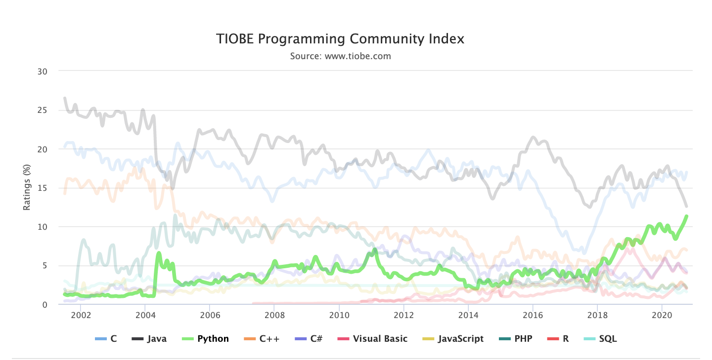
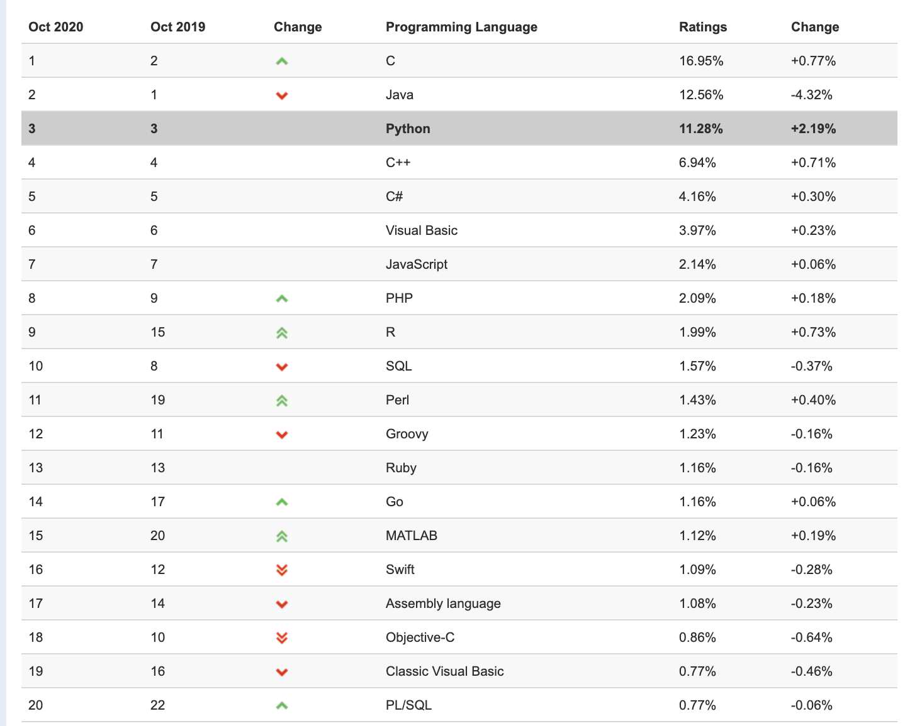

# day01 计算机基础和环境搭建

课程目标：让大家了解计算机基础知识并完成Python的环境搭建。

课程概要：

- 计算机基础
- 编程的本质
- Python的介绍
- Python环境的搭建


## 1.计算机基础

### 1.1 基本概念

- 计算机的组成

  ```
  计算机是由多个硬件组合而成，常见的硬件有：CPU、硬盘、内存、网卡、显示器、机箱、电源....
  
  注意事项：机械将零件组合在一起，他们之间是无法进行协作。
  ```

- 操作系统

  ```
  用于协调计算机的各个硬件，让硬件之间进行协同工作，以完成某个目标。
  常见的操作系统分类：
  - windows，优点：生态牛逼、工具多；缺点：略慢、收费。【个人】
  	- xp
  	- win7
  	- win10
  	...
  - linux，优点：资源占用少、免费（很多公司的服务器上安装Linux）；缺点：工具少、告别游戏。【企业的服务器】
  	- centos
  	- ubuntu
  	- redhat
  	...
  - mac，优点：生态还行、工具差不多都有、用户体验和交互； 缺点：不能玩游戏
  ```

- 软件（应用程序）

  ```
  在安装上操作系统之后，我们会在自己电脑上安装一些常用的软件，例如：QQ、杀毒、微信...
  
  问题来了：这些软件是由谁开发的？是由各大公司的程序员开发的。
  
  以后的你肯定是写`软件`，可以把软件理解成为一大堆的代码（一篇文章）。
  ```

  

### 1.2 编程语言

软件，是由程序员使用 编程语言 开发出来的一大堆代码的集合。全球的编程语言有2500+多种，常见的编程语言：Java、C#、Python、PHP、C...

作文，是由小学生使用 汉语/英语/法语/日语... 写出来一大堆的文字的集合。


本质上学习编程语言就是学习他的语法，根据语法再去编写相应的软件中的功能。

- Python语言中输出的语法规则

  ```python
  print("我是Alex的二大爷")
  ```

- Golang语言中的输出的语法规则

  ```go
  fmt.Println("我是Alex二大爷")
  ```


### 1.3 编译器/解释器

编译器/解释器，就是一个`翻译官`，将代码翻译成计算机能够识别的命令。

```

A使用Python开发了一个软件 1000              B使用Golang开发了一个软件 2000

       Python解释器                        Golang编译器

                    操    作    系    统

               CPU    硬盘    网卡    内存    电源 .....
```


为什么有的叫解释器？有的叫编译器？

- 解释器，实时翻译。拿到1000行代码之后，解释一句交给操作系统一句。
- 编译器，全文翻译。拿到2000行代码之后会将他编译成一个临时文件（计算机能够识别命令），再把文件交给操作系统去读取。


Python、PHP、JavaScript、Ruby...一般称为解释型语言。

C、C++、Go、Java...一般称为编译型语言。


## 2.学习编程的本质

学编程本质上就是三件事：

- 选择一门编程语言，在自己的电脑上安装此编程语言相关的 编译器/解释器。
- 学习编程语言的语法规则，根据语法规则 + 业务背景 设计并开发你的软件（代码集合）。
- 使用 编译器/解释器 去运行自己写的代码。


## 3.Python的介绍

### 3.1 语言的分类

- `翻译`的维度

  - 解释型语言，Python、Ruby....
  - 编译型语言，C、C++、Golang

- `高低`的维度

  - 低级编程语言，写出来的代码直接可以被计算机识别。

    ```
    机器语言，101 001 00001 00010 001000100010001，机器码，交给计算机去执行。
    汇编语言，MOV INC ... ，指令，交给计算机去执行。
    ```

  - 高级编程语言，写出来的代码无法直接被计算机识别，但可以通过某中方式将其转换为计算机可以识别的语言。

    ```
    C、C++、Java、Python、Ruby...，这类编程语言在编写代码时几乎是写英语作文。
    交由相关编译器或解释器翻译成机器码，然后再交给计算机去执行。
    ```

注意：现在基本上都使用高级编程语言。

### 3.2 Python

> Python的创始人为吉多·范罗苏姆（Guido van Rossum）。1989年的圣诞节期间，Guido开始写Python语言的编译器。Python这个名字，来自Guido所挚爱的电视剧Monty Python’s Flying Circus。他希望这个新的叫做Python的语言，能符合他的理想：创造一种C和shell之间，功能全面，易学易用，可拓展的语言。

全球众多编程语言，为何Python可以脱颖而出成为业界炙手可热的编程语言？目前位居TIOBE排行榜第三名并且一直呈上升趋势。







Python如此火爆的原因如下：

- 语法简洁 & 适合小白学习，相比较于其他编程语言Python的学习成本非常低，甚至可以让其他行业的人快速掌握编程技能，通过编程提供工作效率，例如：Excel自动化办公、文件和文件夹的处理等。
- 类库强大，Python自诞生之初就任其自然生长，经过多年的发展，造就其在很多领域都是积累了很多方便的类库，自然也成为了运维自动化、数据分析、机器学习首选编程语言。
- 开发效率极高，结合Python语法精炼和类库齐全的特点，所以在使用Python进行开发时可以用更少的代码完成更多的功能，大大提升开发效率。例如：Python10行代码实现的功能，用其他语言可能需要100+行才能完成。


### 3.3 Python的解释器种类（了解）

想要学一门编程语言：安装Python解释器、学习python语法并编写代码、使用Python解释器去执行编写好的代码。

Python在全球非常的火，很多公司都会想要来层热度。


由于Python太火了，所有就有很多的公司都开发了Python解释器（用来翻译python代码成为计算机能够识别的命令）。

- CPython【主流】，底层是由C语言开发出来的Python解释器。
- Jython，是由Java语言开发出来的Python解释器，方便与让Python和Java代码做集成。
- IronPython，是基于C#语言开发出来的Python解释器，方便与让Python和C#代码做集成。
- RubyPython，...
- PyPy，是对CPython的优化，他的执行效率提高了。引入编译器的功能，本质上将Python代码进行编译，再去执行编译后的代码。
- ...

注意：常说的Python解释器默认指的就是CPython解释器。


### 3.4 CPython解释器的版本

CPython的解释器主要有两大版本：

- 2.x，目前最新的Python2.7.18。（2020后不再维护）

  ```
  Being the last of the 2.x series, 2.7 received bugfix support until 2020. Support officially stopped January 1 2020, and 2.7.18 code freeze occurred on January 1 2020, but the final release occurred after that date.
  ```

- 3.x，目前最新的3.9.0版本（授课）。


## 4.环境搭建

- Python解释器，将程序员编写的python代码翻译成计算机能够识别的指令。
  - 主流CPython
  - 3.9.0版本
- 学习编程本质上的3件事
  - 安装 CPython 3.9.0版本解释器
  - 学习Python语法并写代码
  - 解释器去运行代码


### 4.1 安装Python解释器

#### 4.1.1 mac系统

- 去Python官网下载Python解释器（3.9.0版本）

  ```
  https://www.python.org/
  ```

- 安装

  ```
  默认Python解释器安装目录： /Library/Frameworks/Python.framework/Versions/3.9
  
  有bin目录下有一个 python3.9 文件，他就是Python解释器的启动文件。
  解释器路径：/Library/Frameworks/Python.framework/Versions/3.9/bin/python3.9 
  ```

- 写一个简单的Python代码并且让解释器去运行。

  ```python
  name = input("请输入用户名:")
  print("欢迎使用NB系统：",name)
  ```

  将文件保存在：文稿/hello.py【/Users/wupeiqi/Documents/hello.py】

  接下来要让解释器去运行代码文件：

  ```
  - 打开终端
  - 在终端输入：解释器 代码文件
    /Library/Frameworks/Python.framework/Versions/3.9/bin/python3.9 /Users/wupeiqi/Documents/hello.py
  ```

- 【补充】系统环境变量

  ```
  - 假设你有30个Python文件要运行
     /Library/Frameworks/Python.framework/Versions/3.9/bin/python3.9 /Users/wupeiqi/Documents/hello1.py
     ...
     /Library/Frameworks/Python.framework/Versions/3.9/bin/python3.9 /Users/wupeiqi/Documents/hello30.py
  
  - Python解释器的路径每次不用再写这么长。
      - 将  /Library/Frameworks/Python.framework/Versions/3.9/bin 添加到系统的环境变量中。
      - 以后再使用Python解释器去运行python代码时，就可以这样：
      	 python3.9 /Users/wupeiqi/Documents/hello1.py
      	 ...
      	 python3.9 /Users/wupeiqi/Documents/hello2.py
  
  - 如何将 /Library/Frameworks/Python.framework/Versions/3.9/bin 添加到系统的环境变量中 ？
  	- 默认你不用添加，默认Python解释器在安装的过程中已经帮你添加了。
  	- 自己手动想添加：
  		 - 打开用户目录的下的  .bash_profile 文件（.zprofile）
  		 - 在文件中写如下内容
  ```

  ```
  # Setting PATH for Python 3.9
  # The original version is saved in .zprofile.pysave
  PATH="/Library/Frameworks/Python.framework/Versions/3.9/bin:${PATH}"
  export PATH
  ```


#### 4.1.2 windows系统

- Python官网下载Python解释器

  ```
  https://www.python.org/downloads/release/python-390/
  ```

- 在自己电脑上进行安装

  ```
  python解释器安装目录：C:\Python39
  python解释器的路径：C:\Python39\python.exe
  ```

- 编写一个Python代码并交给Python解释器去运行

  ```python
  name = input("请输入用户名")
  print("欢迎使用NB系统",name)
  ```

  并将文件保存在：Y:\hello.py

  怎么让解释器去运行写好的代码文件呢？

  ```
  - 打开终端
  - 在终端输入：解释器路径 代码路径
  ```

- 优化配置（让以后操作Python解释器去运行代码时候更加方便）

  ```
  - 写了30个Python代码，想要使用解释器去运行。
      C:\Python39\python.exe Y:\hello1.py
      C:\Python39\python.exe Y:\hello2.py
      ...
      C:\Python39\python.exe Y:\hello10.py
  
  - 然你以后可以方便的去运行代码，不用再写Python解释器所在的路径。   
      只要你将 C:\Python39 路径添加到系统的环境变量中。以后你在终端就可以：
          python.exe Y:\hello1.py
          
  - 如何将 C:\Python39 添加到环境变量呢？【默认在解释器安装的时已自动添加到环境变量了】
  ```

  


### 4.2 安装Pycharm编辑器（mac)

帮助我们快速编写代码，用Pycharm可以大大的提高咱们写代码的效率。 +  用解释器去运行代码。

```python
print("asdfasdf")
```

- 下载Pycharm

  ```
  https://www.jetbrains.com/pycharm/
  ```

- 安装

- 快速使用，写代码+运行代码

- 破解Pycharm（专业版）

### 4.3 安装Pycharm编辑器（win)

- 下载Pycharm

  ```
  https://www.jetbrains.com/pycharm/download/other.html
  ```

- 安装

- 快速使用：编写代码 + 运行代码

- 破解Pycharm（专业版）


## 总结

1. 了解硬件 & 操作系统 & 软件（应用系统）之间的关系。
2. 了解常见的操作系统都有哪些。
3. 了解编译器和解释器的区别和作用。
4. 编程语言进行分类
5. 了解Python解释器的种类
6. 了解CPython解释器的版本
7. 学会如何安装Python解释器。
8. 了解什么环境变量的作用。
9. 了解Python和Pycharm的区别。


## 作业

1. 简述硬件 & 操作系统 & 软件（应用系统）之间的关系。
2. 列举常见的操作系统都有哪些。
3. 简述编译器和解释器的区别和作用。
4. 编程语言进行分类
5. Python解释器的种类有哪些？
6. CPython解释器的版本有哪些？你现在用的是哪个版本？
7. 系统环境变量的作用是什么？
8. Python和Pycharm的区别是什么？


