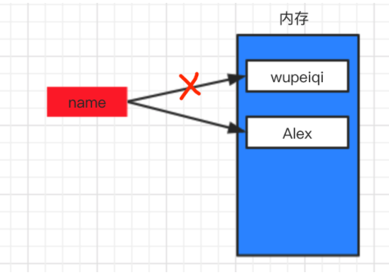

# day02 快速上手

课程目标：学习Python最基础的语法知识，可以用代码快速实现一些简单的功能。

课程概要：

- 初识编码（密码本）
- 编程初体验
- 输出
- 初识数据类型
- 变量
- 注释
- 输入
- 条件语句


## 1.编码（密码本）

**计算机中所有的数据本质上都是以0和1的组合来存储**。


在计算机中会将中文内存转换成 01010101010... ，最终存储到硬盘上。


在计算机中有这么一个编码的概念（密码本）。

```
    武     ->      01111111 00011010 010110110
    沛     ->      01001111 10010000 001110100
    齐     ->      11111111 00000000 010101010
```


在计算机中有很多种编码。

```
每种编码都有自己的一套密码本，都维护这自己的一套规则，如：
    utf-8编码：
        武     ->      01111111 00011010 010110110
        沛     ->      01001111 10010000 001110100
        齐     ->      11111111 00000000 010101010
    gbk编码：
        武     ->      11111111 00000010
        沛     ->      01001111 01111111
        齐     ->      00110011 10101010
所以，使用的不同的编码保存文件时，硬盘的文件中存储的0/1也是不同的。
```


注意事项：以某个编码的形式进行保存文件，以后就要以这种编码去打开这个文件。否则就会出现乱码。

```
UTF-8编码去保存武沛齐：01111111 00011010 010110110 01001111 10010000 001110100 11111111 00000000 010101010
GBK编码形式去打开：乱码
```


## 2.编程初体验

- 编码必须要保持：保存和打开一直，否则会乱码。

- 默认Python解释器是以UTF-8编码的形式打开文件。如果想要修改Python的默认解释器编码，可以这样干：

  ```python
  # -*- coding:gbk -*-
  
  print("我是你二大爷")
  ```

- 建议：所有Python代码文件的都要以UTF-8编码保存和读取。


## 3.输出

将结果或内容想要呈现给用户。

```python
print("看着风景美如画")
```

```python
print("                                                            * *  ")
print("                                                         * * * *  ")
print("                                                      * * * * * *  ")
print("                                                   * * * * * * * *  ")
print("                                                * * * * * * * * * *  ")
print("                                             * * * * * * * * * * * *  ")
print("                                              * * * * * * * * * * * *  ")
print("                                               * * * * * * * * * * * *  ")
print("                                      * *       * * * * * * * * * * * *  ")
print("                                   * * * *       * * * * * * * * * * * *  ")
print("                                * * * * * *       * * * * * * * * * * * *  ")
print("                             * * * * * * * *       * * * * * * * * * * * *  ")
print("                          * * * * * * * * * *       * * * * * * * * * * * *  ")
print("                       * * * * * * * * * * * *       * * * * * * * * * * * *  ")
print("                        * * * * * * * * * * * *       * * * * * * * * * * * *  ")
print("                         * * * * * * * * * * * *       * * * * * * * * * * * *  ")
print("                * *       * * * * * * * * * * * *       * * * * * * * * * * * *  ")
print("             * * * *       * * * * * * * * * * * *       * * * * * * * * * * * *  ")
print("          * * * * * *       * * * * * * * * * * * *       * * * * * * * * * * * *  ")
print("       * * * * * * * *       * * * * * * * * * * * *       * * * * * * * * * * * *  ")
print("    * * * * * * * * * *       * * * * * * * * * * * *       * * * * * * * * * * * *  ")
print(" * * * * * * * * * * * *       * * * * * * * * * * * *       * * * * * * * * * * * *  ")
print("  * * * * * * * * * * * *       * * * * * * * * * * * *       * * * * * * * * * * * *  ")
print("   * * * * * * * * * * * *       * * * * * * * * * * * *       * * * * * * * * * * * *  ")
```


关于输出：

- 默认print在尾部会加换行符

  ```python
  print("看着风景美如画")
  print("本想吟诗增天下")
  
  输出：
  看着风景美如画
  本想吟诗增天下
  
  ```

- 想要不换行，则可以这样干

  ```
  print("看着风景美如画",end="")
  print("本想吟诗增天下",end="")
  
  输出：
  看着风景美如画本想吟诗增天下
  ```

  ```python
  print("看着风景美如画",end=",")
  print("本想吟诗增天下",end=".")
  
  输出：
  看着风景美如画,本想吟诗增天下.
  ```

  

### 练习题

1. 使用print输出自己的姓名
2. 使用print输出
   春眠不觉晓，
   出处闻啼鸟，
   夜来风雨声，
   花落知多少。
3. 是用print输出
   春眠不觉晓，出处闻啼鸟，夜来风雨声，花落知多少。


## 4. 初识数据类型

刚上学时，老师教我们 数字 、拼音、汉字、真假判断 等，然后我们根据学到的内容写作文，老师来检查并打分。

现在学编程，我教大家 int、str、bool 等，然后大家根据这些内容来写代码，写完代码交给Python解释器去运行。


### 4.1 整形（int）

整形，整数。

整型，其实就是以前数学课上讲的整数（不包含小数），在写代码时用于表示整数相关的东西，例如：年龄、存款、尺寸、手机号等。
一般我们提到的：5、18、22、99、… 等整数 在Python中都称为是整型，且支持 加/减/乘/除/取余/指数 等操作。

```python
print(666)

print(2 + 10)

print(2 * 10)

print(10 / 2)

print(10 % 3)

print(2 ** 4)
```


### 4.2 字符串（str）

字符串，其实就是我们生活中的文本信息。例如：姓名、地址、自我介绍等。
字符串有一个特点，他必须由引号引起来，如：

单行字符串

```python
print("我是Alex")
print('我是Alex')
print('我是"alex')
print("中国北京昌平区")
```

多行字符串

```python
print("""中国北京昌平区""")
print('''中国北京昌平区''')
```


对于字符串：

- 加，两个字符串可以通过加号拼接起来。

  ```python
  print( "alex" + "是金角大王吧" )
  ```

- 乘，让整形和字符串进行相乘，以实现让字符串重复出现N次并拼接起来。

  ```python
  print(3 * "我想吃饺子")
  ```


### 4.3 布尔类型（bool）

布尔类型中共有两个值：True / False

```python
print(1 > 2)
print(False)

print(1 == 1)
print(True)
```

```python
name = input("请输入你的用户名:")

if name == "alex":
    print("用户登录成功")
else:
    print("用户登录失败")
```


补充：

```python
1 > 2 
1 == 3
"alex" == "eric"
1 == "alex"

1 > "alex"  是无法进行比较大小
```


### 4.4 类型转换

上文数据类型int/str/bool有了初步了解，他们都有自己不同的定义方式。

- int，整型定义时，必须是数字且无引号，例如：5、8、9
- str，字符串定义时，必须用双引号括起来，例如：”中国”、”武沛齐”、”666”
- bool，布尔值定义时，只能写True和False

不同的数据类型都有不同的功能，例如：整型可以加减乘除 而 字符串只能加(拼接)和乘法。
如果想要做转换可遵循一个基本规则：想转换什么类型就让他包裹一些。

例如：str(666) = "666"是将整型转换为字符串、int(“888”)是将字符串转 888。


转换为整形：

```python
# 字符串转换为整形（度可度之人）
  int("666")
  int("999")
  "6" + "9" 的结果应该是： "69"
  int("6") + int("9") 的结果是：15

  int("alex是sb") 报错
  
# 布尔类型转换为整形
  int(True)  转换完等于 1
  int(False) 转换完等于 0
```


转换为字符串

```python
# 整形转字符串
str(345)
str(666) + str(9) 结果为："6669"

# 布尔类型转换为字符串
str(True)  "True"
str(False) "False"
```


转换为布尔类型

```python
# 整形转布尔
bool(1) True
bool(2) True
bool(0) False
bool(-10) True

# 字符串转布尔
bool("alex") True
bool("砂玻帮你") True
bool("") False
bool(" ") True
```


三句话搞定类型转换：

- 其他所有类型转换为布尔类型时，除了 空字符串、0以为其他都是True。

- 字符串转整形时，只有那种 "988" 格式的字符串才可以转换为整形，其他都报错。

- 想要转换为那种类型，就用这类型的英文包裹一下就行。 

  ```
  str(...)
  int(...)
  bool(...)
  ```

  

### 练习题

1. 计算整型50乘以10再除以5的商并使用print输出。

2. 判断整型8是否大于10的结果并使用print输出。

3. 计算整型30除以2得到的余数并使用print输出。

4. 使用字符串乘法实现 把字符串”我爱我的祖国”创建三遍并拼接起来最终使用print输出。

5. 判断 字符串”wupeiqi”和”alex”是否相等的结果并使用print输出。

6. 判断 整型666和整型666是否相等的结果并使用print输出。

7. 判断 字符串”666”和整型666是否相等的结果并使用print输出。

8. 看代码写结果（禁止运行代码）：

   ```python
   print( int("100")*3 )
   print( int("123") + int("88") )
   print( str(111) + str(222) )
   print( str(111)*3 )
   print( int("8") > 7 )
   print( str(111) == 111 )
   print( bool(-1) )
   print( bool(0) )
   print( bool("") )
   print( bool("你好") )
   print( True == True)
   print( True == False)
   print( bool("") == bool(0) )
   ```

注意：类型转换不是改变原来值，实际在底层是新创建了一个值。例如有整数 6 ，然后使用 str(6) 转化了一下得到 “6”,实际上这个字符串”6”是依据整数6新创建的。


## 5. 变量

变量，其实就是我们生活中起别名和外号，让变量名指向某个值，格式为： 【变量名 = 值】，以后可以通过变量名来操作其对应的值。

```python
name = "武沛齐"
print(name) # 武沛齐
```

```python
age = 18
name = "alex"
flag = 1 > 18
address = "北京昌平" + "沙河"
addr = "北京昌平" + "沙河" + name   # "北京昌平沙河alex"

print(addr)
print(flag)
```

```python
age = 18
number = 1 == 2
```

注意：

- 给变量赋值 `age = 18`
- 让age代指值 `age=18`


### 5.1 变量名的规范

```python
age = 18
name = "alex"
flag = 1 > 18
address = "北京昌平" + "沙河"
```

三个规范（只要有一条就会报错）：

- 变量名只能由 字母、数字、下划线 组成。

- 不能以数字开头

  ```
  na9me9 = "alex"
  ```

- 不能用Python内置的关键字

  ```
  def = "alex"
  break = 123
  ```

  *[‘and’, ‘as’, ‘assert’, ‘break’, ‘class’, ‘continue’, ‘def’, ‘del’, ‘elif’, ‘else’, ‘except’, ‘exec’, ‘finally’, ‘for’, ‘from’, ‘global’, ‘if’, ‘import’, ‘in’, ‘is’, ‘lambda’, ‘not’, ‘or’, ‘pass’, ‘print’, ‘raise’, ‘return’, ‘try’, ‘while’, ‘with’, ‘yield’]*

两个建议：

- 下划线连接命名（小写）

  ```
  father_name = "wupeiqi"
  brother_age = 19
  ```

- 见名知意

  ```
  age = 18
  color = "red"
  current_user_name = "吉诺比利"
  ```

#### 练习题

```python
name = "吉诺比利"
name0 = "帕克"
name_1 = "邓肯"
_coach = "波波维奇"
_ = "卡哇伊"
1_year = "1990" # 错误
year_1_ = "1990"
_1_year = "1990"
nba-team = "马刺" # 错误
new*name = "伦纳德" # 错误
```


### 5.2 变量内存指向关系

通过学习上述变量知识让我们对变量了有了初步认识，接下来我们就要从稍稍高级一些的角度来学习变量，即：内存指向（在电脑的内存中是怎么存储的）。

**情景一**

```python
name = "wupeiqi"
```

在计算机的内存中创建一块区域保存字符串”wupeiqi”，name变量名则指向这块区域。


**情景二**

```python
name = "wupeiqi"
name = "alex"
```

在计算机的内存中创建一块区域保存字符串”wupeiqi”，name变量名则指向这块区域。然后又再内存中创建了一块域保存字符串”alex”，name变量名则指向”alex”所在的区域，不再指向”wupeiqi”所在区域（无人指向的数据会被标记为垃圾，由解释器自动化回收）




**情景三**

```python
name = "wupeiqi"
new_name = name
```

在计算机的内存中创建一块区域保存字符串”wupeiqi”，name变量名则指向这块区域。new_name变量名指向name变量，因为被指向的是变量名，所以自动会转指向到name变量代表的内存区域。


**情景四**

```python
name = "wupeiqi"
new_name = name
name = "alex"
```

在计算机的内存中创建一块区域保存字符串”wupeiqi”，name变量名则指向这块区域(灰色线)， 然后new_name指向name所指向的内存区域，最后又创建了一块区域存放”alex”，让name变量指向”alex”所在区域.


**情景五**

```python
num = 18
age = str(num)
```

在计算机的内存中创建一块区域保存整型18，name变量名则指向这块区域。通过类型转换依据整型18再在内存中创建一个字符串”18”, age变量指向保存这个字符串的内存区域。


至此，关于变量的内存相关的说明已讲完，由于大家都是初学者，关于变量的内存管理目前只需了解以上知识点即可，更多关于内存管理、垃圾回收、驻留机制等问题在后面的课程中会讲解。


#### 练习题

1. 看代码结果

   ```python
   alex_length = 3
   wupeiqi_length = 18
   total = alex_length + wupeiqi_length
   print(total)
   ```

2. 按要求写代码
    ```python
    # 假设age为小明的年龄
    age = 18
    # 问：已知小李比小明大3岁，计算小李年龄赋值给ming_age变量并输出。
    ming_age = age + 3
    print(ming_age)
    # 问：已知大刘比小明和小李年龄的和还要大5岁，计算大刘的年龄赋值给liu_age变量并输入。
    liu_age = age + ming_age + 5
    print(liu_age)
    ```
3. 看代码写结果
    ```python
    nickname = "一米八大高个"
    username = nickname

    username = "弟弟"
    print(nickname)
    print(username)
    ```
4. 看代码写结果
    ```python
    nickname = "一米八大高个"
    username = nickname
    nickname = "弟弟"

    print(nickname)
    print(username)
    ```
5. 看代码写结果
    ```python
    nickname = "一米八大高个"
    username = "弟弟"
    text = username + nickname
    print(text)
    ```
6. 看代码写结果
    ```python
    nickname = "一米八大高个"
    username = nickname
    nickname = "弟弟"
    text = username + nickname
    print(text)
    ```
7. 看代码写结果
    ```python
    string_number = "20"
    num = int(string_number)

    data = string_number * 3
    print(data) # "202020"

    value = num * 3
    print(value) # 60
    ```


## 6. 注释

写代码时候，如果想要对某写内容进行注释处理，即：解释器忽略不会按照代码去运行。

- 单行注释

  ```python
  # 声明一个name变量
  name = "alex"
  
  age = 19 # 这表示当前用户的年龄
  
  注意：快捷点 command + ?  、   control + ?
  ```

- 多行注释

  ```python
  # 声明一个name变量
  # 声明一个name变量
  # 声明一个name变量
  name = "alex"
  
  
  """
  多行注释内容
  多行注释内容
  多行注释内容
  """
  age = 19
  ```

  

## 7. 输入

输入，可以实现程序和用户之间的交互。

```python
# 1. 右边 input("请输入用户名：") 是让用户输入内容。
# 2. 将用户输入的内容赋值给name变量。
name = input("请输入用户名：")

if name == "alex":
  print("登录成功")
else:
  print("登录失败")
```

```python
data = input(">>>")
print(data)
```

**特别注意**：用户输入的任何内容本质上都是字符串。

1. 提示输入姓名，然后给姓名后面拼接一个“烧饼”，提示输入姓名，然后给姓名后面拼接一个“烧饼”，最终打印结果。

   ```python
   name = input("请输入用户名：")
   text = name + "烧饼"
   print(text)
   ```

2. 提示输入 姓名/位置/行为，然后做拼接并打印：xx 在 xx 做 xx 。

   ```python
   name = input("请输入用户名：")
   address = input("请输入位置：")
   action = input("请输入行为：")
   
   text = name + "在" + address + action
   print(text)
   ```

3. 提示输入两个数字，计算两个数的和。

   ```python
   number1 = input("请输入一个数字：") # "1"
   number2 = input("请输入一个数字：") # "2"
   
   value = int(number1) + int(number2)
   print(value)
   ```

   

## 8.条件语句

```python
if 条件 :
    条件成立之后的代码...
    条件成立之后的代码...
    条件成立之后的代码...
else:
    条件不成立之后执行的代码...
    条件不成立之后执行的代码...
    条件不成立之后执行的代码...
```

```python
name = input("请输入用户名:")
if name == "alex":
  print("sb")
else:
  print("db")
```

提醒：统一缩进问题（都是使用四个空格 = tab）。

```python
name = input("请输入用户名:")
if name == "alex":
    print("sb")
   print("sb")
else:
    print("db")
```


### 8.1 基本条件语句

- 示例1

  ```python
  print("开始")
  if True:
    print("123")
  else:
    print("456")
  print("结束")
  
  # 输出结果
  开始
  123
  结束
  ```

- 示例2

  ```python
  print("开始")
  if 5==5:
    print("123")
  else:
    print("456")
  print("结束")
  ```

- 示例3

  ```python
  num = 19
  if num > 10:
  	print("num变量对应值大于10")
  else:
  	print("num变量对应值不大于10")
  ```

- 示例4

  ```python
  username = "wupeiqi"
  password = "666"
  if username == "wupeiqi" and password == "666":
  	print("恭喜你，登录成功")
  else:
  	print("登录失败")
  ```

- 示例5

  ```python
  username = "wupeiqi"
  
  if username == "wupeiqi" or username == "alex":
  	print("VIP大会员用户")
  else:
  	print("普通用户")
  ```

- 示例6

  ```python
  number = 19
  if number%2 == 1:
  	print("number是奇数")
  else:
  	print("number是偶数")
  ```

  ```python
  number = 19
  data = number%2 == 1
  if data:
  	print("number是奇数")
  else:
  	print("number是偶数")
  ```

- 示例7

  ```python
  if 条件:
    成立
  ```

  ```python
  print("开始")
  if 5 == 5:
    print("5等于5")
  print("结束")
  ```

  

#### 练习题

1. 提示用户输入用户名和密码，用户名等于"wupeiqi"且密码等于"uuu"就输出登录成功；否则输出登录失败。
2. 猜数字，提示用户输入一个数字，判断数字如果大于10，就输出猜错了；否则输出猜对了。
3. 提示用户输入一个数字，判断是否为偶数，是偶数则输出 偶偶偶数，否则输出 奇奇奇数。


### 8.2 多条件判断

```python
if 条件A:
  A成立，执行此缩进中的所有代码
  ...
elif 条件B:
  B成立，执行此缩进中的所有代码
  ...
elif 条件C:
  C成立，执行此缩进中的所有代码
  ...
else:
  上述ABC都不成立。
```

```python
num = input("请输入数字")
data = int(num)
if data>6:
  print("太大了")
elif data == 6:
  print("刚刚好")
else:
  print("太小了")
```

```python
score = input("请输入分数")
data = int(score)

if data > 90:
  print("优")
elif data > 80:
  print("良")
elif data > 70:
  print("中")
elif data > 60:
  print("差")
else:
  print("不及格")
```


### 8.3 条件嵌套

```python
if 条件A:
  ...
elif 条件B:
  ...
```

```python
if 条件A:
    if 条件A1:
        ...
    else：
   	    ...
elif 条件B:
    ...
```

模拟10086客服

```python
print("欢迎致电10086，我们提供了如下服务： 1.话费相关；2.业务办理；3.人工服务")

choice = input("请选择服务序号")

if choice == "1":
    print("话费相关业务")
    cost = input("查询话费请按1;交话费请按2")
    if cost == "1":
        print("查询话费余额为100")
    elif cost == "2":
        print("交互费")
    else:
        print("输入错误")
elif choice == "2":
    print("业务办理")
elif choice == "3":
    print("人工服务")
else:
    print("序号输入错误")
```


## 总结

1. 什么是编码？打开文件时为什么会出现乱码？
2. pycharm如何设置文件编码？
3. python解释器去打开代码文件时，默认使用编码是什么？如何修改？
4. print输入
5. 各数据类型格式 以及 相关之间如何实现转换？
6. 变量的命名规范
7. 用户通过input输的内容均为字符串类型。
8. 条件语句。


## 今日作业

1. 谈谈你了解的编码以及为什么会出现乱码的现象？

2. Python解释器默认编码是什么？如何修改？

3. 用print打印出下面内容：

   ```
   ⽂能提笔安天下,
   武能上⻢定乾坤.
   ⼼存谋略何⼈胜,
   古今英雄唯是君。
   ```

4. 变量名的命名规范和建议？

5. 如下那个变量名是正确的？

   ```pythonn
   name = '武沛齐'
   _ = 'alex'
   _9 = "老男孩"
   9name = "宝浪"
   oldboy(edu = 666
   ```

6. 设定一个理想数字比如：66，让用户输入数字，如果比66大，则显示猜测的结果大了；如果比66小，则显示猜测的结果小了;只有等于66，显示猜测结果正确。

7. 提示⽤户输入 "爸爸" ，判断⽤户输入的对不对。如果对, 提示真聪明, 如果不对, 提示你是傻逼么。

8. 写程序，成绩有ABCDE5个等级，与分数的对应关系如下.

   ```python
   A    90-100
   B    80-89
   C    60-79
   D    40-59
   E    0-39
   ```

   要求用户输入0-100的数字后，你能正确打印他的对应成绩等级.


