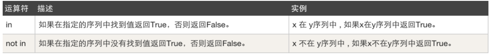

# day03 Python基础

课程目标：掌握Python基础中的必备语法知识。

课程概要：

- 循环语句
- 字符串格式化
- 运算符（面试题）


## 1. 循环语句

- while循环
- for循环（后期）

```python
while 条件:
    ...
    ...
    ...
```

```python
print("123")
while 条件:
  ...
  ...
  ...
print(456)
```


### 1.1 循环语句基本使用

示例1：

```python
print("开始")
while True:
    print("Alex是个小都比")
print("结束")

# 输出：
开始
Alex是个小都比
Alex是个小都比
Alex是个小都比
Alex是个小都比
...
```

示例2：

```python
print("开始")
while 1 > 2:
	print("如果祖国遭受到侵犯，热血男儿当自强。")
print("结束")

# 输出：
开始
结束
```

示例3：

```python
data = True
print("开始")
while data:
	print("如果祖国遭受到侵犯，热血男儿当自强。")
print("结束")

# 输出：
开始
如果祖国遭受到侵犯，热血男儿当自强。
如果祖国遭受到侵犯，热血男儿当自强。
如果祖国遭受到侵犯，热血男儿当自强。
...
```

示例4：

```python
print("开始")
flag = True
while flag:
	print("滚滚黄河，滔滔长江。")
	flag = False
print("结束")

# 输出：
开始
滚滚黄河，滔滔长江。
结束
```

示例5：

```python
print("开始")
num = 1
while num < 3:
	print("滚滚黄河，滔滔长江。")
	num = 5
print("结束")

# 输出：
开始
滚滚黄河，滔滔长江。
结束
```

示例6：

```python
print("开始")
num = 1
while num < 5:
	print("给我生命，给我力量。")
	num = num + 1
print("结束")

# 输出：
开始
给我生命，给我力量。
给我生命，给我力量。
给我生命，给我力量。
给我生命，给我力量。
结束
```

```
练习题：重复3次输出我爱我的祖国。
num = 1
while num < 4:
	print("我爱我的祖国")
	num = num + 1
	
我爱我的祖国
我爱我的祖国
我爱我的祖国
```


### 1.2 综合小案例

请实现一个用户登录系统，如果密码错误则反复提示让用户重新输入，直到输入正确才停止。

```python
# 请实现一个用户登录系统，如果密码错误则反复提示让用户重新输入，直到输入正确才停止。

print("开始运行路飞系统")

flag = True
while flag:
    user = input("请输入用户名：")
    pwd = input("请输入密码：")
    if user == "wupeiqi" and pwd == "luffy":
        print("登录成功")
        flag = False
    else:
        print("用户名或密码错误")

print("系统结束")
```

#### 练习题

1. 补充代码实现
   猜数字，设定一个理想数字比如：66，一直提示让用户输入数字，如果比66大，则显示猜测的结果大了；如果比66小，则显示猜测的结果小了;只有输入等于66，显示猜测结果正确，然后退出循环。

   ```python
     number = 66
     flag = True
     while flag:
     	...
   ```

2. 使用循环输出1~100所有整数。
3. 使用循环输出 1 2 3 4 5 6   8 9 10，即：10以内除7以外的整数。
4. 输出 1~100 内的所有奇数。
5. 输出 1~100 内的所有偶数。
6. 求 1~100 的所有整数的和。
7. 输出10 ~ 1 所有整数。


### 1.3 break

break，用于在while循环中帮你终止循环。

```python
print("开始")
while True:
	print("1")
  break
	print("2")
print("结束")

# 输出
开始
1
结束
```

通过示例来更深入理解break的应用。

示例1：

```python
print("开始")
while True:
	print("红旗飘飘，军号响。")
	break
	print("剑已出鞘，雷鸣电闪。")
	print("从来都是狭路相逢勇者胜。")
print("结束")
```

示例2：

```python
print("开始")
i = 1
while True:
	print(i)
	i = i + 1
	if i == 101:
		break
print("结束")

# 输出
开始
1
2
...
100
结束
```

示例3：

```python
print("开始运行系统")
while True:
	user = input("请输入用户名：")
	pwd =  input("请输入密码：")
	if user == 'wupeiqi' and pwd = "oldboy":
		print("登录成功")
		break
	else:
		print("用户名或密码错误，请重新登录")
print("系统结束")

# 输出
开始运行系统
>>> 用户名
>>> 密码
正确，登录成功
	系统结束
不正确，一直循环输出
```

所以，以后写代码时候，想要结束循环可以通过两种方式实现了，即：条件判断 和 break关键字，两种在使用时无好坏之分，只要能实现功能就行。

### 1.4 continue

continue，在循环中用于 结束本次循环，开始下一次循环。

```python
print("开始")
while True:
  print(1)
  continue
  print(2)
  print(3)
print("结束")
```

示例1：

```python
print("开始")
while True:
	print("红旗飘飘，军号响。")
	continue
	print("剑已出鞘，雷鸣电闪。")
	print("从来都是狭路相逢勇者胜。")
print("结束")

# 输出
开始
红旗飘飘，军号响。
红旗飘飘，军号响。
红旗飘飘，军号响。
红旗飘飘，军号响。
...
```

示例2：

```python
print("开始")
i = 1
while i < 101:
	if i == 7:
		i = i + 1
		continue
	print(i)
	i = i + 1
print("结束")

# 输出
开始
1
2
3
4
5
6
8
9
10
...
100
结束
```

示例3：

```python
print("开始")
i = 1
while True:
	if i == 7:
		i = i + 1
		continue
	print(i)
	i = i + 1
	if i == 101:
		break
print("结束")

# 输出
开始
1
2
3
4
5
6
8
9
10
...
100
结束
```

写在最后，对于break和continue都是放在循环语句中用于控制循环过程的，一旦遇到break就停止所有循环，一旦遇到continue就停止本次循环，开始下次循环。

当然，通过如果没有了break和continue，我们用while条件的判断以及其他协助也能完成很多功能，有了break和continue可以在一定程度上简化我们的代码逻辑。


### 1.5 while else

当while后的条件不成立时，else中的代码就会执行。

```python
while 条件:
  代码
else:
  代码
```

```python
while False:
  pass
else:
  print(123)
```

```python
num = 1
while num < 5:
  print(num)
  num = num + 1
else:
  print(666)

# 输出 
1
2
3
4
666
```

```python
while True:
  print(123)
	break
else:
  print(666)

# 输出
123
```


## 2.字符串格式化

字符串格式化，使用跟便捷的形式实现字符串的拼接。

### 2.1 %

#### 2.1.1 基本格式化操作

```python
name = "武沛齐"
# 占位符
# text = "我叫%s，今年18岁" %"武沛齐"
text = "我叫%s，今年18岁" %name
```

```python
name = "武沛齐"
age = 18

# text = "我叫%s，今年%s岁" %("武沛齐",18)
# text = "我叫%s，今年%s岁" %(name,age)
text = "我叫%s，今年%d岁" %(name,age)
```

https://www.cnblogs.com/wupeiqi/articles/5484747.html

```python
message = "%(name)s你什么时候过来呀？%(user)s今天不在呀。" % {"name": "死鬼", "user": "李杰"}
print(message)
```

#### 2.1.2 百分比

```python
text = "兄弟，这个片我已经下载了90%了，居然特么的断网了"
print(text)
```

```python
text = "%s，这个片我已经下载了90%%了，居然特么的断网了" %"兄弟"
print(text)
# 输出：
兄弟，这个片我已经下载了90%了，居然特么的断网了
```

一旦字符串格式化中存现百分比的显示，请一定要呀加 %% 以实现输出 %。


### 2.2 format（推荐）

```python
text = "我叫{0}，今年18岁".format("武沛齐")

text = "我叫{0}，今年{1}岁".format("武沛齐",18)

text = "我叫{0}，今年{1}岁，真是的姓名是{0}。".format("武沛齐",18)
```

```python
text = "我叫{}，今年18岁".format("武沛齐")

text = "我叫{}，今年{}岁".format("武沛齐",18)

text = "我叫{}，今年{}岁，真是的姓名是{}。".format("武沛齐",18,"武沛齐")
```

```python
text = "我叫{n1}，今年18岁".format(n1="武沛齐")

text = "我叫{n1}，今年{age}岁".format(n1="武沛齐",age=18)

text = "我叫{n1}，今年{age}岁，真是的姓名是{n1}。".format(n1="武沛齐",age=18)
```

```python
text = "我叫{0}，今年{1}岁"
data1 = text.format("武沛齐",666)
data2 = text.format("alex",73)
```

```python
text = "我叫%s，今年%d岁"
data1 = text %("武沛齐",20)
data2 = text %("alex",84)
```


### 2.3 f

到Python3.6版本，更便捷。

```python
text = f"嫂子喜欢{'跑步'}，跑完之后满身大汗"
```

```python
action = "跑步"
text = f"嫂子喜欢{action}，跑完之后满身大汗"
```

```python
name = "喵喵"
age = 19
text = f"嫂子的名字叫{name}，今年{age}岁"
print(text)
```

```python
text = f"嫂子的名字叫喵喵，今年{19 + 2}岁"
print(text)
```

```python
# 在Python3.8引入
text = f"嫂子的名字叫喵喵，今年{19 + 2=}岁"
print(text)
```

```python
# 进制转换
v1 = f"嫂子今年{22}岁"
print(v1)

v2 = f"嫂子今年{22:#b}岁"
print(v2)

v3 = f"嫂子今年{22:#o}岁"
print(v3)

v4 = f"嫂子今年{22:#x}岁"
print(v4)
```

```python
# 理解
text = f"我是{'alex'}，我爱大铁锤"

name = "alex"
text = f"我是{name}，我爱大铁锤"

name = "alex"
text = f"我是{ name.upper() }，我爱大铁锤"

# 输出：我是ALEX，我爱大铁锤
```


## 3. 运算符

提到运算符，我想大家首先想到的就是加、减、乘、除之类， 本节要系统的跟大家来聊一聊，我们写代码时常见的运算符可以分为5种：
- 算数运算符，例如：加减乘除
  

  ```python
  print( 9//2 )
  ```
  
- 比较运算符，例如：大于、小于
  
  
  注意：python3中不支持 `<>`
  
  ```python
  if 1 >2:
    pass
  while 1>2:
    pass
  
  data = 1 == 2
  ```
  
- 赋值运算，例如：变量赋值
  

  ```python
  num = 1
  while num < 100:
    print(num)
    # num = num + 1
    num += 1
  ```

- 成员运算，例如：是否包含
  

  ```python
  v1 = "le" in "alex"  # True/False
  # 让用户输入一段文本，检测文本中是否包含敏感词。
  text = input("请输入内容：")
  if "苍老师" in text:
    print("少儿不宜")
  else:
    print(text)
  ```

- 逻辑运算，例如：且或非
  

  ```python
  if username == "alex" and pwd == "123":
    pass
  
  data = 1 > 2
  if not data:
    pass
  ```

  

### 3.1 运算符优先级

运算符的优先级有很多，常见的没几个，推荐你记住3个即可：

- 算数优先级优先级 大于 比较运算符

  ```python
  if 2 + 10 > 11:
  	print("真")
  else:
  	print("假")
  ```

- 比较运算符优先级 大于 逻辑运算符

  ```python
  if 1>2 and 2<10:
  	print("成立")
  else:
  	print("不成立")
  ```

- 逻辑运算符内部三个优先级 not > and > or

  ```python
  if not 1 and 1>2 or 3 == 8:
  	print("真")
  else:
  	print("假")
  ```

上述这3个优先级从高到低总结：`加减乘除 > 比较 > not and or `。绝招：加括号。


### 3.2 面试题

逻辑运算中：and  or

```python
v1 = name == "alex" and pwd == "123"
# v1 = True and False

if name == "alex" and pwd == "123":
  pass
```


```python
v2 = "wupeiqi" and "alex"

# 第一步：将and前后的只转换为布尔值 True and True
# 第二步：判断本次操作取悦于谁？由于前面的是True，所以本次逻辑判断取决于后面的值。
# 所以，后面的只等于多少最终结果就是多少。 v2 = "alex"


v3 = "" and "alex"
# 第一步：将and前后的只转换为布尔值 False and True
# 第二步：判断本次操作取悦于谁？由于前面的是False，所以本次逻辑判断取决于前面的值。
# 所以，前面的只等于多少最终结果就是多少。 v2 = ""

v4 = 1 or 8 
# 第一步：将and前后的只转换为布尔值 True or True
# 第二步：判断本次操作取悦于谁？由于前面的是True，所以本次逻辑判断取决于前面的值。
# v4 = 1

v5 = 0 or 8 
# 第一步：将and前后的只转换为布尔值 False or True
# 第二步：判断本次操作取悦于谁？由于前面的是False，所以本次逻辑判断取决于后面的值。
# v5 = 8
```


### 练习题

```python
v1 = 1 or 2
v2 = -1 or 3
v3 = 0 or -1
v4 = 0 or 100
v5 = "" or 10
v6 = "wupeiqi" or ""
v7 = 0 or ""

print(v1,v2,v3,v4,v5,v6,v7)

# or，看第一个值，如果第一个值为真，结果就应该是第一个值，否则就结果就是第二个值。
```

```python
v1 = 4 and 8
v2 = 0 and 6
v3 = -1 and 88
v4 = "" and 7
v5 = "武沛齐" and ""
v6 = "" and 0
v7 = 0 and "中国"

print(v1,v2,v3,v4,v5,v6,v7)

# and，看第一个值，如果第一个值真，结果就应该是第二个值，否则结果就是第一个值。
```

### 面试题

如果多个and 和or的情况，先计算and再计算or.

```python
v1 = 0 or 4 and 3 or 7 or 9 and 6
     0 or 3 or 7 or 9 and 6
     0 or 3 or 7 or 6
     3 or 7 or 6
     3 or 6
     3
v2 = 8 or 3 and 4 or 2 and 0 or 9 and 7
		 8
  
  
v3 = 0 or 2 and 3 and 4 or 6 and 0 or 3
		 4
```

先计算not，在计算and，最后计算or

```python
v4 = not 8 or 3 and 4 or 2
		 4
```


## 总结

1. while循环语句
2. break和continue关键字的作用
3. 三种字符串格式化的方式
4. 基本运算符（逻辑运算符涉及的相关面试题）


## 今日作业

1. 判断下列逻辑语句的True,False

   ```python
   1 > 1 or 3 < 4 or 4 > 5 and 2 > 1 and 9 > 8 or 7 < 6
   not 2 > 1 and 3 < 4 or 4 > 5 and 2 > 1 and 9 > 8 or 7 < 6
   ```

2. 求出下列逻辑语句的值。

   ```python
   8 or 3 and 4 or 2 and 0 or 9 and 7
   0 or 2 and 3 and 4 or 6 and 0 or 3
   ```

3. 下列结果是什么？

   ```python
   6 or 2 > 1
   3 or 2 > 1
   0 or 5 < 4
   5 < 4 or 3
   2 > 1 or 6
   3 and 2 > 1
   0 and 3 > 1
   2 > 1 and 3
   3 > 1 and 0
   3 > 1 and 2 or 2 < 3 and 3 and 4 or 3 > 2
   ```

4. 实现用户登录系统，并且要支持连续三次输错之后直接退出，并且在每次输错误时显示剩余错误次数（提示：使⽤字符串格式化）。

5. 猜年龄游戏 
   要求：允许用户最多尝试3次，3次都没猜对的话，就直接退出，如果猜对了，打印恭喜信息并退出。

6. 猜年龄游戏升级版
   要求：允许用户最多尝试3次，每尝试3次后，如果还没猜对，就问用户是否还想继续玩，如果回答Y，就继续让其猜3次，以此往复，如果回答N，就退出程序，如何猜对了，就直接退出。


