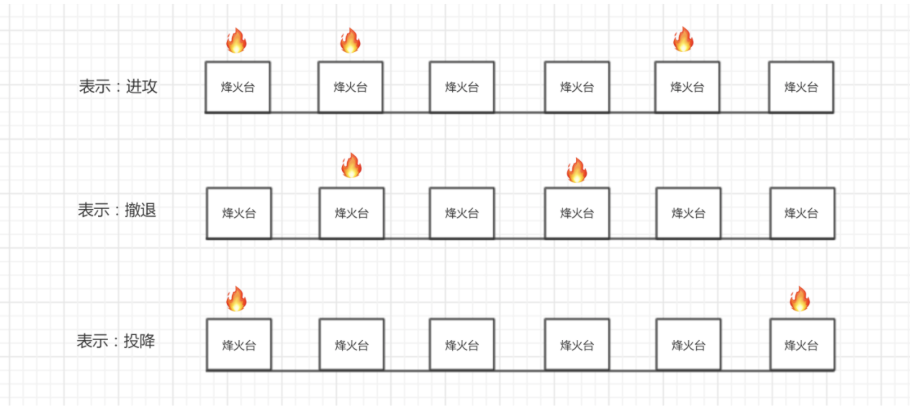
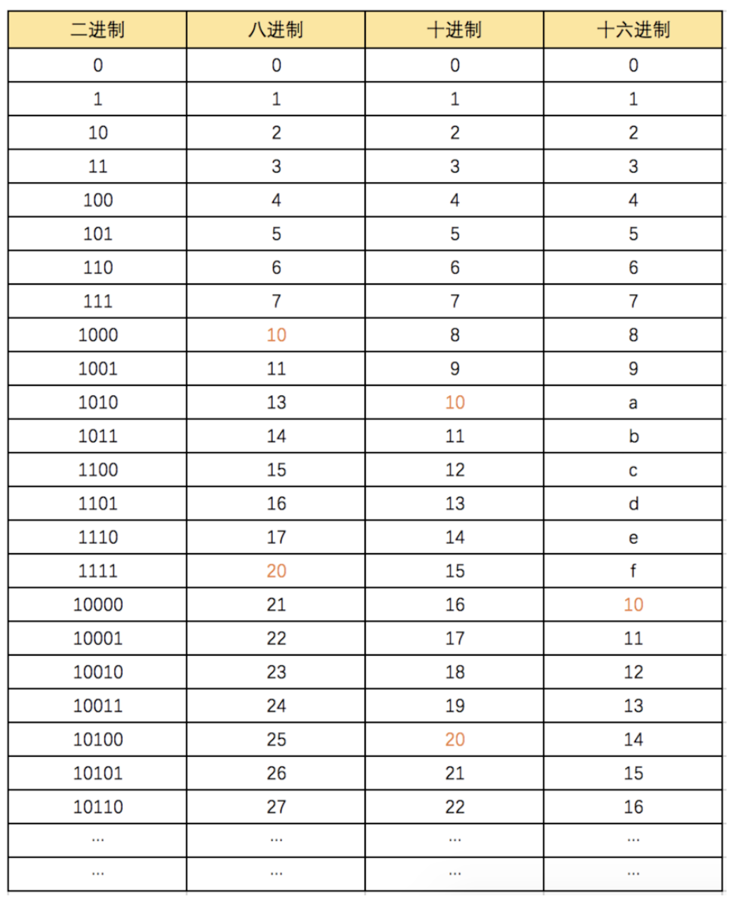
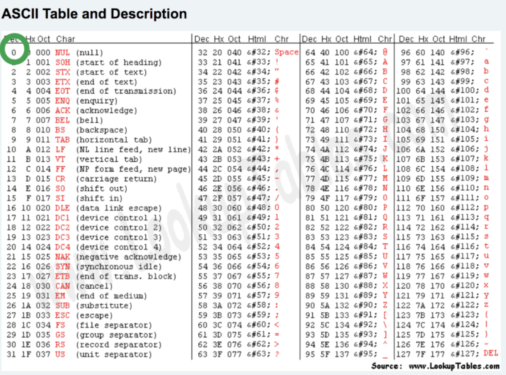

# day04 进制和编码

课程目标：讲解计算机中一些必备的常识知识，让学员了解一些常见名词背后的含义（重在理解）。

课程概要：

- python代码的运行方式
- 进制
- 计算机中的单位
- 编码


## 1.Python代码运行方式

- 脚本式

  ```python
  python3 ~/PycharmProjects/day03/6.作业题讲解.py
  ```

- 交互式

  ```python
  python3
  ```

  


## 2.进制

计算机中底层所有的数据都是以 `010101`的形式存在（图片、文本、视频等）。

- 二进制

  ```python
  0
  1
  10
  ```

  

- 八进制
- 十进制
- 十六进制



### 2.1 进制转换


```python
v1 = bin(25) # 十进制转换为二进制
print(v1) # "0b11001"

v2 = oct(23) # 十进制转换为八进制
print(v2) # "0o27"

v3 = hex(28) # 十进制转换为十六进制
print(v3) # "0x1c"
```

```python
i1 = int("0b11001",base=2) # 25

i2 = int("0o27",base=8) # 23 

i3 = int("0x1c",base=16) # 28 
```


## 3. 计算机中的单位

由于计算机中本质上所有的东西以为二进制存储和操作的，为了方便对于二进制值大小的表示，所以就搞了一些单位。

- b（bit），位

  ```
  1，1位
  10，2位
  111，3位
  1001，4位
  ```

- B（byte），字节

  ```
  8位是一个字节。
  
  10010110，1个字节
  10010110 10010110，2个字节
  ```

- KB（kilobyte），千字节

  ```
  1024个字节就是1个千字节。
  
  10010110 11010110  10010111 .. ，1KB
  1KB = 1024B= 1024 * 8 b
  ```

- M（Megabyte），兆

  ```
  1024KB就是1M
  1M= 1024KB = 1024 * 1024 B = 1024 * 1024 * 8 b
  ```

- G（Gigabyte），千兆

  ```
  1024M就是1G
  1 G=  1024 M=  1024 *1024KB =  1024 * 1024 * 1024 B =  1024 * 1024 * 1024 * 8 b
  ```

- T（Terabyte），万亿字节

  ```
  1024个G就是1T
  ```

- ...其他更大单位 PB/EB/ZB/YB/BB/NB/DB 不再赘述。


<span style="color:red;">做个小练习</span>：

- 假设1个汉字需要2个字节(2B=16位来表示，如：1000101011001100)，那么1G流量可以通过网络传输多少汉字呢？（计算机传输本质上也是二进制）

  ```
  1G = 1024M = 1024 * 1024KB = 1024 * 1024 * 1024 B
  每个汉字需要2个字节表示
  1024 * 1024 * 1024/2 = ?
  ```

- 假设1个汉字需要2个字节(2B=16位来表示，如：1000101011001100)，那么500G硬盘可以存储多少个汉字？

  ```python
  500G = 500 * 1024M = 500 * 1024 * 1024KB = 500 * 1024 * 1024 * 1024 B
  500 * 1024 * 1024 * 1024 / 2 = ?
  ```

  

## 4.编码

编码，文字和二进制之间的一个对照表。


### 4.1 ascii编码

ascii规定使用1个字节来表示字母与二进制的对应关系。

```
00000000
00000001    w
00000010    B
00000011    a
...
11111111

2**8 = 256
```




### 4.2 gb-2312编码

gb-2312编码，由国家信息标准委员会制作（1980年）。

gbk编码，对gb2312进行扩展，包含了中日韩等文字（1995年）。

在与二进制做对应关系时，由如下逻辑：

- 单字节表示，用一个字节表示对应关系。2**8 = 256
- 双字节表示，用两个字节表示对应关系。2**16 = 65536中可能性。


### 4.3 unicode

unicode也被称为万国码，为全球的每个文字都分配了一个码位（二进制表示）。

- ucs2 

  ```
  用固定的2个字节去表示一个文字。
  
  00000000 00000000     悟
  ...
  
  2**16 = 65535
  ```

- ucs4

  ```
  用固定的4个字节去表示一个文字。
  00000000 00000000 00000000 00000000  无
  ...
  2**32 = 4294967296
  ```

  

```
文字     十六进制            二进制 
 ȧ        0227           1000100111
 ȧ        0227         00000010 00100111                       ucs2
 ȧ        0227         00000000 00000000 00000010 00100111     ucs4
 
 乔       4E54           100111001010100
 乔       4E54         01001110 01010100                       ucs2
 乔       4E54         00000000 00000000 01001110 01010100     ucs4
 
 😆      1F606        11111011000000110
 😆      1F606        00000000 00000001 11110110 00000110      ucs4
```


无论是ucs2和ucs4都有缺点：浪费空间？

```python
文字     十六进制     二进制
A        0041      01000001
A        0041      00000000 01000001
A        0041      00000000 00000000 00000000 01000001
```

unicode的应用：在文件存储和网络传输时，不会直接使用unicode，而在内存中会unicode。

### 4.4 utf-8编码

包含所有文字和二进制的对应关系，全球应用最为广泛的一种编码（站在巨人的肩膀上功成名就）。

本质上：utf-8是对unicode的压缩，用尽量少的二进制去与文字进行对应。

```
  unicode码位范围            utf-8      
   0000 ~ 007F              用1个字节表示
   0080 ~ 07FF              用2个字节表示
   0800 ~ FFFF              用3个字节表示
  10000 ~ 10FFFF            用4个字节表示
```

具体压缩的流程：

- 第一步：选择转换模板

  ```
    码位范围（十六进制）                转换模板
     0000 ~ 007F              0XXXXXXX
     0080 ~ 07FF              110XXXXX 10XXXXXX
     0800 ~ FFFF              1110XXXX 10XXXXXX 10XXXXXX
    10000 ~ 10FFFF            11110XXX 10XXXXXX 10XXXXXX 10XXXXXX
    
    例如：
        "B"  对应的unicode码位为 0042，那么他应该选择的一个模板。
        "ǣ"  对应的unicode码位为 01E3，则应该选择第二个模板。
        "武" 对应的unicode码位为 6B66，则应该选择第三个模板。
        "沛" 对应的unicode码位为 6C9B，则应该选择第三个模板。
        "齐" 对应的unicode码位为 9F50，则应该选择第三个模板。
         😆  对应的unicode码位为 1F606，则应该选择第四个模板。            
  
  注意：一般中文都使用第三个模板（3个字节），这也就是平时大家说中文在utf-8中会占3个字节的原因了。
  ```

- 第二步：在模板中填入数据

  ```
  - "武"  ->  6B66  ->  110 101101 100110
  - 根据模板去套入数据
  	1110XXXX 10XXXXXX 10XXXXXX
  	1110XXXX 10XXXXXX 10100110
  	1110XXXX 10101101 10100110
  	11100110 10101101 10100110
  在UTF-8编码中 ”武“  11100110 10101101 10100110
  
  - 😆  ->  1F606  ->  11111 011000 000110
  - 根据模板去套入数据
  	11110000 10011111 10011000 10000110
  ```

  

### 4.5 Python相关的编码

```
字符串（str）     "alex媳妇叫铁锤"             unicode处理               一般在内存
字节（byte）      b"alexfdsfdsdfskdfsd"      utf-8编码 or gbk编码       一般用于文件或网络处理
```

```python
v1 = "武"

v2 = "武".encode("utf-8")
v2 = "武".encode("gbk")
```

将一个字符串写入到一个文件中。

```python
name = "嫂子热的满身大汗"
data = name.encode("utf-8")

# 打开一个文件
file_object = open("log.txt",mode="wb")
# 在文件中写内容
file_object.write(data)
# 关闭文件
file_object.close()
```


## 总结

本章的知识点属于理解为主，了解这些基础之后有利于后面知识点的学习，接下来对本节所有的知识点进行归纳总结：

1. 计算机上所有的东西最终都会转换成为二进制再去运行。

2. ascii编码、unicode字符集、utf-8编码本质上都是字符与二进制的关系。

   - ascii，字符和二进制的对照表。
   - unicode，字符和二进制（码位）的对照表。
   - utf-8，对unicode字符集的码位进行压缩处理，间接也维护了字符和二进制的对照表。

3. ucs2和ucs4指的是使用多少个字节来表示unicode字符集的码位。

4. 目前最广泛的编码为：utf-8，他可以表示所有的字符且存储或网络传输也不会浪费资源（对码位进行压缩了）。

5. 二进制、八进制、十进制、十六进制其实就是进位的时机不同。

6. 基于Python实现二进制、八进制、十进制、十六进制之间的转换。

7. 一个字节8位

8. 计算机中常见单位b/B/KB/M/G的关系。

9. 汉字，用gbk编码需要用2个字节；用utf-8编码需要用3个字节。

10. 基于Python实现将字符串转换为字节（utf-8编码）

    ```python
    # 字符串类型
    name = "武沛齐"
    
    print(name) # 武沛齐
    # 字符串转换为字节类型
    data = name.encode("utf-8")
    print(data) # b'\xe6\xad\xa6\xe6\xb2\x9b\xe9\xbd\x90'
    
    # 把字节转换为字符串
    old = data.decode("utf-8")
    print(old)
    ```

11. 基于Python实现将字符串转换为字节（gbk编码）

    ```python
    # 字符串类型
    name = "武沛齐"
    print(name) # 武沛齐
    # 字符串转换为字节类型
    data = name.encode("gbk")
    # print(data) # b'\xe6\xad\xa6\xe6\xb2\x9b\xe9\xbd\x90'  utf8，中文3个字节
    print(data) # b'\xce\xe4\xc5\xe6\xc6\xeb'              gbk，中文2个字节
    
    # 把字节转换为字符串
    old = data.decode("gbk")
    print(old)
    ```

    


