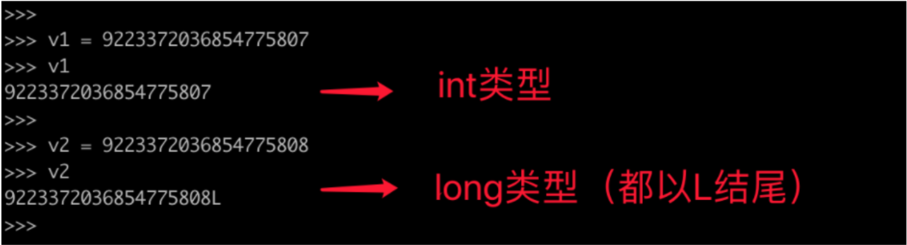

# day05 数据类型（上）

接下来的3天的课程都是来讲解数据类型的知识点，常见的数据类型：

- int，整数类型（整形）
- bool，布尔类型
- str，字符串类型
- list，列表类型
- tuple，元组类型
- dict，字典类型
- set，集合类型
- float，浮点类型（浮点型）


每种数据类型都有自己的特点及应用场景，以后的开发中需要根据实际的开发情况选择合适的数据类型。


每种数据类型的讲解，会按照以下4个维度来进行：

1. 定义
2. 独有功能
3. 公共功能
4. 类型转换
5. 其他


今日课程目标：掌握整形、布尔类型、字符串的必备知识。

今日课程概要：

- 整形
- 布尔类型
- 字符串类型


## 1.整型

整型其实就是十进制整数的统称，比如：1、68、999都属于整型。他一般用于表示 年龄、序号等。

### 1.1 定义

```python
number = 10
age = 99
```

### 1.2 独有功能

无

```python
v1 = 5
print(bin(v1))  # 0b101
# 调用v1（int）的独有功能，获取v1的二进制有多少个位组成。
result1 = v1.bit_length()
print(result1)  # 3

v2 = 10
print(bin(10))  # 0b1010
# 调用v2（int）的独有功能，获取v2的二进制有多少个位组成。
result2 = v2.bit_length()
print(result2)  # 4
```

### 1.3 公共功能

加减乘除

```python
v1 = 4
v2 = 8
v3 = v1 + v2
```

### 1.4 转换

在项目开发和面试题中经常会出现一些 "字符串" 和 布尔值 转换为 整型的情况。

```python
# 布尔值转整型
n1 = int(True)  # True转换为整数 1
n2 = int(False) # False转换为整数 0

# 字符串转整型
v1 = int("186",base=10) # 把字符串看成十进制的值，然后再转换为 十进制整数，结果：v1 = 186
v2 = int("0b1001",base=2) # 把字符串看成二进制的值，然后再转换为 十进制整数，结果：v1 = 9 (0b表示二进制)
v3 = int("0o144",base=8)  # 把字符串看成八进制的值，然后转换为 十进制整数，结果：v1 = 100 (0o表示八进制)
v4 = int("0x59",base=16)  # 把字符串看成十六进制的值，然后转换为 十进制整数，结果：v1 = 89 （0x表示十六进制）

# 浮点型（小数）
v1 = int(8.7) # 8
```

所以，如果以后别人给你一个按 二进制、八进制、十进制、十六进制 规则存储的字符串时，可以轻松的通过int转换为十进制的整数。

### 1.5 其他

#### 1.5.1 长整型

- Python3：整型（无限制）
- Python2：整型、长整形

在python2中跟整数相关的数据类型有两种：int(整型)、long（长整型），他们都是整数只不过能表示的值范围不同。



- int，可表示的范围：-9223372036854775808～9223372036854775807
- long，整数值超出int范围之后自动会转换为long类型（无限制）。

在python3中去除了long只剩下：int（整型），并且 int 长度不在限制。

#### 1.5.2 地板除

- Py3：

  ```python
  v1 = 9/2 
  print(v1) # 4.5
  ```

- py2:

  ```python
  v1 = 9/2 
  print(v1) # 4
  ```

  ```python
  from __future__ import division 
  
  v1 = 9/2 
  print(v1) # 4.5
  ```

  

## 2. 布尔类型

布尔值，其实就是 “真”、“假” 。

### 2.1 定义

```python
data = False
alex_is_sb = True
```

### 2.2 独有功能

无

### 2.3 公共功能

无

```python
v1 = True + True
print(v1) # 2
```

### 2.4 转换

在以后的项目开发中，会经常使用其他类型转换为布尔值的情景，此处只要记住一个规律即可。

```
整数0、空字符串、空列表、空元组、空字典转换为布尔值时均为False
其他均为True
```

```python
# 练习题：查看一些变量为True还是False
v1 = bool(0)
v2 = bool(-10)
v3 = bool(10)
v4 = bool("武沛齐")
v5 = bool("")
v6 = bool(" ")
v7 = bool([]) # [] 表示空列表
v8 = bool([11，22，33]) # [11，22，33] 表示非空列表
v9 = bool({}) # {} 表示空字典
v10 = bool({"name":"武沛齐","age":18}) # {"name":"武沛齐","age":18} 表示非空字典
```

### 2.5 其他

#### 2.5.1 做条件自动转换

如果在 `if` 、`while` 条件后面写一个值当做条件时，他会默认转换为布尔类型，然后再做条件判断。

```python
if 0:
	print("太六了")
else:
  print(999)

if "武沛齐":
	print("你好")

if "alex":
	print("你是傻逼？")
else:
	print("你是逗比？")
```

```python
while 1>9:
  pass
```

```python
if 值:
  pass

while 值:
  pass
```


## 3.字符串类型

字符串，我们平时会用他来表示文本信息。例如：姓名、地址、自我介绍等。

### 3.1 定义

```python
v1 = "包治百病"
v2 = '包治百病'
v3 = "包'治百病"
v4 = '包"治百病'
v5 = """
吵架都是我的错，
因为大家打不过。
"""
# 三个引号，可以支持多行/换行表示一个字符串，其他的都只能在一行中表示一个字符串。
```


### 3.2 独有功能（18/48）

```python
"xxxxx".功能(...)

v1 = "xxxxx"
v1.功能(...)
```


1. 判断字符串是否以 XX 开头？得到一个布尔值

   ```python
   v1 = "叨逼叨的一天，烦死了"
   
   # True
   result = v1.startswith("叨逼叨的一天")
   
   print(result) # 值为True
   ```

   ```python
   # 案例
   v1 = input("请输入住址：")
   
   if v1.startswith("北京市"):
   	print("北京人口")
   else:
   	print("非北京人口")
   ```

2. 判断字符串是否以 XX 结尾？得到一个布尔值

```python
v1 = "叨逼叨的一天，烦死了"

result = v1.endswith("烦死了")

print(result) # 值为True
```

```python
# 案例
address = input("请输入地址：")

if address.endswith('村'):
	print("农业户口")
else:
	print("非农户口")
```

3. 判断字符串是否为十进制数？得到一个布尔值

   ```python
   v1 = "1238871"
   result = v1.isdecimal()
   print(result) # True
   ```

   ```python
   # 案例,两个数相加。
   
   v1 = input("请输入值：") # ”666“
   v2 = input("请输入值：") # ”999“
   if v1.isdecimal() and v2.isdecimal():
   	data = int(v1) + int(v2)
   	print(data)
   else:
   	print("请正确输入数字")
   ```

   ```python
   v1 = "123"
   print(v1.isdecimal()) # True
   
   v2 = "①"
   print(v2.isdecimal()) # False
   
   v3 = "123"
   print(v3.isdigit()) # True
   
   v4 = "①"
   print(v4.isdigit()) # True
   ```

4. 去除字符串两边的 空格、换行符、制表符，得到一个新字符串

   ```python
   data = input("请输入内容：") #武沛齐,武沛齐   
   print(data)
   ```

   ```python
   msg = " H e ll o啊，树哥 "
   data = msg.strip()
   print(data) # 将msg两边的空白去掉，得到"H e ll o啊，树哥"
   ```

   ```python
   msg = " H e ll o啊，树哥 "
   data = msg.lstrip()
   print(data) # 将msg两边的空白去掉，得到"H e ll o啊，树哥 "
   ```

   ```python
   msg = " H e ll o啊，树哥 "
   data = msg.rstrip()
   print(data) # 将msg两边的空白去掉，得到" H e ll o啊，树哥"
   ```

   补充：去除 空格、换行符、制表符。

   ```python
   # 案例
   code = input("请输入4位验证码：") #  FB87 
   data = code.strip()
   if data == "FB87":
   	print('验证码正确')
   else:
   	print("验证码错误")
   ```

   再补充：去除字符串两边指定的内容

   ```python
   msg = "哥H e ll o啊，树哥"
   data = msg.strip("哥")
   print(data) # 将msg两边的空白去掉，得到"H e ll o啊，树"
   ```

   ```python
   msg = "哥H e ll o啊，树哥"
   data = msg.lstrip("哥")
   print(data) # 将msg两边的空白去掉，得到"H e ll o啊，树哥"
   ```

   ```python
   msg = "哥H e ll o啊，树哥"
   data = msg.rstrip("哥")
   print(data) # 将msg两边的空白去掉，得到"哥H e ll o啊，树"
   ```

5. 字符串变大写，得到一个新字符串

   ```python
   msg = "my name is oliver queen"
   data = msg.upper()
   
   print(msg) # my name is oliver queen
   print(data) # 输出为：MY NAME IS OLIVER QUEEN
   ```

   ```python
   # 案例
   code = input("请输入4位验证码：") #  FB88   fb88 
   value = code.upper() #  FB88  
   data = value.strip() # FB88
   
   if data == "FB87":
   	print('验证码正确')
   else:
   	print("验证码错误")
     
   # 注意事项
   """
   code的值"fb88 "
   value的值"FB88 "
   data的值"FB88"
   """
   ```

6. 字符串变小写，得到一个新字符串

   ```python
   msg = "My Name Is Oliver Queen"
   data = msg.lower()
   
   print(data) # 输出为：my name is oliver queen
   ```

   ```python
   # 案例
   code = input("请输入4位验证码：")
   value = code.strip().lower()
   if value == "fb87":
   	print('验证码正确')
   else:
   	print("验证码错误")
   ```

7. 字符串内容替换，得到一个新的字符串

   ```python
   data = "你是个好人，但是好人不合适我"
   value = data.replace("好人","贱人")
   print(data)  # "你是个好人，但是好人不合适我"
   print(value) # "你是个贱人，但是贱人不合适我"
   ```

   ```python
   # 案例
   video_file_name = "高清无码爱情动作片.mp4"
   
   new_file_name = video_file_name.replace("mp4","avi") # "高清无码爱情动作片.avi"
   
   final_file_name = new_file_name.replace("无码","步兵") # "高清步兵爱情动作片.avi"
   
   print(final_file_name)
   ```

   ```python
   # 案例
   video_file_name = "高清无码爱情动作片.mp4"
   
   new_file_name = video_file_name.replace("mp4","avi") # "高清无码爱情动作片.avi"
   
   final_file_name = video_file_name.replace("无码","步兵") # "高清步兵爱情动作片.mp4"
   
   print(final_file_name)
   ```

   ```python
   # 案例
   content = input("请输入评论信息") # alex是一个草包
   content = content.replace("草","**") # alex是一个**包
   content = content.replace("泥马","***") # alex是一个**包
   print(content) # alex是一个**包
   ```

   ```python
   char_list = ["草拟吗","逗比","二蛋","钢球"]
   
   content = input("请输入评论信息")
   for item in char_list:
     content = content.repalce(item,"**")
   
   print(content)
   ```

8. 字符串切割，得到一个列表

   ```python
   data = "武沛齐|root|wupeiqi@qq.com"
   result = data.split('|') # ["武沛齐","root","wupeiqi@qq.com"]
   print(data) # "武沛齐|root|wupeiqi@qq.com"
   print(result) # 输出 ["武沛齐","root","wupeiqi@qq.com"] 根据特定字符切开之后保存在列表中，方便以后的操作
   ```

   ```python
   # 案例：判断用户名密码是否正确
   info = "武沛齐,root"   # 备注：字符串中存储了用户名和密码
   user_list = info.split(',')    # 得到一个包含了2个元素的列表 [ "武沛齐" , "root" ]
   
   # user_list[0]
   # user_list[1]
   
   user = input("请输入用户名：")
   pwd = input("请输入密码：")
   
   if user == user_list[0] and pwd == user_list[1]:
   	print("登录成功")
   else:
   	print("用户名或密码错误")
   ```

   扩展

   ```python
   data = "武沛齐|root|wupeiqi@qq.com"
   v1 = data.split("|")   # ['武沛齐', 'root', 'wupeiqi@qq.com']
   print(v1)
   
   v2 = data.split("|", 2) # ['武沛齐', 'root|wupeiqi@qq.com']
   print(v2)
   ```

   再扩展

   ```python
   data = "武沛齐,root,wupeiqi@qq.com"
   
   v1 = data.rsplit(',')
   print(v1) # ['武沛齐', 'root', 'wupeiqi@qq.com']
   
   v2 = data.rsplit(',',1)
   print(v2) # ['武沛齐,root', 'wupeiqi@qq.com']
   ```

   应用场景：

   ```python
   file_path = "xxx/xxxx/xx.xx/xxx.mp4"
   
   data_list = file_path.rsplit(".",1) # ["xxx/xxxx/xx.xx/xxx","mp4"]
   data_list[0]
   data_list[1]
   ```

9. 字符串拼接，得到一个新的字符串

   ```python
   data_list = ["alex","是","大烧饼"]
   v1 = "_".join(data_list) # alex_是_大烧饼
   print(v1)
   ```

10. 格式化字符串，得到新的字符串

    ```python
    name = "{0}的喜欢干很多行业，例如有：{1}、{2} 等"
    data = name.format("老王","护士","嫩模")
    print(data) # 老王的喜欢干很多行业，例如有：护士、嫩模 等
    print(name) # "{0}的喜欢干很多行业，例如有：{1}、{2} 等"
    ```

    ```python
    name = "{}的喜欢干很多行业，例如有：{}、{} 等"
    data = name.format("老王","护士","嫩模")
    print(data) # 老王的喜欢干很多行业，例如有：护士、嫩模 等
    ```

    ```python
    name = "{name}的喜欢干很多行业，例如有：{h1}、{h2} 等"
    data = name.format(name="老王",h1="护士",h2="嫩模")
    print(data) # 老王的喜欢干很多行业，例如有：护士、嫩模 等
    ```

11. 字符串转换为字节类型

    ```python
    data = "嫂子"  # unicode，字符串类型
    
    v1 = data.encode("utf-8")  # utf-8，字节类型
    v2 = data.encode("gbk")  # gbk，字节类型
    
    print(v1)  # b'\xe5\xab\x82 \xe5\xad\x90'
    print(v2)  # b'\xc9\xa9 \xd7\xd3'
    
    s1 = v1.decode("utf-8") # 嫂子
    s2 = v2.decode("gbk") # 嫂子
    print(s1)
    print(s2)
    ```

12. 将字符串内容居中、居左、居右展示

    ```python
    v1 = "王老汉"
    # data = v1.center(21, "-")
    # print(data) #---------王老汉---------
    
    # data = v1.ljust(21, "-")
    # print(data) # 王老汉------------------
    
    # data = v1.rjust(21, "-")
    # print(data) # ------------------王老汉
    ```

13. 帮助你填充0

    ```python
    data = "alex"
    v1 = data.zfill(10)
    print(v1) # 000000alex
    ```

    ```python
    # 应用场景：处理二进制数据
    data = "101" # "00000101"
    v1 = data.zfill(8)
    print(v1) # "00000101"
    ```

#### 练习题

1. 写代码实现判断用户输入的值否以 "al"开头,如果是则输出 "是的" 否则 输出 "不是的"

2. 写代码实现判断用户输入的值否以"Nb"结尾,如果是则输出 "是的" 否则 输出 "不是的"

3. 将 name 变量对应的值中的 所有的"l"替换为 "p",并输出结果

4. 写代码实现对用户输入的值判断，是否为整数，如果是则转换为整型并输出，否则直接输出"请输入数字"

5. 对用户输入的数据使用"+"切割，判断输入的值是否都是数字？
	提示：用户输入的格式必须是以下+连接的格式，如 5+9 、alex+999
	
6. 写代码实现一个整数加法计算器(两个数相加)
    需求：提示用户输入：5+9或5+9或5+9，计算出两个值的和（提示：先分割再转换为整型，再相加）
    
7. 写代码实现一个整数加法计算器(两个数相加)
    需求：提示用户输入：5 +9或5+ 9或5 + 9，计算出两个值的和（提示：先分割再去除空白、再转换为整型，再相加）
    
8. 补充代码实现用户认证。
	需求：提示用户输入手机号、验证码，全都验证通过之后才算登录成功（验证码大小写不敏感）
	
	```python
	import random
	code = random.randrange(1000,9999) # 生成动态验证码
	msg = "欢迎登录PythonAV系统，您的验证码为：{},手机号为：{}".format(code,"15131266666")
	print(msg)
	# 请补充代码
	```
	
9. 补充代码实现数据拼接
	
	```python
	data_list = []
	while True:
	    hobby = input("请输入你的爱好（Q/q退出）：")
	    if hobby.upper() == 'Q':
	        break
	    # 把输入的值添加到 data_list 中，如：data_list = ["小姨子","哥们的女朋友"]
	    data_list.append(hobby) 
	    # 将所有的爱好通过符号 "、"拼接起来并输出
	```
	
	

### 3.3 公共功能

1. 相加：字符串 + 字符串

   ```python
   v1 = "alex" + "大sb"
   print(v1)
   ```

2. 相乘：字符串 * 整数

   ```python
   data = "嫂子" * 3
   print(data) # 嫂子嫂子嫂子
   ```

3. 长度

   ```python
   data = "嫂子满身大汉"
   value = len(data) 
   print(value) # 6
   ```

4. 获取字符串中的字符，索引

   ```python
   message = "来做点py交易呀"
   #          0 1 2345 6 7
   #           ... -3 -2 -1
   print(message[0]) # "来"
   print(message[1]) # "做"
   print(message[2]) # "点"
   
   print(message[-1]) # 呀
   print(message[-2]) # 呀
   print(message[-3]) # 呀
   ```

   注意：字符串中是能通过索引取值，无法修改值。【字符串在内部存储时不允许对内部元素修改，想修改只能重新创建。】

   ```python
   message = "来做点py交易呀"
   index = 0
   while index < len(message):
   	value = message[index]
       print(value)
       index += 1
   ```

   ```python
   message = "来做点py交易呀"
   index = len(message) - 1
   while index >=0:
       value = message[index]
       print(value)
       index -= 1
   ```

5. 获取字符串中的子序列，切片

   ```python
   message = "来做点py交易呀"
   
   print(message[0:2]) # "来做"
   print(message[3:7]) # "py交易"
   print( message[3:] ) # "py交易呀"
   print( message[:5] ) # "来做点py"
   
   print(message[4:-1]) # "y交易"
   print(message[4:-2]) # "y交"
   
   print( message[4:len(message)] ) # "y交易呀"
   ```

   注意：字符串中的切片只能读取数据，无法修改数据。【字符串在内部存储时不允许对内部元素修改，想要修改只能重新创建】

   ```python
   message = "来做点py交易呀"
   
   value = message[:3] + "Python" + message[5:]
   print(value)
   ```

6. 步长，跳着去字符串的内容

   ```python
   name = "生活不是电影，生活比电影苦"
   
   print( name[ 0:5:2 ] )   # 输出：生不电 【前两个值表示区间范围，最有一个值表示步长】
   print( name[ :8:2 ] )    # 输出：生不电，  【区间范围的前面不写则表示起始范围为0开始】
   print( name[ 2::3 ] )    # 输出：不电，活电苦 【区间范围的后面不写则表示结束范围为最后】
   print( name[ ::2 ] )     # 输出：生不电，活电苦 【区间范围不写表示整个字符串】
   print( name[ 8:1:-1 ] )  # 输出：活生，影电是不 【倒序】
   ```

   ```python
   name = "生活不是电影，生活比电影苦"
   
   print(name[8:1:-1])  # 输出：活生，影电是不 【倒序】
   print(name[-1:1:-1])  # 输出：苦影电比活生，影电是不 【倒序】
   
   # 面试题：给你一个字符串，请将这个字符串翻转。
   value = name[-1::-1]
   print(value)  # 苦影电比活生，影电是不活生
   ```

7. 循环

   - while循环

     ```python
     message = "来做点py交易呀"
     index = 0
     while index < len(message):
     	value = message[index]
         print(value)
         index += 1
     ```

   - for循环

     ```python
     message = "来做点py交易呀"
     for char in message:
         print(char)
     ```

   - range，帮助我们创建一系列的数字

     ```python
     range(10) # [0,1,2,3,4,5,6,7,8,9]
     range(1,10) # [1,2,3,4,5,6,7,8,9]
     range(1,10,2) # [1,3,5,7,9]
     range(10,1,-1) # [10,9,8,7,6,5,4,3,2]
     ```

   - For + range

     ```python
     for i in range(10):
         print(i)
     ```

     ```python
     message = "来做点py交易呀"
     
     for i in range(5): # [0,1,2,3,4]
         print(message[i])
     ```

     ```python
     message = "来做点py交易呀"
     for i in range( len(message) ): # [0,1,2,3,4,5,6,7]
         print(message[i])
     ```

   一般应用场景：

   - while，一般在做无限制（未知）循环此处时使用。

     ```python
     while True:
         ...
     ```

     ```python
     # 用户输入一个值，如果不是整数则一直输入，直到是整数了才结束。
     num = 0
     while True:
         data = input("请输入内容:")
         if data.isdecimal():
             num = int(data)
             break
     	else:
             print("输入错误，请重新输入！")
     ```

   - for循环，一般应用在已知的循环数量的场景。

     ```python
     message = "来做点py交易呀"
     for char in message:
         print(char)
     ```

     ```python
     for i in range(30):
         print(message[i])
     ```

   
   - break和continue关键字
   
     ```python
     message = "来做点py交易呀"
     for char in message:
         if char == "p":
             continue
         print(char)
     
     # 输出：
     来
     做
     点
     y
     交
     易
     呀
     ```
   
     ```python
     message = "来做点py交易呀"
     for char in message:
         if char == "p":
             break
         print(char)
     
     # 输出：
     来
     做
     点
     ```
   
     ```python
     for i in range(5):
         print(i)# 0 1 2 3 4
         for j in range(3):
             break
             print(j) # 0 1 2  # 0 1 2  # 0 1 2  # 0 1 2  # 0 1 2  
     ```
   
     


### 3.4 转换

```python
num = 999
data = str(num)
print(data) # "999"
```

```python
data_list = ["alex","eric",999]
data = str(data_list)
print(data) # '["alex","eric",999]'
```

一般情况下，只有整型转字符串才有意义。


### 3.5 其他

#### 3.5.1 字符串不可被修改

```python
name = "武沛齐"

name[1]
name[1:2]
```

```python
num_list = [11,22,33]

num_list[0]
num_list[0] = 666
```


## 总结

1. 整型在Python2和Python3中的区别？

2. 进制之间的转换。

3. 其他类型转换为布尔类型时，空和0为False，其他均为True。

4. 条件语句中可自动化转换布尔类型来做判断。

   ```python
   if "武沛齐":
       print(666)
   else:
       print(999)
   ```

5. 字符串中常见的独有功能。

6. 字符串中常见的公共功能。

7. 字符串创建之后是不可以被修改的。


## 作业

1. 请用代码实现如下进制的转换。

   ```python
   v1 = 675          # 请将v1转换为二进制（字符串类型）。
   
   v2 = "0b11000101" # 请将二进制v2转换为十进制（整型）
   
   v3 = "11000101"   # 请将二进制v3转换为十进制（整型）
   ```

2. 按要求实现

   > 现有 `v1=123` 和 `v2=456`，请将这两个值转换为二进制，并将其二进制中的前缀 0b 去掉，然后将两个二进制拼接起来，最终再转换为整型（十进制）。
   >
   > 例如：
   >
   > ​		123  对应二进制为  "0b1111011" ，去除前缀0b之后的二进制为 "1111011"
   >
   > ​		456  对应二进制为  "0b111001000" ，去除前缀0b之后的二进制为 "111001000"
   >
   > ​		将两个二进制拼接起来的值为："1111011111001000"，再将此值转换为整型为：63432

3. 按要求实现

   > 现有 `v1=123` 和 `v2=456`，请将这两个值转换为二进制，并将其二进制中的前缀 0b 去掉，再补足为2个字节（16位），然后将两个二进制拼接起来，最终再转换为整型（十进制）。
   >
   > 例如：
   >
   > ​		123  对应二进制为  "0b1111011" ，去除前缀0b之后的二进制为 "1111011" ，补足16位为  "00000000 01111011"
   >
   > ​		456  对应二进制为  "0b111001000" ，去除前缀0b之后的二进制为 "111001000"，，补足16位为  "00000001 11001000"
   >
   > ​		将两个二进制拼接起来的值为："00000000 0111101100000001 11001000"，再将此值转换为整型为：8061384

4. 列举你了解的那些数据类型的值转换为布尔值为False。

5. 看代码写结果：

   ```python
   if "":
       print(123)
   else:
       print(456)
   ```

   ```python
   if 0:
       print(999)
   else:
       print(666)
   ```

   ```python
   if "武沛齐":
       print(345)
   else:
       print(110)
   ```

6. 让用户输入一段文本，请实现将文本中的敏感词 `苍老师`、`波波老师`替换为 `***`，最后并输入替换后的文本。

7. 有变量name = "aleX leNb " 完成如下操作： 

   - 移除 name 变量对应的值两边的空格,并输出处理结果
   - 判断 name 变量是否以 "al" 开头,并输出结果（用切片 或 startswith实现）
   - 判断name变量是否以"Nb"结尾,并输出结果（用切片 或 endswith实现）
   - 将 name 变量对应的值中的 所有的"l" 替换为 "p",并输出结果 
   - 将 name 变量对应的值根据 所有的"l" 分割,并输出结果
   - 将name变量对应的值根据第一个"l"分割,并输出结果
   - 将 name 变量对应的值变大写,并输出结果
   - 将 name 变量对应的值变小写,并输出结果

8. 如何实现字符串的翻转？

9. 有字符串s = "123a4b5c"

   - 通过对s切片形成新的字符串 "123"
   - 通过对s切片形成新的字符串 "a4b"
   - 通过对s切片形成字符串 "c"
   - 通过对s切片形成字符串 "ba2"

10. 使用while循环实现对字符串 message = "伤情最是晚凉天，憔悴厮人不堪言" 中每个字符进行输出。

11. 使用for循环实现对字符串 message = "伤情最是晚凉天，憔悴厮人不堪言" 中每个字符进行输出。

12. 使用for循环和range实现对字符串 message = "伤情最是晚凉天，憔悴厮人不堪言" 中每个字符进行倒叙输出。

13. 使用for循环实现输出倒计时效果，例如：输出内容依次是："倒计时3秒"，"倒计时2秒"，"倒计时1秒"。

14. 让用户输入一段文本，请计算文本中 "浪" 出现的次数，并输入结果。

15. 获取用户两次输入的内容，并提取其中的数字，然后实现数字的相加（转换为整型再相加）：

    ```python
    """
    要求：
    	将num1中的的所有数字找到并拼接起来：1232312
    	将num1中的的所有数字找到并拼接起来：1218323
    	然后将两个数字进行相加。
    """
    num1 = input("请输入：") # asdfd123sf2312
    num2 = input("请输入：") # a12dfd183sf23
    # 请补充代码
    ```

    


