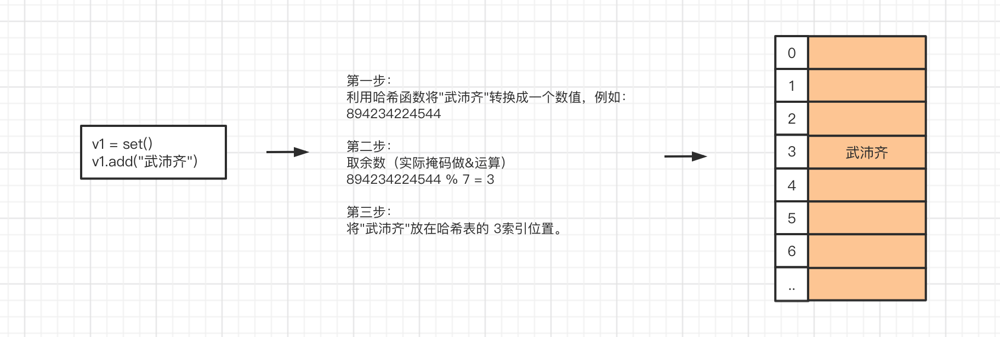
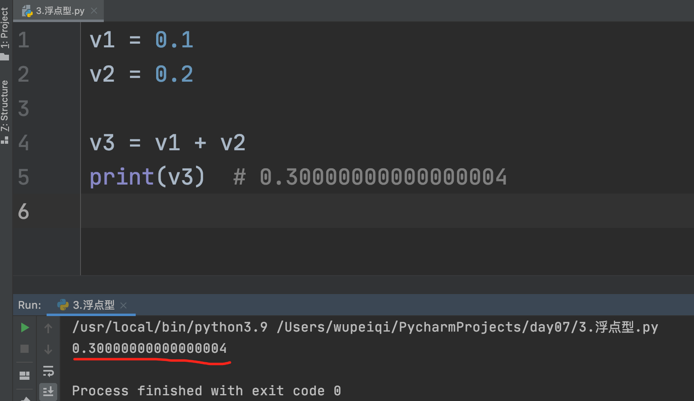

# day06 数据类型（下）

常见的数据类型：

- <span style="color:gray">int，整数类型（整形）</span>
- <span style="color:gray">bool，布尔类型</span>
- <span style="color:gray">str，字符串类型</span>
- <span style="color:gray">list，列表类型</span>
- <span style="color:gray">tuple，元组类型</span>
- **dict，字典类型**
- **set，集合类型**
- **float，浮点类型（浮点型）**


目标：掌握字典、集合、浮点类型相关知识。

课程概要：

- set集合，一个不允许重复重复 & 可变类型（元素可哈希）。
- dict字典，一个容器且元素必须是键值对。
- float类型，我们生活中常见的小数。


## 1.集合（set）

集合是一个 无序 、可变、不允许数据重复的容器。

### 1.1 定义

```python
v1 = { 11, 22, 33, "alex" }
```

- 无序，无法通过索引取值。

- 可变，可以添加和删除元素。

  ```python
  v1 = {11,22,33,44}
  v1.add(55)
  print(v1) # {11,22,33,44,55}
  ```

- 不允许数据重复。

  ```python
  v1 = {11,22,33,44}
  v1.add(22)
  print(v1) # {11,22,33,44}
  ```

一般什么时候用集合呢？

> 就是想要维护一大堆不重复的数据时，就可以用它。比如：做爬虫去网上找图片的链接，为了避免链接重复，可以选择用集合去存储链接地址。


**注意**：定义空集合时，只能使用`v = set()`，不能使用 `v={}`（这样是定义一个空字典）。

```python
v1 = []
v11 = list()

v2 = ()
v22 = tuple()

v3 = set()

v4 = {} # 空字典
v44 = dict()
```


### 1.2 独有功能

1. 添加元素

   ```python
   data = {"刘嘉玲", '关之琳', "王祖贤"}
   data.add("郑裕玲")
   print(data)
   ```

   ```python
   data = set()
   data.add("周杰伦")
   data.add("林俊杰")
   print(data)
   ```

2. 删除元素

   ```python
   data = {"刘嘉玲", '关之琳', "王祖贤","张曼⽟", "李若彤"}
   data.discard("关之琳") 
   print(data)
   ```

3. 交集

   ```python
   s1 = {"刘能", "赵四", "⽪⻓⼭"}
   s2 = {"刘科⻓", "冯乡⻓", "⽪⻓⼭"}
   
   s4 = s1.intersection(s2) # 取两个集合的交集 
   print(s4) # {"⽪⻓⼭"}
   
   s3 = s1 & s2   			  # 取两个集合的交集
   print(s3)
   ```

4. 并集

   ```python
   s1 = {"刘能", "赵四", "⽪⻓⼭"}
   s2 = {"刘科⻓", "冯乡⻓", "⽪⻓⼭"}
   s4 = s1.union(s2) 		# 取两个集合的并集  {"刘能", "赵四", "⽪⻓⼭","刘科⻓", "冯乡⻓", }
   print(s4)
   s3 = s1 | s2   			# 取两个集合的并集
   print(s3)
   ```

5. 差集

   ```python
   s1 = {"刘能", "赵四", "⽪⻓⼭"}
   s2 = {"刘科⻓", "冯乡⻓", "⽪⻓⼭"}
   s4 = s1.difference(s2) 		# 差集，s1中有且s2中没有的值 {"刘能", "赵四"}
   s6 = s2.difference(s1)   	# 差集，s2中有且s1中没有的值 {"刘科⻓", "冯乡⻓"}
   
   s3 = s1 - s2   			   # 差集，s1中有且s2中没有的值
   s5 = s2 - s1   			   # 差集，s2中有且s1中没有的值
   
   print(s5,s6)
   ```


### 1.3 公共功能

1. 减，计算差集

   ```python
   s1 = {"刘能", "赵四", "⽪⻓⼭"}
   s2 = {"刘科⻓", "冯乡⻓", "⽪⻓⼭"}
   
   s3 = s1 - s2 
   s4 = s2 - s1
   print(s3)
   print(s4)
   ```

2. &，计算交集

   ```python
   s1 = {"刘能", "赵四", "⽪⻓⼭"}
   s2 = {"刘科⻓", "冯乡⻓", "⽪⻓⼭"}
   s3 = s1 & s2
   print(s3)
   ```

3. |，计算并集

   ```python
   s1 = {"刘能", "赵四", "⽪⻓⼭"}
   s2 = {"刘科⻓", "冯乡⻓", "⽪⻓⼭"}
   s3 = s1 | s2
   print(s3)
   ```

4. 长度

   ```python
   v = {"刘能", "赵四", "尼古拉斯"}
   data = len(v)
   print(data)
   ```

5. for循环

   ```python
   v = {"刘能", "赵四", "尼古拉斯"}
   for item in v:
   	print(item)
   ```

### 1.4 转换

其他类型如果想要转换为集合类型，可以通过set进行转换，并且如果数据有重复自动剔除。

提示：int/list/tuple/dict都可以转换为集合。

```python
v1 = "武沛齐"
v2 = set(v1)
print(v2) # {"武","沛","齐"}
```

```python
v1 = [11,22,33,11,3,99,22]
v2 = set(v1)
print(v2) # {11,22,33,3,99}
```

```python
v1 = (11,22,3,11)
v2 = set(v1)
print(v2) # {11,22,3}
```

提示：这其实也是去重的一个手段。

```python
data = {11,22,33,3,99}

v1 = list(data) # [11,22,33,3,99]

v2 = tuple(data) # (11,22,33,3,99)
```


### 1.5 其他

#### 1.5.1 集合的存储原理



#### 1.5.2 元素必须可哈希

因存储原理，集合的元素必须是可哈希的值，即：内部通过通过哈希函数把值转换成一个数字。


目前可哈希的数据类型：int、bool、str、tuple，而list、set是不可哈希的。

总结：集合的元素只能是 int、bool、str、tuple 。

- 转换成功

  ```python
  v1 = [11,22,33,11,3,99,22]
  v2 = set(v1)
  print(v2) # {11,22,33,3,99}
  ```

- 转换失败

  ```python
  v1 = [11,22,["alex","eric"],33]
  v2 = set(v1) # 报错 
  print(v2) 
  ```


#### 1.5.3 查找速度特别快

因存储原理特殊，集合的查找效率非常高（数据量大了才明显）。

- 低

  ```python
  user_list = ["武沛齐","alex","李璐"]
  if "alex" in user_list:
      print("在")
  else:
      print("不在")
      
      
  user_tuple = ("武沛齐","alex","李璐")
  if "alex" in user_tuple:
      print("在")
  else:
      print("不在")
  ```

- 效率高

  ```python
  user_set = {"武沛齐","alex","李璐"}
  if "alex" in user_set:
      print("在")
  else:
      print("不在")
  ```

  

#### 1.5.4 对比和嵌套

| 类型  | 是否可变 | 是否有序 | 元素要求 | 是否可哈希 | 转换        | 定义空            |
| ----- | -------- | -------- | -------- | ---------- | ----------- | ----------------- |
| list  | 是       | 是       | 无       | 否         | list(其他)  | `v=[]或v=list()`  |
| tuple | 否       | 是       | 无       | 是         | tuple(其他) | `v=()或v=tuple()` |
| set   | 是       | 否       | 可哈希   | 否         | set(其他)   | `v=set()`         |

```python
data_list = [
    "alex",
    11,
    (11, 22, 33, {"alex", "eric"}, 22),
    [11, 22, 33, 22],
    {11, 22, (True, ["中国", "北京"], "沙河"), 33}
]
```

注意：由于True和False本质上存储的是 1 和 0 ，而集合又不允许重复，所以在整数 0、1和False、True出现在集合中会有如下现象：

```python
v1 = {True, 1}
print(v1)  # {True}

v2 = {1, True}
print(v2)  # {1}

v3 = {0, False}
print(v3)  # {0}

v4 = {False, 0}
print(v4)  # {False}
```


### 练习题

1. 写代码实现

   ```python
   v1 = {'alex','武sir','肖大'}
   v2 = []
   
   # 循环提示用户输入，如果输入值在v1中存在，则追加到v2中，如果v1中不存在，则添加到v1中。（如果输入N或n则停止循环）
   while True:
       name = input("请输入姓名(N/n退出)：")
       if name.upper() == "Q":
           break
       if name in v1:
           v2.append(name)
   	else:
           v1.add(name)
   ```

2. 下面那些值不能做集合的元素

   ```python
   ""
   0
   [11,22,33]   # 不能
   []           # 不能
   (123)
   {1,2,3}      # 不能
   ```

3. 模拟用户信息录入程序，已录入则不再创建。

   ```python
   user_info_set = set()
   
   while True:
       name = input("请输入姓名：")
       age = input("请输入年龄：")
   	item = (name,age,)
       if item in user_info_set:
           print("该用户已录入")
   	else:
       	user_info_set.add(item)
   ```

4. 给你个列表去重。

   ```python
   v = [11,22,11,22,44455]
   data = set(v) # {11,22,44455}
   result = list(data) # [11,22,44455]
   ```


## 强插：None类型

Python的数据类型中有一个特殊的值None，意味着这个值啥都不是 或 表示空。 相当于其他语言中 `null`作用一样。

在一定程度上可以帮助我们去节省内存。例如：

```python
v1 = None
v2 = None
..
v1 = [11,22,33,44]
v2 = [111,22,43]
```

```python
v3 = []
v4 = []
...
v3 = [11,22,33,44]
v4 = [111,22,43]
```

注意：暂不要考虑Python内部的缓存和驻留机制。


目前所有转换为布尔值为False的值有：

```python
0
""
[] or list()
() or tuple()
set()
None
```

```python
if None:
    pass
```


## 2.字典（dict)

字典是 **无序**、**键不重复** 且 元素只能是**键值对**的**可变的** 个 **容器**。

```python
data = { "k1":1,  "k2":2 }
```

- 容器

- 元素必须键值对

- 键不重复，重复则会被覆盖

  ```python
  data = { "k1":1, "k1":2 }
  print(data) # {"k1":2}
  ```

- 无序（在Python3.6+字典就是有序了，之前的字典都是无序。）

  ```python
  data = { "k1":1,  "k2":2 }
  print(data)
  ```

  

### 2.1 定义

```python
v1 = {}
v2 = dict()
```

```python
data = { 
    "k1":1, 
    "k2":2 
}
```

```python
info = { 
    "age":12, 
    "status":True,  
    "name":"wupeiqi",   
    "hobby":['篮球','足球']  
}
```

字典中对键值得要求：

- 键：必须可哈希。 目前为止学到的可哈希的类型：int/bool/str/tuple；不可哈希的类型：list/set/dict。（集合）
- 值：任意类型。

```python
data_dict = {
	"武沛齐":29,
	 True:5,
	123:5,
    (11,22,33):["alex","eric"]
}
```

```python
# 不合法
v1 = {
    [1, 2, 3]: '周杰伦',
    "age" : 18
} 
v2 = {
    {1,2,3}: "哈哈哈",
    'name':"alex"
} 

v3 = {
    {"k1":123,"k2":456}: '呵呵呵',
    "age":999
}
```

```python
data_dict = {
    1: 29,
    True: 5
}
print(data_dict) # {1: 5}
```


一般在什么情况下会用到字典呢？

当我们想要表示一组固定信息时，用字典可以更加的直观，例如：

```python
# 用户列表
user_list = [ ("alex","123"), ("admin","666") ]
...
```

```python
# 用户列表
user_list = [ {"name":"alex","pwd":"123"}, {"name":"eric","pwd":"123"} ]
```


### 2.2 独有功能

1. 获取值

   ```python
   info = { 
       "age":12, 
       "status":True, 
       "name":"武沛齐",
       "data":None
   }
   
   data1 = info.get("name")
   print(data1) # 输出：武沛齐
   
   data2 = info.get("age")
   print(data2) # 输出：12
   
   data = info.get("email") # 键不存在，默认返回 None
   """
   if data == None:
       print("此键不存在")
   else:
       print(data)
   
   if data:
       print(data)
   else:
       print("键不存在")
   """
   
   """
   # 字典的键中是否存在 email
   if "email" in info:
       data = info.get("email")
       print(data)
   else:
   	print("不存在")
   """
   
   data = info.get("hobby",123)
   print(data) # 输出：123
   ```

   ```python
   # 案例：
   user_list = {
       "wupeiqi": "123",
       "alex": "uk87",
   }
   
   username = input("请输入用户名：")
   password = input("请输入密码：")
   # None，用户名不存在
   # 密码，接下来比较密码
   pwd = user_list.get(username)
   
   if pwd == None:
       print("用户名不存在")
   else:
       if password == pwd:
           print("登录成功")
   	else:
           print("密码错误")
   ```

   ```python
   # 案例：
   user_list = {
       "wupeiqi": "123",
       "alex": "uk87",
   }
   
   username = input("请输入用户名：")
   password = input("请输入密码：")
   # None，用户名不存在
   # 密码，接下来比较密码
   pwd = user_list.get(username)
   
   if pwd:
       if password == pwd:
           print("登录成功")
   	else:
           print("密码错误")
   else:
       print("用户名不存在")
   ```

   ```python
   # 案例：
   user_list = {
       "wupeiqi": "123",
       "alex": "uk87",
   }
   
   username = input("请输入用户名：")
   password = input("请输入密码：")
   # None，用户名不存在
   # 密码，接下来比较密码
   pwd = user_list.get(username)
   
   if not pwd:
       print("用户名不存在")
   else:
       if password == pwd:
           print("登录成功")
   	else:
           print("密码错误")
           
   # 写代码的准则：简单的逻辑处理放在前面；复杂的逻辑放在后面。
   ```

2. 所有的键

   ```python
   info = {"age":12, "status":True, "name":"wupeiqi","email":"xx@live.com"}
   data = info.keys()
   print(data) # 输出：dict_keys(['age', 'status', 'name', 'email'])    py2 -> ['age', 'status', 'name', 'email']
   
   result = list(data)
   print(result) # ['age', 'status', 'name', 'email']
   ```

   注意：在Python2中 字典.keys()直接获取到的是列表，而Python3中返回的是`高仿列表`，这个高仿的列表可以被循环显示。

   ```python
   # 循环
   info = {"age":12, "status":True, "name":"wupeiqi","email":"xx@live.com"}
   for ele in info.keys():
       print(ele)
   ```

   ```python
   # 是否存在
   info = {"age":12, "status":True, "name":"wupeiqi","email":"xx@live.com"}
   # info.keys() # dict_keys(['age', 'status', 'name', 'email'])
   if "age" in info.keys():
       print("age是字典的键")
   else:
       print("age不是")
   ```

3. 所有的值

   ```python
   info = {"age":12, "status":True, "name":"wupeiqi","email":"xx@live.com"}
   data = info.values()
   
   print(data) # 输出：dict_values([12, True, 'wupeiqi', 'xx@live.com'])
   ```

   注意：在Python2中 字典.values()直接获取到的是列表，而Python3中返回的是高仿列表，这个高仿的列表可以被循环显示。

   ```python
   # 循环
   info = {"age":12, "status":True, "name":"wupeiqi","email":"xx@live.com"}
   for val in info.values():
       print(val) 
   ```

   ```python
   # 是否存在
   info = {"age":12, "status":True, "name":"wupeiqi","email":"xx@live.com"}
   if 12 in info.values():
       print("12是字典的值")
   else:
       print("12不是")
   ```

   

4. 所有的键值

   ```python
   info = {"age":12, "status":True, "name":"wupeiqi","email":"xx@live.com"}
   data = info.items()
   
   print(data) # 输出 dict_items([ ('age', 12),  ('status', True),  ('name', 'wupeiqi'),  ('email', 'xx@live.com')  ])
   ```

   ```python
   for item in info.items():
       print(item[0],item[1]) # item是一个元组 (键，值)
   ```

   ```python
   for key,value in info.items():
       print(key,value) # key代表键，value代表值，将兼职从元组中直接拆分出来了。
   ```

   ```python
   info = {"age":12, "status":True, "name":"wupeiqi","email":"xx@live.com"}
   data = info.items()
   
   if ('age', 12) in data:
       print("在")
   else:
       print("不在")
   ```

5. 设置值

   ```python
   data = {
       "name": "武沛齐",
       "email": 'xxx@live.com'
   }
   data.setdefault("age", 18)
   print(data)  # {'name': '武沛齐', 'email': 'xxx@live.com', 'age': 18}
   
   data.setdefault("name", "alex")
   print(data)  # {'name': '武沛齐', 'email': 'xxx@live.com', 'age': 18}
   ```

6. 更新字典键值对

   ```python
   info = {"age":12, "status":True}
   info.update( {"age":14,"name":"武沛齐"} )   # info中没有的键直接添加；有的键则更新值
   print(info) # 输出：{"age":14, "status":True,"name":"武沛齐"}
   ```

7. 移除指定键值对

   ```python
   info = {"age":12, "status":True,"name":"武沛齐"}
   
   data = info.pop("age")
   
   print(info) # {"status":True,"name":"武沛齐"}
   print(data) # 12
   ```

8. 按照顺序移除（后进先出）

   ```python
   info = {"age":12, "status":True,"name":"武沛齐"}
   data = info.popitem() # ("name","武沛齐" )
   
   print(info) # {"age":12, "status":True}
   print(data) # ("name","武沛齐")
   ```

   - py3.6后，popitem移除最后的值。
   - py3.6之前，popitem随机删除。

```python
# 练习题
""" 
结合下面的两个变量 header 和 stock_dict实现注意输出股票信息，格式如下：
	SH601778，股票名称:中国晶科、当前价:6.29、涨跌额:+1.92。
    SH688566，股票名称:吉贝尔、当前价:...               。
	...
"""
header = ['股票名称', '当前价', '涨跌额']

stock_dict = {
    'SH601778': ['中国晶科', '6.29', '+1.92'], 
    'SH688566': ['吉贝尔', '52.66', '+6.96'], 
    'SH688268': ['华特气体', '88.80', '+11.72'], 
    'SH600734': ['实达集团', '2.60', '+0.24']
}
```


### 2.3 公共功能

1. 求`并集`（Python3.9新加入）

   ```python
   v1 = {"k1": 1, "k2": 2}
   v2 = {"k2": 22, "k3": 33}
   
   v3 = v1 | v2
   print(v3) # {'k1': 1, 'k2': 22, 'k3': 33}
   ```

2. 长度

   ```python
   info = {"age":12, "status":True,"name":"武沛齐"}
   data = len(info)
   print(data) # 输出：3
   ```

3. 是否包含

   ```python
   info = { "age":12,  "status":True,"name":"武沛齐" }
   v1 = "age" in info
   print(v1)
   
   v2 = "age" in info.keys()
   print(v2)
   
   if "age" in info:
       pass
   else:
       pass
   ```

   ```python
   info = {"age":12, "status":True,"name":"武沛齐"}
   v1 = "武佩奇" in info.values()
   print(v1)
   ```

   ```python
   info = {"age": 12, "status": True, "name": "武沛齐"}
   # 输出info.items()获取到的 dict_items([ ('age', 12),  ('status', True),  ('name', 'wupeiqi'),  ('email', 'xx@live.com')  ])
   v1 = ("age", 12) in info.items()
   print(v1)
   ```

4. 索引（键）
   字典不同于元组和列表，字典的索引是`键`，而列表和元组则是 `0、1、2等数值` 。

   ```python
   info = { "age":12,  "status":True, "name":"武沛齐"}
   
   print( info["age"] )  	    # 输出：12
   print( info["name"] )		# 输出：武沛齐
   print( info["status"] )	    # 输出：True
   print( info["xxxx"] )   	# 报错，通过键为索引去获取之后时，键不存在会报错（以后项目开发时建议使用get方法根据键去获取值）
   
   value = info.get("xxxxx") # None
   print(value)
   ```

5. 根据键 修改值 和 添加值 和 删除键值对
   上述示例通过键可以找到字典中的值，通过键也可以对字典进行添加和更新操作

   ```python
   info = {"age":12, "status":True,"name":"武沛齐"}
   
   info["gender"] = "男"
   
   print(info) # 输出： {"age":12, "status":True,"name":"武沛齐","gender":"男"}
   ```

   ```python
   info = {"age":12, "status":True,"name":"武沛齐"}
   
   info["age"] = "18" 
   
   print(info) # 输出： {"age":"18", "status":True,"name":"武沛齐"}
   ```

   ```python
   info = {"age":12, "status":True,"name":"武沛齐"}
   del info["age"]  # 删除info字典中键为age的那个键值对（键不存在则报错）
   
   print(info) # 输出： {"status":True,"name":"武沛齐"}
   ```

   ```python
   info = {"age": 12, "status": True, "name": "武沛齐"}
   if "agea" in info:
   
       # del info["age"]
       data = info.pop("age")
       print(info)
       print(data)
   else:
       print("键不存在")
   ```

6. for循环
   由于字典也属于是容器，内部可以包含多个键值对，可以通过循环对其中的：键、值、键值进行循环；

   ```python
   info = {"age":12, "status":True,"name":"武沛齐"}
   for item in info:
   	print(item)  # 所有键
   ```

   ```python
   info = {"age":12, "status":True,"name":"武沛齐"}
   for item in info.key():
   	print(item)
   ```

   ```python
   info = {"age":12, "status":True,"name":"武沛齐"}
   for item in info.values():
   	print(item)
   ```

   ```python
   info = {"age":12, "status":True,"name":"武沛齐"}
   for key,value in info.items():
   	print(key,value)
   ```


### 2.4 转换

想要转换为字典.

```python
v = dict( [ ("k1", "v1"), ["k2", "v2"] ] )

print(v) # { "k1":"v1", "k2":"v2" }
```

```python
info = { "age":12, "status":True, "name":"武沛齐" }

v1 = list(info)        # ["age","status","name"]

v2 = list(info.keys()) # ["age","status","name"]

v3 = list(info.values()) # [12,True,"武沛齐"]

v4 = list(info.items()) # [ ("age",12), ("status",True), ("name","武沛齐") ]
```


### 1.5 其他

#### 1.5.1 存储原理


#### 1.5.2 速度快

```python
info = {
    "alex":["肝胆","铁锤"], 
	"老男孩":["二蛋","缺货"]
}
for "alex" in info:
    print("在"）
```

```python
info = {
    "alex":["肝胆","铁锤"], 
	"老男孩":["二蛋","缺货"]
}
v1 = info["alex"]
v2 = info.get("alex")
```


#### 1.5.3 嵌套

我们已学了很多数据类型，在涉及多种数据类型之间的嵌套时，需注意一下几点：

- 字典的键必须可哈希（list/set/dict不可哈希）。

  ```python
  info = {
      (11,22):123
  }
  
  # 错误
  info = {
      (11,[11,22,],22):"alex"
  }
  ```

- 字典的值可以是任意类型。

  ```python
  info = {
      "k1":{12,3,5},
  	"k2":{"xx":"x1"}
  }
  ```

- 字典的键和集合的元素在遇到  布尔值 和 1、0 时，需注意重复的情况。
- 元组的元素不可以被替换。

```python
dic = {
	'name':'汪峰',
	'age':48,
	'wife':[ {'name':'国际章','age':38},{'name':'李杰','age':48} ],
	'children':['第一个娃','第二个娃']
}
"""
1. 获取汪峰的妻子名字
	d1 = dic['wife'][0]['name']
	print(d1)
2. 获取汪峰的孩子们
	d2 = dic['children']
	print(d2)
3. 获取汪峰的第一个孩子
	d3 = dic['children'][0]
	print(d3)
4. 汪峰的媳妇姓名变更为 章子怡
	dic['wife'][0]['name] = "章子怡"
	print(dic)
5. 汪峰再娶一任妻子
	dic['wife'].append( {"name":"铁锤","age":19} )
	print(dic)
	
6. 给汪峰添加一个爱好：吹牛逼
	dic['hobby'] = "吹牛逼"
	print(dic)
7. 删除汪峰的年龄
	del dic['age']
	或
	dic.pop('age')
	print(dic)
"""
```


## 3.浮点型（float）

浮点型，一般在开发中用于表示小数。

```python
v1 = 3.14
v2 = 9.89
```

关于浮点型的其他知识点如下：

- 在类型转换时需要，在浮点型转换为整型时，会将小数部分去掉。

  ```python
  v1 = 3.14 
  data = int(v1)
  print(data) # 3
  ```

- 想要保留小数点后N位

  ```python
  v1 = 3.1415926
  result = round(v1,3)
  print(result) # 3.142
  ```

- 浮点型的坑（所有语言中）
  

  底层原理视频：https://www.bilibili.com/video/BV1354y1B7o1/


  在项目中如果遇到精确的小数计算应该怎么办？

  ```python
  import decimal
  
  v1 = decimal.Decimal("0.1")
  v2 = decimal.Decimal("0.2")
  v3 = v1 + v2
  print(v3) # 0.3
  ```

  

## 总结

1. 集合，是 无序、不重复、元素必须可哈希、可变的一个容器（子孙元素都必须是可哈希）。

2. 集合的查找速度比较快（底层是基于哈希进行存储）

3. 集合可以具有 交并差 的功能。

4. 字典是 无序、键不重复 且 元素只能是键值对的可变的一个容器（键子孙元素都必须是可哈希）。

5. py3.6+之后字典就变为有序了。

6. py3.9 新增了一个 `{} | {} `运算。

7. 字典的常见功能。

8. 在python2和python3中，字典的 keys() 、values()、items() 三个功能获取的数据类型不一样。

9. None是代表内存中的一个空值。

   ```python
   0
   ""
   [] or list()
   () or tuple()
   set()
   None
   {} or dict()
   ```

10. 浮点型用于表示小数，但是由于其内部存储原理可能会引发数据存储不够精准。


## 作业

1. 根据需求写代码

   ```python
   dic = {'k1': "v1", "k2": "v2", "k3": [11,22,33]}
   
   # 请在字典中添加一个键值对，"k4": "v4"，输出添加后的字典
   # 请在修改字典中 "k1" 对应的值为 "alex"，输出修改后的字典
   # 请在k3对应的值中追加一个元素 44，输出修改后的字典
   # 请在k3对应的值的第 1 个位置插入个元素 18，输出修改后的字典
   ```

2. 根据需求写代码

   ```python
   dic1 = {
    'name':['alex',2,3,5],
    'job':'teacher',
    'oldboy':{'alex':['python1','python2',100]}
   }
   
   # 1，将name对应的列表追加⼀个元素’wusir’。
   # 2，将name对应的列表中的alex全变成大写。
   # 3，oldboy对应的字典加⼀个键值对’⽼男孩’:’linux’。
   # 4，将oldboy对应的字典中的alex对应的列表中的python2删除
   ```

3. 循环提示用户输入，并将输入内容添加到字典中（如果输入N或n则停止循环）

   ```python
   例如：用户输入 x1|wupeiqi ,则需要再字典中添加键值对 {'x1':"wupeiqi"}
   ```

4. 判断以下值那个能做字典的key ？那个能做集合的元素？

   - 1
   - -1
   - ""
   - None
   - [1,2]
   - (1,)
   - {11,22,33,4}
   - {'name':'wupeiq','age':18}

5. 将字典的键和值分别追加到 key_list 和 value_list 两个列表中，如：

   ```python
   key_list = []
   value_list = []
   info = {'k1':'v1','k2':'v2','k3':'v3'}
   ```

6. 字典dic = {'k1': "v1", "k2": "v2", "k3": [11,22,33]}

   ```python
   a. 请循环输出所有的key
   b. 请循环输出所有的value
   c. 请循环输出所有的key和value
   ```

7. 请循环打印k2对应的值中的每个元素。

   ```python
   info = {
       'k1':'v1',
       'k2':[('alex'),('wupeiqi'),('oldboy')],
   }
   ```

8. 有字符串"k: 1|k1:2|k2:3  |k3 :4" 处理成字典 {'k':1,'k1':2....} 

9. 写代码

   ```python
   """
   有如下值 li= [11,22,33,44,55,66,77,88,99,90] ,将所有大于 66 的值保存至字典的第一个key对应的列表中，将小于 66 的值保存至第二个key对应的列表中。
   
      result = {'k1':[],'k2':[]}
   """
   ```

11. 输出商品列表，用户输入序号，显示用户选中的商品

    ```python
    """
    商品列表：
      goods = [
    		{"name": "电脑", "price": 1999},
    		{"name": "鼠标", "price": 10},
    		{"name": "游艇", "price": 20},
    		{"name": "美女", "price": 998}
    	]
    要求:
    1：页面显示 序号 + 商品名称 + 商品价格，如：
          1 电脑 1999 
          2 鼠标 10
    	  ...
    2：用户输入选择的商品序号，然后打印商品名称及商品价格
    3：如果用户输入的商品序号有误，则提示输入有误，并重新输入。
    4：用户输入Q或者q，退出程序。
    """
    ```


