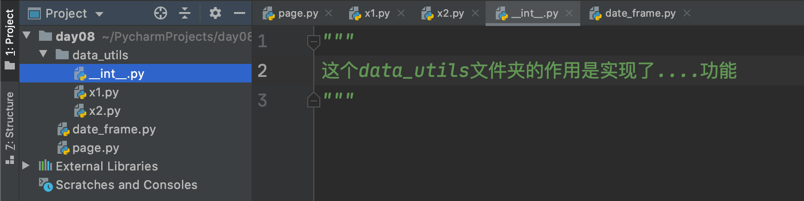

# day08 总结和考试

课程目标：对第一模块 “Python基础” 阶段的知识点进行总结和考试，让学员更好的掌握此模块的相关知识。

课程概要：

- 代码规范
- 知识补充
- 阶段总结（思维导图）
- 考试题


## 1. 代码规范

程序员写代码是有规范的，不只是实现功能而已。


### 1.1 名称

在Python开发过程中会创建文件夹/文件/变量等，这些在命名有一些潜规则（编写代码时也要注意pep8规范）。

- 文件夹，小写 & 小写下划线连接，例如：`commands`、`data_utils`等。

- 文件，小写 & 小写下划线连接，例如：`page.py`、`db_convert.py`等。

- 变量

  - 全局变量，大写 & 大写下划线连接，例如：`NAME = "武沛齐"` 、`BASE_NAME = 18`
  - 局部变量，小写 & 小写下划线连接，例如：`data = [11,22,33]`、`user_parent_id = 9`等。

  

### 1.2 注释

作为程序员，写代码注释是非常基础且有用的技能，方便以后对代码进行维护和理解。

- 文件夹
  

- 文件注释

  ```python
  """
  这个文件主要为项目提供工具和转换的功能，初次之外还有日志....
  例如：
  	...
  	...
  	...
  """
  
  
  ....
  ```

- 代码注释

  ```python
  name = "alex"
  # 在名称后面添加一个大烧饼
  data = name + "dsb" 
  print(data)
  ```

  ```python
  name = "alex"
  """
  在名称后面添加一个大烧饼，内部的实现机制：
  	1. xxx
      2. xxx
      3. xx
  """
  data = name + "dsb" 
  print(data)
  ```

  

### 1.3 todo

基于注释可以实现todo注释的效果，例如：


### 1.4 条件嵌套

以后写条件语句一定要想办法减少嵌套的层级（最好不要超过3层）。


### 1.5 简单逻辑先处理

示例1：

```python
goods = [
    {"name": "电脑", "price": 1999},
    {"name": "鼠标", "price": 10},
    {"name": "游艇", "price": 20},
    {"name": "美女", "price": 998}
]
for index in range(len(goods)):
    item = goods[index]
    print(index + 1, item['name'], item['price'])

while True:
    num = input("请输入要选择的商品序号(Q/q)：")  # "1"
    if num.upper() == "Q":
        break
    if num.isdecimal():
        num = int(num)
        if 0 < num < 5:
            target_index = num - 1
            choice_item = goods[target_index]
            print(choice_item["name"], choice_item['price'])
        else:
            print("序号范围选择错误")
    else:
        print("用户输入的序号格式错误")
```

示例2：

```python
goods = [
    {"name": "电脑", "price": 1999},
    {"name": "鼠标", "price": 10},
    {"name": "游艇", "price": 20},
    {"name": "美女", "price": 998}
]
for index in range(len(goods)):
    item = goods[index]
    print(index + 1, item['name'], item['price'])

while True:
    num = input("请输入要选择的商品序号(Q/q)：")  # "1"
    if num.upper() == "Q":
        break
    if not num.isdecimal():
        print("用输入的格式错误")
        break
    num = int(num)

    if num > 4 or num < 0:
        print("范围选择错误")
        break
    target_index = num - 1
    choice_item = goods[target_index]
    print(choice_item["name"], choice_item['price'])
```


### 1.6 循环

尽量少循环多干事，提高代码效率。

```python
key_list = []
value_list = []

info = {'k1': 'v1', 'k2': 'v2', 'k3': 'v3'}

for key, value in info.items():
    key_list.append(key)
    value_list.append(value)
```

```python
info = {'k1': 'v1', 'k2': 'v2', 'k3': 'v3'}

key_list = list(info.keys())
value_list = list(info.values())

```


### 1.7 变量和值

```python
# 推荐
name = "武沛齐"
age = 19
```

```python
# 不推荐
name="武沛齐"
age= 18
```

可以基于Pycharm的格式化工具来实现自动处理。

python代码规范：PEP8规范。


## 2.知识补充


### 2.1 pass

一般Python的代码块是基于 `:` 和`缩进`来实现，Python中规定代码块中必须要有代码才算完整，在没有代码的情况下为了保证语法的完整性可以用pass代替，例如：

```python
# 其他编程语言
if 提交{
    ...
}else{
    ....
}
```

```python
if 条件 :
    pass
else:
    pass
```


```python
if 条件:
    pass
else:
    pass
```

```python
for i in range(xxx):
    pass
```


### 2.2 is 比较

`is` 和 `==`的区别是什么？

- `==`，用于比较两个值是否相等。
- is，用于表示内存地址是否一致。

```python
# 示例1
v1 = []
v2 = []

print( v1 == v2 )  # True，两个值相当
print( v1 is v2 )  # False，不属于同一块内存。
```

```python
# 示例2
v1 = []
v2 = v1

print( v1 == v2 )  # True，两个值相当
print( v1 is v2 )  # True，属于同一块内存。
```

```python
# 示例3
v1 = None
v2 = None

print(v1 == v2)  # True，两个值相当
print(v1 is v2)  # True，属于同一块内存。
```


### 2.3 位运算

计算机底层本质上都是二进制，我们平时在计算机中做的很多操作底层都会转换为二进制的操作，位运算就是对二进制的操作。

- `&`，与（都为1）

  ```python
  a = 60            # 60 = 0011 1100 
  b = 13            # 13 = 0000 1101 
  
  c = a & b         # 12 = 0000 1100
  ```

- `|`，或（只要有一个为1）

  ```python
  a = 60            # 60 = 0011 1100 
  b = 13            # 13 = 0000 1101 
  
  c = a | b         # 61 = 0011 1101 
  ```

- `^`，异或（值不同）

  ```python
  a = 60            # 60 = 0011 1100 
  b = 13            # 13 = 0000 1101 
  
  c = a ^ b         # 49 = 0011 0001 
  ```

- `~`，取反

  ```python
  a = 60            #  60 = 0011 1100 
  
  c = ~a;           # -61 = 1100 0011
  ```

- `<<`，左移动

  ```python
  a = 60            #  60 = 0011 1100
  c = a << 2;       # 240 = 1111 0000
  ```

- `>>`，右移动

  ```python
  a = 60            # 60 = 0011 1101 
  c = a >> 2;       # 15 = 0000 1111
  ```

平时在开发中，二进制的位运算几乎很好少使用，在计算机底层 或 网络协议底层用的会比较多，例如：

- 计算  2**n

  ```python
  2**0    1 << 0   1     1
  2**1    1 << 1   10    2
  2**2    1 << 2   100   4
  2**3    1 << 3   1000  8
  ...
  ```

- 计算一个数的一半【面试题】

  ```python
  v1 = 10 >> 1 
  print(v1) # 值为5
  
  v2 = 20 >> 1
  print(v2) # 值为 10
  ```

- 网络传输数据，文件太大还未传完（websocket源码为例）。

  ```python
       第1个字节         第2个字节         ... 
   0 1 2 3 4 5 6 7 8 9 0 1 2 3 4 5 6 7 8 9 0 1 2 3 4 5 6 7 8 9 0 1
  +-+-+-+-+-------+-+-------------+-------------------------------+
  |F|R|R|R| opcode|M| Payload len |    Extended payload length    |
  |I|S|S|S|  (4)  |A|     (7)     |             (16/64)           |
  |N|V|V|V|       |S|             |   (if payload len==126/127)   |
  | |1|2|3|       |K|             |                               |
  +-+-+-+-+-------+-+-------------+ - - - - - - - - - - - - - - - +
  
  FIN位置是0，表示这是一部分数据，后续还有数据。
  FIN位置是1，表示这是最后数据，已发送完毕。
  ```

  ```python
  # 例如：接收到的第一个字节的值为245（11110101），让v的二进制和 1000 0000 做 & 与运算。
  
  v = 245   # 245 11110101
            # 128 10000000
                  10000000
      
  data = v & 128
  if data == 0:
      print("还有数据")
  else:
      print("已完毕")
  ```

  

## 3.阶段总结

可使用思维导图（ xmind 软件），对阶段知识点的内容进行梳理，将知识梗概和重点写出来，也便于以后的回顾和复习。


## 4.考试题

考试题的目的是让大家对自己近期知识点学习练习 以及 自测，请大家务必【独立】完成（切勿翻看笔记 & 切勿网上搜索 ）。

- 第一步：自己独立完成（闭卷）

- 第二步：做完之后，翻看自己笔记去修改和更正。

- 第三步：觉自己做的没问题了，最后再去看考试题的参考答案和讲解。

  

详情见附件《第一阶段考试题.md》文件。


