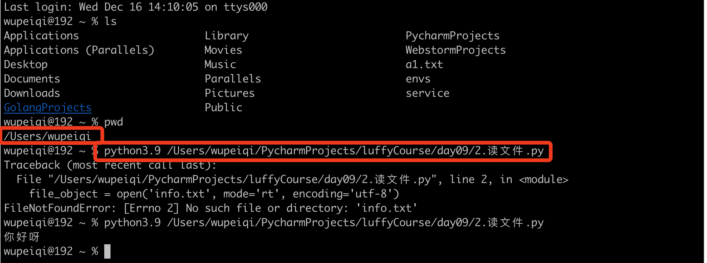
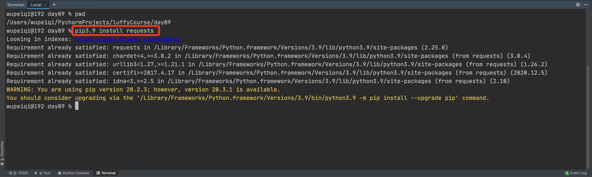
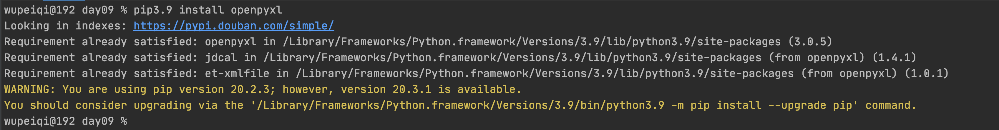

# 第二模块 函数&模块

从今天开始，我们将进入系列课程第二模块的的学习。

第一模块主要是学习python基础知识，从第二模块开始就可以通过程序去解决工作中实际的问题。


从今天开始，我们将进入第二模块的学习，此模块主要包含两大部分：

- 函数，一个用于专门实现某个功能的代码块（可重用）。

  - 内置函数

    ```
    len、bin、oct、hex 等
    ```

  - 自定义函数

    ```python
    def send_email():
        # 写了10行代码，实现了发送邮件。
        pass
    
    send_email()
    ```

    ```python
    # 定义了一个函数，功能代码块
    def send_email():
        # 写了10行代码，实现了发送邮件。
        pass
    
    goods = [
        {"name": "电脑", "price": 1999},
        {"name": "鼠标", "price": 10},
        {"name": "游艇", "price": 20},
        {"name": "美女", "price": 998}
    ]
    for index in range(len(goods)):
        item = goods[index]
        print(index + 1, item['name'], item['price'])
    
    # 调用并执行函数
    send_email()
    
    while True:
        num = input("请输入要选择的商品序号(Q/q)：")  # "1"
        if num.upper() == "Q":
            break
        if not num.isdecimal():
            print("用输入的格式错误")
            break
        num = int(num)
        send_email()
        if num > 4 or num < 0:
            print("范围选择错误")
            break
        target_index = num - 1
        choice_item = goods[target_index]
        print(choice_item["name"], choice_item['price'])
        send_email()
    ```

- 模块，集成了很多功能的函数集合。

  - 内置模块，Python内部帮助我们提供好的。

    ```python
    import random
    
    num = random.randint(0,19)
    ```

    ```python
    import decimal
    
    v1 = decimal.Decimal("0.1")
    v2 = decimal.Decimal("0.2")
    v3 = v1 + v2
    print(v3) # 0.3
    ```

  - 第三方模块，网上下载别人写好的模块（功能集合）。

  - 自定义模块


# day09 文件操作相关


课程目标：掌握基于Python对文件相关操作。

课程概要：

- 文件操作
- 文件夹和路径
- csv格式文件
- ini格式文件                                                                                                                                                                                                                                                                                                                                                                                                                                                                                                                                                                                                                                                                                                                                                                                                                                                                                                                                                                                                                                                                                                                                                                                                                                                                                                                                                                                                                                                                                                                                                                                                                                                                                                                                                                                                                                                                                                                                                                                                                  
- xml格式文件
- excel文件
- 压缩文件

注意：每种格式包含很多相关操作，大家在学习的过程中只要掌握知识点的用法，参考笔记可以实现相关的练习即可，不必背会（在企业开发过程中也是边搜边实现。


## 1. 文件操作

在学习文件操作之前，先来回顾一下编码的相关以及先关数据类型的知识。

- 字符串类型（str），在程序中用于表示文字信息，本质上是unicode编码中的二进制。

  ```python
  name = "武沛齐"
  ```

- 字节类型（bytes）

  - 可表示文字信息，本质上是utf-8/gbk等编码的二进制（对unicode进行压缩，方便文件存储和网络传输。）

    ```python
    name = "武沛齐"
    data = name.encode('utf-8')
    print(data) # b'\xe6\xad\xa6\xe6\xb2\x9b\xe9\xbd\x90'
    
    result = data.decode('utf-8')
    print(result) # "武沛齐"
    ```

  - 可表示原始二进制（图片、文件等信息）


### 1.1 读文件

- 读文本文件

  ```python
  # 1.打开文件
  #	- 路径：
  #		相对路径：'info.txt'
  #		绝对路径：'/Users/wupeiqi/PycharmProjects/luffyCourse/day09/info.txt'
  # 	- 模式
  # 		rb，表示读取文件原始的二进制（r, 读 read；b, 二进制 binary；）
  # 1.打开文件
  file_object = open('info.txt', mode='rb')
  # 2.读取文件内容，并赋值给data
  data = file_object.read()
  # 3.关闭文件
  file_object.close()
  
  print(data) # b'alex-123\n\xe6\xad\xa6\xe6\xb2\x9b\xe9\xbd\x90-123'
  text = data.decode("utf-8")
  print(text)
  ```

  ```python
  # 1.打开文件
  file_object = open('info.txt', mode='rt', encoding='utf-8')
  
  # 2.读取文件内容，并赋值给data
  data = file_object.read()
  
  # 3.关闭文件
  file_object.close()
  
  print(data)
  ```

  

- 读图片等非文本内容文件。

  ```python
  file_object = open('a1.png', mode='rb')
  data = file_object.read()
  file_object.close()
  
  print(data) # \x91\xf6\xf2\x83\x8aQFfv\x8b7\xcc\xed\xc3}\x7fT\x9d{.3.\xf1{\xe8\...
  ```

  

注意事项：

- 路径

  - 相对路径，你的程序到底在哪里运行的？

    
    

    

    

  - 绝对路径

    ```python
    # 1.打开文件
    file_object = open('/Users/wupeiqi/PycharmProjects/luffyCourse/day09/info.txt', mode='rt', encoding='utf-8')
    # 2.读取文件内容，并赋值给data
    data = file_object.read()
    # 3.关闭文件
    file_object.close()
    ```

    windows系统中写绝对路径容易出问题：

    ```python
    # file_object = open('C:\\new\\info.txt', mode='rt', encoding='utf-8')
    
    file_object = open(r'C:\new\info.txt', mode='rt', encoding='utf-8')
    data = file_object.read()
    file_object.close()
    print(data)
    ```

- 读文件时，文件不存在程序会报错。

  ```python
  Traceback (most recent call last):
    File "/Users/wupeiqi/PycharmProjects/luffyCourse/day09/2.读文件.py", line 2, in <module>
      file_object = open('infower.txt', mode='rt', encoding='utf-8')
  FileNotFoundError: [Errno 2] No such file or directory: 'infower.txt'
  ```

  ```python
  # 判断路径是否存在？
  import os
  
  file_path = "/Users/wupeiqi/PycharmProjects/luffyCourse/day09/info.txt"
  exists = os.path.exists(file_path)
  if exists:
      # 1.打开文件
      file_object = open('infower.txt', mode='rt', encoding='utf-8')
      # 2.读取文件内容，并赋值给data
      data = file_object.read()
      # 3.关闭文件
      file_object.close()
      print(data)
  else:
      print("文件不存在")
  ```

  

### 1.2 写文件

- 写文本文件

    ```python
    # 1.打开文件
    # 路径：t1.txt
    # 模式：wb（要求写入的内容需要是字节类型）
file_object = open("t1.txt", mode='wb')
    
    # 2.写入内容
file_object.write(    "武沛齐".encode("utf-8")    )
    
    # 3.文件关闭
file_object.close()
    ```
    
    ```python
    file_object = open("t1.txt", mode='wt', encoding='utf-8')
    
    file_object.write("武沛齐")
    
    file_object.close()
    ```

- 写图片等文件

  ```python
  f1 = open('a1.png',mode='rb')
  content = f1.read()
  f1.close()
  
  f2 = open('a2.png',mode='wb')
  f2.write(content)
  f2.close()
  ```


基础案例：

```python
# 案例1：用户注册
"""
user = input("请输入用户名：")
pwd = input("请输入密码：")
data = "{}-{}".format(user, pwd)
file_object = open("files/info.txt", mode='wt', encoding='utf-8')
file_object.write(data)
file_object.close()
"""

# 案例2：多用户注册
"""
# w写入文件，先清空文件；再在文件中写入内容。
file_object = open("files/info.txt", mode='wt', encoding='utf-8')
while True:
    user = input("请输入用户名：")
    if user.upper() == "Q":
        break
    pwd = input("请输入密码：")
    data = "{}-{}\n".format(user, pwd)

    file_object.write(data)
file_object.close()
"""
```


小高级案例：（超前）

> 利用Python想某个网址发送请求并获取结果（利用第三方的模块）
>
> - 下载第三方模块
>
>   ```
>   pip install requests
>   ```
>
>   ```
>   /Library/Frameworks/Python.framework/Versions/3.9/bin/pip3 install requests
>   ```
>
>   
>
> - 使用第三方模块
>
>   ```python
>   import requests
>   
>   res = requests.get(url="网址")
>   print(res)
>   ```


```python
# 案例1：去网上下载一点文本，文本信息写入文件。
import requests

res = requests.get(
    url="https://movie.douban.com/j/search_subjects?type=movie&tag=%E7%83%AD%E9%97%A8&sort=recommend&page_limit=20&page_start=20",
    headers={
        "User-Agent": "Mozilla/5.0 (Macintosh; Intel Mac OS X 10_15_7) AppleWebKit/537.36 (KHTML, like Gecko) Chrome/87.0.4280.88 Safari/537.36"
    }
)

# 网络传输的原始二进制信息（bytes）
# res.content

file_object = open('files/log1.txt', mode='wb')
file_object.write(res.content)
file_object.close()


# 案例2：去网上下载一张图片，图片写入本地文件。
import requests

res = requests.get(
    url="https://hbimg.huabanimg.com/c7e1461e4b15735fbe625c4dc85bd19904d96daf6de9fb-tosv1r_fw1200",
    headers={
        "User-Agent": "Mozilla/5.0 (Macintosh; Intel Mac OS X 10_15_7) AppleWebKit/537.36 (KHTML, like Gecko) Chrome/87.0.4280.88 Safari/537.36"
    }
)

# 网络传输的原始二进制信息（bytes）
# res.content

file_object = open('files/美女.png', mode='wb')
file_object.write(res.content)
file_object.close()
```


注意事项：

- 路径
  - 绝对路径
  - 相对路径
- 文件不存在时，w模式会新建然后再写入内容；文件存在时，w模式会清空文件再写入内容。


### 1.3 文件打开模式

上文我们基于文件操作基本实现了读、写的功能，其中涉及的文件操作模式：rt、rb、wt、wb，其实在文件操作中还有其他的很多模式。

```
========= ===============================================================
Character Meaning
--------- ---------------------------------------------------------------
'r'       open for reading (default)
'w'       open for writing, truncating the file first
'x'       create a new file and open it for writing
'a'       open for writing, appending to the end of the file if it exists

'b'       binary mode
't'       text mode (default)

'+'       open a disk file for updating (reading and writing)

The default mode is 'rt' (open for reading text).
```

关于文件的打开模式常见应用有：

- 只读：`r`、`rt`、`rb` （用）

  - 存在，读
  - 不存在，报错

- 只写：`w`、`wt`、`wb`（用）

  - 存在，清空再写
  - 不存在，创建再写

- 只写：`x`、`xt`、`xb`

  - 存在，报错
  - 不存在，创建再写。

- 只写：`a`、`at`、`ab`【尾部追加】（用）

  - 存在，尾部追加。
  - 不存在，创建再写。

- 读写

  - r+、rt+、rb+，默认光标位置：起始位置

    ```python
    file_object = open('info.txt', mode='rt+')
    
    # 读取内容
    data = file_object.read()
    print(data)
    
    # 写入内容
    file_object.write("你好呀")
    
    file_object.close()
    ```

    ```python
    file_object = open('info.txt', mode='rt+')
    
    # 写入内容
    file_object.write("alex")
    
    # 读取内容
    data = file_object.read()
    print(data)  # -123
    
    file_object.close()
    ```

  - w+、wt+、wb+，默认光标位置：起始位置（清空文件）

    ```python
    file_object = open('info.txt', mode='wt+')
    
    # 读取内容
    data = file_object.read()
    print(data)
    
    # 写入内容
    file_object.write("你好呀")
    
    # 将光标位置重置起始
    file_object.seek(0)
    
    # 读取内容
    data = file_object.read()
    print(data)
    
    file_object.close()
    ```

  - x+、xt+、xb+，默认光标位置：起始位置（新文件）

  - a+、at+、ab+，默认光标位置：末尾

    ```python
    file_object = open('info.txt', mode='at+')
    
    # 写入内容
    file_object.write("武沛齐")
    
    # 将光标位置重置起始
    file_object.seek(0)
    
    # 读取内容
    data = file_object.read()
    print(data)
    
    file_object.close()
    ```

    

多用户注册案例：

```python
while True:
    user = input("用户名：")
    if user.upper() == "Q":
        break
    pwd = input("密码：")

    data = "{}-{}\n".format(user, pwd)

    file_object = open('files/account.txt', mode='a')
    file_object.write(data)
    file_object.close()
```

```python
file_object = open('files/account.txt', mode='a')

while True:
    user = input("用户名：")
    if user.upper() == "Q":
        break
    pwd = input("密码：")
    data = "{}-{}\n".format(user, pwd)
    file_object.write(data)

file_object.close()
```


### 1.4 常见功能

在上述对文件的操作中，我们只使用了write和read来对文件进行读写，其实在文件操作中还有很多其他的功能来辅助实现更好的读写文件的内容。

- read，读

  - 读所有【常用】

    ```python
    f = open('info.txt', mode='r',encoding='utf-8')
    data = f.read()
    f.close()
    ```

    ```python
    f = open('info.txt', mode='rb')
    data = f.read()
    f.close()
    ```

  - 读n个字符（字节）【会用到】

    ```python
    f = open('info.txt', mode='r', encoding='utf-8')
    # 读1个字符
    data = f.read(1)
    f.close()
    
    print(data) # 武
    ```

    ```python
    f = open('info.txt', mode='r',encoding='utf-8')
    
    # 读1个字符
    chunk1 = f.read(1)
    chunk2 = f.read(2)
    print(chunk1,chunk2)
    
    f.close()
    ```

    ```python
    f = open('info.txt', mode='rb')
    
    # 读1个字节
    data = f.read(3)
    f.close()
    
    print(data, type(data))  # b'\xe6\xad\xa6' <class 'bytes'>
    ```

    ```python
    f = open('info.txt', mode='rb')
    
    # 读1个字节
    chunk1 = f.read(3)
    chunk2 = f.read(3)
    chunk3 = f.read(1)
    print(chunk1,chunk2,chunk3)
    
    f.close()
    ```

- readline，读一行

  ```python
  f = open('info.txt', mode='r', encoding='utf-8')
  
  v1 = f.readline()
  print(v1)
  
  v2 = f.readline()
  print(v2)
  
  f.close()
  ```

  ```python
  f = open('info.txt', mode='r', encoding='utf-8')
  v1 = f.readline()
  print(v1)
  f.close()
  
  f = open('info.txt', mode='r', encoding='utf-8')
  v2 = f.readline()
  print(v2)
  f.close()
  ```

- readlines，读所有行，每行作为列表的一个元素

  ```python
  f = open('info.txt', mode='rb')
  
  data_list = f.readlines()
  
  f.close()
  
  print(data_list)
  ```

- 循环，读大文件（readline加强版）【常见】

  ```python
  f = open('info.txt', mode='r', encoding='utf-8')
  for line in f:
      print(line.strip())
  f.close()
  ```


- write，写

  ```python
  f = open('info.txt', mode='a',encoding='utf-8')
  f.write("武沛齐")
  f.close()
  ```

  ```python
  f = open('info.txt', mode='ab')
  f.write( "武沛齐".encode("utf-8") )
  f.close()
  ```

- flush，刷到硬盘

  ```python
  f = open('info.txt', mode='a',encoding='utf-8')
  
  while True:
      # 不是写到了硬盘，而是写在缓冲区，系统会将缓冲区的内容刷到硬盘。
  	f.write("武沛齐")
      f.flush()
  
  f.close()
  ```

  ```python
  file_object = open('files/account.txt', mode='a')
  
  while True:
      user = input("用户名：")
      if user.upper() == "Q":
          break
      pwd = input("密码：")
      data = "{}-{}\n".format(user, pwd)
      file_object.write(data)
      file_object.flush()
  
  file_object.close()
  ```

  

- 移动光标位置（字节）

  ```python
  f = open('info.txt', mode='r+', encoding='utf-8')
  
  # 移动到指定字节的位置
  f.seek(3)
  f.write("武沛齐")
  
  f.close()
  ```

  注意：在a模式下，调用write在文件中写入内容时，永远只能将内容写入到尾部，不会写到光标的位置。

- 获取当前光标位置

  ```python
  f = open('info.txt', mode='r', encoding='utf-8')
  
  p1 = f.tell()
  print(p1)  # 0
  
  f.read(3)  # 读3个字符 3*3=9字节
  
  p2 = f.tell()
  print(p2)  # 9
  
  f.close()
  ```

  ```python
  f = open('info.txt', mode='rb')
  
  p1 = f.tell()
  print(p1)  # 0
  
  f.read(3)  # 读3个字节
  
  p2 = f.tell()
  print(p2)  # 3
  
  f.close()
  ```

  

### 1.5 上下文管理

之前对文件进行操作时，每次都要打开和关闭文件，比较繁琐且容易忘记关闭文件。

以后再进行文件操作时，推荐大家使用with上下文管理，它可以自动实现关闭文件。

```python
with open("xxxx.txt", mode='rb') as file_object:
    data = file_object.read()
    print(data)
```


在Python 2.7 后，with又支持同时对多个文件的上下文进行管理，即：

```python
with open("xxxx.txt", mode='rb') as f1, open("xxxx.txt", mode='rb') as f2:
    pass
```


### 练习题

1. 补充代码：实现下载视频并保存到本地

   ```python
   import requests

   res = requests.get(
       url="https://f.video.weibocdn.com/000pTZJLgx07IQgaH7HW010412066BJV0E030.mp4?label=mp4_720p&template=1280x720.25.0&trans_finger=1f0da16358befad33323e3a1b7f95fc9&media_id=4583105541898354&tp=8x8A3El:YTkl0eM8&us=0&ori=1&bf=2&ot=h&ps=3lckmu&uid=3ZoTIp&ab=3915-g1,966-g1,3370-g1,3601-g0,3601-g0,3601-g0,1493-g0,1192-g0,1191-g0,1258-g0&Expires=1608204895&ssig=NdYpDIEXSS&KID=unistore,video",
       headers={
           "User-Agent": "Mozilla/5.0 (Macintosh; Intel Mac OS X 10_15_7) AppleWebKit/537.36 (KHTML, like Gecko) Chrome/87.0.4280.88 Safari/537.36"
       }
   )
   
   # 视频的文件内容
   res.content
   ```
   
2. 日志分析，计算某用户`223.73.89.192`访问次数。日志文件如下：`access.log`

   ```
   49.89.167.91 - - [17/Dec/2020:03:43:50 +0800] "GET /wiki/detail/3/40 HTTP/1.1" 301 0 "-" "Mozilla/5.0(Linux;Android 5.1.1;OPPO A33 Build/LMY47V;wv) AppleWebKit/537.36(KHTML,link Gecko) Version/4.0 Chrome/43.0.2357.121 Mobile Safari/537.36 LieBaoFast/4.51.3" "-"
   49.89.167.91 - - [17/Dec/2020:03:44:11 +0800] "GET /wiki/detail/3/40/ HTTP/1.1" 200 8033 "-" "Mozilla/5.0(Linux;Android 5.1.1;OPPO A33 Build/LMY47V;wv) AppleWebKit/537.36(KHTML,link Gecko) Version/4.0 Chrome/43.0.2357.121 Mobile Safari/537.36 LieBaoFast/4.51.3" "-"
   203.208.60.66 - - [17/Dec/2020:03:47:58 +0800] "GET /media/uploads/2019/11/17/pic/s1.png HTTP/1.1" 200 710728 "-" "Googlebot-Image/1.0" "-"
   223.73.89.192 - - [17/Dec/2020:03:48:26 +0800] "GET /wiki/detail/3/40/ HTTP/1.1" 200 8033 "-" "Mozilla/5.0 (Windows NT 10.0; Win64; x64) AppleWebKit/537.36 (KHTML, like Gecko) Chrome/87.0.4280.88 Safari/537.36 Edg/87.0.664.60" "-"
   223.73.89.192 - - [17/Dec/2020:03:48:26 +0800] "GET /static/stark/plugins/font-awesome/css/font-awesome.css HTTP/1.1" 200 37414 "https://pythonav.com/wiki/detail/3/40/" "Mozilla/5.0 (Windows NT 10.0; Win64; x64) AppleWebKit/537.36 (KHTML, like Gecko) Chrome/87.0.4280.88 Safari/537.36 Edg/87.0.664.60" "-"
   223.73.89.192 - - [17/Dec/2020:03:48:26 +0800] "GET /static/stark/plugins/bootstrap/css/bootstrap.css HTTP/1.1" 200 146010 "https://pythonav.com/wiki/detail/3/40/" "Mozilla/5.0 (Windows NT 10.0; Win64; x64) AppleWebKit/537.36 (KHTML, like Gecko) Chrome/87.0.4280.88 Safari/537.36 Edg/87.0.664.60" "-"
   223.73.89.192 - - [17/Dec/2020:03:48:26 +0800] "GET /static/web/css/commons.css HTTP/1.1" 200 3674 "https://pythonav.com/wiki/detail/3/40/" "Mozilla/5.0 (Windows NT 10.0; Win64; x64) AppleWebKit/537.36 (KHTML, like Gecko) Chrome/87.0.4280.88 Safari/537.36 Edg/87.0.664.60" "-"
   223.73.89.192 - - [17/Dec/2020:03:48:26 +0800] "GET /static/mdeditor/editormd/css/editormd.preview.css HTTP/1.1" 200 60230 "https://pythonav.com/wiki/detail/3/40/" "Mozilla/5.0 (Windows NT 10.0; Win64; x64) AppleWebKit/537.36 (KHTML, like Gecko) Chrome/87.0.4280.88 Safari/537.36 Edg/87.0.664.60" "-"
   223.73.89.192 - - [17/Dec/2020:03:48:26 +0800] "GET /static/stark/js/jquery-3.3.1.min.js HTTP/1.1" 200 86927 "https://pythonav.com/wiki/detail/3/40/" "Mozilla/5.0 (Windows NT 10.0; Win64; x64) AppleWebKit/537.36 (KHTML, like Gecko) Chrome/87.0.4280.88 Safari/537.36 Edg/87.0.664.60" "-"
   223.73.89.192 - - [17/Dec/2020:03:48:26 +0800] "GET /static/stark/plugins/bootstrap/js/bootstrap.min.js HTTP/1.1" 200 37045 "https://pythonav.com/wiki/detail/3/40/" "Mozilla/5.0 (Windows NT 10.0; Win64; x64) AppleWebKit/537.36 (KHTML, like Gecko) Chrome/87.0.4280.88 Safari/537.36 Edg/87.0.664.60" "-"
   223.73.89.192 - - [17/Dec/2020:03:48:26 +0800] "GET /static/mdeditor/editormd/lib/marked.min.js HTTP/1.1" 200 19608 "https://pythonav.com/wiki/detail/3/40/" "Mozilla/5.0 (Windows NT 10.0; Win64; x64) AppleWebKit/537.36 (KHTML, like Gecko) Chrome/87.0.4280.88 Safari/537.36 Edg/87.0.664.60" "-"
   223.73.89.192 - - [17/Dec/2020:03:48:27 +0800] "GET /static/mdeditor/editormd/lib/prettify.min.js HTTP/1.1" 200 17973 "https://pythonav.com/wiki/detail/3/40/" "Mozilla/5.0 (Windows NT 10.0; Win64; x64) AppleWebKit/537.36 (KHTML, like Gecko) Chrome/87.0.4280.88 Safari/537.36 Edg/87.0.664.60" "-"
   223.73.89.192 - - [17/Dec/2020:03:48:27 +0800] "GET /static/mdeditor/editormd/fonts/fontawesome-webfont.woff2?v=4.3.0 HTTP/1.1" 200 56780 "https://pythonav.com/static/mdeditor/editormd/css/editormd.preview.css" "Mozilla/5.0 (Windows NT 10.0; Win64; x64) AppleWebKit/537.36 (KHTML, like Gecko) Chrome/87.0.4280.88 Safari/537.36 Edg/87.0.664.60" "-"
   223.73.89.192 - - [17/Dec/2020:03:48:27 +0800] "GET /static/mdeditor/editormd/editormd.js HTTP/1.1" 200 163262 "https://pythonav.com/wiki/detail/3/40/" "Mozilla/5.0 (Windows NT 10.0; Win64; x64) AppleWebKit/537.36 (KHTML, like Gecko) Chrome/87.0.4280.88 Safari/537.36 Edg/87.0.664.60" "-"
   223.73.89.192 - - [17/Dec/2020:03:48:28 +0800] "GET /static/mdeditor/mdeditor-preview-init.js HTTP/1.1" 200 261 "https://pythonav.com/wiki/detail/3/40/" "Mozilla/5.0 (Windows NT 10.0; Win64; x64) AppleWebKit/537.36 (KHTML, like Gecko) Chrome/87.0.4280.88 Safari/537.36 Edg/87.0.664.60" "-"
   223.73.89.192 - - [17/Dec/2020:03:48:29 +0800] "GET /static/stark/plugins/font-awesome/fonts/fontawesome-webfont.woff2?v=4.7.0 HTTP/1.1" 200 77160 "https://pythonav.com/static/stark/plugins/font-awesome/css/font-awesome.css" "Mozilla/5.0 (Windows NT 10.0; Win64; x64) AppleWebKit/537.36 (KHTML, like Gecko) Chrome/87.0.4280.88 Safari/537.36 Edg/87.0.664.60" "-"
   223.73.89.192 - - [17/Dec/2020:03:48:29 +0800] "GET /media/uploads/2019/02/22/Gobook/_book/ssl2.png HTTP/1.1" 200 203535 "https://pythonav.com/wiki/detail/3/40/" "Mozilla/5.0 (Windows NT 10.0; Win64; x64) AppleWebKit/537.36 (KHTML, like Gecko) Chrome/87.0.4280.88 Safari/537.36 Edg/87.0.664.60" "-"
   ```

3. 日志分析升级，计算所有用户的访问次数。

4. 筛选出股票 当前价大于 20 的所有股票数据。

   ```
   股票代码,股票名称,当前价,涨跌额,涨跌幅,年初至今,成交量,成交额,换手率,市盈率(TTM),股息率,市值
   SH601778,N晶科,6.29,+1.92,+43.94%,+43.94%,259.66万,1625.52万,0.44%,22.32,-,173.95亿
   SH688566,吉贝尔,52.66,+6.96,+15.23%,+122.29%,1626.58万,8.09亿,42.29%,89.34,-,98.44亿
   SH688268,华特气体,88.80,+11.72,+15.20%,+102.51%,622.60万,5.13亿,22.87%,150.47,-,106.56亿
   SH600734,实达集团,2.60,+0.24,+10.17%,-61.71%,1340.27万,3391.14万,2.58%,亏损,0.00%,16.18亿
   SH900957,凌云B股,0.36,+0.033,+10.09%,-35.25%,119.15万,42.10万,0.65%,44.65,0.00%,1.26亿
   SZ000584,哈工智能,6.01,+0.55,+10.07%,-4.15%,2610.86万,1.53亿,4.36%,199.33,0.26%,36.86亿
   SH600599,熊猫金控,6.78,+0.62,+10.06%,-35.55%,599.64万,3900.23万,3.61%,亏损,0.00%,11.25亿
   SH600520,文一科技,8.21,+0.75,+10.05%,-24.05%,552.34万,4464.69万,3.49%,亏损,0.00%,13.01亿
   SH603682,锦和商业,11.73,+1.07,+10.04%,+48.29%,2746.63万,3.15亿,29.06%,29.62,-,55.42亿
   SZ300831,派瑞股份,12.27,+1.12,+10.04%,+208.29%,25.38万,311.41万,0.32%,60.59,-,39.26亿
   ```

5. 根据要求修改文件的内容，原文件内容如下：`ha.conf`

   ```
   global       
           log 127.0.0.1 local2
           daemon
           maxconn 256
           log 127.0.0.1 local2 info
   defaults
           log global
           mode http
           timeout connect 5000ms
           timeout client 50000ms
           timeout server 50000ms
           option  dontlognull
   
   listen stats :8888
           stats enable
           stats uri       /admin
           stats auth      admin:1234
   
   frontend oldboy.org
           bind 0.0.0.0:80
           option httplog
           option httpclose
           option  forwardfor
           log global
           acl www hdr_reg(host) -i www.luffycity.org
           use_backend www.luffycity.com if www
   
   backend www.luffycity.com
           server 100.1.7.9 100.1.7.9 weight 20 maxconn 3000
   ...
   ```

   请将文件中的 `luffycity`修改为 `pythonav` 。


## 2.csv格式文件

**逗号分隔值**（Comma-Separated Values，**CSV**，有时也称为**字符分隔值**，因为分隔字符也可以不是逗号），其文件以纯文本形式存储表格数据（数字和文本）。

对于这种格式的数据，我们需要利用open函数来读取文件并根据逗号分隔的特点来进行处理。

```
股票代码,股票名称,当前价,涨跌额,涨跌幅,年初至今
SH601778,N晶科,6.29,+1.92,-43.94%,+43.94%
SH688566,吉贝尔,52.66,+6.96,+15.23%,+122.29%
...
```


练习题案例：下载文档中的所有图片且以用户名为图片名称存储。

```python
ID,用户名,头像
26044585,Hush,https://hbimg.huabanimg.com/51d46dc32abe7ac7f83b94c67bb88cacc46869954f478-aP4Q3V
19318369,柒十一,https://hbimg.huabanimg.com/703fdb063bdc37b11033ef794f9b3a7adfa01fd21a6d1-wTFbnO
15529690,Law344,https://hbimg.huabanimg.com/b438d8c61ed2abf50ca94e00f257ca7a223e3b364b471-xrzoQd
18311394,Jennah·,https://hbimg.huabanimg.com/4edba1ed6a71797f52355aa1de5af961b85bf824cb71-px1nZz
18009711,可洛爱画画,https://hbimg.huabanimg.com/03331ef39b5c7687f5cc47dbcbafd974403c962ae88ce-Co8AUI
30574436,花姑凉~,https://hbimg.huabanimg.com/2f5b657edb9497ff8c41132e18000edb082d158c2404-8rYHbw
17740339,小巫師,https://hbimg.huabanimg.com/dbc6fd49f1915545cc42c1a1492a418dbaebd2c21bb9-9aDqgl
18741964,桐末tonmo,https://hbimg.huabanimg.com/b60cee303f62aaa592292f45a1ed8d5be9873b2ed5c-gAJehO
30535005,TANGZHIQI,https://hbimg.huabanimg.com/bbd08ee168d54665bf9b07899a5c4a4d6bc1eb8af77a4-8Gz3K1
31078743,你的老杨,https://hbimg.huabanimg.com/c46fbc3c9a01db37b8e786cbd7174bbd475e4cda220f4-F1u7MX
25519376,尺尺寸,https://hbimg.huabanimg.com/ee29ee198efb98f970e3dc2b24c40d89bfb6f911126b6-KGvKes
21113978,C-CLong,https://hbimg.huabanimg.com/7fa6b2a0d570e67246b34840a87d57c16a875dba9100-SXsSeY
24674102,szaa,https://hbimg.huabanimg.com/0716687b0df93e8c3a8e0925b6d2e4135449cd27597c4-gWdv24
30508507,爱起床的小灰灰,https://hbimg.huabanimg.com/4eafdbfa21b2f300a7becd8863f948e5e92ef789b5a5-1ozTKq
12593664,yokozen,https://hbimg.huabanimg.com/cd07bbaf052b752ed5c287602404ea719d7dd8161321b-cJtHss
16899164,一阵疯,https://hbimg.huabanimg.com/0940b557b28892658c3bcaf52f5ba8dc8402100e130b2-G966Uz
847937,卩丬My㊊伴er彎,https://hbimg.huabanimg.com/e2d6bb5bc8498c6f607492a8f96164aa2366b104e7a-kWaH68
31010628,慢慢即漫漫,https://hbimg.huabanimg.com/c4fb6718907a22f202e8dd14d52f0c369685e59cfea7-82FdsK
13438168,海贼玩跑跑,https://hbimg.huabanimg.com/1edae3ce6fe0f6e95b67b4f8b57c4cebf19c501b397e-BXwiW6
28593155,源稚生,https://hbimg.huabanimg.com/626cfd89ca4c10e6f875f3dfe1005331e4c0fd7fd429-9SeJeQ
28201821,合伙哼哼,https://hbimg.huabanimg.com/f59d4780531aa1892b80e0ec94d4ec78dcba08ff18c416-769X6a
28255146,漫步AAA,https://hbimg.huabanimg.com/3c034c520594e38353a039d7e7a5fd5e74fb53eb1086-KnpLaL
30537613,配䦹,https://hbimg.huabanimg.com/efd81d22c1b1a2de77a0e0d8e853282b83b6bbc590fd-y3d4GJ
22665880,日后必火,https://hbimg.huabanimg.com/69f0f959979a4fada9e9e55f565989544be88164d2b-INWbaF
16748980,keer521521,https://hbimg.huabanimg.com/654953460733026a7ef6e101404055627ad51784a95c-B6OFs4
30536510,“西辞”,https://hbimg.huabanimg.com/61cfffca6b2507bf51a507e8319d68a8b8c3a96968f-6IvMSk
30986577,艺成背锅王,https://hbimg.huabanimg.com/c381ecc43d6c69758a86a30ebf72976906ae6c53291f9-9zroHF
26409800,CsysADk7,https://hbimg.huabanimg.com/bf1d22092c2070d68ade012c588f2e410caaab1f58051-ahlgLm
30469116,18啊全阿,https://hbimg.huabanimg.com/654953460733026a7ef6e101404055627ad51784a95c-B6OFs4
15514336,W/小哥,https://hbimg.huabanimg.com/a30f5967fc0acf81421dd49650397de63c105b9ead1c-nVRrNl
17473505,椿の花,https://hbimg.huabanimg.com/0e38d810e5a24f91ebb251fd3aaaed8bb37655b14844c-pgNJBP
19165177,っ思忆゜♪,https://hbimg.huabanimg.com/4815ea0e4905d0f3bb82a654b481811dadbfe5ce2673-vMVr0B
16059616,格林熊丶,https://hbimg.huabanimg.com/8760a2b08d87e6ed4b7a9715b1a668176dbf84fec5b-jx14tZ
30734152,sCWVkJDG,https://hbimg.huabanimg.com/f31a5305d1b8717bbfb897723f267d316e58e7b7dc40-GD3e22
24019677,虚无本心,https://hbimg.huabanimg.com/6fdfa9834abe362e978b517275b06e7f0d5926aa650-N1xCXE
16670283,Y-雨后天空,https://hbimg.huabanimg.com/a3bbb0045b536fc27a6d2effa64a0d43f9f5193c177f-I2vHaI
21512483,汤姆2,https://hbimg.huabanimg.com/98cc50a61a7cc9b49a8af754ffb26bd15764a82f1133-AkiU7D
16441049,笑潇啸逍小鱼,https://hbimg.huabanimg.com/ae8a70cd85aff3a8587ff6578d5cf7620f3691df13e46-lmrIi9
24795603,⁢⁢⁢⁢⁢v,https://hbimg.huabanimg.com/a7183cc3a933aa129d7b3230bf1378fd8f5857846cc5-3tDtx3
29819152,妮玛士珍多,https://hbimg.huabanimg.com/ca4ecb573bf1ff0415c7a873d64470dedc465ea1213c6-RAkArS
19101282,陈勇敢❤,https://hbimg.huabanimg.com/ab6d04ebaff3176e3570139a65155856871241b58bc6-Qklj2E
28337572,爱意随风散,https://hbimg.huabanimg.com/117ad8b6eeda57a562ac6ab2861111a793ca3d1d5543-SjWlk2
17342758,幸运instant,https://hbimg.huabanimg.com/72b5f9042ec297ae57b83431123bc1c066cca90fa23-3MoJNj
18483372,Beau染,https://hbimg.huabanimg.com/077115cb622b1ff3907ec6932e1b575393d5aae720487-d1cdT9
22127102,栽花的小蜻蜓,https://hbimg.huabanimg.com/6c3cbf9f27e17898083186fc51985e43269018cc1e1df-QfOIBG
13802024,LoveHsu,https://hbimg.huabanimg.com/f720a15f8b49b86a7c1ee4951263a8dbecfe3e43d2d-GPEauV
22558931,白驹过隙丶梨花泪う,https://hbimg.huabanimg.com/e49e1341dfe5144da5c71bd15f1052ef07ba7a0e1296b-jfyfDJ
11762339,cojoy,https://hbimg.huabanimg.com/5b27f876d5d391e7c4889bc5e8ba214419eb72b56822-83gYmB
30711623,雪碧学长呀,https://hbimg.huabanimg.com/2c288a1535048b05537ba523b3fc9eacc1e81273212d1-nr8M4t
18906718,西霸王,https://hbimg.huabanimg.com/7b02ad5e01bd8c0a29817e362814666a7800831c154a6-AvBDaG
31037856,邵阳的小哥哥,https://hbimg.huabanimg.com/654953460733026a7ef6e101404055627ad51784a95c-B6OFs4
26830711,稳健谭,https://hbimg.huabanimg.com/51547ade3f0aef134e8d268cfd4ad61110925aefec8a-NKPEYX
```

```python
import os
import requests

with open('files/mv.csv', mode='r', encoding='utf-8') as file_object:
    file_object.readline()
    for line in file_object:
        user_id, username, url = line.strip().split(',')
        print(username, url)
        # 1.根据URL下载图片
        res = requests.get(
            url=url,
            headers={
                "User-Agent": "Mozilla/5.0 (Macintosh; Intel Mac OS X 10_15_7) AppleWebKit/537.36 (KHTML, like Gecko) Chrome/87.0.4280.88 Safari/537.36"
            }
        )
        # 检查images目录是否存在？不存在，则创建images目录
        if not os.path.exists("images"):
            # 创建images目录
            os.makedirs("images")

        # 2.将图片的内容写入到文件
        with open("images/{}.png".format(username), mode='wb') as img_object:
            img_object.write(res.content)
```


## 3.ini格式文件

ini文件是Initialization File的缩写，平时用于存储软件的的配置文件。例如：MySQL数据库的配置文件。

```ini
[mysqld]
datadir=/var/lib/mysql
socket=/var/lib/mysql/mysql.sock
log-bin=py-mysql-bin
character-set-server=utf8
collation-server=utf8_general_ci
log-error=/var/log/mysqld.log
# Disabling symbolic-links is recommended to prevent assorted security risks
symbolic-links=0

[mysqld_safe]
log-error=/var/log/mariadb/mariadb.log
pid-file=/var/run/mariadb/mariadb.pid

[client]
default-character-set=utf8
```

这种格式是可以直接使用open来出来，考虑到自己处理比较麻烦，所以Python为我们提供了更为方便的方式。

```python
import configparser

config = configparser.ConfigParser()
config.read('files/my.ini', encoding='utf-8')
# config.read('/Users/wupeiqi/PycharmProjects/luffyCourse/day09/files/my.ini', encoding='utf-8')

# 1.获取所有的节点
"""
result = config.sections()
print(result)  # ['mysqld', 'mysqld_safe', 'client']
"""

# 2.获取节点下的键值
"""
result = config.items("mysqld_safe")
print(result)  # [('log-error', '/var/log/mariadb/mariadb.log'), ('pid-file', '/var/run/mariadb/mariadb.pid')]

for key, value in config.items("mysqld_safe"):
    print(key, value)
"""

# 3.获取某个节点下的键对应的值
"""
result = config.get("mysqld","collation-server")
print(result)
"""

# 4.其他

# 4.1 是否存在节点
# v1 = config.has_section("client")
# print(v1)

# 4.2 添加一个节点
# config.add_section("group")
# config.set('group','name','wupeiqi')
# config.set('client','name','wupeiqi')
# config.write(open('files/new.ini', mode='w', encoding='utf-8'))

# 4.3 删除
# config.remove_section('client')
# config.remove_option("mysqld", "datadir")
# config.write(open('files/new.ini', mode='w', encoding='utf-8'))
```

- 读取所有节点

  ```python
  import configparser
  
  config = configparser.ConfigParser()
  config.read('/Users/wupeiqi/PycharmProjects/luffyCourse/day09/files/my.conf', encoding='utf-8')
  # config.read('my.conf', encoding='utf-8')
  ret = config.sections()
  print(ret) 
  
  >>输出
  ['mysqld', 'mysqld_safe', 'client']
  ```

- 读取节点下的键值

  ```python
  import configparser
  
  config = configparser.ConfigParser()
  config.read('/Users/wupeiqi/PycharmProjects/luffyCourse/day09/files/my.conf', encoding='utf-8')
  # config.read('my.conf', encoding='utf-8')
  item_list = config.items("mysqld_safe")
  print(item_list) 
  
  >>输出
  [('log-error', '/var/log/mariadb/mariadb.log'), ('pid-file', '/var/run/mariadb/mariadb.pid')]
  ```

- 读取节点下值（根据 节点+键 ）

  ```python
  import configparser
  
  config = configparser.ConfigParser()
  config.read('/Users/wupeiqi/PycharmProjects/luffyCourse/day09/files/my.conf', encoding='utf-8')
  
  value = config.get('mysqld', 'log-bin')
  print(value)
  
  >>输出
  py-mysql-bin
  ```

- 检查、删除、添加节点

  ```python
  import configparser
  
  config = configparser.ConfigParser()
  config.read('/Users/wupeiqi/PycharmProjects/luffyCourse/day09/files/my.conf', encoding='utf-8')
  # config.read('my.conf', encoding='utf-8')
  
  
  # 检查
  has_sec = config.has_section('mysqld')
  print(has_sec)
  
  # 添加节点
  config.add_section("SEC_1")
  # 节点中设置键值
  config.set('SEC_1', 'k10', "123")
  config.set('SEC_1', 'name', "哈哈哈哈哈")
  
  config.add_section("SEC_2")
  config.set('SEC_2', 'k10', "123")
  # 内容写入新文件
  config.write(open('/Users/wupeiqi/PycharmProjects/luffyCourse/day09/files/xxoo.conf', 'w'))
  
  
  # 删除节点
  config.remove_section("SEC_2")
  # 删除节点中的键值
  config.remove_option('SEC_1', 'k10')
  config.write(open('/Users/wupeiqi/PycharmProjects/luffyCourse/day09/files/new.conf', 'w'))
  ```

  

## 4.XML格式文件

[可扩展标记语言](https://baike.baidu.com/item/可扩展标记语言/2885849)，是一种简单的数据存储语言，XML 被设计用来传输和存储数据。

- 存储，可用来存放配置文件，例如：java的配置文件。
- 传输，网络传输时以这种格式存在，例如：早期ajax传输的数据、soap协议等。

```xml
<data>
    <country name="Liechtenstein">
        <rank updated="yes">2</rank>
        <year>2023</year>
        <gdppc>141100</gdppc>
        <neighbor direction="E" name="Austria" />
        <neighbor direction="W" name="Switzerland" />
    </country>
    <country name="Singapore">
        <rank updated="yes">5</rank>
        <year>2026</year>
        <gdppc>59900</gdppc>
        <neighbor direction="N" name="Malaysia" />
    </country>
    <country name="Panama">
        <rank updated="yes">69</rank>
        <year>2026</year>
        <gdppc>13600</gdppc>
        <neighbor direction="W" name="Costa Rica" />
        <neighbor direction="E" name="Colombia" />
    </country>
</data>
```

注意：在Python开发中用的相对来比较少，大家作为了解即可（后期课程在讲解微信支付、微信公众号消息处理 时会用到基于xml传输数据）。

例如：https://developers.weixin.qq.com/doc/offiaccount/Message_Management/Receiving_standard_messages.html

### 4.1 读取文件和内容

```python
from xml.etree import ElementTree as ET

# ET去打开xml文件
tree = ET.parse("files/xo.xml")

# 获取根标签
root = tree.getroot()

print(root) # <Element 'data' at 0x7f94e02763b0>
```

```python
from xml.etree import ElementTree as ET

content = """
<data>
    <country name="Liechtenstein">
        <rank updated="yes">2</rank>
        <year>2023</year>
        <gdppc>141100</gdppc>
        <neighbor direction="E" name="Austria" />
        <neighbor direction="W" name="Switzerland" />
    </country>
     <country name="Panama">
        <rank updated="yes">69</rank>
        <year>2026</year>
        <gdppc>13600</gdppc>
        <neighbor direction="W" name="Costa Rica" />
        <neighbor direction="E" name="Colombia" />
    </country>
</data>
"""

root = ET.XML(content)
print(root)  # <Element 'data' at 0x7fdaa019cea0>
```

### 4.2 读取节点数据

```python
from xml.etree import ElementTree as ET

content = """
<data>
    <country name="Liechtenstein" id="999" >
        <rank>2</rank>
        <year>2023</year>
        <gdppc>141100</gdppc>
        <neighbor direction="E" name="Austria" />
        <neighbor direction="W" name="Switzerland" />
    </country>
     <country name="Panama">
        <rank>69</rank>
        <year>2026</year>
        <gdppc>13600</gdppc>
        <neighbor direction="W" name="Costa Rica" />
        <neighbor direction="E" name="Colombia" />
    </country>
</data>
"""

# 获取根标签 data
root = ET.XML(content)

country_object = root.find("country")
print(country_object.tag, country_object.attrib)
gdppc_object = country_object.find("gdppc")
print(gdppc_object.tag,gdppc_object.attrib,gdppc_object.text)
```

```python
from xml.etree import ElementTree as ET

content = """
<data>
    <country name="Liechtenstein">
        <rank>2</rank>
        <year>2023</year>
        <gdppc>141100</gdppc>
        <neighbor direction="E" name="Austria" />
        <neighbor direction="W" name="Switzerland" />
    </country>
     <country name="Panama">
        <rank>69</rank>
        <year>2026</year>
        <gdppc>13600</gdppc>
        <neighbor direction="W" name="Costa Rica" />
        <neighbor direction="E" name="Colombia" />
    </country>
</data>
"""

# 获取根标签 data
root = ET.XML(content)

# 获取data标签的孩子标签
for child in root:
    # child.tag = conntry
    # child.attrib = {"name":"Liechtenstein"}
    print(child.tag, child.attrib)
    for node in child:
        print(node.tag, node.attrib, node.text)
```

```python
from xml.etree import ElementTree as ET

content = """
<data>
    <country name="Liechtenstein">
        <rank>2</rank>
        <year>2023</year>
        <gdppc>141100</gdppc>
        <neighbor direction="E" name="Austria" />
        <neighbor direction="W" name="Switzerland" />
    </country>
     <country name="Panama">
        <rank>69</rank>
        <year>2026</year>
        <gdppc>13600</gdppc>
        <neighbor direction="W" name="Costa Rica" />
        <neighbor direction="E" name="Colombia" />
    </country>
</data>
"""

root = ET.XML(content)

for child in root.iter('year'):
    print(child.tag, child.text)
```

```python
from xml.etree import ElementTree as ET

content = """
<data>
    <country name="Liechtenstein">
        <rank>2</rank>
        <year>2023</year>
        <gdppc>141100</gdppc>
        <neighbor direction="E" name="Austria" />
        <neighbor direction="W" name="Switzerland" />
    </country>
     <country name="Panama">
        <rank>69</rank>
        <year>2026</year>
        <gdppc>13600</gdppc>
        <neighbor direction="W" name="Costa Rica" />
        <neighbor direction="E" name="Colombia" />
    </country>
</data>
"""

root = ET.XML(content)
v1 = root.findall('country')
print(v1)

v2 = root.find('country').find('rank')
print(v2.text)
```


### 4.3 修改和删除节点

```python
from xml.etree import ElementTree as ET

content = """
<data>
    <country name="Liechtenstein">
        <rank>2</rank>
        <year>2023</year>
        <gdppc>141100</gdppc>
        <neighbor direction="E" name="Austria" />
        <neighbor direction="W" name="Switzerland" />
    </country>
     <country name="Panama">
        <rank>69</rank>
        <year>2026</year>
        <gdppc>13600</gdppc>
        <neighbor direction="W" name="Costa Rica" />
        <neighbor direction="E" name="Colombia" />
    </country>
</data>
"""

root = ET.XML(content)

# 修改节点内容和属性
rank = root.find('country').find('rank')
print(rank.text)
rank.text = "999"
rank.set('update', '2020-11-11')
print(rank.text, rank.attrib)
############ 保存文件 ############
tree = ET.ElementTree(root)
tree.write("new.xml", encoding='utf-8')


# 删除节点
root.remove( root.find('country') )
print(root.findall('country'))

############ 保存文件 ############
tree = ET.ElementTree(root)
tree.write("newnew.xml", encoding='utf-8')
```


### 4.4 构建文档

```xml
<home>
    <son name="儿1">
        <grandson name="儿11"></grandson>
        <grandson name="儿12"></grandson>
    </son>
    <son name="儿2"></son>
</home>
```


```python
from xml.etree import ElementTree as ET

# 创建根标签
root = ET.Element("home")

# 创建节点大儿子
son1 = ET.Element('son', {'name': '儿1'})
# 创建小儿子
son2 = ET.Element('son', {"name": '儿2'})

# 在大儿子中创建两个孙子
grandson1 = ET.Element('grandson', {'name': '儿11'})
grandson2 = ET.Element('grandson', {'name': '儿12'})
son1.append(grandson1)
son1.append(grandson2)

# 把儿子添加到根节点中
root.append(son1)
root.append(son2)

tree = ET.ElementTree(root)
tree.write('oooo.xml', encoding='utf-8', short_empty_elements=False)
```


```xml
<famliy>
    <son name="儿1">
        <grandson name="儿11"></grandson>
        <grandson name="儿12"></grandson>
    </son>
    <son name="儿2"></son>
</famliy>
```

```python
from xml.etree import ElementTree as ET

# 创建根节点
root = ET.Element("famliy")


# 创建大儿子
son1 = root.makeelement('son', {'name': '儿1'})
# 创建小儿子
son2 = root.makeelement('son', {"name": '儿2'})

# 在大儿子中创建两个孙子
grandson1 = son1.makeelement('grandson', {'name': '儿11'})
grandson2 = son1.makeelement('grandson', {'name': '儿12'})

son1.append(grandson1)
son1.append(grandson2)


# 把儿子添加到根节点中
root.append(son1)
root.append(son2)

tree = ET.ElementTree(root)
tree.write('oooo.xml',encoding='utf-8')
```


```xml
<famliy>
	<son name="儿1">
    	<age name="儿11">孙子</age>
    </son>
	<son name="儿2"></son>
</famliy>
```

```python
from xml.etree import ElementTree as ET


# 创建根节点
root = ET.Element("famliy")


# 创建节点大儿子
son1 = ET.SubElement(root, "son", attrib={'name': '儿1'})
# 创建小儿子
son2 = ET.SubElement(root, "son", attrib={"name": "儿2"})

# 在大儿子中创建一个孙子
grandson1 = ET.SubElement(son1, "age", attrib={'name': '儿11'})
grandson1.text = '孙子'


et = ET.ElementTree(root)  #生成文档对象
et.write("test.xml", encoding="utf-8")
```


```xml
<user><![CDATA[你好呀]]</user>
```

```python
from xml.etree import ElementTree as ET

# 创建根节点
root = ET.Element("user")
root.text = "<![CDATA[你好呀]]"

et = ET.ElementTree(root)  # 生成文档对象
et.write("test.xml", encoding="utf-8")
```


案例：

```python
content = """<xml>
    <ToUserName><![CDATA[gh_7f083739789a]]></ToUserName>
    <FromUserName><![CDATA[oia2TjuEGTNoeX76QEjQNrcURxG8]]></FromUserName>
    <CreateTime>1395658920</CreateTime>
    <MsgType><![CDATA[event]]></MsgType>
    <Event><![CDATA[TEMPLATESENDJOBFINISH]]></Event>
    <MsgID>200163836</MsgID>
    <Status><![CDATA[success]]></Status>
</xml>"""

from xml.etree import ElementTree as ET

info = {}
root = ET.XML(content)
for node in root:
    # print(node.tag,node.text)
    info[node.tag] = node.text
print(info)
```


## 5.Excel格式文件

Python内部未提供处理Excel文件的功能，想要在Python中操作Excel需要按照第三方的模块。

```
pip install openpyxl
```

此模块中集成了Python操作Excel的相关功能，接下来我们就需要去学习该模块提供的相关功能即可。




### 5.1 读Excel

- 读sheet

  ```python
  from openpyxl import load_workbook
  
  wb = load_workbook("files/p1.xlsx")
  
  # sheet相关操作
  
  # 1.获取excel文件中的所有sheet名称
  """
  print(wb.sheetnames) # ['数据导出', '用户列表', 'Sheet1', 'Sheet2']
  """
  
  # 2.选择sheet，基于sheet名称
  """
  sheet = wb["数据导出"]
  cell = sheet.cell(1, 2)
  print(cell.value)
  """
  
  # 3.选择sheet，基于索引位置
  """
  sheet = wb.worksheets[0]
  cell = sheet.cell(1,2)
  print(cell.value)
  """
  
  # 4.循环所有的sheet
  """
  for name in wb.sheetnames:
      sheet = wb[name]
      cell = sheet.cell(1, 1)
      print(cell.value)
  """
  """
  for sheet in wb.worksheets:
      cell = sheet.cell(1, 1)
      print(cell.value)
  """
  """
  for sheet in wb:
      cell = sheet.cell(1, 1)
      print(cell.value)
  """
  ```

- 读sheet中单元格的数据

  ```python
  from openpyxl import load_workbook
  
  wb = load_workbook("files/p1.xlsx")
  sheet = wb.worksheets[0]
  
  # 1.获取第N行第N列的单元格(位置是从1开始）
  """
  cell = sheet.cell(1, 1)
  
  print(cell.value)
  print(cell.style)
  print(cell.font)
  print(cell.alignment)
  """
  
  # 2.获取某个单元格
  """
  c1 = sheet["A2"]
  print(c1.value)
  
  c2 = sheet['D4']
  print(c2.value)
  """
  
  # 3.第N行所有的单元格
  """
  for cell in sheet[1]:
      print(cell.value)
  """
  
  # 4.所有行的数据（获取某一列数据）
  """
  for row in sheet.rows:
      print(row[0].value, row[1].value)
  """
  
  # 5.获取所有列的数据
  """
  for col in sheet.columns:
      print(col[1].value)
  """
  ```

- 读合并的单元格

  

  ```python
  from openpyxl import load_workbook
  
  wb = load_workbook("files/p1.xlsx")
  sheet = wb.worksheets[2]
  
  # 获取第N行第N列的单元格(位置是从1开始）
  c1 = sheet.cell(1, 1)
  print(c1)  # <Cell 'Sheet1'.A1>
  print(c1.value) # 用户信息
  
  c2 = sheet.cell(1, 2)
  print(c2)  # <MergedCell 'Sheet1'.B1>
  print(c2.value) # None
  
  ```

  ```python
  from openpyxl import load_workbook
  
  wb = load_workbook('files/p1.xlsx')
  sheet = wb.worksheets[2]
  for row in sheet.rows:
      print(row)
  ```

  ```
  >>> 输出结果
  (<Cell 'Sheet1'.A1>, <MergedCell 'Sheet1'.B1>, <Cell 'Sheet1'.C1>)
  (<Cell 'Sheet1'.A2>, <Cell 'Sheet1'.B2>, <Cell 'Sheet1'.C2>)
  (<Cell 'Sheet1'.A3>, <Cell 'Sheet1'.B3>, <Cell 'Sheet1'.C3>)
  (<MergedCell 'Sheet1'.A4>, <Cell 'Sheet1'.B4>, <Cell 'Sheet1'.C4>)
  (<Cell 'Sheet1'.A5>, <Cell 'Sheet1'.B5>, <Cell 'Sheet1'.C5>)
  ```

  

### 5.1 写Excel

在Excel中想要写文件，大致要分为在：

- 原Excel文件基础上写内容。

  ```python
  from openpyxl import load_workbook
  
  wb = load_workbook('files/p1.xlsx')
  sheet = wb.worksheets[0]
  
  # 找到单元格，并修改单元格的内容
  cell = sheet.cell(1, 1)
  cell.value = "新的开始"
  
  # 将excel文件保存到p2.xlsx文件中
  wb.save("files/p2.xlsx")
  ```

- 新创建Excel文件写内容。

  ```python
  from openpyxl import workbook
  
  # 创建excel且默认会创建一个sheet（名称为Sheet）
  wb = workbook.Workbook()
  
  sheet = wb.worksheets[0] # 或 sheet = wb["Sheet"]
  
  # 找到单元格，并修改单元格的内容
  cell = sheet.cell(1, 1)
  cell.value = "新的开始"
  
  # 将excel文件保存到p2.xlsx文件中
  wb.save("files/p2.xlsx")
  ```


在了解了如何读取Excel和创建Excel之后，后续对于Excel中的sheet和cell操作基本上都相同。

```python
from openpyxl import workbook

wb = workbook.Workbook() # Sheet

# 1. 修改sheet名称
"""
sheet = wb.worksheets[0]
sheet.title = "数据集"
wb.save("p2.xlsx")
"""

# 2. 创建sheet并设置sheet颜色
"""
sheet = wb.create_sheet("工作计划", 0)
sheet.sheet_properties.tabColor = "1072BA"
wb.save("p2.xlsx")
"""

# 3. 默认打开的sheet
"""
wb.active = 0
wb.save("p2.xlsx")
"""

# 4. 拷贝sheet
"""
sheet = wb.create_sheet("工作计划")
sheet.sheet_properties.tabColor = "1072BA"

new_sheet = wb.copy_worksheet(wb["Sheet"])
new_sheet.title = "新的计划"
wb.save("p2.xlsx")
"""

# 5.删除sheet
"""
del wb["用户列表"]
wb.save('files/p2.xlsx')
"""
```

```python
from openpyxl import load_workbook
from openpyxl.styles import Alignment, Border, Side, Font, PatternFill, GradientFill


wb = load_workbook('files/p1.xlsx')

sheet = wb.worksheets[1]

# 1. 获取某个单元格，修改值
"""
cell = sheet.cell(1, 1)
cell.value = "开始"
wb.save("p2.xlsx")
"""

# 2.  获取某个单元格，修改值
"""
sheet["B3"] = "Alex"
wb.save("p2.xlsx")
"""

# 3. 获取某些单元格，修改值
"""
cell_list = sheet["B2":"C3"]
for row in cell_list:
    for cell in row:
        cell.value = "新的值"
wb.save("p2.xlsx")
"""

# 4. 对齐方式
"""
cell = sheet.cell(1, 1)

# horizontal，水平方向对齐方式："general", "left", "center", "right", "fill", "justify", "centerContinuous", "distributed"
# vertical，垂直方向对齐方式："top", "center", "bottom", "justify", "distributed"
# text_rotation，旋转角度。
# wrap_text，是否自动换行。
cell.alignment = Alignment(horizontal='center', vertical='distributed', text_rotation=45, wrap_text=True)
wb.save("p2.xlsx")
"""

# 5. 边框
# side的style有如下：dashDot','dashDotDot', 'dashed','dotted','double','hair', 'medium', 'mediumDashDot', 'mediumDashDotDot','mediumDashed', 'slantDashDot', 'thick', 'thin'
"""
cell = sheet.cell(9, 2)
cell.border = Border(
    top=Side(style="thin", color="FFB6C1"), 
    bottom=Side(style="dashed", color="FFB6C1"),
    left=Side(style="dashed", color="FFB6C1"),
    right=Side(style="dashed", color="9932CC"),
    diagonal=Side(style="thin", color="483D8B"),  # 对角线
    diagonalUp=True,  # 左下 ~ 右上
    diagonalDown=True  # 左上 ~ 右下
)
wb.save("p2.xlsx")
"""

# 6.字体
"""
cell = sheet.cell(5, 1)
cell.font = Font(name="微软雅黑", size=45, color="ff0000", underline="single")
wb.save("p2.xlsx")
"""

# 7.背景色
"""
cell = sheet.cell(5, 3)
cell.fill = PatternFill("solid", fgColor="99ccff")
wb.save("p2.xlsx")
"""

# 8.渐变背景色
"""
cell = sheet.cell(5, 5)
cell.fill = GradientFill("linear", stop=("FFFFFF", "99ccff", "000000"))
wb.save("p2.xlsx")
"""

# 9.宽高（索引从1开始）
"""
sheet.row_dimensions[1].height = 50
sheet.column_dimensions["E"].width = 100
wb.save("p2.xlsx")
"""

# 10.合并单元格
"""
sheet.merge_cells("B2:D8")
sheet.merge_cells(start_row=15, start_column=3, end_row=18, end_column=8)
wb.save("p2.xlsx")
"""
"""
sheet.unmerge_cells("B2:D8")
wb.save("p2.xlsx")
"""

# 11.写入公式
"""
sheet = wb.worksheets[3]
sheet["D1"] = "合计"
sheet["D2"] = "=B2*C2"
wb.save("p2.xlsx")
"""
"""
sheet = wb.worksheets[3]
sheet["D3"] = "=SUM(B3,C3)"
wb.save("p2.xlsx")
"""

# 12.删除
"""
# idx，要删除的索引位置
# amount，从索引位置开始要删除的个数（默认为1）
sheet.delete_rows(idx=1, amount=20)
sheet.delete_cols(idx=1, amount=3)
wb.save("p2.xlsx")
"""

# 13.插入
"""
sheet.insert_rows(idx=5, amount=10)
sheet.insert_cols(idx=3, amount=2)
wb.save("p2.xlsx")
"""

# 14.循环写内容
"""
sheet = wb["Sheet"]
cell_range = sheet['A1:C2']
for row in cell_range:
    for cell in row:
        cell.value = "xx"

for row in sheet.iter_rows(min_row=5, min_col=1, max_col=7, max_row=10):
    for cell in row:
        cell.value = "oo"
wb.save("p2.xlsx")
"""

# 15.移动
"""
# 将H2:J10范围的数据，向右移动15个位置、向上移动1个位置
sheet.move_range("H2:J10",rows=1, cols=15)
wb.save("p2.xlsx")
"""
"""
sheet = wb.worksheets[3]
sheet["D1"] = "合计"
sheet["D2"] = "=B2*C2"
sheet["D3"] = "=SUM(B3,C3)"
sheet.move_range("B1:D3",cols=10, translate=True) # 自动翻译公式
wb.save("p2.xlsx")
"""

# 16.打印区域
"""
sheet.print_area = "A1:D200"
wb.save("p2.xlsx")
"""

# 17.打印时，每个页面的固定表头
"""
sheet.print_title_cols = "A:D"
sheet.print_title_rows = "1:3"
wb.save("p2.xlsx")
"""
```


## 6.压缩文件

基于Python内置的shutil模块可以实现对压缩文件的操作。

```python
import shutil

# 1. 压缩文件
"""
# base_name，压缩后的压缩包文件
# format，压缩的格式，例如："zip", "tar", "gztar", "bztar", or "xztar".
# root_dir，要压缩的文件夹路径
"""
# shutil.make_archive(base_name=r'datafile',format='zip',root_dir=r'files')


# 2. 解压文件
"""
# filename，要解压的压缩包文件
# extract_dir，解压的路径
# format，压缩文件格式
"""
# shutil.unpack_archive(filename=r'datafile.zip', extract_dir=r'xxxxxx/xo', format='zip')
```


## 7.路径相关


### 7.1  转义

windows路径使用的是\，linux路径使用的是/。

特别的，在windows系统中如果有这样的一个路径 `D:\nxxx\txxx\x1`，程序会报错。因为在路径中存在特殊符 `\n`（换行符）和`\t`（制表符），Python解释器无法自动区分。

所以，在windows中编写路径时，一般有两种方式：

- 加转义符，例如：`"D:\\nxxx\\txxx\\x1"`
- 路径前加r，例如：`r"D:\\nxxx\\txxx\\x1"`


### 7.2 程序当前路径

项目中如果使用了相对路径，那么一定要注意当前所在的位置。

例如：在`/Users/wupeiqi/PycharmProjects/CodeRepository/`路径下编写 `demo.py`文件

```python
with open("a1.txt", mode='w', encoding='utf-8') as f:
    f.write("你好呀")
```

用以下两种方式去运行：

- 方式1，文件会创建在 `/Users/wupeiqi/PycharmProjects/CodeRepository/` 目录下。

  ```python
  cd /Users/wupeiqi/PycharmProjects/CodeRepository/
  python demo.py
  ```

- 方式2，文件会创建在 `/Users/wupeiqi`目录下。

  ```
  cd /Users/wupeiqi
  python /Users/wupeiqi/PycharmProjects/CodeRepository/demo.py
  ```


```python
import os

"""
# 1.获取当前运行的py脚本所在路径
abs = os.path.abspath(__file__)
print(abs) # /Users/wupeiqi/PycharmProjects/luffyCourse/day09/20.路径相关.py
path = os.path.dirname(abs)
print(path) # /Users/wupeiqi/PycharmProjects/luffyCourse/day09
"""
base_dir = os.path.dirname(os.path.abspath(__file__))
file_path = os.path.join(base_dir, 'files', 'info.txt')
print(file_path)
if os.path.exists(file_path):
    file_object = open(file_path, mode='r', encoding='utf-8')
    data = file_object.read()
    file_object.close()

    print(data)
else:
    print('文件路径不存在')
```


### 7.3 文件和路径相关

```python
import shutil
import os

# 1. 获取当前脚本绝对路径
"""
abs_path = os.path.abspath(__file__)
print(abs_path)
"""

# 2. 获取当前文件的上级目录
"""
base_path = os.path.dirname( os.path.dirname(路径) ）
print(base_path)
"""

# 3. 路径拼接
"""
p1 = os.path.join(base_path, 'xx')
print(p1)

p2 = os.path.join(base_path, 'xx', 'oo', 'a1.png')
print(p2)
"""

# 4. 判断路径是否存在
"""
exists = os.path.exists(p1)
print(exists)
"""

# 5. 创建文件夹
"""
os.makedirs(路径)
"""
"""
path = os.path.join(base_path, 'xx', 'oo', 'uuuu')
if not os.path.exists(path):
    os.makedirs(path)
"""

# 6. 是否是文件夹
"""
file_path = os.path.join(base_path, 'xx', 'oo', 'uuuu.png')
is_dir = os.path.isdir(file_path)
print(is_dir) # False

folder_path = os.path.join(base_path, 'xx', 'oo', 'uuuu')
is_dir = os.path.isdir(folder_path)
print(is_dir) # True

"""

# 7. 删除文件或文件夹
"""
os.remove("文件路径")
"""
"""
path = os.path.join(base_path, 'xx')
shutil.rmtree(path)
"""

# 8. 拷贝文件夹
"""
shutil.copytree("/Users/wupeiqi/Desktop/图/csdn/","/Users/wupeiqi/PycharmProjects/CodeRepository/files")
"""

# 9.拷贝文件
"""
shutil.copy("/Users/wupeiqi/Desktop/图/csdn/WX20201123-112406@2x.png","/Users/wupeiqi/PycharmProjects/CodeRepository/")
shutil.copy("/Users/wupeiqi/Desktop/图/csdn/WX20201123-112406@2x.png","/Users/wupeiqi/PycharmProjects/CodeRepository/x.png")
"""

# 10.文件或文件夹重命名
"""
shutil.move("/Users/wupeiqi/PycharmProjects/CodeRepository/x.png","/Users/wupeiqi/PycharmProjects/CodeRepository/xxxx.png")
shutil.move("/Users/wupeiqi/PycharmProjects/CodeRepository/files","/Users/wupeiqi/PycharmProjects/CodeRepository/images")
"""
```


## 总结

今天我们主要围绕着`文件` 相关的操作来展开进行讲解，让大家能够基于Python处理不同格式的文件。由于涉及的知识点比较多，所以今日的内容学起来会比较耗时，但都比较简单，只需要理解并编写好相关笔记以便后期开发时翻阅。

1. 文件相对路径，在使用相对路径时可能会执行程序的目录不同，导致路径出问题。所以，如若使用相对路径请务必清楚当前运行程序所在目录。

2. 文件绝对路径（推荐），不要将文件路径写死，而是基于 os 模块中的相关功能自动化获取绝对路径，以方便项目移动到其他文件或电脑上。

   ```python
   import os
   base_dir = os.path.dirname(os.path.abspath(__file__))
   file_path = os.path.join(base_dir, 'files', 'info.txt')
   ```

3. 路径转义

   - 手动写路径，需要自己在路径中添加 r 或 加入 \ 来进行处理。
   - 基于os.path.join拼接，内部自动处理，不需要手动处理。

4. 内置函数、内置模块、第三方模块的区别？

5. 如何去下载安装第三方模块？

   ```python
   pip install 模块名称
   ```

   - requests模块，可以用来发送网络请求。
   - openpyxl模块，处理Excel格式的文件。

6. 基本文件的读写、打开模式、上下文管理。

7. 其他格式：csv、ini、xml、excel格式的处理（无序记忆，做好笔记即可）。


## 作业

1. 基于csv格式实现 用户的注册 & 登录认证。详细需求如下：

   - 用户注册时，新注册用户要写入文件csv文件中，输入Q或q则退出。
   - 用户登录时，逐行读取csv文件中的用户信息并进行校验。
   - 提示：文件路径须使用os模块构造的绝对路径的方式。

2. 补充代码：实现去网上获取指定地区的天气信息，并写入到Excel中。

   ```python
   import requests
   
   while True:
       city = input("请输入城市（Q/q退出）：")
       if city.upper() == "Q":
           break
       url = "http://ws.webxml.com.cn//WebServices/WeatherWebService.asmx/getWeatherbyCityName?theCityName={}".format(city)
       res = requests.get(url=url)
       print（res.text）
   
       # 1.提取XML格式中的数据
       # 2.为每个城市创建一个sheet，并将获取的xml格式中的数据写入到excel中。 
   ```

3. 读取ini文件内容，按照规则写入到Excel中。

   - ini文件内容如下：

     ```ini
     [mysqld]
     datadir=/var/lib/mysql
     socket=/var/lib/mysql/mysql.sock
     log-bin=py-mysql-bin
     character-set-server=utf8
     collation-server=utf8_general_ci
     log-error=/var/log/mysqld.log
     # Disabling symbolic-links is recommended to prevent assorted security risks
     symbolic-links=0
     
     [mysqld_safe]
     log-error=/var/log/mariadb/mariadb.log
     pid-file=/var/run/mariadb/mariadb.pid
     
     [client]
     default-character-set=utf8
     ```

   - 读取ini格式的文件，并创建一个excel文件，且为每个节点创建一个sheet，然后将节点下的键值写入到excel中，按照如下格式。
     

     - 首行，字体白色 & 单元格背景色蓝色。
     - 内容均居中。
     - 边框。	

4. 补充代码，实现如下功能。

   ```python
   import requests
   
   # 1.下载文件
   file_url = 'https://files.cnblogs.com/files/wupeiqi/HtmlStore.zip'
   res = requests.get(url=file_url)
   print(res.content)
   
   # 2.将下载的文件保存到当前执行脚本同级目录下 /files/package/ 目录下（且文件名为HtmlStore.zip）
   
   # 3.在将下载下来的文件解压到 /files/html/ 目录下
   ```

   


