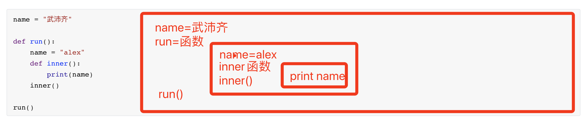
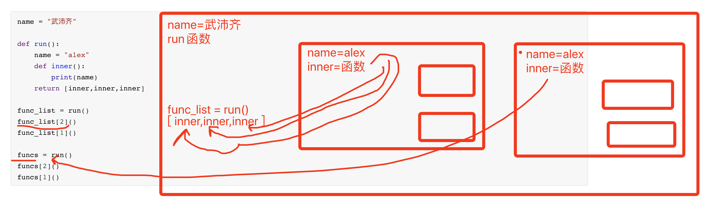
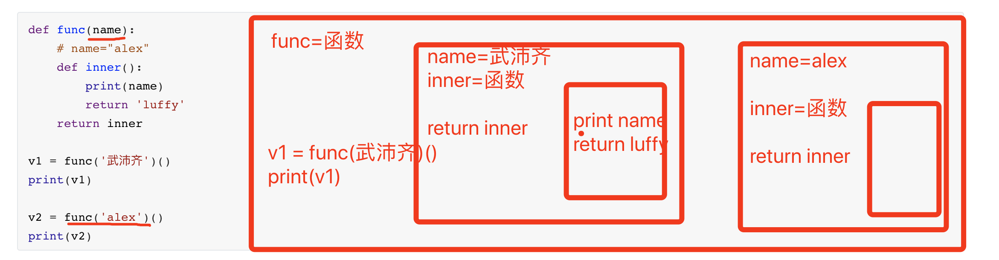
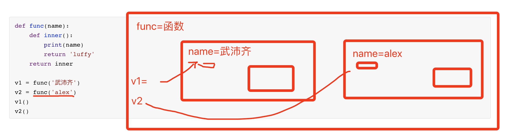
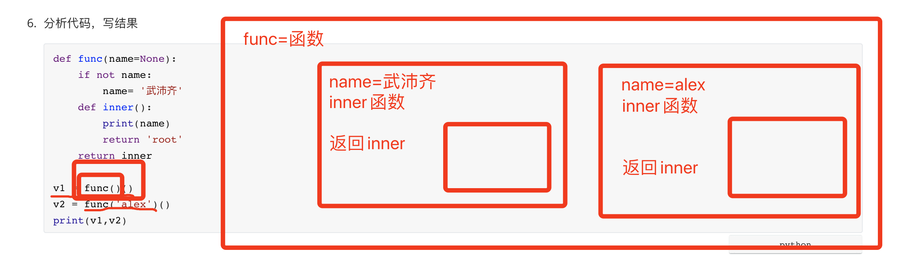
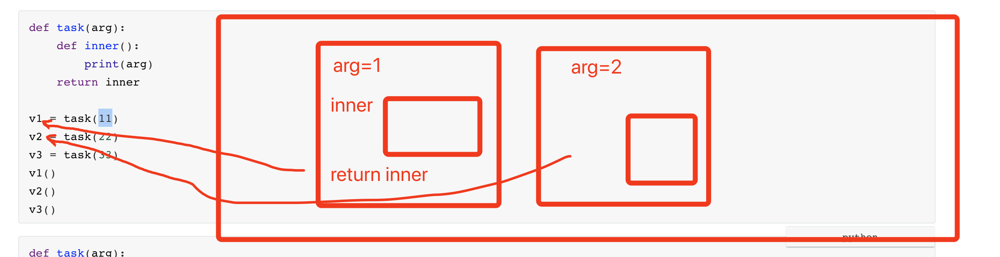
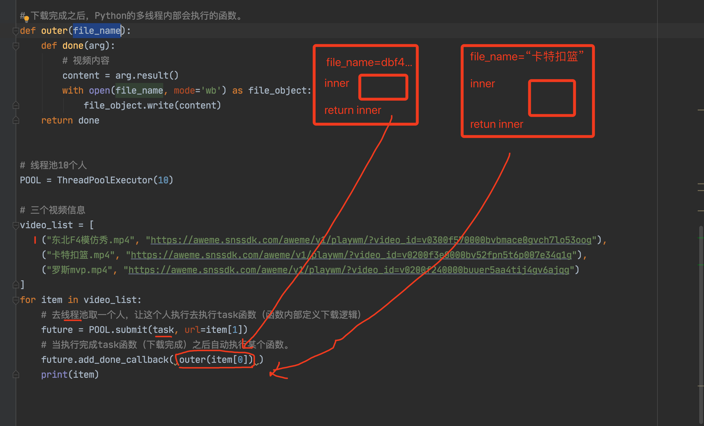

# day12 函数高级


课程目标：掌握函数嵌套、闭包、装饰器等高级知识点。

今日概要：

- 函数的嵌套
- 闭包
- 装饰器

上述内容均属于函数部分必备知识，以后开发时直接和间接都会使用，请务必理解（重在理解，不要去死记硬背）。


## 1. 函数嵌套

Python中以函数为作用域，在作用域中定义的相关数据只能被当前作用域或子作用域使用。

```python
NAME = "武沛齐"
print(NAME)

def func():
    print(NAME)

func()
```


### 1.1 函数在作用域中

其实，函数也是定义在作用域中的数据，在执行函数时候，也同样遵循：优先在自己作用域中寻找，没有则向上一接作用域寻找，例如：

```python
# 1. 在全局作用域定义了函数func
def func():
    print("你好")
    
# 2. 在全局作用域找到func函数并执行。
func()


# 3.在全局作用域定义了execute函数
def execute():
    print("开始")
    # 优先在当前函数作用域找func函数，没有则向上级作用域中寻找。
    func()
    print("结束")

# 4.在全局作用域执行execute函数
execute()
```

此处，有一个易错点：作用域中的值在被调用时到底是啥？

- 情景1

  ```python
  def func():
      print("你好")
      
  func()
  
  def execute():
      print("开始")
      func()
      print("结束")
      
  execute()
  
  def func():
      print(666)
      
  func()
  ```

- 情景2

  ```python
  def func():
      print("你好")
      
  func()
  
  def execute():
      print("开始")
      func()
      print("结束")
  
  def func():
      print(666)
  
  func()
  execute()
  ```


### 1.2 函数定义的位置

上述示例中的函数均定义在全局作用域，其实函数也可以定义在局部作用域，这样函数被局部作用域和其子作用于中调用（函数的嵌套）。

```python
def func():
    print("沙河高晓松")
    
def handler():
    print("昌平吴彦祖")
    def inner():
        print("朝阳大妈")
	inner()
    func()
    print("海淀网友")

handler()
```

到现在你会发现，只要理解数据定义时所存在的作用域，并根据从上到下代码执行过程进行分析，再怎么嵌套都可以搞定。


现在的你可能有疑问：为什么要这么嵌套定义？把函数都定义在全局不好吗？

其实，大多数情况下我们都会将函数定义在全局，不会嵌套着定义函数。不过，当我们定义一个函数去实现某功能，想要将内部功能拆分成N个函数，又担心这个N个函数放在全局会与其他函数名冲突时（尤其多人协同开发）可以选择使用函数的嵌套。

```python
def f1():
    pass

def f2():
    pass

def func():
	f1()
    f2()
```

```python
def func():
    def f1():
        pass

    def f2():
        pass
	f1()
    f2()
```

```python
"""
生成图片验证码的示例代码，需要提前安装pillow模块（Python中操作图片中一个第三方模块）
	pip3 install pillow
"""
import random
from PIL import Image, ImageDraw, ImageFont


def create_image_code(img_file_path, text=None, size=(120, 30), mode="RGB", bg_color=(255, 255, 255)):
    """ 生成一个图片验证码 """
    _letter_cases = "abcdefghjkmnpqrstuvwxy"  # 小写字母，去除可能干扰的i，l，o，z
    _upper_cases = _letter_cases.upper()  # 大写字母
    _numbers = ''.join(map(str, range(3, 10)))  # 数字
    chars = ''.join((_letter_cases, _upper_cases, _numbers))

    width, height = size  # 宽高
    # 创建图形
    img = Image.new(mode, size, bg_color)
    draw = ImageDraw.Draw(img)  # 创建画笔

    def get_chars():
        """生成给定长度的字符串，返回列表格式"""
        return random.sample(chars, 4)

    def create_lines():
        """绘制干扰线"""
        line_num = random.randint(*(1, 2))  # 干扰线条数

        for i in range(line_num):
            # 起始点
            begin = (random.randint(0, size[0]), random.randint(0, size[1]))
            # 结束点
            end = (random.randint(0, size[0]), random.randint(0, size[1]))
            draw.line([begin, end], fill=(0, 0, 0))

    def create_points():
        """绘制干扰点"""
        chance = min(100, max(0, int(2)))  # 大小限制在[0, 100]

        for w in range(width):
            for h in range(height):
                tmp = random.randint(0, 100)
                if tmp > 100 - chance:
                    draw.point((w, h), fill=(0, 0, 0))

    def create_code():
        """绘制验证码字符"""
        if text:
            code_string = text
        else:
            char_list = get_chars()
            code_string = ''.join(char_list)  # 每个字符前后以空格隔开

        # Win系统字体
        # font = ImageFont.truetype(r"C:\Windows\Fonts\SEGOEPR.TTF", size=24)
        # Mac系统字体
        # font = ImageFont.truetype("/System/Library/Fonts/SFNSRounded.ttf", size=24)
        # 项目字体文件
        font = ImageFont.truetype("MSYH.TTC", size=15)
        draw.text([0, 0], code_string, "red", font=font)
        return code_string

    create_lines()
    create_points()
    code = create_code()

    # 将图片写入到文件
    with open(img_file_path, mode='wb') as img_object:
        img.save(img_object)
    return code


code = create_image_code("a2.png")
print(code)
```


### 1.3 嵌套引发的作用域问题

基于内存和执行过程分析作用域。

```python
name = "武沛齐"

def run():
    name = "alex"
    def inner():
        print(name)
	inner()
    
run()
```




```python
name = "武沛齐"

def run():
    name = "alex"
    def inner():
        print(name)
	return inner
    
v1 = run()
v1()

v2 = run()
v2()
```


```python
name = "武沛齐"

def run():
    name = "alex"
    def inner():
        print(name)
	return [inner,inner,inner]
    
func_list = run()
func_list[2]()
func_list[1]()

funcs = run()
funcs[2]()
funcs[1]()
```




三句话搞定作用域：

- 优先在自己的作用域找，自己没有就去上级作用域。
- 在作用域中寻找值时，要确保此次此刻值是什么。
- 分析函数的执行，并确定函数`作用域链`。（函数嵌套）


### 练习题

1. 分析代码，写结果

   ```python
   name = '武沛齐'
   
   def func():
       def inner():
           print(name)
       res = inner()
       return res
   
   v = func()
   print(v)
   
   # 武沛齐
   # None
   ```

2. 分析代码，写结果

   ```python
   name = '武沛齐'
   
   def func():
       def inner():
           print(name)
           return "alex"
       res = inner()
   	return res
   
   v = func()
   print(v)
   
   # 武沛齐
   # alex
   ```

3. 分析代码，写结果

   ```python
   name = 'root'
   
   def func():
       def inner():
           print(name)
           return 'admin'
       return inner
   
   v = func()
   result = v()
   print(result)
   
   # root
   # admin
   ```

4. 分析代码，写结果

   ```python
   def func():
       name = '武沛齐'
       def inner():
           print(name)
           return '路飞'
       return inner
   
   v11 = func()
   data = v11()
   print(data)
   
   
   v2 = func()()
   print(v2)
   ```

5. 分析代码，写结果

   ```python
   def func(name):
       # name="alex"
       def inner():
           print(name)
           return 'luffy'
       return inner
   
   v1 = func('武沛齐')()
   print(v1)
   
   v2 = func('alex')()
   print(v2)
   ```

   

   

   

   ```python
   def func(name):
       def inner():
           print(name)
           return 'luffy'
       return inner
   
   v1 = func('武沛齐')
   v2 = func('alex')
   v1()
   v2()
   ```

   

   

6. 分析代码，写结果

   ```python
   def func(name=None):
       if not name:
           name= '武沛齐'
       def inner():
           print(name)
           return 'root'
       return inner
   
   v1 = func()()
   v2 = func('alex')()
   print(v1,v2)
   
   # 武沛齐
   # alex
   # root root
   ```

   


## 2.闭包

闭包，简而言之就是将数据封装在一个包（区域）中，使用时再去里面取。（本质上 闭包是基于函数嵌套搞出来一个中特殊嵌套）

- 闭包应用场景1：封装数据防止污染全局。

  ```python
  name = "武沛齐"
  
  def f1():
      print(name, age)
  
  def f2():
  	print(name, age)
  
  def f3():
  	print(name, age)
      
  def f4():
      pass
  ```

  ```python
  def func(age):
      name = "武沛齐"
  
      def f1():
          print(name, age)
  
      def f2():
          print(name, age)
  
      def f3():
          print(name, age)
  
      f1()
      f2()
      f3()
  
  func(123)
  ```

  

- 闭包应用场景2：封装数据封到一个包里，使用时在取。
  

  ```python
  def task(arg):
      def inner():
          print(arg)
      return inner
  
  v1 = task(11)
  v2 = task(22)
  v3 = task(33)
  v1()
  v2()
  v3()
  ```

  ```python
  def task(arg):
      def inner():
          print(arg)
      return inner
  
  inner_func_list = []
  for val in [11,22,33]:
      inner_func_list.append( task(val) )
      
  inner_func_list[0]() # 11
  inner_func_list[1]() # 22
  inner_func_list[2]() # 33
  ```

  

  ```python
  """ 基于多线程去下载视频 """
  from concurrent.futures.thread import ThreadPoolExecutor
  
  import requests
  
  
  def download_video(url):
      res = requests.get(
          url=url,
          headers={
              "user-agent": "Mozilla/5.0 (Macintosh; Intel Mac OS X 10_15_7) AppleWebKit/537.36 (KHTML, like Gecko) Chrome/87.0.4280.88 Safari/537.36 FS"
          }
      )
      return res.content
  
  
  def outer(file_name):
      def write_file(response):
          content = response.result()
          with open(file_name, mode='wb') as file_object:
              file_object.write(content)
  
      return write_file
  
  
  POOL = ThreadPoolExecutor(10)
  
  video_dict = [
      ("东北F4模仿秀.mp4", "https://aweme.snssdk.com/aweme/v1/playwm/?video_id=v0300f570000bvbmace0gvch7lo53oog"),
      ("卡特扣篮.mp4", "https://aweme.snssdk.com/aweme/v1/playwm/?video_id=v0200f3e0000bv52fpn5t6p007e34q1g"),
      ("罗斯mvp.mp4", "https://aweme.snssdk.com/aweme/v1/playwm/?video_id=v0200f240000buuer5aa4tij4gv6ajqg")
  ]
  for item in video_dict:
      future = POOL.submit(download_video, url=item[1])
      future.add_done_callback(outer(item[0]))
  
  POOL.shutdown()
  ```

  


## 3.装饰器

现在给你一个函数，在不修改函数源码的前提下，实现在函数执行前和执行后分别输入 "before" 和 "after"。

```python
def func():
    print("我是func函数")
    value = (11,22,33,44) 
    return value
    
result = func()
print(result)
```


### 3.1 第一回合

你的实现思路：

```python
def func():
    print("before")
    
    print("我是func函数")
    value = (11,22,33,44) 
    
    print("after")
    
    return value
    
result = func()
```


我的实现思路：

```python
def func():
    print("我是func函数")
    value = (11, 22, 33, 44)
    return value


def outer(origin):
    def inner():
        print('inner')
        origin()
        print("after")

    return inner

func = outer(func)
result = func()
```

处理返回值：

```python
def func():
    print("我是func函数")
    value = (11, 22, 33, 44)
    return value


def outer(origin):
    def inner():
        print('inner')
        res = origin()
        print("after")
        return res
    return inner

func = outer(func)
result = func()
```


### 3.2 第二回合

在Python中有个一个特殊的语法糖：

```python
def outer(origin):
    def inner():
        print('inner')
        res = origin()
        print("after")
        return res
    return inner


@outer
def func():
    print("我是func函数")
    value = (11, 22, 33, 44)
    return value


func()
```


### 3.3 第三回合

请在这3个函数执行前和执行后分别输入 "before" 和 "after"

```python
def func1():
    print("我是func1函数")
    value = (11, 22, 33, 44)
    return value
    
    
def func2():
    print("我是func2函数")
    value = (11, 22, 33, 44)
    return value
    
def func3():
    print("我是func3函数")
    value = (11, 22, 33, 44)
    return value
    
func1()
func2()
func3()
```


你的实现思路：

```python
def func1():
    print('before')
    print("我是func1函数")
    value = (11, 22, 33, 44)
    print("after")
    return value
    
    
def func2():
    print('before')
    print("我是func2函数")
    value = (11, 22, 33, 44)
    print("after")
    return value
    
def func3():
    print('before')
    print("我是func3函数")
    value = (11, 22, 33, 44)
    print("after")
    return value
    
func1()
func2()
func3()
```


我的实现思路：

```python
def outer(origin):
    def inner():
        print("before 110")
        res = origin()  # 调用原来的func函数
        print("after")
        return res

    return inner


@outer
def func1():
    print("我是func1函数")
    value = (11, 22, 33, 44)
    return value


@outer
def func2():
    print("我是func2函数")
    value = (11, 22, 33, 44)
    return value


@outer
def func3():
    print("我是func3函数")
    value = (11, 22, 33, 44)
    return value


func1()
func2()
func3()
```

装饰器，在不修改原函数内容的前提下，通过@函数可以实现在函数前后自定义执行一些功能（批量操作会更有意义）。


### 优化

优化以支持多个参数的情况。

```python
def outer(origin):
    def inner(*args, **kwargs):
        print("before 110")
        res = origin(*args, **kwargs)  # 调用原来的func函数
        print("after")
        return res

    return inner


@outer  # func1 = outer(func1)
def func1(a1):
    print("我是func1函数")
    value = (11, 22, 33, 44)
    return value


@outer  # func2 = outer(func2)
def func2(a1, a2):
    print("我是func2函数")
    value = (11, 22, 33, 44)
    return value


@outer  # func3 = outer(func3)
def func3(a1):
    print("我是func3函数")
    value = (11, 22, 33, 44)
    return value


func1(1)
func2(11, a2=22)
func3(999)
```


其中，我的那种写法就称为装饰器。

- 实现原理：基于@语法和函数闭包，将原函数封装在闭包中，然后将函数赋值为一个新的函数（内层函数），执行函数时再在内层函数中执行闭包中的原函数。

- 实现效果：可以在不改变原函数内部代码 和 调用方式的前提下，实现在函数执行和执行扩展功能。

- 适用场景：多个函数系统统一在 执行前后自定义一些功能。

- 装饰器示例

  ```python
  def outer(origin):
      def inner(*args, **kwargs):
  		# 执行前
          res = origin(*args, **kwargs)  # 调用原来的func函数
          # 执行后
          return res
      return inner
  
  
  @outer
  def func():
      pass
  
  func()
  ```

  


### 伪应用场景

在以后编写一个网站时，如果项目共有100个页面，其中99个是需要登录成功之后才有权限访问，就可以基于装饰器来实现。

```
pip3 install flask
```

基于第三方模块Flask（框架）快速写一个网站：

```python
from flask import Flask

app = Flask(__name__)


def index():
    return "首页"


def info():
    return "用户中心"


def order():
    return "订单中心"


def login():
    return "登录页面"


app.add_url_rule("/index/", view_func=index)
app.add_url_rule("/info/", view_func=info)
app.add_url_rule("/login/", view_func=login)

app.run()
```


基于装饰器实现的伪代码：

```python
from flask import Flask

app = Flask(__name__)


def auth(func):
    def inner(*args, **kwargs):
        # 在此处，判断如果用户是否已经登录，已登录则继续往下，未登录则自动跳转到登录页面。
        return func(*args, **kwargs)

    return inner


@auth
def index():
    return "首页"


@auth
def info():
    return "用户中心"


@auth
def order():
    return "订单中心"


def login():
    return "登录页面"


app.add_url_rule("/index/", view_func=index, endpoint='index')
app.add_url_rule("/info/", view_func=info, endpoint='info')
app.add_url_rule("/order/", view_func=order, endpoint='order')
app.add_url_rule("/login/", view_func=login, endpoint='login')

app.run()

```


### 重要补充：functools

你会发现装饰器实际上就是将原函数更改为其他的函数，然后再此函数中再去调用原函数。

```python
def handler():
    pass

handler()
print(handler.__name__) # handler
```

```python
def auth(func):
    def inner(*args, **kwargs):
        return func(*args, **kwargs)
    return inner

@auth
def handler():
    pass

handler()
print(handler.__name__) # inner
```

```python
import functools

def auth(func):
    @functools.wraps(func)
    def inner(*args, **kwargs):
        return func(*args, **kwargs)
    return inner

@auth
def handler():
    pass

handler()
print(handler.__name__)  # handler
```

其实，一般情况下大家不用functools也可以实现装饰器的基本功能，但后期在项目开发时，不加functools会出错（内部会读取`__name__`，且`__name__`重名的话就报错），所以在此大家就要规范起来自己的写法。


```python
import functools


def auth(func):
    @functools.wraps(func)
    def inner(*args, **kwargs):
        """巴巴里吧"""
        res = func(*args, **kwargs)  # 执行原函数
        return res

    return inner
```


## 总结

1. 函数可以定义在全局、也可以定义另外一个函数中（函数的嵌套）

2. 学会分析函数执行的步骤（内存中作用域的管理）

3. 闭包，基于函数的嵌套，可以将数据封装到一个包中，以后再去调用。

4. 装饰器

   - 实现原理：基于@语法和函数闭包，将原函数封装在闭包中，然后将函数赋值为一个新的函数（内层函数），执行函数时再在内层函数中执行闭包中的原函数。

   - 实现效果：可以在不改变原函数内部代码 和 调用方式的前提下，实现在函数执行和执行扩展功能。

   - 适用场景：多个函数系统统一在 执行前后自定义一些功能。

   - 装饰器示例

     ```python
     import functools
     
     
     def auth(func):
         @functools.wraps(func)
         def inner(*args, **kwargs):
             """巴巴里吧"""
             res = func(*args, **kwargs)  # 执行原函数
             return res
     
         return inner
     ```


## 作业

1. 请为以下所有函数编写一个装饰器，添加上装饰器后可以实现：执行func时，先执行func函数内部代码，再输出 "after"

   ```python
   def func(a1):
       return a1 + "傻叉"
   
   def base(a1,a2):
       return a1 + a2 + '傻缺'
   
   
   def foo(a1,a2,a3,a4):
       return a1 + a2 + a3 + a4 + '傻蛋'
   ```

2. 请为以下所有函数编写一个装饰器，添加上装饰器后可以实现：将被装饰的函数执行5次，讲每次执行函数的结果按照顺序放到列表中，最终返回列表。

   ```python
   import random 
   
   
   def func():
       return random.randint(1,4)
   
   result = func() # 内部自动执行5次，并将每次执行的结果追加到列表最终返回给result
   print(result) 
   ```

3. 请为以下函数编写一个装饰器，添加上装饰器后可以实现： 检查文件所在路径（文件件）是否存在，如果不存在自动创建文件夹（保证写入文件不报错）。

   ```python
   def write_user_info(path):
       file_obj = open(path, mode='w', encoding='utf-8')
       file_obj.write("武沛齐")
       file_obj.close()
   
   write_user_info('/usr/bin/xxx/xxx.png')
   ```

4. 分析代码写结果：

   ```python
   def get_data():
       scores = []
   
       def inner(val):
           scores.append(val)
           print(scores)
   
       return inner
   
   
   func = get_data()
   
   func(10)
   func(20)
   func(30)
   ```

5. 看代码写结果

   ```python
   name = "武沛齐"
   
   
   def foo():
       print(name)
   
   
   def func():
       name = "root"
       foo()
   
   
   func()
   ```

6. 看代码写结果

   ```python
   name = "武沛齐"
   
   
   def func():
       name = "root"
   
       def foo():
           print(name)
   
       foo()
   
   
   func()
   ```

7. 看代码写结果

   ```python
   def func(val):
       def inner(a1, a2):
           return a1 + a2 + val
   
       return inner
   
   
   data_list = []
   
   for i in range(10):
       data_list.append(  func(i)   )
   
   print(data_list)
   ```

8. 看代码写结果

   ```python
   def func(val):
       def inner(a1, a2):
           return a1 + a2 + val
   
       return inner
   
   
   data_list = []
   
   for i in range(10):
       data_list.append(func(i))
   
   v1 = data_list[0](11,22)
   v2 = data_list[2](33,11)
   
   print(v1)
   print(v2)
   ```

   


