# day14 模块

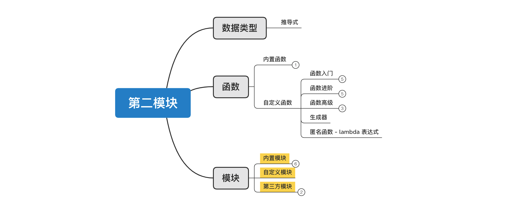

课程目标：掌握Python中常用模块的使用方法。

今日概要：

- 自定义模块（包）
- 第三方模块
- 内置模块【1/2】


## 1. 自定义模块


### 1.1 模块和包

```python
import hashlib


def encrypt(data):
    """ 数据加密 """
    hash_object = hashlib.md5()
    hash_object.update(data.encode('utf-8'))
    return hash_object.hexdigest()


user = input("请输入用户名：")
pwd = input("请输入密码：")
md5_password = encrypt(pwd)

message = "用户名：{}，密码：{}".format(user, md5_password)
print(message)

```

在开发简单的程序时，使用一个py文件就可以搞定，如果程序比较庞大，需要些10w行代码，此时为了，代码结构清晰，将功能按照某种规则拆分到不同的py文件中，使用时再去导入即可。另外，当其他项目也需要此项目的某些模块时，也可以直接把模块拿过去使用，增加重用性。


如果按照某个规则进行拆分，发现拆分到 `commons.py` 中函数太多，也可以通过文件夹来进行再次拆分，例如：

```
├── commons
│   ├── convert.py
│   ├── page.py
│   └── utils.py
└── run.py

```

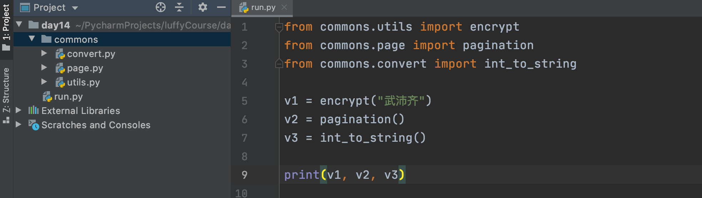


在Python中一般对文件和文件的称呼（很多开发者的平时开发中也有人都称为模块）

- 一个py文件，模块（module）。
- 含多个py文件的文件夹，包（package）。


注意：在包（文件夹）中有一个默认内容为空的`__init__.py`的文件，一般用于描述当前包的信息（在导入他下面的模块时，也会自动加载）。

- py2必须有，如果没有导入包就会失败。
- py3可有可无。


### 1.2 导入

当定义好一个模块或包之后，如果想要使用其中定义的功能，必须要先导入，然后再能使用。

导入，其实就是将模块或包加载的内存中，以后再去内存中去拿就行。


关于导如时的路径：

>  在Python内部默认设置了一些路径，导入模块或包时，都会按照指定顺序逐一去特定的路径查找。

```python
import sys
print(sys.path)
```

```python
[
    '当前执行脚本所在的目录', /Users/wupeiqi/PycharmProjects/luffyCourse/day14/bin
	/Users/wupeiqi/PycharmProjects/luffyCourse/day14
    '/Applications/PyCharm.app/Contents/plugins/python/helpers/pycharm_display',
    '/Library/Frameworks/Python.framework/Versions/3.9/lib/python39.zip',
    '/Library/Frameworks/Python.framework/Versions/3.9/lib/python3.9',
    '/Library/Frameworks/Python.framework/Versions/3.9/lib/python3.9/lib-dynload',
    '/Library/Frameworks/Python.framework/Versions/3.9/lib/python3.9/site-packages',
    '/Applications/PyCharm.app/Contents/plugins/python/helpers/pycharm_matplotlib_backend'
    
]
```


想要导入任意的模块和包，都必须写在如下路径下，才能被找到。

也可以自动手动在sys.path中添加指定路径，然后再导入可以，例如：

```python
import sys
sys.path.append("路径A")

import xxxxx  # 导入路径A下的一个xxxxx.py文件
```


1. 你以后写模块名称时，千万不能和内置和第三方的同名（新手容易犯错误）。
2. 项目执行文件一般都在项目根目录，如果执行文件嵌套的内存目录，就需要自己手动在sys.path中添加路径。
   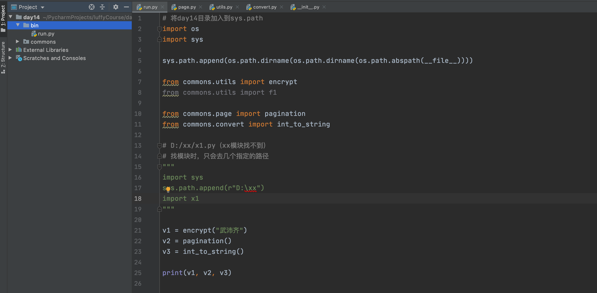
3. pycharm中默认会将项目目录加入到sys.path中


关于导入的方式：

导入本质上是将某个文件中的内容先加载到内存中，然后再去内存中拿过来使用。而在Python开发中常用的导入的方式有2类方式，每类方式都也多种情况。

 - 第一类：import xxxx（开发中，一般多用于导入sys.path目录下的一个py文件）

   - 模块级别

     ```
     ├── commons
     │   ├── __init__.py
     │   ├── convert.py
     │   ├── page.py
     │   ├── tencent
     │   │   ├── __init__.py
     │   │   ├── sms.py
     │   │   └── wechat.py
     │   └── utils.py
     ├── many.py
     └── run.py
     ```

     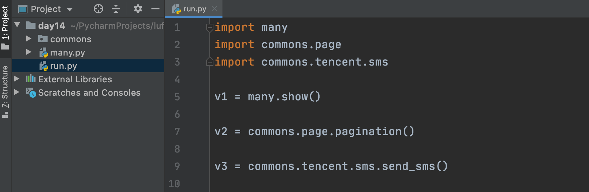

   - 包级别

     ```
     ├── commons
     │   ├── __init__.py
     │   ├── convert.py
     │   ├── page.py
     │   └── utils.py
     ├── third
     │   ├── __init__.py
     │   ├── ali
     │   │   └── oss.py
     │   └── tencent
     │       ├── __init__.py
     │       ├── __pycache__
     │       ├── sms.py
     │       └── wechat.py
     └── run.py
     ```

     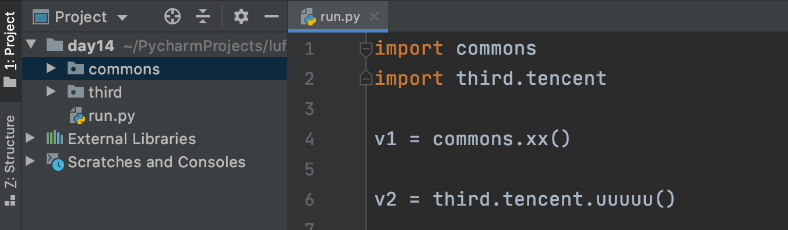

 - 第二类：from xxx import xxx 【常用】，一般适用于多层嵌套和导入模块中某个成员的情况。

   - 成员级别

     ```
     ├── commons
     │   ├── __init__.py
     │   ├── convert.py
     │   ├── page.py
     │   └── utils.py
     ├── many.py
     └── run.py
     ```

     

     提示：基于from模式也可以支持 `from many import *`，即：导入一个模块中所有的成员（可能会重名，所以用的少）。

   - 模块级别

     ```
     ├── commons
     │   ├── __init__.py
     │   ├── convert.py
     │   ├── page.py
     │   └── utils.py
     ├── many.py
     └── run.py
     ```

     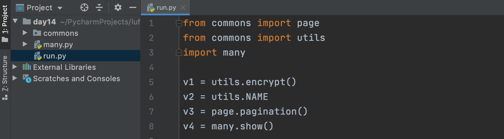

   - 包级别

     ```python
     ├── commons
     │   ├── __init__.py
     │   ├── convert.py
     │   ├── page.py
     │   ├── tencent
     │   │   ├── __init__.py
     │   │   ├── sms.py
     │   │   └── wechat.py
     │   └── utils.py
     ├── many.py
     └── run.py
     ```

     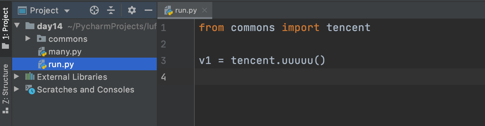

   

### 1.3 相对导入

在导入模块时，对于 `from xx import xx`这种模式，还支持相对到导入。例如：

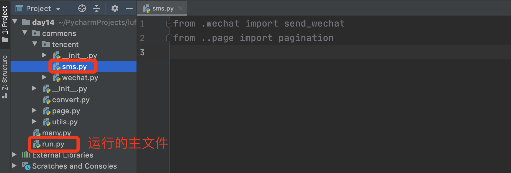


切记，相对导入只能用在包中的py文件中（即：嵌套在文件中的py文件才可以使用，项目根目录下无法使用）。

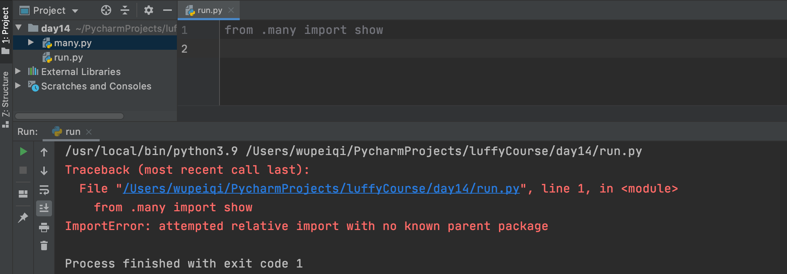


### 1.4 导入别名

如果项目中导入 成员/模块/包 有重名，那么后导入的会覆盖之前导入，为了避免这种情况的发生，Python支持重命名，即：

```python
from xxx.xxx import xx as xo
import x1.x2 as pg
```


除此之外，有了as的存在，让 import xx.xxx.xxxx.xxx 在调用执行时，会更加简单（**不常用，了解即可**）。

- 原来

  ```python
  import commons.page
  
  v1 = commons.page.pagination()
  ```

- 现在

  ```python
  import commons.page as pg
  
  v1 = pg.pagination()
  ```


### 1.5 主文件

- 执行一个py文件时

  ```
  __name__ = "__main__"
  ```

- 导入一个py文件时

  ```python
  __name__ = "模块名"
  ```


主文件，其实就是在程序执行的入口文件，例如：

```python
├── commons
│   ├── __init__.py
│   ├── convert.py
│   ├── page.py
│   ├── tencent
│   │   ├── __init__.py
│   │   ├── sms.py
│   │   └── wechat.py
│   └── utils.py
├── many.py
└── run.py
```

我们通常是执行 run.py 去运行程序，其他的py文件都是一些功能代码。当我们去执行一个文件时，文件内部的 `__name__`变量的值为 `__main__`，所以，主文件经常会看到：

```python
import many
from commons import page
from commons import utils


def start():
    v1 = many.show()
    v2 = page.pagination()
    v3 = utils.encrypt()


if __name__ == '__main__':
    start()
```

只有是以主文件的形式运行此脚本时start函数才会执行，被导入时则不会被执行。


### 小结

1. 模块和包的区别

2. 导入模块的两种方式：

   ```
   import xx
   from xxx import xxx
   ```

3. 相对导入，需要有包名称。

4. 模块重名可以通过as取别名。

5. 执行py文件时，内部`__name__=="__main__"`，导入模块时，被导入的模块 `__name__="模块名"`

6. 在项目开发中，一般在主文件中会写上 main （主文件标记，不是绝对的，因为其他文件在开发调试时候有时候也可能有main）。


## 2. 第三方模块

Python内部提供的模块有限，所以在平时在开发的过程中，经常会使用第三方模块。

而第三方模块必须要先安装才能可以使用，下面介绍常见的3中安装第三方模块的方式。


其实，使用第三方模块的行为就是去用别人写好并开源出来的py代码，这样自己拿来就用，不必重复造轮子了。。。。


### 2.1 pip（最常用）

这是Python中最最最常用的安装第三方模块的方式。

pip其实是一个第三方模块包管理工具，默认安装Python解释器时自动会安装，默认目录：

```
MAC系统，即：Python安装路径的bin目录下
	/Library/Frameworks/Python.framework/Versions/3.9/bin/pip3
	/Library/Frameworks/Python.framework/Versions/3.9/bin/pip3.9
	
Windows系统，即：Python安装路径的scripts目录下
	C:\Python39\Scripts\pip3.exe
	C:\Python39\Scripts\pip3.9.exe
```

提示：为了方便在终端运行pip管理工具，我们也会把它所在的路径添加到系统环境变量中。

```
pip3 install 模块名称
```


如果你的电脑上某个写情况没有找到pip，也可以自己手动安装：

- 下载 `get-pip.py` 文件，到任意目录

  ```
  地址：https://bootstrap.pypa.io/get-pip.py
  ```

- 打开终端进入目录，用Python解释器去运行已下载的 `get-pip.py`文件即刻安装成功。
  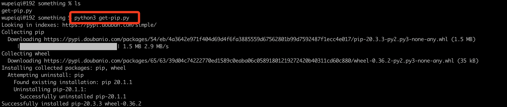


使用pip去安装第三方模块也非常简单，只需要在自己终端执行：`pip install 模块名称` 即可。

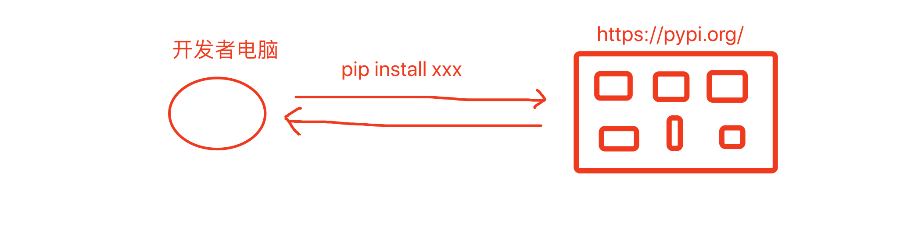

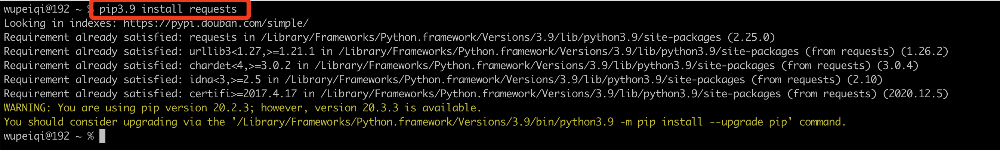


默认安装的是最新的版本，如果想要指定版本：

```python
pip3 install 模块名称==版本

例如：
pip3 install django==2.2
```

#### 2.1.1 pip更新

上图的黄色字体提示：目前我电脑上的pip是20.2.3版本，最新的是 20.3.3 版本，如果想要升级为最新的版本，可以在终端执行他提示的命令：

```
/Library/Frameworks/Python.framework/Versions/3.9/bin/python3.9 -m pip install --upgrade pip
```

注意：根据自己电脑的提示命令去执行，不要用我这里的提示命令哈。


#### 2.1.2 豆瓣源

pip默认是去 `https://pypi.org` 去下载第三方模块（本质上就是别人写好的py代码），国外的网站速度会比较慢，为了加速可以使用国内的豆瓣源。

- 一次性使用

  ```
  pip3.9 install 模块名称  -i  https://pypi.douban.com/simple/
  ```

- 永久使用

  - 配置

    ```
    # 在终端执行如下命令
    pip3.9 config set global.index-url https://pypi.douban.com/simple/
    
    # 执行完成后，提示在我的本地文件中写入了豆瓣源，以后再通过pip去安装第三方模块时，就会默认使用豆瓣源了。
    # 自己以后也可以打开文件直接修改源地址。
    Writing to /Users/wupeiqi/.config/pip/pip.conf
    ```

  - 使用

    ```
    pip3.9 install 模块名称
    ```


写在最后，也还有其他的源可供选择（豆瓣应用广泛）。

```
阿里云：http://mirrors.aliyun.com/pypi/simple/
中国科技大学：https://pypi.mirrors.ustc.edu.cn/simple/ 
清华大学：https://pypi.tuna.tsinghua.edu.cn/simple/
中国科学技术大学：http://pypi.mirrors.ustc.edu.cn/simple/
```


### 2.2 源码

如果要安装的模块在pypi.org中不存在 或 因特殊原因无法通过pip install 安装时，可以直接下载源码，然后基于源码安装，例如：

- 下载requests源码（压缩包zip、tar、tar.gz）并解压。

  ```
  下载地址：https://pypi.org/project/requests/#files
  ```

- 进入目录

- 执行编译和安装命令

  ```
  python3 setup.py build
  python3 setup.py install
  ```

  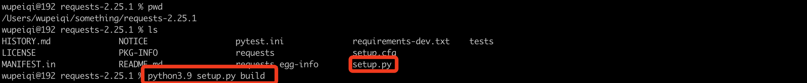
  


### 2.3 wheel

wheel是Python的第三方模块包的文件格式的一种，我们也可以基于wheel去安装一些第三方模块。

- 安装wheel格式支持，这样pip再安装第三方模块时，就可以处理wheel格式的文件了。

  ```python
  pip3.9 install wheel
  ```

- 下载第三方的包（wheel格式），例如：https://pypi.org/project/requests/#files

  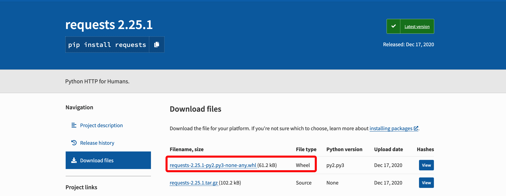

- 进入下载目录，在终端基于pip直接安装
  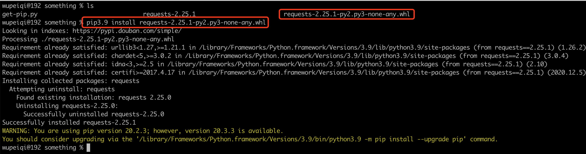


无论通过什么形式去安装第三方模块，默认模块的安装路径在：

```
Max系统：
	/Library/Frameworks/Python.framework/Versions/3.9/lib/python3.9/site-packages
Windows系统：
	C:\Python39\Lib\site-packages\
```

提醒：这个目录在sys.path中，所以我们直接在代码中直接导入下载的第三方包是没问题的。


## 3.内置模块（一）

Python内置的模块有很多，我们也已经接触了不少相关模块，接下来咱们就来做一些汇总和介绍。

内置模块有很多 & 模块中的功能也非常多，我们是没有办法注意全局给大家讲解，在此我会整理出项目开发最常用的来进行讲解。


### 3.1 os

```python
import os

# 1. 获取当前脚本绝对路径
"""
abs_path = os.path.abspath(__file__)
print(abs_path)
"""

# 2. 获取当前文件的上级目录
"""
base_path = os.path.dirname( os.path.dirname(路径) ）
print(base_path)
"""

# 3. 路径拼接
"""
p1 = os.path.join(base_path, 'xx')
print(p1)

p2 = os.path.join(base_path, 'xx', 'oo', 'a1.png')
print(p2)
"""

# 4. 判断路径是否存在
"""
exists = os.path.exists(p1)
print(exists)
"""

# 5. 创建文件夹
"""
os.makedirs(路径)
"""
"""
path = os.path.join(base_path, 'xx', 'oo', 'uuuu')
if not os.path.exists(path):
    os.makedirs(path)
"""

# 6. 是否是文件夹
"""
file_path = os.path.join(base_path, 'xx', 'oo', 'uuuu.png')
is_dir = os.path.isdir(file_path)
print(is_dir) # False

folder_path = os.path.join(base_path, 'xx', 'oo', 'uuuu')
is_dir = os.path.isdir(folder_path)
print(is_dir) # True

"""

# 7. 删除文件或文件夹
"""
os.remove("文件路径")
"""
"""
path = os.path.join(base_path, 'xx')
shutil.rmtree(path)
"""

```

- listdir，查看目录下所有的文件
- walk，查看目录下所有的文件（含子孙文件）

```python
import os

"""
data = os.listdir("/Users/wupeiqi/PycharmProjects/luffyCourse/day14/commons")
print(data)
# ['convert.py', '__init__.py', 'page.py', '__pycache__', 'utils.py', 'tencent']
"""

"""
要遍历一个文件夹下的所有文件，例如：遍历文件夹下的所有mp4文件
"""

data = os.walk("/Users/wupeiqi/Documents/视频教程/路飞Python/mp4")
for path, folder_list, file_list in data:
    for file_name in file_list:
        file_abs_path = os.path.join(path, file_name)
        ext = file_abs_path.rsplit(".",1)[-1]
        if ext == "mp4":
            print(file_abs_path)
```

### 3.2 shutil

```python
import shutil

# 1. 删除文件夹
"""
path = os.path.join(base_path, 'xx')
shutil.rmtree(path)
"""

# 2. 拷贝文件夹
"""
shutil.copytree("/Users/wupeiqi/Desktop/图/csdn/","/Users/wupeiqi/PycharmProjects/CodeRepository/files")
"""

# 3.拷贝文件
"""
shutil.copy("/Users/wupeiqi/Desktop/图/csdn/WX20201123-112406@2x.png","/Users/wupeiqi/PycharmProjects/CodeRepository/")
shutil.copy("/Users/wupeiqi/Desktop/图/csdn/WX20201123-112406@2x.png","/Users/wupeiqi/PycharmProjects/CodeRepository/x.png")
"""

# 4.文件或文件夹重命名
"""
shutil.move("/Users/wupeiqi/PycharmProjects/CodeRepository/x.png","/Users/wupeiqi/PycharmProjects/CodeRepository/xxxx.png")
shutil.move("/Users/wupeiqi/PycharmProjects/CodeRepository/files","/Users/wupeiqi/PycharmProjects/CodeRepository/images")
"""

# 5. 压缩文件
"""
# base_name，压缩后的压缩包文件
# format，压缩的格式，例如："zip", "tar", "gztar", "bztar", or "xztar".
# root_dir，要压缩的文件夹路径
"""
# shutil.make_archive(base_name=r'datafile',format='zip',root_dir=r'files')


# 6. 解压文件
"""
# filename，要解压的压缩包文件
# extract_dir，解压的路径
# format，压缩文件格式
"""
# shutil.unpack_archive(filename=r'datafile.zip', extract_dir=r'xxxxxx/xo', format='zip')
```


### 3.3 sys

```python
import sys

# 1. 获取解释器版本
"""
print(sys.version)
print(sys.version_info)
print(sys.version_info.major, sys.version_info.minor, sys.version_info.micro)
"""

# 2. 导入模块路径
"""
print(sys.path)
"""

```

- argv，执行脚本时，python解释器后面传入的参数

```python
import sys

print(sys.argv)


# [
#       '/Users/wupeiqi/PycharmProjects/luffyCourse/day14/2.接受执行脚本的参数.py'
# ]

# [
#     "2.接受执行脚本的参数.py"
# ]

# ['2.接受执行脚本的参数.py', '127', '999', '666', 'wupeiqi']

# 例如，请实现下载图片的一个工具。

def download_image(url):
    print("下载图片", url)


def run():
    # 接受用户传入的参数
    url_list = sys.argv[1:]
    for url in url_list:
        download_image(url)


if __name__ == '__main__':
    run()
```

### 3.4 random

```python
import random

# 1. 获取范围内的随机整数
v = random.randint(10, 20)
print(v)

# 2. 获取范围内的随机小数
v = random.uniform(1, 10)
print(v)

# 3. 随机抽取一个元素
v = random.choice([11, 22, 33, 44, 55])
print(v)

# 4. 随机抽取多个元素
v = random.sample([11, 22, 33, 44, 55], 3)
print(v)

# 5. 打乱顺序
data = [1, 2, 3, 4, 5, 6, 7, 8, 9]
random.shuffle(data)
print(data)
```


### 3.5 hashlib

```python
import hashlib

hash_object = hashlib.md5()
hash_object.update("武沛齐".encode('utf-8'))
result = hash_object.hexdigest()
print(result)
```

```python
import hashlib

hash_object = hashlib.md5("iajfsdunjaksdjfasdfasdf".encode('utf-8'))
hash_object.update("武沛齐".encode('utf-8'))
result = hash_object.hexdigest()
print(result)
```


### 3.6 configparser 

见：day09


### 3.7 xml

见：day09


## 总结

1. 模块和包的区别

2. 了解如何导入模块

   - 路径
   - 导入方式

3. 导入模块时一般要遵循的规范【补充】

   - 注释：文件顶部或init文件中。

   - 在文件顶部导入

   - 有规则导入，并用空行分割。

     ```
     # 先内置模块
     
     # 再第三方模块
     
     # 最后自定义模块
     ```

     ```
     import os
     import sys
     import random
     import hashlib
     
     import requests
     import openpyxl
     
     from commons.utils import encrypt
     ```

4. 第三方模块安装的方法

5. 常见内置模块


## 作业

1. 自己去网上搜索如何基于Python计算mp4视频的时长，最终实现用代码统计某个文件夹下所有mp4的时长。


