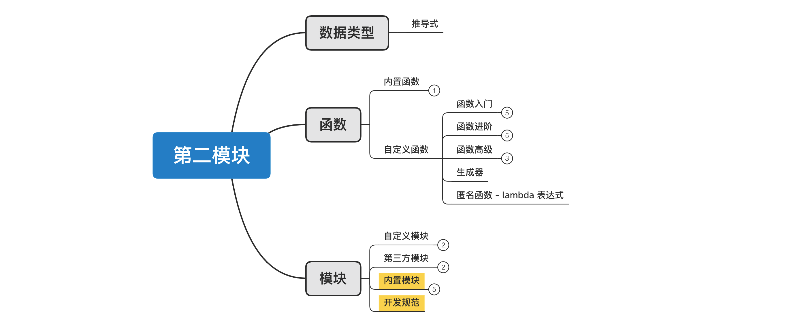
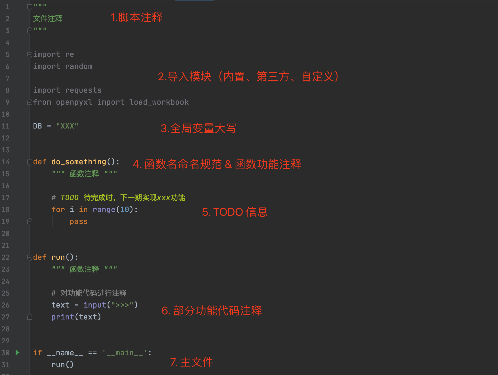
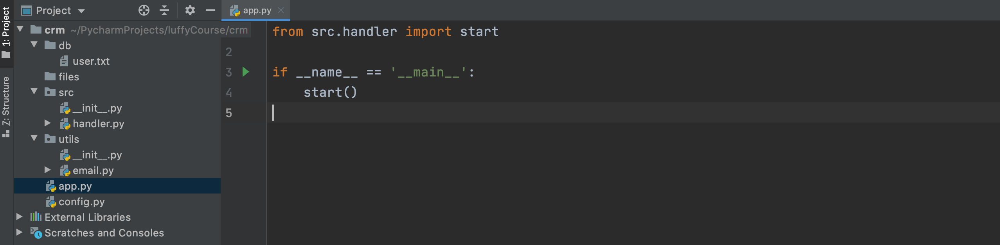
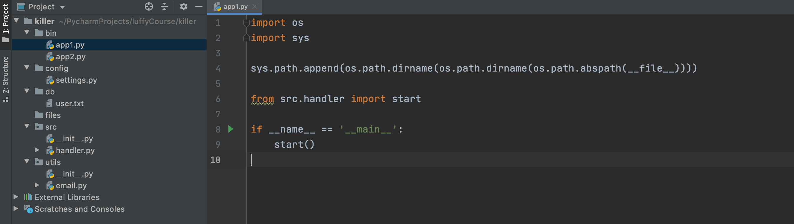
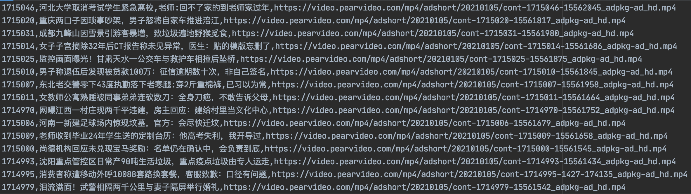

# day15 内置模块和开发规范



目标：掌握常见的内置模块的使用及了解软件开发的规范。

今日概要：

- 内置模块
  - json
  - time
  - datetime
  - re
- 开发规范
  - 主文件
  - 配置文件
  - 数据
  - 附件
  - 业务代码


## 1. 内置模块


### 1.1 json

json模块，是python内部的一个模块，可以将python的数据格式 转换为json格式的数据，也可以将json格式的数据转换为python的数据格式。

json格式，是一个数据格式（本质上就是个字符串，常用语网络数据传输）

```python
# Python中的数据类型的格式
data = [
    {"id": 1, "name": "武沛齐", "age": 18},
    {"id": 2, "name": "alex", "age": 18},
    ('wupeiqi',123),
]

# JSON格式
value = '[{"id": 1, "name": "武沛齐", "age": 18}, {"id": 2, "name": "alex", "age": 18},["wupeiqi",123]]'
```


#### 1.1.1 核心功能


json格式的作用？

```
跨语言数据传输，例如：
	A系统用Python开发，有列表类型和字典类型等。
	B系统用Java开发，有数组、map等的类型。

	语言不同，基础数据类型格式都不同。
	
	为了方便数据传输，大家约定一个格式：json格式，每种语言都是将自己数据类型转换为json格式，也可以将json格式的数据转换为自己的数据类型。
```


Python数据类型与json格式的相互转换：

- 数据类型 -> json ，一般称为：序列化

  ```python
  import json
  
  data = [
      {"id": 1, "name": "武沛齐", "age": 18},
      {"id": 2, "name": "alex", "age": 18},
  ]
  
  res = json.dumps(data)
  print(res) # '[{"id": 1, "name": "\u6b66\u6c9b\u9f50", "age": 18}, {"id": 2, "name": "alex", "age": 18}]'
  
  res = json.dumps(data, ensure_ascii=False)
  print(res) # '[{"id": 1, "name": "武沛齐", "age": 18}, {"id": 2, "name": "alex", "age": 18}]'
  ```

- json格式 -> 数据类型，一般称为：反序列化

  ```python
  import json
  
  data_string = '[{"id": 1, "name": "武沛齐", "age": 18}, {"id": 2, "name": "alex", "age": 18}]'
  
  data_list = json.loads(data_string)
  
  print(data_list)
  ```


#### 练习题

1. 写网站，给用户返回json格式数据

   - 安装flask模块，协助我们快速写网站（之前已安装过）

     ```python
     pip3 install flask
     ```

   - 使用flask写网站

     ```python
     import json
     from flask import Flask
     
     app = Flask(__name__)
     
     
     def index():
         return "首页"
     
     
     def users():
         data = [
             {"id": 1, "name": "武沛齐", "age": 18},
             {"id": 2, "name": "alex", "age": 18},
         ]
         return json.dumps(data)
     
     
     app.add_url_rule('/index/', view_func=index, endpoint='index')
     app.add_url_rule('/users/', view_func=users, endpoint='users')
     
     if __name__ == '__main__':
         app.run()
     ```

2. 发送网络请求，获取json格式数据并处理。

   ```python
   import json
   import requests
   
   url = "https://movie.douban.com/j/search_subjects?type=movie&tag=%E7%83%AD%E9%97%A8&sort=recommend&page_limit=5&page_start=20"
   
   res = requests.get(
       url=url,
       headers={
           "User-Agent": "Mozilla/5.0 (Macintosh; Intel Mac OS X 10_15_7) AppleWebKit/537.36 (KHTML, like Gecko) Chrome/87.0.4280.88 Safari/537.36"
       }
   )
   
   # json格式
   print(res.text)
   
   # json格式转换为python数据类型
   data_dict = json.loads(res.text)
   print(data_dict)
   ```

   

#### 1.1.2 类型要求

python的数据类型转换为 json 格式，对数据类型是有要求的，默认只支持：

```
    +-------------------+---------------+
    | Python            | JSON          |
    +===================+===============+
    | dict              | object        |
    +-------------------+---------------+
    | list, tuple       | array         |
    +-------------------+---------------+
    | str               | string        |
    +-------------------+---------------+
    | int, float        | number        |
    +-------------------+---------------+
    | True              | true          |
    +-------------------+---------------+
    | False             | false         |
    +-------------------+---------------+
    | None              | null          |
    +-------------------+---------------+
```

```python
data = [
    {"id": 1, "name": "武沛齐", "age": 18},
    {"id": 2, "name": "alex", "age": 18},
]
```

其他类型如果想要支持，需要自定义`JSONEncoder `才能实现【目前只需要了解大概意思即可，以后项目开发中用到了还会讲解。】，例如：

```python
import json
from decimal import Decimal
from datetime import datetime

data = [
    {"id": 1, "name": "武沛齐", "age": 18, 'size': Decimal("18.99"), 'ctime': datetime.now()},
    {"id": 2, "name": "alex", "age": 18, 'size': Decimal("9.99"), 'ctime': datetime.now()},
]


class MyJSONEncoder(json.JSONEncoder):
    def default(self, o):
        if type(o) == Decimal:
            return str(o)
        elif type(o) == datetime:
            return o.strftime("%Y-%M-%d")
        return super().default(o)


res = json.dumps(data, cls=MyJSONEncoder)
print(res)
```


#### 1.1.3 其他功能

json模块中常用的是：

- `json.dumps`，序列化生成一个字符串。

- `json.loads`，发序列化生成python数据类型。

- `json.dump`，将数据序列化并写入文件（不常用）

  ```python
  import json
  
  data = [
      {"id": 1, "name": "武沛齐", "age": 18},
      {"id": 2, "name": "alex", "age": 18},
  ]
  
  file_object = open('xxx.json', mode='w', encoding='utf-8')
  
  json.dump(data, file_object)
  
  file_object.close()
  ```

- `json.load`，读取文件中的数据并反序列化为python的数据类型（不常用）

  ```python
  import json
  
  file_object = open('xxx.json', mode='r', encoding='utf-8')
  
  data = json.load(file_object)
  print(data)
  
  file_object.close()
  ```

  


### 1.2 时间处理

- UTC/GMT：世界时间

- 本地时间：本地时区的时间。

Python中关于时间处理的模块有两个，分别是time和datetime。

#### 1.2.1 time

```python
import time

# 获取当前时间戳（自1970-1-1 00:00）
v1 = time.time()
print(v1)

# 时区
v2 = time.timezone

# 停止n秒，再执行后续的代码。
time.sleep(5)
```


#### 1.2.2 datetime

在平时开发过程中的时间一般是以为如下三种格式存在：

- datetime

  ```python
  from datetime import datetime, timezone, timedelta
  
  v1 = datetime.now()  # 当前本地时间
  print(v1)
  
  tz = timezone(timedelta(hours=7))  # 当前东7区时间
  v2 = datetime.now(tz)
  print(v2)
  
  v3 = datetime.utcnow()  # 当前UTC时间
  print(v3)
  ```

  ```python
  from datetime import datetime, timedelta
  
  v1 = datetime.now()
  print(v1)
  
  # 时间的加减
  v2 = v1 + timedelta(days=140, minutes=5)
  print(v2)
  
  # datetime类型 + timedelta类型
  ```

  ```python
  from datetime import datetime, timezone, timedelta
  
  v1 = datetime.now()
  print(v1)
  
  v2 = datetime.utcnow()  # 当前UTC时间
  print(v2)
  
  # datetime之间相减，计算间隔时间（不能相加）
  data = v1 - v2
  print(data.days, data.seconds / 60 / 60, data.microseconds)
  
  # datetime类型 - datetime类型
  # datetime类型 比较 datetime类型
  ```

- 字符串

  ```python
  # 字符串格式的时间  ---> 转换为datetime格式时间
  text = "2021-11-11"
  v1 = datetime.strptime(text,'%Y-%m-%d') # %Y 年，%m，月份，%d，天。
  print(v1)
  ```

  ```python
  # datetime格式 ----> 转换为字符串格式
  v1 = datetime.now()
  val = v1.strftime("%Y-%m-%d %H:%M:%S")
  print(val)
  ```

- 时间戳

  ```python
  # 时间戳格式 --> 转换为datetime格式
  ctime = time.time() # 11213245345.123
  v1 = datetime.fromtimestamp(ctime)
  print(v1)
  ```

  ```python
  # datetime格式 ---> 转换为时间戳格式
  v1 = datetime.now()
  val = v1.timestamp()
  print(val)
  ```


#### 练习题

1. 日志记录，将用户输入的信息写入到文件，文件名格式为`年-月-日-时-分.txt`。

   ```python
   from datetime import datetime
   
   while True:
       text = input("请输入内容：")
       if text.upper() == "Q":
           break
           
       current_datetime = datetime.now().strftime("%Y-%m-%d-%H-%M")
       file_name = "{}.txt".format(current_datetime)
       
       with open(file_name, mode='a', encoding='utf-8') as file_object:
           file_object.write(text)
           file_object.flush()
   ```

2. 用户注册，将用户信息写入Excel，其中包含：用户名、密码、注册时间 三列。

   ```python
   import os
   import hashlib
   from datetime import datetime
   
   from openpyxl import load_workbook
   from openpyxl import workbook
   
   
   BASE_DIR = os.path.dirname(os.path.abspath(__file__))
   FILE_NAME = "db.xlsx"
   
   
   def md5(origin):
       hash_object = hashlib.md5("sdfsdfsdfsd23sd".encode('utf-8'))
       hash_object.update(origin.encode('utf-8'))
       return hash_object.hexdigest()
   
   
   def register(username, password):
       db_file_path = os.path.join(BASE_DIR, FILE_NAME)
       if os.path.exists(db_file_path):
           wb = load_workbook(db_file_path)
           sheet = wb.worksheets[0]
           next_row_position = sheet.max_row + 1
       else:
           wb = workbook.Workbook()
           sheet = wb.worksheets[0]
           next_row_position = 1
   
       user = sheet.cell(next_row_position, 1)
       user.value = username
   
       pwd = sheet.cell(next_row_position, 2)
       pwd.value = md5(password)
   
       ctime = sheet.cell(next_row_position, 3)
       ctime.value = datetime.now().strftime("%Y-%m-%d %H:%M:%S")
   
       wb.save(db_file_path)
   
   
   def run():
       while True:
           username = input("请输入用户名：")
           if username.upper() == "Q":
               break
           password = input("请输入密码：")
           register(username, password)
   
   
   if __name__ == '__main__':
       run()
   
   ```

   

### 1.3 正则表达式相关

当给你一大堆文本信息，让你提取其中的指定数据时，可以使用正则来实现。例如：提取文本中的邮箱和手机号

```python
import re

text = "楼主太牛逼了，在线想要 442662578@qq.com和xxxxx@live.com谢谢楼主，手机号也可15131255789，搞起来呀"

phone_list = re.findall("1[3|5|8|9]\d{9}", text)
print(phone_list)
```


#### 1.3.1 正则表达式

##### 1. 字符相关

- `wupeiqi` 匹配文本中的wupeiqi

  ```python
  import re
  
  text = "你好wupeiqi,阿斯顿发wupeiqasd 阿士大夫能接受的wupeiqiff"
  data_list = re.findall("wupeiqi", text)
  print(data_list) # ['wupeiqi', 'wupeiqi'] 可用于计算字符串中某个字符出现的次数
  ```

- `[abc]` 匹配a或b或c 字符。

  ```python
  import re
  
  text = "你2b好wupeiqi,阿斯顿发awupeiqasd 阿士大夫a能接受的wffbbupqaceiqiff"
  data_list = re.findall("[abc]", text)
  print(data_list) # ['b', 'a', 'a', 'a', 'b', 'b', 'c']
  ```

  ```python
  import re
  
  text = "你2b好wupeiqi,阿斯顿发awupeiqasd 阿士大夫a能接受的wffbbupqcceiqiff"
  data_list = re.findall("q[abc]", text)
  print(data_list) # ['qa', 'qc']
  ```

- `[^abc]` 匹配除了abc意外的其他字符。

  ```python
  import re
  
  text = "你wffbbupceiqiff"
  data_list = re.findall("[^abc]", text)
  print(data_list)  # ['你', 'w', 'f', 'f', 'u', 'p', 'e', 'i', 'q', 'i', 'f', 'f']
  ```

- `[a-z]`  匹配a~z的任意字符（ [0-9]也可以 ）。

  ```python
  import re
  
  text = "alexrootrootadmin"
  data_list = re.findall("t[a-z]", text)
  print(data_list)  # ['tr', 'ta']
  ```

- `.`  代指除换行符以外的任意字符。

  ```python
  import re
  
  text = "alexraotrootadmin"
  data_list = re.findall("r.o", text)
  print(data_list) # ['rao', 'roo']
  ```

  ```python
  import re
  
  text = "alexraotrootadmin"
  data_list = re.findall("r.+o", text) # 贪婪匹配
  print(data_list) # ['raotroo']
  ```

  ```python
  import re
  
  text = "alexraotrootadmin"
  data_list = re.findall("r.+?o", text) # 非贪婪匹配
  print(data_list) # ['rao']
  ```

- `\w` 代指字母或数字或下划线（汉字）。

  ```python
  import re
  
  text = "北京武沛alex齐北  京武沛alex齐"
  data_list = re.findall("武\w+x", text)
  print(data_list) # ['武沛alex', '武沛alex']
  ```

- `\d` 代指数字

  ```python
  import re
  
  text = "root-ad32min-add3-admd1in"
  data_list = re.findall("d\d", text)
  print(data_list) # ['d3', 'd3', 'd1']
  ```

  ```python
  import re
  
  text = "root-ad32min-add3-admd1in"
  data_list = re.findall("d\d+", text)
  print(data_list) # ['d32', 'd3', 'd1']
  ```

- `\s` 代指任意的空白符，包括空格、制表符等。

  ```python
  import re
  
  text = "root admin add admin"
  data_list = re.findall("a\w+\s\w+", text)
  print(data_list) # ['admin add']
  ```

  

##### 2. 数量相关

- `*` 重复0次或更多次

  ```python
  import re
  
  text = "他是大B个，确实是个大2B。"
  data_list = re.findall("大2*B", text)
  print(data_list) # ['大B', '大2B']
  ```

- `+` 重复1次或更多次

  ```python
  import re
  
  text = "他是大B个，确实是个大2B，大3B，大66666B。"
  data_list = re.findall("大\d+B", text)
  print(data_list) # ['大2B', '大3B', '大66666B']
  ```

- `?` 重复0次或1次

  ```python
  import re
  
  text = "他是大B个，确实是个大2B，大3B，大66666B。"
  data_list = re.findall("大\d?B", text)
  print(data_list) # ['大B', '大2B', '大3B']
  ```

- `{n}` 重复n次

  ```python
  import re
  
  text = "楼主太牛逼了，在线想要 442662578@qq.com和xxxxx@live.com谢谢楼主，手机号也可15131255789，搞起来呀"
  data_list = re.findall("151312\d{5}", text)
  print(data_list) # ['15131255789']
  ```

- `{n,}` 重复n次或更多次

  ```python
  import re
  
  text = "楼主太牛逼了，在线想要 442662578@qq.com和xxxxx@live.com谢谢楼主，手机号也可15131255789，搞起来呀"
  data_list = re.findall("\d{9,}", text)
  print(data_list) # ['442662578', '15131255789']
  
  ```

- `{n,m}` 重复n到m次

  ```python
  import re
  
  text = "楼主太牛逼了，在线想要 442662578@qq.com和xxxxx@live.com谢谢楼主，手机号也可15131255789，搞起来呀"
  data_list = re.findall("\d{10,15}", text)
  print(data_list) # ['15131255789']
  ```


##### 3. 括号（分组）

- 提取数据区域

  ```python
  import re
  
  text = "楼主太牛逼了，在线想要 442662578@qq.com和xxxxx@live.com谢谢楼主，手机号也可15131255789，搞起来呀"
  data_list = re.findall("15131(2\d{5})", text)
  print(data_list)  # ['255789']
  ```

  ```python
  import re
  
  text = "楼主太牛逼了，在线想要 442662578@qq.com和xxxxx@live.com谢谢楼主，手机号也可15131255789，搞起来15131266666呀"
  data_list = re.findall("15(13)1(2\d{5})", text)
  print(data_list)  # [ ('13', '255789')   ]
  ```

  

  ```python
  import re
  
  text = "楼主太牛逼了，在线想要 442662578@qq.com和xxxxx@live.com谢谢楼主，手机号也可15131255789，搞起来呀"
  data_list = re.findall("(15131(2\d{5}))", text)
  print(data_list)  # [('15131255789', '255789')]
  ```

  

- 获取指定区域 + 或条件

  ```python
  import re
  
  text = "楼主15131root太牛15131alex逼了，在线想要 442662578@qq.com和xxxxx@live.com谢谢楼主，手机号也可15131255789，搞起来呀"
  data_list = re.findall("15131(2\d{5}|r\w+太)", text)
  print(data_list)  # ['root太', '255789']
  ```

  ```python
  import re
  
  text = "楼主15131root太牛15131alex逼了，在线想要 442662578@qq.com和xxxxx@live.com谢谢楼主，手机号也可15131255789，搞起来呀"
  data_list = re.findall("(15131(2\d{5}|r\w+太))", text)
  print(data_list)  # [('15131root太', 'root太'), ('15131255789', '255789')]
  ```


  ##### 练习题

1. 利用正则匹配QQ号码

   ```
   [1-9]\d{4,}
   ```

2. 身份证号码

   ```python
   import re
   
   text = "dsf130429191912015219k13042919591219521Xkk"
   data_list = re.findall("\d{17}[\dX]", text) # [abc]
   print(data_list) # ['130429191912015219', '13042919591219521X']
   ```

   ```python
   import re
   
   text = "dsf130429191912015219k13042919591219521Xkk"
   data_list = re.findall("\d{17}(\d|X)", text)
   print(data_list) # ['9', 'X']
   ```

   ```python
   import re
   
   text = "dsf130429191912015219k13042919591219521Xkk"
   data_list = re.findall("(\d{17}(\d|X))", text)
   print(data_list) # [('130429191912015219', '9'), ('13042919591219521X', 'X')]
   ```

   ```python
   import re
   
   text = "dsf130429191912015219k13042919591219521Xkk"
   data_list = re.findall("(\d{6})(\d{4})(\d{2})(\d{2})(\d{3})([0-9]|X)", text)
   print(data_list) # [('130429', '1919', '12', '01', '521', '9'), ('130429', '1959', '12', '19', '521', 'X')]
   ```

3. 手机号

   ```python
   import re
   
   text = "我的手机哈是15133377892，你的手机号是1171123啊？"
   data_list = re.findall("1[3-9]\d{9}", text)
   print(data_list)  # ['15133377892']
   ```

4. 邮箱地址

   ```python
   import re
   
   text = "楼主太牛逼了，在线想要 442662578@qq.com和xxxxx@live.com谢谢楼主，手机号也可15131255789，搞起来呀"
   email_list = re.findall("\w+@\w+\.\w+",text)
   print(email_list) # ['442662578@qq.com和xxxxx']
   ```

   ```python
   import re
   
   text = "楼主太牛逼了，在线想要 442662578@qq.com和xxxxx@live.com谢谢楼主，手机号也可15131255789，搞起来呀"
   email_list = re.findall("[a-zA-Z0-9_-]+@[a-zA-Z0-9_-]+\.[a-zA-Z0-9_-]+", text, re.ASCII)
   print(email_list) # ['442662578@qq.com', 'xxxxx@live.com']
   
   ```

   ```python
   import re
   
   text = "楼主太牛逼了，在线想要 442662578@qq.com和xxxxx@live.com谢谢楼主，手机号也可15131255789，搞起来呀"
   email_list = re.findall("\w+@\w+\.\w+", text, re.ASCII)
   print(email_list) # ['442662578@qq.com', 'xxxxx@live.com']
   ```

   ```python
   import re
   
   text = "楼主太牛44266-2578@qq.com逼了，在线想要 442662578@qq.com和xxxxx@live.com谢谢楼主，手机号也可15131255789，搞起来呀"
   email_list = re.findall("(\w+([-+.]\w+)*@\w+([-.]\w+)*\.\w+([-.]\w+)*)", text, re.ASCII)
   print(email_list) # [('44266-2578@qq.com', '-2578', '', ''), ('xxxxx@live.com', '', '', '')]
   ```

5. 补充代码，实现获取页面上的所有评论（已实现），并提取里面的邮箱。

   ```python
   # 先安装两个模块
   pip3 install requests
   pip3 install beautifulsoup4
   ```

   ```python
   import re
   import requests
   from bs4 import BeautifulSoup
   
   res = requests.get(
       url="https://www.douban.com/group/topic/79870081/",
       headers={
           'User-Agent': 'Mozilla/5.0 (Macintosh; Intel Mac OS X 10_14_0) AppleWebKit/537.36 (KHTML, like Gecko) Chrome/80.0.3987.163 Safari/537.36',
       }
   )
   bs_object = BeautifulSoup(res.text, "html.parser")
   comment_object_list = bs_object.find_all("p", attrs={"class": "reply-content"})
   for comment_object in comment_object_list:
       text = comment_object.text
       print(text)
       # 请继续补充代码，提取text中的邮箱地址
   
   ```

   


##### 4. 起始和结束

上述示例中都是去一段文本中提取数据，只要文本中存在即可。

但，如果要求用户输入的内容必须是指定的内容开头和结尾，比就需要用到如下两个字符。

- `^` 开始
- `$` 结束

```python
import re

text = "啊442662578@qq.com我靠"
email_list = re.findall("^\w+@\w+.\w+$", text, re.ASCII)
print(email_list) # []
```

```python
import re

text = "442662578@qq.com"
email_list = re.findall("^\w+@\w+.\w+$", text, re.ASCII)
print(email_list) # ['442662578@qq.com']
```


这种一般用于对用户输入数据格式的校验比较多，例如：

```python
import re

text = input("请输入邮箱：")
email = re.findall("^\w+@\w+.\w+$", text, re.ASCII)
if not email:
    print("邮箱格式错误")
else:
    print(email)
```


##### 5. 特殊字符

由于正则表达式中 `*  .  \ { } ( ) ` 等都具有特殊的含义，所以如果想要在正则中匹配这种指定的字符，需要转义，例如：

```python
import re

text = "我是你{5}爸爸"
data = re.findall("你{5}爸", text)
print(data) # []
```

```python
import re

text = "我是你{5}爸爸"
data = re.findall("你\{5\}爸", text)
print(data)
```


#### 1.3.2 re模块

python中提供了re模块，可以处理正则表达式并对文本进行处理。

- findall，获取匹配到的所有数据

  ```python
  import re
  
  text = "dsf130429191912015219k13042919591219521Xkk"
  data_list = re.findall("(\d{6})(\d{4})(\d{2})(\d{2})(\d{3})([0-9]|X)", text)
  print(data_list) # [('130429', '1919', '12', '01', '521', '9'), ('130429', '1959', '12', '19', '521', 'X')]
  ```

- match，从起始位置开始匹配，匹配成功返回一个对象，未匹配成功返回None

  ```python
  import re
  
  text = "大小逗2B最逗3B欢乐"
  data = re.match("逗\dB", text)
  print(data) # None
  ```

  ```python
  import re
  
  text = "逗2B最逗3B欢乐"
  data = re.match("逗\dB", text)
  if data:
      content = data.group() # "逗2B"
      print(content)
  ```

- search，浏览整个字符串去匹配第一个，未匹配成功返回None

  ```python
  import re
  
  text = "大小逗2B最逗3B欢乐"
  data = re.search("逗\dB", text)
  if data:
      print(data.group())  # "逗2B"
  ```

- sub，替换匹配成功的位置

  ```python
  import re
  
  text = "逗2B最逗3B欢乐"
  data = re.sub("\dB", "沙雕", text)
  print(data) # 逗沙雕最逗沙雕欢乐
  ```

  ```python
  import re
  
  text = "逗2B最逗3B欢乐"
  data = re.sub("\dB", "沙雕", text, 1)
  print(data) # 逗沙雕最逗3B欢乐
  ```

- split，根据匹配成功的位置分割

  ```python
  import re
  
  text = "逗2B最逗3B欢乐"
  data = re.split("\dB", text)
  print(data) # ['逗', '最逗', '欢乐']
  ```

  ```python
  import re
  
  text = "逗2B最逗3B欢乐"
  data = re.split("\dB", text, 1)
  print(data) # ['逗', '最逗3B欢乐']
  ```

- finditer

  ```python
  import re
  
  text = "逗2B最逗3B欢乐"
  data = re.finditer("\dB", text)
  for item in data:
      print(item.group())
  ```

  ```python
  import re
  
  text = "逗2B最逗3B欢乐"
  data = re.finditer("(?P<xx>\dB)", text)  # 命名分组
  for item in data:
      print(item.groupdict())
  ```

  ```python
  text = "dsf130429191912015219k13042919591219521Xkk"
  data_list = re.finditer("\d{6}(?P<year>\d{4})(?P<month>\d{2})(?P<day>\d{2})\d{3}[\d|X]", text)
  for item in data_list:
      info_dict = item.groupdict()
      print(info_dict)
  ```

  


### 小结

到此，关于最常见的内置模块就全部讲完了（共11个），现阶段只需要掌握这些模块的使用即可，在后续的课程和练习题中也会涉及到一起其他内置模块。

- os
- shutil
- sys
- random
- hashlib
- configparser
- xml
- json
- time
- datetime
- re


## 2. 项目开发规范

现阶段，我们在开发一些程序时（终端运行），应该遵循一些结构的规范，让你的系统更加专业。


### 2.1 单文件应用

当基于python开发简单应用时（一个py文件就能搞定），需要注意如下几点。

```python
"""
文件注释
"""

import re
import random

import requests
from openpyxl import load_workbook

DB = "XXX"


def do_something():
    """ 函数注释 """

    # TODO 待完成时，下一期实现xxx功能
    for i in range(10):
        pass


def run():
    """ 函数注释 """

    # 对功能代码进行注释
    text = input(">>>")
    print(text)


if __name__ == '__main__':
    run()
```





### 2.2 单可执行文件

新创建一个项目，假设名字叫 【crm】，可以创建如下文件和文件夹来存放代码和数据。

```python
crm
├── app.py        文件，程序的主文件（尽量精简）
├── config.py     文件，配置文件（放相关配置信息，代码中读取配置信息，如果想要修改配置，即可以在此修改，不用再去代码中逐一修改了）
├── db            文件夹，存放数据
├── files         文件夹，存放文件
├── src           包，业务处理的代码
└── utils         包，公共功能
```

示例程序见附件：crm.zip




### 2.3 多可执行文件

新创建项目，假设名称叫【killer】，可以创建如下文件和文件夹来存放代码和数据。

```
killer
├── bin					文件夹，存放多个主文件（可运行）
│   ├── app1.py
│   └── app2.py
├── config              包，配置文件
│   ├── __init__.py
│   └── settings.py
├── db                  文件夹，存放数据
├── files               文件夹，存放文件
├── src                 包，业务代码
│   └── __init__.py
└── utils               包，公共功能
    └── __init__.py
```


示例程序见附件：killer.zip




## 总结

1. json格式和json模块
2. json模块处理特殊的数据类型
3. datetime格式与字符串、时间戳以及相关之间的转换。
4. datetime格式时间与timedelta的加减。
5. 两个datetime相减可以计算时间间隔，得到的是一个timedelta格式的时间。
6. 了解正则表达式的编写方式和python中re模块的使用。
7. 项目开发规范。


## 作业：开发短视频资讯平台

- 有video.csv视频库文件，其中有999条短视频数据，格式如下：【 video.csv 文件已为大家提供好，在day15课件目录下。 】

  

- 项目的核心功能有：

  - 分页看新闻（每页显示10条），提示用户输入页码，根据页码显示指定页面的数据。

    - 提示用户输入页码，根据页码显示指定页面的数据。
    - 当用户输入的页码不存在时，默认显示第1页

  - 搜索专区

    - 用户输入关键字，根据关键词筛选出所有匹配成功的短视频资讯。
    - 支持的搜索两种搜索格式：
      - `id=1715025`，筛选出id等于1715025的视频（video.csv的第一列）。
      - `key=文本`，模糊搜索，筛选包含关键字的所有新闻（video.csv的第二列）。

  - 下载专区

    - 用户输入视频id，根据id找到对应的mp4视频下载地址，然后下载视频到项目的files目录。

      - 视频的文件名为：`视频id-年-月-日-时-分-秒.mp4`

      - 视频下载代码示例

        ```python
        import requests
        
        res = requests.get(
            url='https://video.pearvideo.com/mp4/adshort/20210105/cont-1715046-15562045_adpkg-ad_hd.mp4'
        )
        
        # 视频总大小（字节）
        file_size = int(res.headers['Content-Length'])
        
        download_size = 0
        with open('xxx.mp4', mode='wb') as file_object:
            # 分块读取下载的视频文件（最多一次读128字节），并逐一写入到文件中。 len(chunk)表示实际读取到每块的视频文件大小。
            for chunk in res.iter_content(128):
                download_size += len(chunk)
                file_object.write(chunk)
                file_object.flush()
                message = "视频总大小为：{}字节，已下载{}字节。".format(file_size, download_size)
                print(message)
            file_object.close()
        
        res.close()
        ```

      - 下载的过程中，输出已下载的百分比，示例代码如下：

        ```python
        import time
        
        print("正在下载中...")
        for i in range(101):
            text = "\r{}%".format(i)
            print(text, end="")
            time.sleep(0.2)
        
        print("\n下载完成")
        ```

        

      

## 附赠

自动采集梨视频1000条资讯的爬虫脚本。<span style='color:red;'>梨视频平台系统更新后可能会导致下载失败，到时候需根据平台调整再来修改代码。</span>

```python
"""
下载梨视频的：视频ID，视频标题，视频URL地址 并写入到本次 video.csv 文件中。

运行此脚本需要预先安装：
    pip install request
    pip install beautifulsoup4

"""
import requests
from bs4 import BeautifulSoup


def get_mp4_url(video_id):
    data = requests.get(
        url="https://www.pearvideo.com/videoStatus.jsp?contId={}".format(video_id),
        headers={
            "Referer": "https://www.pearvideo.com/video_{}".format(video_id),
        }
    )
    response = data.json()
    image_url = response['videoInfo']['video_image']
    video_url = response['videoInfo']['videos']['srcUrl']
    middle = image_url.rsplit('/', 1)[-1].rsplit('-', 1)[0]
    before, after = video_url.rsplit('/', 1)
    suffix = after.split('-', 1)[-1]
    url = "{}/{}-{}".format(before, middle, suffix)
    return url


def download_video():
    file_object = open('video.csv', mode='w', encoding='utf-8')
    count = 0
    while count <= 999:
        res = requests.get(
            url="https://www.pearvideo.com/category_loading.jsp?reqType=14&categoryId=&start={}".format(count)
        )
        bs = BeautifulSoup(res.text, 'lxml')
        a_list = bs.find_all("a", attrs={'class': "vervideo-lilink"})
        for tag in a_list:
            title = tag.find('div', attrs={'class': "vervideo-title"}).text.strip()
            video_id = tag.get('href').split('_')[-1]
            mp4_url = get_mp4_url(video_id)
            row = "{},{},{}\n".format(video_id, title, mp4_url)
            file_object.write(row)
            file_object.flush()
            count += 1
            message = "已下载{}个".format(count)
            print(message)
    file_object.close()


if __name__ == '__main__':
    download_video()
```


