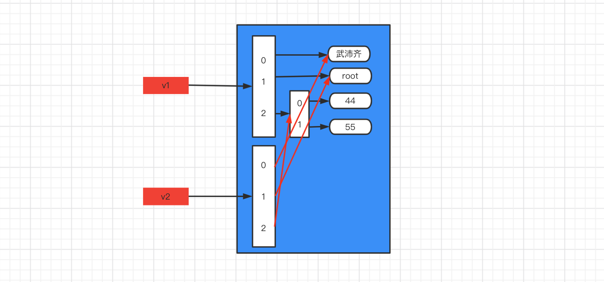
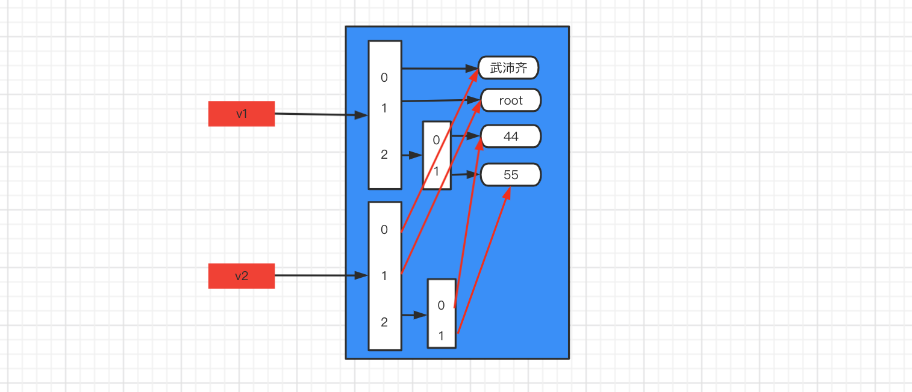

# day16 阶段总结

课程目标：对第二模块  “函数和模块” 阶段的知识点进行总结和考试，让学员更好的掌握此模块的相关知识。

课程概要：

- 知识补充
- 阶段总结（思维导图）
- 考试题


## 1.知识补充

### 1.1 nolocal关键字

在之前的课程中，我们学过global关键字。

```python     
name = 'root'


def outer():
    name = "武沛齐"

    def inner():
        global name
        name = 123

    inner()
    print(name)


outer()
print(name)
```


其实，还有一个nolocal关键字，用的比较少，此处作为了解即可。

```python
name = 'root'


def outer():
    name = "武沛齐"

    def inner():
        nonlocal name
        name = 123

    inner()
    print(name)


outer()
print(name)
```

```python
name = 'root'


def outer():
    name = 'alex'

    def func():
        name = "武沛齐"

        def inner():
            nonlocal name
            name = 123

        inner()
        print(name)

    func()
    print(name)


outer()
print(name)

```

```python
name = 'root'


def outer():
    name = 'alex'

    def func():
        nonlocal name
        name = "武沛齐"

        def inner():
            nonlocal name
            name = 123

        inner()
        print(name)

    func()
    print(name)


outer()
print(name)
```


### 1.2 yield from

在生成器部分我们了解了yield关键字，其在python3.3之后有引入了一个yield from。

```python
def foo():
    yield 2
    yield 2
    yield 2


def func():
    yield 1
    yield 1
    yield 1
    yield from foo()
    yield 1
    yield 1


for item in func():
    print(item)
```


### 1.3 深浅拷贝

- 浅拷贝

  - 不可变类型，不拷贝。

    ```python
    import copy
    
    v1 = "武沛齐"
    print(id(v1)) # 140652260947312
    
    v2 = copy.copy(v1) 
    print(id(v2)) # 140652260947312
    ```

    按理说拷贝v1之后，v2的内存地址应该不同，但由于python内部优化机制，内存地址是相同的，因为对不可变类型而言，如果以后修改值，会重新创建一份数据，不会影响原数据，所以，不拷贝也无妨。

  - 可变类型，只拷贝第一层。

    ```python
    import copy
    
    v1 = ["武沛齐", "root", [44, 55]]
    print(id(v1))  # 140405837216896
    print(id(v1[2]))  # 140405837214592
    
    v2 = copy.copy(v1)
    print(id(v2))  # 140405837214784
    print(id(v2[2]))  # 140405837214592
    ```

    

- 深拷贝

  - 不可变类型，不拷贝

    ```python
    import copy
    
    v1 = "武沛齐"
    print(id(v1))  # 140188538697072
    
    v2 = copy.deepcopy(v1)
    print(id(v2))  # 140188538697072
    ```

    特殊的元组：

    - 元组元素中无可变类型，不拷贝

      ```python
      import copy
      
      v1 = ("武沛齐", "root")
      print(id(v1))  # 140243298961984
      
      v2 = copy.deepcopy(v1)
      print(id(v2))  # 140243298961984
      ```

    - 元素元素中有可变类型，找到所有【可变类型】或【含有可变类型的元组】   均拷贝一份

      ```python
      import copy
      
      v1 = ("武沛齐", "root", [11, [44, 55], (11, 22), (11, [], 22), 33])
      v2 = copy.deepcopy(v1)
      
      print(id(v1))  # 140391475456384
      print(id(v2))  # 140391475456640
      
      print(id(v1[2]))  # 140352552779008
      print(id(v2[2]))  # 140352552920448
      
      print(id(v1[2][1]))  # 140642999940480
      print(id(v2[2][1]))  # 140643000088832
      
      print(id(v1[2][2]))  # 140467039914560
      print(id(v2[2][2]))  # 140467039914560
      
      print(id(v1[2][3]))  # 140675479841152
      print(id(v2[2][3]))  # 140675480454784
      ```

  - 可变类型，找到所有层级的 【可变类型】或【含有可变类型的元组】   均拷贝一份

    ```python
    import copy
    
    v1 = ["武沛齐", "root", [11, [44, 55], (11, 22), (11, [], 22), 33]]
    v2 = copy.deepcopy(v1)
    
    print(id(v1))  # 140391475456384
    print(id(v2))  # 140391475456640
    
    print(id(v1[2]))  # 140352552779008
    print(id(v2[2]))  # 140352552920448
    
    print(id(v1[2][1]))  # 140642999940480
    print(id(v2[2][1]))  # 140643000088832
    
    print(id(v1[2][2]))  # 140467039914560
    print(id(v2[2][2]))  # 140467039914560
    
    print(id(v1[2][3]))  # 140675479841152
    print(id(v2[2][3]))  # 140675480454784
    ```

    ```python
    import copy
    
    v1 = ["武沛齐", "root", [44, 55]]
    v2 = copy.deepcopy(v1)
    
    print(id(v1))  # 140405837216896
    print(id(v2))  # 140405837214784
    
    
    print(id(v1[2]))  # 140563140392256
    print(id(v2[2]))  # 140563140535744
    ```

    

    


## 2.阶段总结


## 3.考试题

考试题的目的是让大家对自己近期知识点学习练习 以及 自测，请大家务必【独立】完成（切勿翻看笔记 & 切勿网上搜索 ）。

- 第一步：自己独立完成（编程题目可以在pycharm中编写）

- 第二步：做完之后，翻看自己笔记去修改和更正。

- 第三步：觉自己做的没问题了，最后再去看考试题的参考答案和讲解。

  

详情见附件《第二阶段考试题.md》文件。


