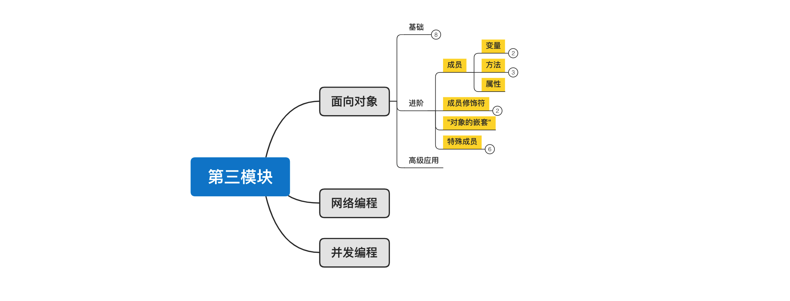
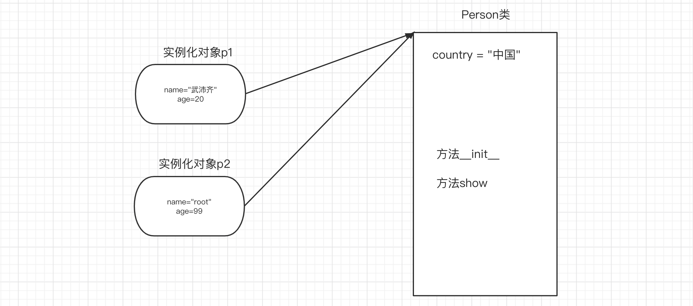
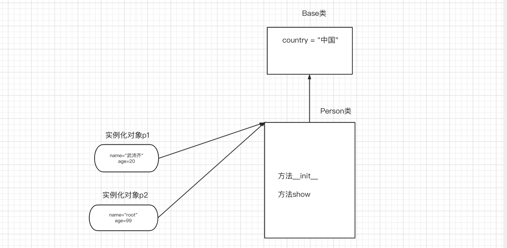
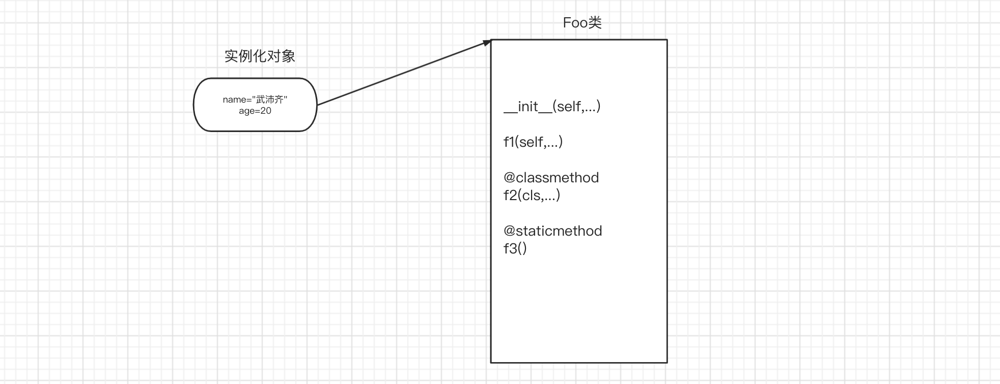
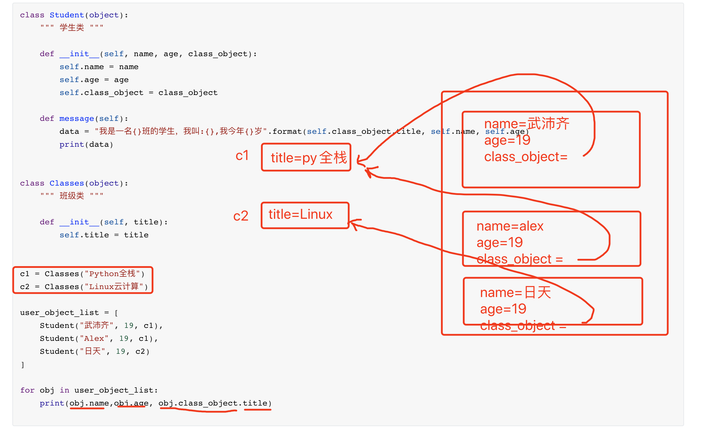
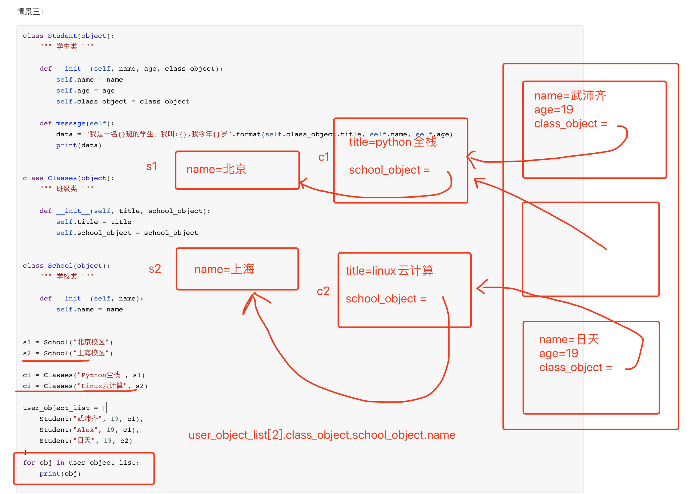

# day18 面向对象进阶



课程目标：掌握面向对象进阶相关知识点，能沟通更加自如的使用面向对象来进行编程。

今日概要：

- 成员
  - 变量
    - 实例变量
    - 类变量
  - 方法
    - 绑定方法
    - 类方法
    - 静态方法
  - 属性
- 成员修饰符（公有/私有）
- “对象嵌套”

- 特殊成员


## 1.成员

面向对象中的所有成员如下：

- 变量
  - 实例变量
  - 类变量
- 方法
  - 绑定方法
  - 类方法
  - 静态方法
- 属性

通过面向对象进行编程时，会遇到很多种情况，也会使用不同的成员来实现，接下来我们来逐一介绍成员特性和应用场景。


### 1.1 变量

- 实例变量，属于对象，每个对象中各自维护自己的数据。
- 类变量，属于类，可以被所有对象共享，一般用于给对象提供公共数据（类似于全局变量）。




```python
class Person(object):
    country = "中国"

    def __init__(self, name, age):
        self.name = name
        self.age = age

    def show(self):
        # message = "{}-{}-{}".format(Person.country, self.name, self.age)
        message = "{}-{}-{}".format(self.country, self.name, self.age)
        print(message)

print(Person.country) # 中国


p1 = Person("武沛齐",20)
print(p1.name)
print(p1.age)
print(p1.country) # 中国

p1.show() # 中国-武沛齐-20


```

提示：当把每个对象中都存在的相同的示例变量时，可以选择把它放在类变量中，这样就可以避免对象中维护多个相同数据。


#### 易错点 & 面试题

第一题：注意读和写的区别。


```python
class Person(object):
    country = "中国"

    def __init__(self, name, age):
        self.name = name
        self.age = age

    def show(self):
        message = "{}-{}-{}".format(self.country, self.name, self.age)
        print(message)

print(Person.country) # 中国

p1 = Person("武沛齐",20)
print(p1.name) # 武沛齐
print(p1.age) # 20
print(p1.country) # 中国
p1.show() # 中国-武沛齐-20

p1.name = "root"     # 在对象p1中讲name重置为root
p1.num = 19          # 在对象p1中新增实例变量 num=19
p1.country = "china" # 在对象p1中新增实例变量 country="china"

print(p1.country)   # china
print(Person.country) # 中国
```

```python
class Person(object):
    country = "中国"

    def __init__(self, name, age):
        self.name = name
        self.age = age

    def show(self):
        message = "{}-{}-{}".format(self.country, self.name, self.age)
        print(message)

print(Person.country) # 中国

Person.country = "美国"


p1 = Person("武沛齐",20)
print(p1.name) # 武沛齐
print(p1.age) # 20
print(p1.country) # 美国
```


第二题：继承关系中的读写



```python
class Base(object):
    country = "中国"


class Person(Base):

    def __init__(self, name, age):
        self.name = name
        self.age = age

    def show(self):
        message = "{}-{}-{}".format(Person.country, self.name, self.age)
        # message = "{}-{}-{}".format(self.country, self.name, self.age)
        print(message)


# 读
print(Base.country) # 中国
print(Person.country) # 中国

obj = Person("武沛齐",19)
print(obj.country) # 中国

# 写
Base.country = "china"
Person.country = "泰国"
obj.country = "日本"
```

面试题

```python
class Parent(object):
    x = 1


class Child1(Parent):
    pass


class Child2(Parent):
    pass


print(Parent.x, Child1.x, Child2.x) # 1 1 1

Child1.x = 2
print(Parent.x, Child1.x, Child2.x) # 1 2 1

Parent.x = 3
print(Parent.x, Child1.x, Child2.x) # 3 2 3
```


### 1.2 方法

- 绑定方法，默认有一个self参数，由对象进行调用（此时self就等于调用方法的这个对象）【对象&类均可调用】
- 类方法，默认有一个cls参数，用类或对象都可以调用（此时cls就等于调用方法的这个类）【对象&类均可调用】
- 静态方法，无默认参数，用类和对象都可以调用。【对象&类均可调用】



```python
class Foo(object):

    def __init__(self, name,age):
        self.name = name
        self.age = age

    def f1(self):
        print("绑定方法", self.name)

    @classmethod
    def f2(cls):
        print("类方法", cls)

    @staticmethod
    def f3():
        print("静态方法")
        
# 绑定方法（对象）
obj = Foo("武沛齐",20)
obj.f1() # Foo.f1(obj)


# 类方法
Foo.f2()  # cls就是当前调用这个方法的类。（类）
obj.f2()  # cls就是当前调用这个方法的对象的类。


# 静态方法
Foo.f3()  # 类执行执行方法（类）
obj.f3()  # 对象执行执行方法
```

在Python中比较灵活，方法都可以通过对象和类进行调用；而在java、c#等语言中，绑定方法只能由对象调用；类方法或静态方法只能由类调用。

```python
import os
import requests


class Download(object):

    def __init__(self, folder_path):
        self.folder_path = folder_path

    @staticmethod
    def download_dou_yin():
        # 下载抖音
        res = requests.get('.....')

        with open("xxx.mp4", mode='wb') as f:
            f.write(res.content)

    def download_dou_yin_2(self):
        # 下载抖音
        res = requests.get('.....')
        path = os.path.join(self.folder_path, 'xxx.mp4')
        with open(path, mode='wb') as f:
            f.write(res.content)


obj = Download("video")
obj.download_dou_yin()

```

面试题：

在类中 @classmethod 和 @staticmethod 的作用？


### 1.3 属性

属性其实是由绑定方法 + 特殊装饰器 组合创造出来的，让我们以后在调用方法时可以不加括号，例如：

```python
class Foo(object):

    def __init__(self, name):
        self.name = name

    def f1(self):
        return 123

    @property
    def f2(self):
        return 123


obj = Foo("武沛齐")

v1 = obj.f1()
print(v1)

v2 = obj.f2
print(v2)
```


示例：以之前开发的分页的功能。

```python
class Pagination:
    def __init__(self, current_page, per_page_num=10):
        self.per_page_num = per_page_num
        
        if not current_page.isdecimal():
            self.current_page = 1
            return
        current_page = int(current_page)
        if current_page < 1:
            self.current_page = 1
            return
        self.current_page = current_page
	
    def start(self):
        return (self.current_page - 1) * self.per_page_num
	
    def end(self):
        return self.current_page * self.per_page_num


user_list = ["用户-{}".format(i) for i in range(1, 3000)]

# 分页显示，每页显示10条
while True:
    page = input("请输入页码：")
	
    # page，当前访问的页码
    # 10，每页显示10条数据
	# 内部执行Pagination类的init方法。
    pg_object = Pagination(page, 20)
    
    page_data_list = user_list[ pg_object.start() : pg_object.end() ]
    for item in page_data_list:
        print(item)
```

```python
class Pagination:
    def __init__(self, current_page, per_page_num=10):
        self.per_page_num = per_page_num

        if not current_page.isdecimal():
            self.current_page = 1
            return
        current_page = int(current_page)
        if current_page < 1:
            self.current_page = 1
            return
        self.current_page = current_page

    @property
    def start(self):
        return (self.current_page - 1) * self.per_page_num

    @property
    def end(self):
        return self.current_page * self.per_page_num


user_list = ["用户-{}".format(i) for i in range(1, 3000)]

# 分页显示，每页显示10条
while True:
    page = input("请输入页码：")

    pg_object = Pagination(page, 20)
    page_data_list = user_list[ pg_object.start : pg_object.end ]
    
    for item in page_data_list:
        print(item)
```


其实，除了咱们写的示例意外，在很多模块和框架的源码中也有porperty的身影，例如：requests模块。

```python
import requests

# 内部下载视频，并将下载好的数据分装到Response对象中。
res = requests.get(
    url="https://aweme.snssdk.com/aweme/v1/playwm/?video_id=v0200f240000buuer5aa4tij4gv6ajqg",
    headers={
        "user-agent": "Mozilla/5.0 (Macintosh; Intel Mac OS X 10_15_7) AppleWebKit/537.36 (KHTML, like Gecko) Chrome/87.0.4280.88 Safari/537.36 FS"
    }
)

# 去对象中获取text，其实需要读取原始文本字节并转换为字符串
res.text
```


关于属性的编写有两种方式：

- 方式一，基于装饰器

  ```python
  class C(object):
      
      @property
      def x(self):
          pass
      
      @x.setter
      def x(self, value):
          pass
      
      @x.deleter
      def x(self):
  		pass
          
  obj = C()
  
  obj.x
  obj.x = 123
  del obj.x
  ```

- 方式二，基于定义变量

  ```python
  class C(object):
      
      def getx(self): 
  		pass
      
      def setx(self, value): 
  		pass
          
      def delx(self): 
  		pass
          
      x = property(getx, setx, delx, "I'm the 'x' property.")
      
  obj = C()
  
  obj.x
  obj.x = 123
  del obj.x
  ```

  

Django源码一撇：

```python
class WSGIRequest(HttpRequest):
    def __init__(self, environ):
        script_name = get_script_name(environ)
        # If PATH_INFO is empty (e.g. accessing the SCRIPT_NAME URL without a
        # trailing slash), operate as if '/' was requested.
        path_info = get_path_info(environ) or '/'
        self.environ = environ
        self.path_info = path_info
        # be careful to only replace the first slash in the path because of
        # http://test/something and http://test//something being different as
        # stated in https://www.ietf.org/rfc/rfc2396.txt
        self.path = '%s/%s' % (script_name.rstrip('/'),
                               path_info.replace('/', '', 1))
        self.META = environ
        self.META['PATH_INFO'] = path_info
        self.META['SCRIPT_NAME'] = script_name
        self.method = environ['REQUEST_METHOD'].upper()
        # Set content_type, content_params, and encoding.
        self._set_content_type_params(environ)
        try:
            content_length = int(environ.get('CONTENT_LENGTH'))
        except (ValueError, TypeError):
            content_length = 0
        self._stream = LimitedStream(self.environ['wsgi.input'], content_length)
        self._read_started = False
        self.resolver_match = None

    def _get_scheme(self):
        return self.environ.get('wsgi.url_scheme')

    def _get_post(self):
        if not hasattr(self, '_post'):
            self._load_post_and_files()
        return self._post

    def _set_post(self, post):
        self._post = post

    @property
    def FILES(self):
        if not hasattr(self, '_files'):
            self._load_post_and_files()
        return self._files

    POST = property(_get_post, _set_post)
```


写在最后，对属性进行一个补充：

由于属性和实例变量的调用方式相同，所以在编写时需要注意：属性名称 不要 实例变量 重名。

```python
class Foo(object):

    def __init__(self, name, age):
        self.name = name
        self.age = age

    @property
    def func(self):
        return 123


obj = Foo("武沛齐", 123)
print(obj.name)
print(obj.func)
```


一旦重名，可能就会有报错。

```python
class Foo(object):

    def __init__(self, name, age):
        self.name = name  # 报错，错认为你想要调用 @name.setter 装饰的方法。
        self.age = age

    @property
    def name(self):
        return "{}-{}".format(self.name, self.age)


obj = Foo("武沛齐", 123)
```


```python
class Foo(object):

    def __init__(self, name, age):
        self.name = name 
        self.age = age

    @property
    def name(self):
        return "{}-{}".format(self.name, self.age) # 报错，循环调用自己（直到层级太深报错）

    @name.setter
    def name(self, value):
        print(value)


obj = Foo("武沛齐", 123)
print(obj.name)
```


如果真的想要在名称上创建一些关系，可以让实例变量加上一个下划线。

```python
class Foo(object):

    def __init__(self, name, age):
        self._name = name
        self.age = age

    @property
    def name(self):
        return "{}-{}".format(self._name, self.age)


obj = Foo("武沛齐", 123)
print(obj._name)
print(obj.name)
```


## 2.成员修饰符

Python中成员的修饰符就是指的是：公有、私有。

- 公有，在任何地方都可以调用这个成员。
- 私有，只有在类的内部才可以调用改成员（成员是以两个下划线开头，则表示该成员为私有）。

示例一：

```python
class Foo(object):

    def __init__(self, name, age):
        self.__name = name
        self.age = age

    def get_data(self):
        return self.__name

    def get_age(self):
        return self.age


obj = Foo("武沛齐", 123)


# 公有成员
print(obj.age)
v1 = self.get_age()
print(v1)

# 私有成员
# print(obj.__name) # 错误，由于是私有成员，只能在类中进行使用。
v2 = obj.get_data()
print(v2)
```


示例2：

```python
class Foo(object):

    def get_age(self):
        print("公有的get_age")

    def __get_data(self):
        print("私有的__get_data方法")

    def proxy(self):
        print("公有的proxy")
        self.__get_data()


obj = Foo()
obj.get_age()

obj.proxy()
```


示例3：

```python
class Foo(object):

    @property
    def __name(self):
        print("公有的get_age")

    @property
    def proxy(self):
        print("公有的proxy")
        self.__name
        return 1


obj = Foo()
v1 = obj.proxy
print(v1)

```


特别提醒：父类中的私有成员，子类无法继承。

```python
class Base(object):

    def __data(self):
        print("base.__data")

    def num(self):
        print("base.num")


class Foo(Base):

    def func(self):
        self.num()
        self.__data() # # 不允许执行父类中的私有方法


obj = Foo()
obj.func()

```

```python
class Base(object):

    def __data(self):
        print("base.__data")

    def num(self):
        print("base.num")
        self.__data()  # 不允许执行父类中的私有方法


class Foo(Base):

    def func(self):
        self.num()


obj = Foo()
obj.func()
```


写在最后，按理说私有成员是无法被外部调用，但如果用一些特殊的语法也可以（Flask源码中有这种写法，大家写代码不推荐这样写）。

```python
class Foo(object):

    def __init__(self):
        self.__num = 123
        self.age = 19

    def __msg(self):
        print(1234)


obj = Foo()
print(obj.age)
print(obj._Foo__num)
obj._Foo__msg()
```


成员是否可以作为独立的功能暴露给外部，让外部调用并使用。

- 可以，公有。
- 不可以，内部其他放的一个辅助，私有。


## 3.对象嵌套

在基于面向对象进行编程时，对象之间可以存在各种各样的关系，例如：组合、关联、依赖等（Java中的称呼），用大白话来说就是各种嵌套。

下面我们就用示例来学习常见的嵌套的情景：

情景一：

```python
class Student(object):
    """ 学生类 """

    def __init__(self, name, age):
        self.name = name
        self.age = age

    def message(self):
        data = "我是一名学生，我叫:{},我今年{}岁".format(self.name, self.age)
        print(data)

s1 = Student("武沛齐", 19)
s2 = Student("Alex", 19)
s3 = Student("日天", 19)


class Classes(object):
    """ 班级类 """

    def __init__(self, title):
        self.title = title
        self.student_list = []

    def add_student(self, stu_object):
        self.student_list.append(stu_object)

    def add_students(self, stu_object_list):
        for stu in stu_object_list:
            self.add_student(stu)

    def show_members(self):
        for item in self.student_list:
            # print(item)
            item.message()

c1 = Classes("三年二班")
c1.add_student(s1)
c1.add_students([s2, s3])

print(c1.title)
print(c1.student_list)
```


情景二：

```python
class Student(object):
    """ 学生类 """

    def __init__(self, name, age, class_object):
        self.name = name
        self.age = age
        self.class_object = class_object

    def message(self):
        data = "我是一名{}班的学生，我叫:{},我今年{}岁".format(self.class_object.title, self.name, self.age)
        print(data)


class Classes(object):
    """ 班级类 """

    def __init__(self, title):
        self.title = title


c1 = Classes("Python全栈")
c2 = Classes("Linux云计算")

user_object_list = [
    Student("武沛齐", 19, c1),
    Student("Alex", 19, c1),
    Student("日天", 19, c2)
]

for obj in user_object_list:
    print(obj.name,obj.age, obj.class_object.title)

```




情景三：

```python
class Student(object):
    """ 学生类 """

    def __init__(self, name, age, class_object):
        self.name = name
        self.age = age
        self.class_object = class_object

    def message(self):
        data = "我是一名{}班的学生，我叫:{},我今年{}岁".format(self.class_object.title, self.name, self.age)
        print(data)


class Classes(object):
    """ 班级类 """

    def __init__(self, title, school_object):
        self.title = title
        self.school_object = school_object


class School(object):
    """ 学校类 """

    def __init__(self, name):
        self.name = name


s1 = School("北京校区")
s2 = School("上海校区")

c1 = Classes("Python全栈", s1)
c2 = Classes("Linux云计算", s2)

user_object_list = [
    Student("武沛齐", 19, c1),
    Student("Alex", 19, c1),
    Student("日天", 19, c2)
]
for obj in user_object_list:
    print(obj.name, obj.class_object.title ,  obj.class_object.school_object.name)

```





## 4.特殊成员

在Python的类中存在一些特殊的方法，这些方法都是 `__方法__` 格式，这种方法在内部均有特殊的含义，接下来我们来讲一些常见的特殊成员：

- `__init__`，初始化方法

  ```python
  class Foo(object):
      def __init__(self, name):
          self.name = name
  
  
  obj = Foo("武沛齐")
  ```

- `__new__`，构造方法

  ```python
  class Foo(object):
      def __init__(self, name):
          print("第二步：初始化对象，在空对象中创建数据")
          self.name = name
  
      def __new__(cls, *args, **kwargs):
          print("第一步：先创建空对象并返回")
          return object.__new__(cls)
  
  
  obj = Foo("武沛齐")
  ```

- `__call__`

  ```python
  class Foo(object):
      def __call__(self, *args, **kwargs):
          print("执行call方法")
  
  
  obj = Foo()
  obj()
  ```

- `__str__`

  ```python
  class Foo(object):
  
      def __str__(self):
          return "哈哈哈哈"
  
  
  obj = Foo()
  data = str(obj)
  print(data)
  ```

- `__dict__`

  ```python
  class Foo(object):
      def __init__(self, name, age):
          self.name = name
          self.age = age
  
  
  obj = Foo("武沛齐",19)
  print(obj.__dict__)
  ```

- `__getitem__`、`__setitem__`、`__delitem__`

  ```python
  class Foo(object):
  
      def __getitem__(self, item):
          pass
  
      def __setitem__(self, key, value):
          pass
  
      def __delitem__(self, key):
          pass
  
  
  obj = Foo("武沛齐", 19)
  
  obj["x1"]
  obj['x2'] = 123
  del obj['x3']
  ```

- `__enter__`、`__exit__`

  ```python
  class Foo(object):
  
      def __enter__(self):
          print("进入了")
          return 666
  
      def __exit__(self, exc_type, exc_val, exc_tb):
          print("出去了")
  
  
  obj = Foo()
  with obj as data:
      print(data)
  ```

  ```python
  超前知识：数据连接，每次对远程的数据进行操作时候都必须经历。
  1.连接 = 连接数据库
  2.操作数据库
  3.关闭连接
  ```

  ```python
  class SqlHelper(object):
  
      def __enter__(self):
          self.连接 = 连接数据库
          return 连接
  
      def __exit__(self, exc_type, exc_val, exc_tb):
          self.连接.关闭
  
          
          
  with SqlHelper() as 连接:
      连接.操作..
      
      
  with SqlHelper() as 连接:
      连接.操作...
  ```

  ```python
  # 面试题（补充代码，实现如下功能）
  
  class Context:
      
      def do_something(self):
          print('内部执行')
  
  
  with Context() as ctx:
      print('内部执行')
      ctx.do_something()
  
  ```

  上下文管理的语法。

- `__add__` 等。

  ```python
  class Foo(object):
      def __init__(self, name):
          self.name = name
  
      def __add__(self, other):
          return "{}-{}".format(self.name, other.name)
  
  
  v1 = Foo("alex")
  v2 = Foo("sb")
  
  # 对象+值，内部会去执行 对象.__add__方法，并将+后面的值当做参数传递过去。
  v3 = v1 + v2
  print(v3)
  ```

- `__iter__`

  - 迭代器

    ```python
    # 迭代器类型的定义：
        1.当类中定义了 __iter__ 和 __next__ 两个方法。
        2.__iter__ 方法需要返回对象本身，即：self
        3. __next__ 方法，返回下一个数据，如果没有数据了，则需要抛出一个StopIteration的异常。
    	官方文档：https://docs.python.org/3/library/stdtypes.html#iterator-types
            
    # 创建 迭代器类型 ：
    	class IT(object):
            def __init__(self):
                self.counter = 0
    
            def __iter__(self):
                return self
    
            def __next__(self):
                self.counter += 1
                if self.counter == 3:
                    raise StopIteration()
                return self.counter
    
    # 根据类实例化创建一个迭代器对象：
        obj1 = IT()
        
        # v1 = obj1.__next__()
        # v2 = obj1.__next__()
        # v3 = obj1.__next__() # 抛出异常
        
        v1 = next(obj1) # obj1.__next__()
        print(v1)
    
        v2 = next(obj1)
        print(v2)
    
        v3 = next(obj1)
        print(v3)
    
    
        obj2 = IT()
        for item in obj2:  # 首先会执行迭代器对象的__iter__方法并获取返回值，一直去反复的执行 next(对象) 
            print(item)
            
    迭代器对象支持通过next取值，如果取值结束则自动抛出StopIteration。
    for循环内部在循环时，先执行__iter__方法，获取一个迭代器对象，然后不断执行的next取值（有异常StopIteration则终止循环）。
    ```

  - 生成器

    ```python
    # 创建生成器函数
        def func():
            yield 1
            yield 2
        
    # 创建生成器对象（内部是根据生成器类generator创建的对象），生成器类的内部也声明了：__iter__、__next__ 方法。
        obj1 = func()
        
        v1 = next(obj1)
        print(v1)
    
        v2 = next(obj1)
        print(v2)
    
        v3 = next(obj1)
        print(v3)
    
    
        obj2 = func()
        for item in obj2:
            print(item)
    
    如果按照迭代器的规定来看，其实生成器类也是一种特殊的迭代器类（生成器也是一个中特殊的迭代器）。
    ```

  - 可迭代对象

    ```python
    # 如果一个类中有__iter__方法且返回一个迭代器对象 ；则我们称以这个类创建的对象为可迭代对象。
    
    class Foo(object):
        
        def __iter__(self):
            return 迭代器对象(生成器对象)
        
    obj = Foo() # obj是 可迭代对象。
    
    # 可迭代对象是可以使用for来进行循环，在循环的内部其实是先执行 __iter__ 方法，获取其迭代器对象，然后再在内部执行这个迭代器对象的next功能，逐步取值。
    for item in obj:
        pass
    ```

    ```python
    class IT(object):
        def __init__(self):
            self.counter = 0
    
        def __iter__(self):
            return self
    
        def __next__(self):
            self.counter += 1
            if self.counter == 3:
                raise StopIteration()
            return self.counter
    
    
    class Foo(object):
        def __iter__(self):
            return IT()
    
    
    obj = Foo() # 可迭代对象
    
    
    for item in obj: # 循环可迭代对象时，内部先执行obj.__iter__并获取迭代器对象；不断地执行迭代器对象的next方法。
        print(item)
    ```

    ```python
    # 基于可迭代对象&迭代器实现：自定义range
    class IterRange(object):
        def __init__(self, num):
            self.num = num
            self.counter = -1
    
        def __iter__(self):
            return self
    
        def __next__(self):
            self.counter += 1
            if self.counter == self.num:
                raise StopIteration()
            return self.counter
    
    
    class Xrange(object):
        def __init__(self, max_num):
            self.max_num = max_num
    
        def __iter__(self):
            return IterRange(self.max_num)
    
    
    obj = Xrange(100)
    
    for item in obj:
        print(item)
    ```

    

    ```python
    class Foo(object):
        def __iter__(self):
            yield 1
            yield 2
    
    
    obj = Foo()
    for item in obj:
        print(item)
    ```

    ```python
    # 基于可迭代对象&生成器 实现：自定义range
    
    class Xrange(object):
        def __init__(self, max_num):
            self.max_num = max_num
    
        def __iter__(self):
            counter = 0
            while counter < self.max_num:
                yield counter
                counter += 1
    
    
    obj = Xrange(100)
    for item in obj:
        print(item)
    ```

    常见的数据类型：

    ```python
    v1 = list([11,22,33,44])
    
    v1是一个可迭代对象，因为在列表中声明了一个 __iter__ 方法并且返回一个迭代器对象。
    ```

    ```python
    from collections.abc import Iterator, Iterable
    
    v1 = [11, 22, 33]
    print( isinstance(v1, Iterator) )  # false，判断是否是迭代器；判断依据是__iter__ 和 __next__。
    v2 = v1.__iter__()
    print( isinstance(v2, Iterator) )  # True
    
    
    
    v1 = [11, 22, 33]
    print( isinstance(v1, Iterable) )  # True，判断依据是是否有 __iter__且返回迭代器对象。
    
    v2 = v1.__iter__()
    print( isinstance(v2, Iterable) )  # True，判断依据是是否有 __iter__且返回迭代器对象。
    ```

    

    

## 总结

1. 面向对象编程中的成员

   - 变量
     - 实例变量
     - 类变量
- 方法
      - 绑定方法
      - 类方法
      - 静态方法
   - 属性
2. 成员修饰符
3. 对象中的数据嵌套
4. 特殊成员
5. 重要概念：
   - 迭代器
   - 生成器
   - 可迭代对象


## 作业

1. 列举面向对象的成员并简述他们的特点。

2. @staticmethod 和 @classmethod的作用是什么？

3. 面向对象中如何让成员变为私有。

4.  `__new__`方法的作用？

5. 简述你理解的：迭代器、生成器、可迭代对象。

6. 看代码写结果

   ```python
   class Foo(object):
       a1 = 1
       
       def __init__(self,num):
           self.num = num
           
       def show_data(self):
           print(self.num+self.a1)
       
   obj1 = Foo(666)
   obj2 = Foo(999)
   
   print(obj1.num)
   print(obj1.a1)
   
   obj1.num = 18
   obj1.a1 = 99
   
   print(obj1.num)
   print(obj1.a1)
   
   print(obj2.a1)
   print(obj2.num)
   print(obj2.num)
   print(Foo.a1)
   print(obj1.a1)
   ```

7. 看代码写结果，注意返回值。

   ```python
   class Foo(object):
       
       def f1(self):
           return 999
       
       def f2(self):
           v = self.f1()
           print('f2')
           return v
       
       def f3(self):
           print('f3')
           return self.f2()
       
       def run(self):
           result = self.f3()
           print(result)
   
   obj = Foo()
   v1 = obj.run()
   print(v1)
   ```

8. 看代码写结果【如果有错误，则标注错误即可，并且假设程序报错可以继续执行】

   ```python
   class Foo(object):
       
       def f1(self):
           print('f1')
   
       @staticmethod
       def f2():
           print('f2')
           
   obj = Foo()
   obj.f1()
   obj.f2()
   
   Foo.f1()
   Foo.f2()
   ```

9. 看代码写结果【如果有错误，则标注错误即可，并且假设程序报错可以继续执行】

   ```pthon
   class Foo(object):
       
       def f1(self):
           print('f1')
           self.f2()
           self.f3()
   
       @classmethod
       def f2(cls):
             print('f2')
   
       @staticmethod
       def f3():
             print('f3')
   
   obj = Foo()
   obj.f1()
   ```

10. 看代码写结果【如果有错误，则标注错误即可，并且假设程序报错可以继续执行】

    ```python
    class Base(object):
        @classmethod
        def f2(cls):
              print('f2')
    
        @staticmethod
        def f3():
              print('f3')
    
    class Foo(Base):
        def f1(self):
            print('f1')
            self.f2()
            self.f3()
    
    obj = Foo()
    obj.f1()
    ```

11. 看代码写结果【如果有错误，则标注错误即可，并且假设程序报错可以继续执行】

    ```python
    class Foo(object):
        a1 = 1
        __a2 = 2
        
        def __init__(self,num):
            self.num = num
            self.__salary = 1000
            
         def show_data(self):
             print(self.num+self.a1)
        
    obj = Foo(666)
    
    print(obj.num)
    print(obj.a1)
    print(obj.__salary)
    print(obj.__a2)
    print(Foo.a1)
    print(Foo.__a2)
    obj.show_data()
    ```

12. 看代码写结果

    ```python
    class Foo(object):
    
        def __init__(self, age):
            self.age = age
    
        def display(self):
            print(self.age)
    
    
    data_list = [Foo(8), Foo(9)]
    # print(data_list[0].age)
    # data_list[1].display()
    
    for item in data_list:
        print(item.age, item.display()) 
    ```

13. 看代码写结果

    ```python
    class Base(object):
        def __init__(self, a1):
            self.a1 = a1
    
        def f2(self, arg):
            print(self.a1, arg)
    
    
    class Foo(Base):
        def f2(self, arg):
            print('666')
    
    
    obj_list = [Base(1), Foo(2), Foo(3)]
    
    for item in obj_list:
        item.f2(1)
    ```

14. 看代码写结果

    ```python
    class Foo(object):
        def __init__(self, num):
            self.num = num
            
    v1 = [Foo for i in range(10)]
    v2 = [Foo(5) for i in range(10)]
    v3 = [Foo(i) for i in range(10)]
    
    print(v1)
    print(v2)
    print(v3)
    ```

15. 看代码写结果

    ```python
    class StarkConfig(object):
    
        def __init__(self, num):
            self.num = num
    
        def changelist(self, request):
            print(self.num, request)
    
    
    config_obj_list = [ StarkConfig(1),  StarkConfig(2),  StarkConfig(3) ]
    for item in config_obj_list:
        print(item.num)
    ```

16. 看代码写结果

    ```python
    class StarkConfig(object):
    
        def __init__(self, num):
            self.num = num
    
        def changelist(self, request):
            print(self.num, request)
    
    
    config_obj_list = [StarkConfig(1), StarkConfig(2), StarkConfig(3)]
    for item in config_obj_list:
        item.changelist(666)
    ```

17. 看代码写结果

    ```python
    class StarkConfig(object):
    
        def __init__(self, num):
            self.num = num
    
        def changelist(self, request):
            print(self.num, request)
    
        def run(self):
            self.changelist(999)
    
    
    class RoleConfig(StarkConfig):
    
        def changelist(self, request):
            print(666, self.num)
    
    
    class AdminSite(object):
        def __init__(self):
            self._registry = {}
    
        def register(self, k, v):
            self._registry[k] = v
    
    
    site = AdminSite()
    
    site.register('武沛齐', StarkConfig(19))
    site.register('root', StarkConfig(20))
    site.register("admin", RoleConfig(33))
    
    print(len(site._registry))
    
    for k, row in site._registry.items():
        row.changelist(5)
    
    ```

18. 看代码写结果（如有报错，请标注报错位置）

    ```python
    class StarkConfig(object):
        def __init__(self, num):
            self.num = num
        def run(self):
            self()
        def __call__(self, *args, **kwargs):
            print(self.num)
            
    class RoleConfig(StarkConfig):
        def __call__(self, *args, **kwargs):
            print(345)
        def __getitem__(self, item):
            return self.num[item]
        
    v1 = RoleConfig('alex')
    v2 = StarkConfig("wupeiqi")
    
    print(v1[1])
    print(v2[2])
    ```

19. 补全代码

    ```python
    class Context:
    	pass
    
    
    with Context() as ctx:
        ctx.do_something()
    ```

20. 看代码写结果

    ```python
    class Department(object):
        def __init__(self,title):
            self.title = title
    
    class Person(object):
        def __init__(self,name,age,depart):
            self.name = name
            self.age = age 
            self.depart = depart
    	
        def message(self):
            msg = "我是%s,年龄%s,属于%s" %(self.name,self.age,self.depart.title)
            print(msg)
        
        
    d1 = Department('人事部')
    d2 = Department('销售部')
    
    p1 = Person('武沛齐',18,d1)
    p2 = Person('alex',18,d1)
    
    p1.message()
    p2.message()
    ```

21. 分析代码关系，并写出正确的输出结果。

    ```python
    class Node(object):
        def __init__(self, title):
            self.title = title
            self.children = []
    
        def add(self, node):
            self.children.append(node)
    
        def __getitem__(self, item):
            return self.children[item]
    
    
    root = Node("中国")
    
    root.add(Node("河南省"))
    root.add(Node("河北省"))
    
    print(root.title)
    print(root[0])
    print(root[0].title)
    print(root[1])
    print(root[1].title)
    ```

    

22. 分析代码关系，并写出正确的输出结果。

    ```python
    class Node(object):
        def __init__(self, title):
            self.title = title
            self.children = []
    
        def add(self, node):
            self.children.append(node)
    
        def __getitem__(self, item):
            return self.children[item]
    
    
    root = Node("中国")
    
    root.add(Node("河南省"))
    root.add(Node("河北省"))
    root.add(Node("陕西省"))
    root.add(Node("山东省"))
    
    root[1].add(Node("石家庄"))
    root[1].add(Node("保定"))
    root[1].add(Node("廊坊"))
    
    root[3].add(Node("潍坊"))
    root[3].add(Node("烟台"))
    root[3].add(Node("威海"))
    
    root[1][1].add(Node("雄安"))
    root[1][1].add(Node("望都"))
    
    print(root.title)
    print(root[0].title)
    print(root[1].title)
    print(root[1][0].title)
    print(root[1][2].title)
    print(root[1][1][0].title)
    ```

    


