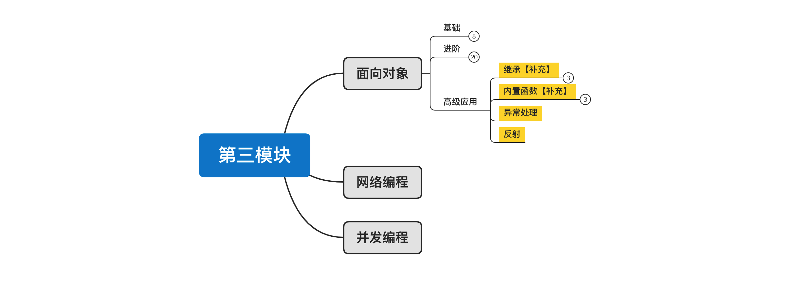
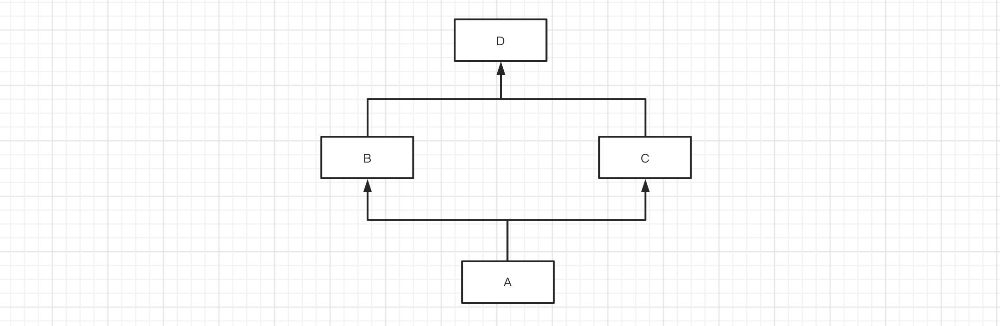
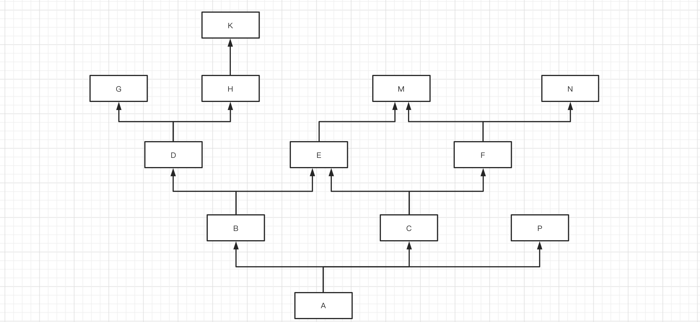
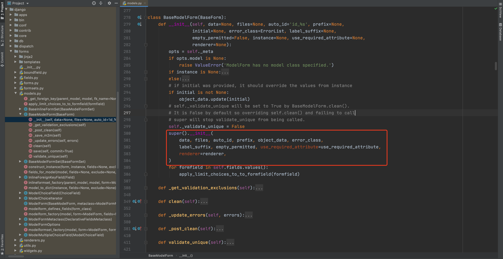
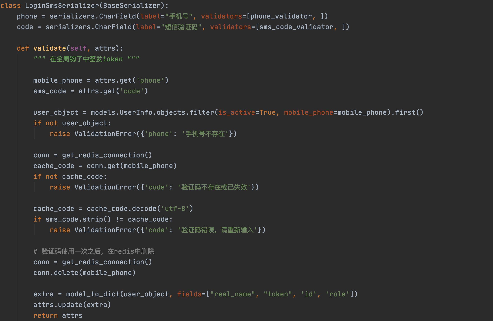

# day19 面向对象高级和应用



课程目标：掌握面向对象高级知识和相关应用。

今日概要

- 继承【补充】
- 内置函数【补充】
- 异常处理
- 反射


## 1. 继承【补充】

对于Python面向对象中的继承，我们已学过：

- 继承存在意义：将公共的方法提取到父类中，有利于增加代码重用性。

- 继承的编写方式：

  ```python
  # 继承
  class Base(object):
      pass
  
  class Foo(Base):
      pass
  ```

  ```python
  # 多继承
  class Base(object):
      pass
  
  class Bar(object):
      pass
  
  class Foo(Base,Bar):
      pass
  ```

- 调用类中的成员时，遵循：

  - 优先在自己所在类中找，没有的话则去父类中找。
  - 如果类存在多继承（多个父类），则先找左边再找右边。

上述的知识点掌握之后，其实就可以解决继承相关的大部分问题。

但如果遇到一些特殊情况（不常见），你就可能不知道怎么搞了，例如：








### 1.1 mro和c3算法

如果类中存在继承关系，在可以通过`mro()`获取当前类的继承关系（找成员的顺序）。


示例1：


```python
mro(A) = [A] + [B,C]
mro(A) = [A,B,C]
```

```python
mro(A) = [A] + merge( mro(B), mro(C), [B,C] )
mro(A) = [A] + merge( [object], [object], [] )
mro(A) = [A] + [B,C,object]
mro(A) = [A,B,C,object]
```

```python
mro(A) = [A] + merge( mro(B), mro(C), [B,C] )
mro(A) = [A] + merge( [], [C], [,C] 
mro(A) = [A] + [B,C]
```


```python
class C(object):
    pass

class B(object):
    pass

class A(B, C):
    pass

print( A.mro() )   # [<class '__main__.A'>, <class '__main__.B'>, <class '__main__.C'>, <class 'object'>]
print( A.__mro__ ) # (<class '__main__.A'>, <class '__main__.B'>, <class '__main__.C'>, <class 'object'>)
```


示例2：


```python
mro(A) = [A] + merge( mro(B), mro(C), [B,C] )
mro(A) = [A] + merge( [], [D], [] )
mro(A) = [A] + [B,C,D]
mro(A) = [A,B,C,D]
```


```python
class D(object):
    pass


class C(D):
    pass


class B(object):
    pass


class A(B, C):
    pass


print( A.mro() ) # [<class '__main__.A'>, <class '__main__.B'>, <class '__main__.C'>, <class '__main__.D'>, <class 'object'>]
```


示例3:


```python
mro(A) = [A] + merge( mro(B),mro(C),[B,C])
mro(A) = [A] + merge( [], [C], [C])
mro(A) = [A,B,D,C]
```


```python
class D(object):
    pass


class C(object):
    pass


class B(D):
    pass


class A(B, C):
    pass


print(A.mro()) # [<class '__main__.A'>, <class '__main__.B'>, <class '__main__.D'>, <class '__main__.C'>, <class 'object'>]
```


示例4：


```python
mro(A) = [A] + merge( mro(B), mro(C), [B,C])

mro(A) = [A] + merge( [B,D], [C,D], [B,C])

mro(A) = [A] + [B,C,D] 
mro(A) = [A,B,C,D] 
```

```python
class D(object):
    pass


class C(D):
    pass


class B(D):
    pass


class A(B, C):
    pass


print(A.mro()) # [<class '__main__.A'>, <class '__main__.B'>, <class '__main__.C'>, <class '__main__.D'>, <class 'object'>]
```


示例5：


```python
简写为：A -> B -> D -> G -> H -> K -> C -> E -> F -> M -> N -> P -> object
```


```
mro(A) = [A] + merge( mro(B),          mro(C),      mro(P),      [B,C,P])
                  []   [N]     [P]          [P]

mro(A) = [A,B,D,G,H,K,C,E,F,M,N,P]

-----------------------------------------------------
mro(B) = [B] + merge( mro(D), mro(E), [D,E])

mro(D) = [D] + merge(mro(G),mro(H), [G,H])

mro(G) = [G]

mro(H) = [H,K]

mro(B) = [B] + merge( [], [E,M], [E])
mro(B) = [B,D,G,H,K,E,M]


-----------------------------------------------------
mro(C) = [C] + merge(mro(E),mro(F),[E,F])

mro(E) = [E,M]

mro(F) = [F,M,N] 

mro(C) = [C] + merge([M],[M,N] ,[])
mro(C) = [C,E,F,M,N]
```

```python
class M:
    pass


class N:
    pass


class E(M):
    pass


class G:
    pass


class K:
    pass


class H(K):
    pass


class D(G, H):
    pass


class F(M, N):
    pass


class P:
    pass


class C(E, F):
    pass


class B(D, E):
    pass


class A(B, C, P):
    pass


print(A.mro()) # 简写为：A -> B -> D -> G -> H -> K -> C -> E -> F -> M -> N -> P -> object
```


**特别补充：一句话搞定继承关系**

不知道你是否发现，如果用正经的C3算法规则去分析一个类继承关系有点繁琐，尤其是遇到一个复杂的类也要分析很久。

所以，我自己根据经验总结了一句话赠送给大家：<span style="color:red">**从左到右，深度优先，大小钻石，留住顶端**</span>，基于这句话可以更快的找到继承关系。


```
简写为：A -> B -> D -> G -> H -> K -> C -> E -> F -> M -> N -> P -> object
```


### 1.2 py2和py3区别（了解）

概述：

- 在python2.2之前，只支持经典类【从左到右，深度优先，大小钻石，不留顶端】

- 后来，Python想让类默认继承object（其他语言的面向对象基本上也都是默认都继承object），此时发现原来的经典类不能直接集成集成这个功能，有Bug。

- 所以，Python决定不再原来的经典类上进行修改了，而是再创建一个新式类来支持这个功能。【从左到右，深度优先，大小钻石，留住顶端。】

  - 经典类，不继承object类型

    ```python
    class Foo:
        pass
    ```

  - 新式类，直接或间接继承object

    ```python
    class Base(object):
        pass
    
    class Foo(Base):
        pass
    ```

- 这样，python2.2之后 中就出现了经典类和新式类共存。（正式支持是2.3）

- 最终，python3中丢弃经典类，只保留新式类。


```
详细文档：https://www.python.org/dev/peps/pep-0253/#mro-method-resolution-order-the-lookup-rule

In classic Python, the rule is given by the following recursive function, also known as the left-to-right depth-first rule.

def classic_lookup(cls, name):
    if cls.__dict__.has_key(name):
        return cls.__dict__[name]
    for base in cls.__bases__:
        try:
            return classic_lookup(base, name)
        except AttributeError:
            pass
    raise AttributeError, name
    
The problem with this becomes apparent when we consider a "diamond diagram":

      class A:
        ^ ^  def save(self): ...
       /   \
      /     \
     /       \
    /         \
class B     class C:
    ^         ^  def save(self): ...
     \       /
      \     /
       \   /
        \ /
      class D
      

Arrows point from a subtype to its base type(s). This particular diagram means B and C derive from A, and D derives from B and C (and hence also, indirectly, from A).

Assume that C overrides the method save(), which is defined in the base A. (C.save() probably calls A.save() and then saves some of its own state.) B and D don't override save(). When we invoke save() on a D instance, which method is called? According to the classic lookup rule, A.save() is called, ignoring C.save()!

This is not good. It probably breaks C (its state doesn't get saved), defeating the whole purpose of inheriting from C in the first place.

Why was this not a problem in classic Python? Diamond diagrams are rarely found in classic Python class hierarchies. Most class hierarchies use single inheritance, and multiple inheritance is usually confined to mix-in classes. In fact, the problem shown here is probably the reason why multiple inheritance is unpopular in classic Python.

Why will this be a problem in the new system? The 'object' type at the top of the type hierarchy defines a number of methods that can usefully be extended by subtypes, for example __getattr__().

(Aside: in classic Python, the __getattr__() method is not really the implementation for the get-attribute operation; it is a hook that only gets invoked when an attribute cannot be found by normal means. This has often been cited as a shortcoming -- some class designs have a legitimate need for a __getattr__() method that gets called for all attribute references. But then of course this method has to be able to invoke the default implementation directly. The most natural way is to make the default implementation available as object.__getattr__(self, name).)

Thus, a classic class hierarchy like this:

class B     class C:
    ^         ^  def __getattr__(self, name): ...
     \       /
      \     /
       \   /
        \ /
      class D
      

will change into a diamond diagram under the new system:

      object:
        ^ ^  __getattr__()
       /   \
      /     \
     /       \
    /         \
class B     class C:
    ^         ^  def __getattr__(self, name): ...
     \       /
      \     /
       \   /
        \ /
      class D


and while in the original diagram C.__getattr__() is invoked, under the new system with the classic lookup rule, object.__getattr__() would be invoked!

Fortunately, there's a lookup rule that's better. It's a bit difficult to explain, but it does the right thing in the diamond diagram, and it is the same as the classic lookup rule when there are no diamonds in the inheritance graph (when it is a tree).


```


总结：Python2和Python3在关于面向对象的区别。

- Py2：

  - 经典类，未继承object类型。【从左到右，深度优先，大小钻石，不留顶端】

    ```python
    class Foo:
        pass
    ```

  - 新式类，直接获取间接继承object类型。【从左到右，深度优先，大小钻石，留住顶端 -- C3算法】

      ```python
    class Foo(object):
        pass
    ```

      或

      ```python
    class Base(object):
        pass
    
    class Foo(Base):
        pass
      ```

- Py3

  - 新式类，丢弃了经典类只保留了新式类。【从左到右，深度优先，大小钻石，留住顶端 -- C3算法】

    ```python
    class Foo:
        pass
    
    class Bar(object):
        pass
    ```

    

## 2. 内置函数补充

本次要给讲解的内置函数共8个，他们都跟面向对象的知识相关。


- classmethod、staticmethod、property 。

- callable，是否可在后面加括号执行。

  - 函数

    ```python
    def func():
        pass
    
    print( callable(func) ) # True
    ```

  - 类

    ```python
    class Foo(object):
        pass
    
    print( callable(Foo) ) # True
    ```

  - 类中具有`__call__`方法的对象

    ```python
    class Foo(object):
    	pass
    
    obj = Foo()
    print( callable(obj) ) # False
    ```

    ```python
    class Foo(object):
    
        def __call__(self, *args, **kwargs):
            pass
        
    obj = Foo()
    print( callable(obj) ) # False
    ```

  所以当你以后在见到下面的情况时，首先就要想到handler可以是：函数、类、具有call方法的对象 这三种，到底具体是什么，需要根据代码的调用关系才能分析出来。

  ```python
  def do_something(handler):
      handler()
  ```

- super，按照mro继承关系向上找成员。

  ```python
  class Base(object):
  
      def message(self, num):
          print("Base.message", num)
  
  
  class Foo(Base):
  
      def message(self, num):
          print("Foo.message", num)
          super().message(num + 100)
  
  
  obj = Foo()
  obj.message(1)
  
  >>> Foo.message 1
  >>> Base.message 101
  ```

  ```python
  class Base(object):
  
      def message(self, num):
          print("Base.message", num)
          super().message(1000)
  
  
  class Bar(object):
  
      def message(self, num):
          print("Bar.message", num)
  
  
  class Foo(Base, Bar):
      pass
  
  
  obj = Foo()
  obj.message(1)
  
  >>> Base.message 1
  >>> Bar.message 1000
  ```

  

  **应用场景**

  假设有一个类，他原来已实现了某些功能，但我们想在他的基础上再扩展点功能，重新写一遍？比较麻烦，此时可以用super。

  - 示例一

    ```python
    class Message(object):
        def send_wechat(self,vid):
            print("发送微信...")
        
    class LogMessageClass(Message):
        
        def send_wechat(self,vid):
            with open('log.txt',mode='a',encoding="utf-8") as f:
                f.write(vid)
    		super().send_wechat(vid)
    
    obj = LogMessageClass()
    obj.send_wechat()
    ```

  - 示例二

    ```python
    class BaseForm(object):
        def __init__(self,data,files,auto_id,prefix,....):
            self.data = data
            ....
            
    	def valid(self):
            pass
        
    
    class MyBaseForm(BaseForm):
        def __init__(self,req,*args,**kwargs):
            super().__init__(*args,**kwargs)
            self.req = req
            
    ```

    

  

  

- type，获取一个对象的类型。

  ```python
  v1 = "武沛齐"
  result = type(v1)
  print(result) # <class 'str'>
  ```

  ```python
  v2 = "武沛齐"
  print(v2)
  print(type(v2) == str)  # True
  
  v3 = [11, 22, 33]
  print(type(v3) == list)  # True
  ```

  ```python
  class Foo(object):
      pass
  
  v4 = Foo()
  print(type(v4) == Foo)  # True
  ```

- isinstance，判断对象是否是某个类或其子类的实例。

  ```python
  class Top(object):
      pass
  
  
  class Base(Top):
      pass
  
  
  class Foo(Base):
      pass
  
  
  v1 = Foo()
  print(isinstance(v1, Foo))   # True，对象v1是Foo类的实例
  print(isinstance(v1, Base))  # True，对象v1的Base子类的实例。
  print(isinstance(v1, Top))   # True，对象v1的Top子类的实例。
  ```

  ```python
  from collections import OrderedDict
  
  v2 = OrderedDict({"name": "武沛齐", "age": 18})
  
  print(isinstance(v2, OrderedDict)) # True
  print(isinstance(v2, dict))        # True
  print(isinstance(v2, object))      # True
  ```

- issubclass，判断类是否是某个类的子孙类。

  ```python
  class Top(object):
      pass
  
  
  class Base(Top):
      pass
  
  
  class Foo(Base):
      pass
  
  
  print(issubclass(Foo, Base))  # True
  print(issubclass(Foo, Top))   # True
  ```

  


## 3.异常处理

在程序中如果遇到一些 `不可预知` 的错误，可以选择用异常处理来做。

```python
import requests

while True:
    url = input("请输入要下载网页地址：")
    res = requests.get(url=url)
    with open('content.txt', mode='wb') as f:
        f.write(res.content)
```

上述下载视频的代码在正常情况下可以运行，但如果遇到网络出问题，那么此时程序就会报错无法正常执行。

```python
import requests

while True:
    url = input("请输入要下载网页地址：")
    
    try:
        res = requests.get(url=url)
    except Exception as e:
        print("请求失败，原因：{}".format(str(e)))
        continue
        
    with open('content.txt', mode='wb') as f:
        f.write(res.content)
```


异常处理的基本格式：

```python
try:
    # 逻辑代码
except Exception as e:
    # try中的代码如果有异常，则此代码块中的代码会执行。
```

```python
try:
    # 逻辑代码
except Exception as e:
    # try中的代码如果有异常，则此代码块中的代码会执行。
finally:
    # try中的代码无论是否报错，finally中的代码都会执行，一般用于释放资源。


"""
try:
    file_object = open("xxx.log")
    # ...
except Exception as e:
    # 异常处理
finally:
    file_object.close()  # try中没异常，最后执行finally关闭文件；try有异常，执行except中的逻辑，最后再执行finally关闭文件。
"""    
```


### 3.1 异常细分

如果想要对错误进行更新的处理，例如：发生Key错误和发生Value错误分开处理。

```python
try:
    # 逻辑代码
    pass

except KeyError as e:
    # 小兵，只捕获try代码中发现了键不存在的异常，例如：去字典 info_dict["n1"] 中获取数据时，键不存在。
    print("KeyError")

except ValueError as e:
    # 小兵，只捕获try代码中发现了值相关错误，例如：把字符串转整型 int("无诶器")
    print("ValueError")

except Exception as e:
    # 王者，处理上面except捕获不了的错误（可以捕获所有的错误）。
    print("Exception")
```

Python中内置了很多细分的错误，供你选择。

```python
常见异常：
"""
AttributeError 试图访问一个对象没有的树形，比如foo.x，但是foo没有属性x
IOError 输入/输出异常；基本上是无法打开文件
ImportError 无法引入模块或包；基本上是路径问题或名称错误
IndentationError 语法错误（的子类） ；代码没有正确对齐
IndexError 下标索引超出序列边界，比如当x只有三个元素，却试图访问x[5]
KeyError 试图访问字典里不存在的键
KeyboardInterrupt Ctrl+C被按下
NameError 使用一个还未被赋予对象的变量
SyntaxError Python代码非法，代码不能编译(个人认为这是语法错误，写错了）
TypeError 传入对象类型与要求的不符合
UnboundLocalError 试图访问一个还未被设置的局部变量，基本上是由于另有一个同名的全局变量，
导致你以为正在访问它
ValueError 传入一个调用者不期望的值，即使值的类型是正确的
"""
更多异常：
"""
ArithmeticError
AssertionError
AttributeError
BaseException
BufferError
BytesWarning
DeprecationWarning
EnvironmentError
EOFError
Exception
FloatingPointError
FutureWarning
GeneratorExit
ImportError
ImportWarning
IndentationError
IndexError
IOError
KeyboardInterrupt
KeyError
LookupError
MemoryError
NameError
NotImplementedError
OSError
OverflowError
PendingDeprecationWarning
ReferenceError
RuntimeError
RuntimeWarning
StandardError
StopIteration
SyntaxError
SyntaxWarning
SystemError
SystemExit
TabError
TypeError
UnboundLocalError
UnicodeDecodeError
UnicodeEncodeError
UnicodeError
UnicodeTranslateError
UnicodeWarning
UserWarning
ValueError
Warning
ZeroDivisionError
"""
```


### 3.2 自定义异常&抛出异常

上面都是Python内置的异常，只有遇到特定的错误之后才会抛出相应的异常。

其实，在开发中也可以自定义异常。

```python
class MyException(Exception):
    pass
```

```python
try:
    pass
except MyException as e:
    print("MyException异常被触发了", e)
except Exception as e:
    print("Exception", e)
```

上述代码在except中定义了捕获MyException异常，但他永远不会被触发。因为默认的那些异常都有特定的触发条件，例如：索引不存在、键不存在会触发IndexError和KeyError异常。

对于我们自定义的异常，如果想要触发，则需要使用：`raise MyException()`类实现。

```python
class MyException(Exception):
    pass


try:
    raise MyException()
except MyException as e:
    print("MyException异常被触发了", e)
except Exception as e:
    print("Exception", e)
```

```python
class MyException(Exception):
    def __init__(self, msg, *args, **kwargs):
        super().__init__(*args, **kwargs)
        self.msg = msg


try:
    raise MyException("xxx失败了")
except MyException as e:
    print("MyException异常被触发了", e.msg)
except Exception as e:
    print("Exception", e)
```

```python
class MyException(Exception):
    title = "请求错误"


try:
    raise MyException()
except MyException as e:
    print("MyException异常被触发了", e.title)
except Exception as e:
    print("Exception", e)
```


**案例一**：你我合作协同开发，你调用我写的方法。

- 我定义了一个函数

  ```python
  class EmailValidError(Exception):
      title = "邮箱格式错误"
  
  class ContentRequiredError(Exception):
      title = "邮箱格式错误"
      
  def send_email(email,content):
      if not re.match("\w+@live.com",email):
          raise EmailValidError()
  	if len(content) == 0 :
          raise ContentRequiredError()
  	# 发送邮件代码...
  ```

- 你调用我写的函数

  ```python
  def execute():
      # 其他代码
      # ...
      
  	try:
          send_email(...)
      except EmailValidError as e:
          pass
      except ContentRequiredError as e:
          pass
      except Exception as e:
          print("发送失败")
  
  execute()
  
  # 提示：如果想要写的简单一点，其实只写一个Exception捕获错误就可以了。
  ```

  

**案例二**：在框架内部已经定义好，遇到什么样的错误都会触发不同的异常。

```python
import requests
from requests import exceptions

while True:
    url = input("请输入要下载网页地址：")
    try:
        res = requests.get(url=url)
        print(res)    
    except exceptions.MissingSchema as e:
        print("URL架构不存在")
    except exceptions.InvalidSchema as e:
        print("URL架构错误")
    except exceptions.InvalidURL as e:
        print("URL地址格式错误")
    except exceptions.ConnectionError as e:
        print("网络连接错误")
    except Exception as e:
        print("代码出现错误", e)
        
# 提示：如果想要写的简单一点，其实只写一个Exception捕获错误就可以了。
```


**案例三**：按照规定去触发指定的异常，每种异常都具备被特殊的含义。




### 3.4 特殊的finally

当在函数或方法中定义异常处理的代码时，要特别注意finally和return。

```python
def func():
    try:
        return 123
    except Exception as e:
        pass
    finally:
        print(666)
        
func()
```

在try或except中即使定义了return，也会执行最后的finally块中的代码。


