- 路由器
- 交换机
- IP
- 子网掩码
- DHCP
- 网管DNS
- ARP协议


网线，8根铜丝（电信号：高低电平）。

网卡，二进制和电信号相互转化。（调至，二进制->高低电平；解调，高低电平->二进制）

1Gbps，接收和发送消息的效率。 每秒/1GB


路由器300M、200M是什么意思？  /8=实际下载速度。


直接全部

网络引入：

- 两个人连接，直接网线连接。
- N个人连接，交换机。通过交换机进行数据转发（广播的方式）。


一个网络中主机太多，广播风暴。

- 广播的好处
- 广播的不好

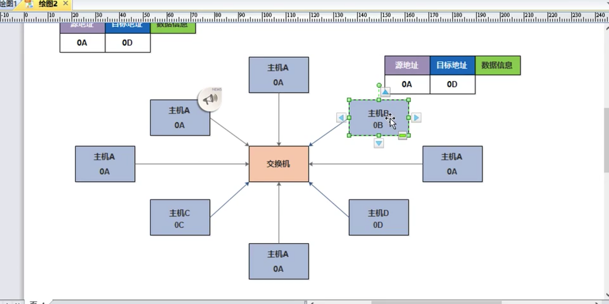


路由器，实现不同网络之间的主机通讯。

- 地址表示：IP地址可以随意改动。
  - 01 网络地址部分
  - 02 主机地址部分


设备：

- 路由器
- 交换机，有很多口。

概念：

	- mac地址
	- IP
	- 掩码
	- 网管
	- DHCP


思科模拟器，路由配置

```python
直连路由
静态路由
动态路由（不需要知道吓一跳的地址）
```

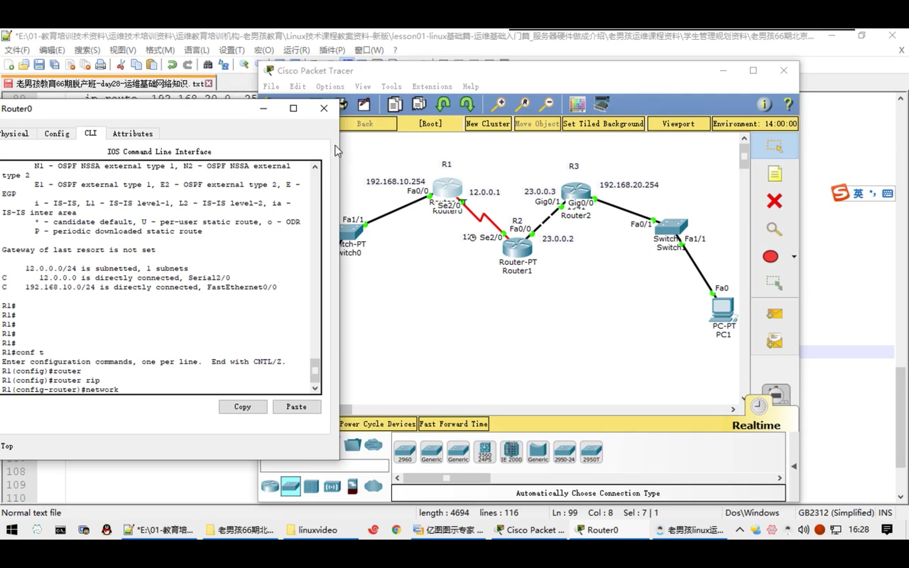

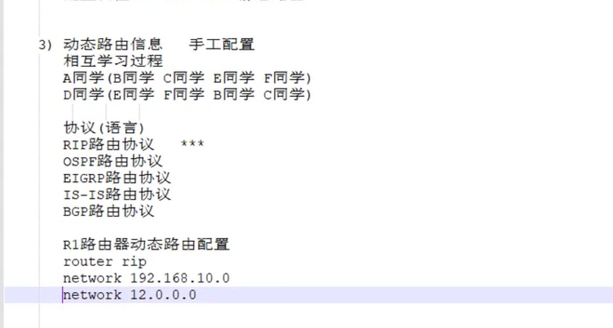


静态默认路由

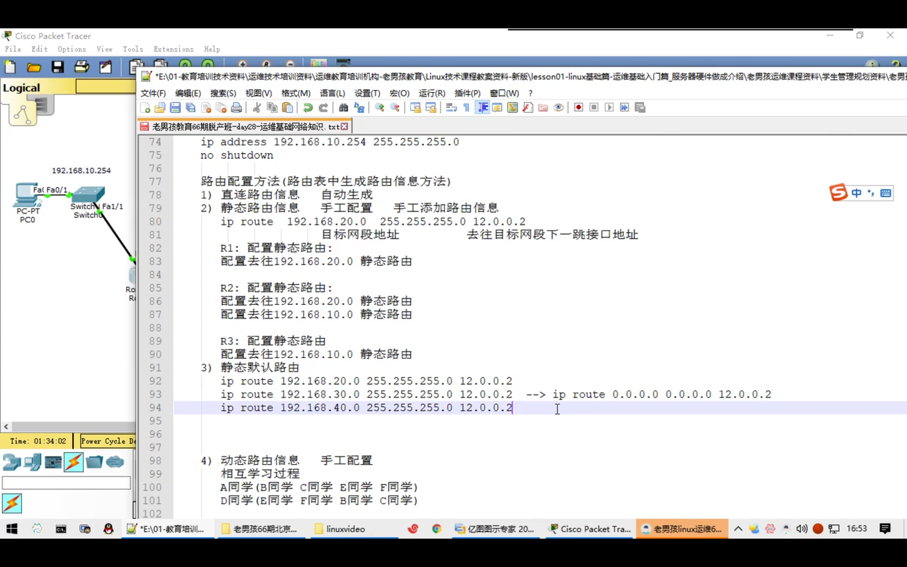


- 直连路由

  ```
  System Bootstrap, Version 12.1(3r)T2, RELEASE SOFTWARE (fc1)
  Copyright (c) 2000 by cisco Systems, Inc.
  PT 1001 (PTSC2005) processor (revision 0x200) with 60416K/5120K bytes of memory
  
  Readonly ROMMON initialized
  
  Self decompressing the image :
  ########################################################################## [OK]
  
                Restricted Rights Legend
  
  Use, duplication, or disclosure by the Government is
  subject to restrictions as set forth in subparagraph
  (c) of the Commercial Computer Software - Restricted
  Rights clause at FAR sec. 52.227-19 and subparagraph
  (c) (1) (ii) of the Rights in Technical Data and Computer
  Software clause at DFARS sec. 252.227-7013.
  
             cisco Systems, Inc.
             170 West Tasman Drive
             San Jose, California 95134-1706
  
  
  
  Cisco Internetwork Operating System Software
  IOS (tm) PT1000 Software (PT1000-I-M), Version 12.2(28), RELEASE SOFTWARE (fc5)
  Technical Support: http://www.cisco.com/techsupport
  Copyright (c) 1986-2005 by cisco Systems, Inc.
  Compiled Wed 27-Apr-04 19:01 by miwang
  
  PT 1001 (PTSC2005) processor (revision 0x200) with 60416K/5120K bytes of memory
  .
  Processor board ID PT0123 (0123)
  PT2005 processor: part number 0, mask 01
  Bridging software.
  X.25 software, Version 3.0.0.
  4 FastEthernet/IEEE 802.3 interface(s)
  2 Low-speed serial(sync/async) network interface(s)
  32K bytes of non-volatile configuration memory.
  63488K bytes of ATA CompactFlash (Read/Write)
  
  
           --- System Configuration Dialog ---
  
  Would you like to enter the initial configuration dialog? [yes/no]: no
  
  
  Press RETURN to get started!
  
  
  
  Router>con
  Router>conf
  Router>conf t
  Router>conf t
              ^
  % Invalid input detected at '^' marker.
  	
  Router>conf t
              ^
  % Invalid input detected at '^' marker.
  	
  Router>config
  Router>config
  Router>config
  Router>config
  Router>config
  Router>confi
  Router>confi
  Router>confi
  Router>confi
  Router>conf t
              ^
  % Invalid input detected at '^' marker.
  	
  Router>en
  Router#conf t
  Enter configuration commands, one per line.  End with CNTL/Z.
  Router(config)#int f0/0
  Router(config-if)#ip add 192.168.10.254 255.255.255.0 
  Router(config-if)#no shut
  
  Router(config-if)#
  %LINK-5-CHANGED: Interface FastEthernet0/0, changed state to up
  
  %LINEPROTO-5-UPDOWN: Line protocol on Interface FastEthernet0/0, changed state to up
  
  Router(config-if)#
  Router(config-if)#
  Router(config-if)#
  Router(config-if)#
  Router(config-if)#^Z
  Router#
  %SYS-5-CONFIG_I: Configured from console by console
  
  Router#ip route
            ^
  % Invalid input detected at '^' marker.
  	
  Router#show ip rout
  Codes: C - connected, S - static, I - IGRP, R - RIP, M - mobile, B - BGP
         D - EIGRP, EX - EIGRP external, O - OSPF, IA - OSPF inter area
         N1 - OSPF NSSA external type 1, N2 - OSPF NSSA external type 2
         E1 - OSPF external type 1, E2 - OSPF external type 2, E - EGP
         i - IS-IS, L1 - IS-IS level-1, L2 - IS-IS level-2, ia - IS-IS inter area
         * - candidate default, U - per-user static route, o - ODR
         P - periodic downloaded static route
  
  Gateway of last resort is not set
  
  C    192.168.10.0/24 is directly connected, FastEthernet0/0
  
  Router#
  ```

  

吓一跳地址：

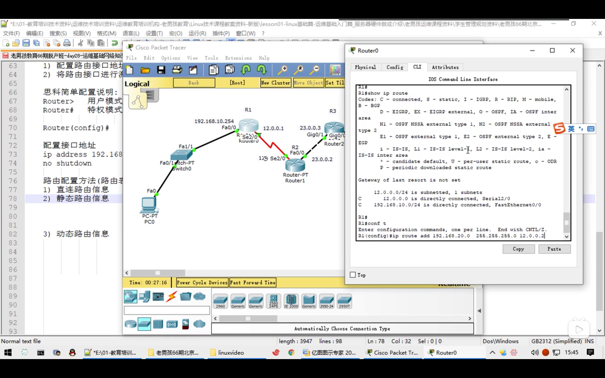


### 4.网络拓扑

- 核心层（路由器 防火墙），和互联网对接，实现内网主机可以访问外网。
- 汇聚层（3层交换机），将主机访问流量进行汇聚，对汇聚数据流量进行监控管理。
- 接入层（2层交换机），和终端主机进行连接。

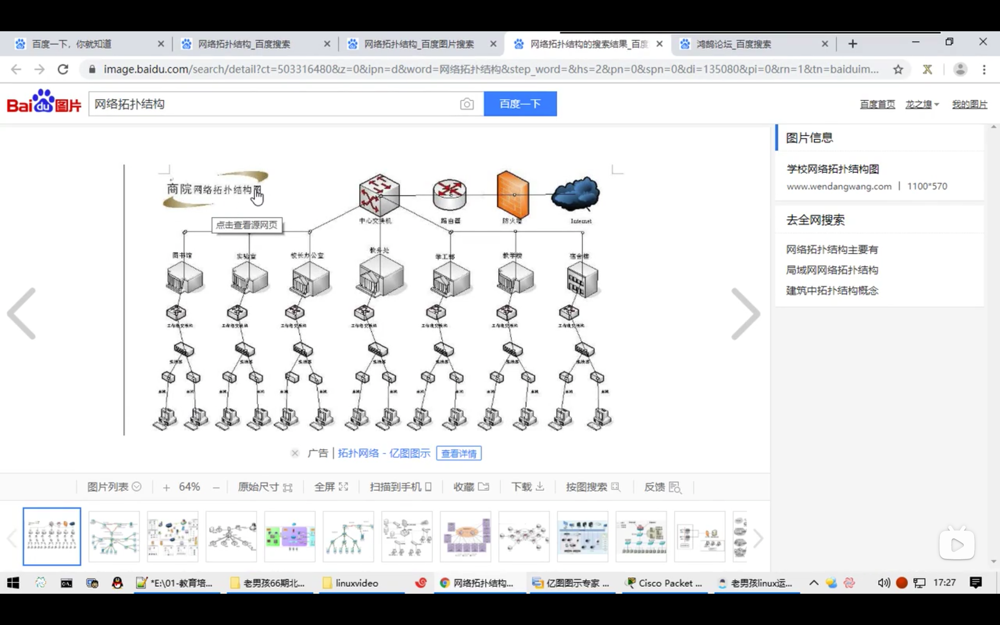


### 5.网络分层模型

osi7层模型：

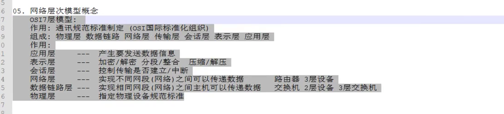


### 6.DHCP

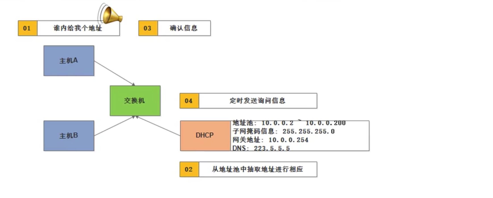

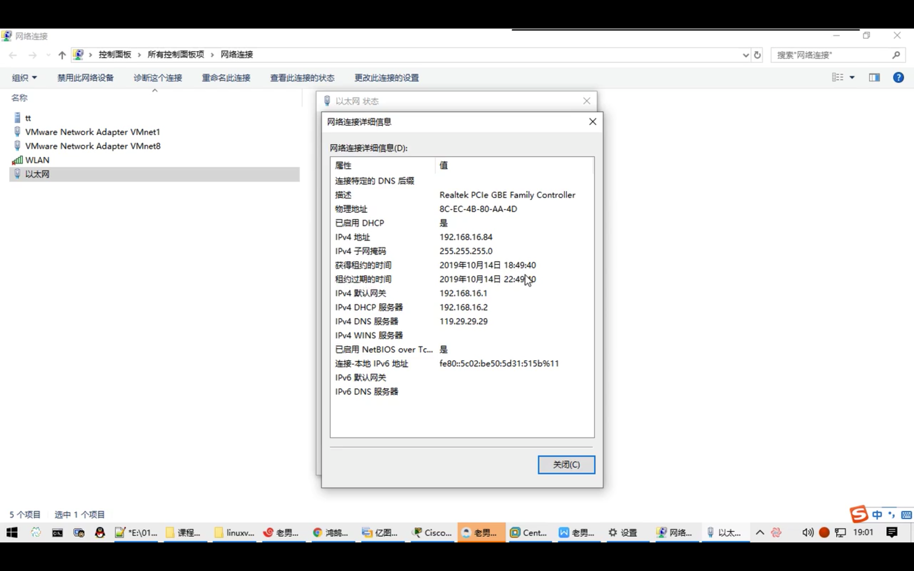


 


### 7.DNS


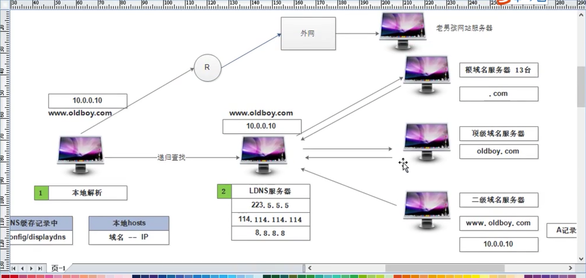


### 8.ARP协议

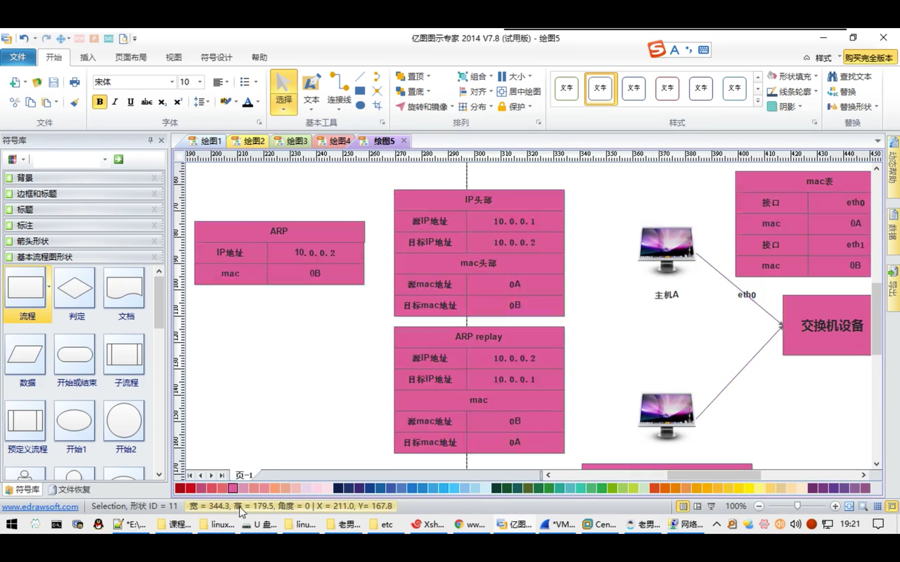


### 9.IP协议


## 2.网络编程


