# day20 网络编程


课程目标：掌握网络相关的基础知识并可以基于Python开发程序（基于网络进行数据传输）。

课程概要：

- 网络必备基础
- 网络编程（Python代码）
- B/S和C/S架构


## 1.必备基础

你必须了解的网络相关设备和基础概念。

### 1.1 网络架构


假设 **alex** 上了一个野鸡大学买了一台电脑，电脑里存了1部小电影，整宿整宿的在宿舍反复的看。


**alex** 如何想要和室友 **于超** 进行收发数据，可以通过一根网线来进行连接，并进行数据的传输。


#### 1.1.1 交换机

其他2位室友如何也想和他们的电脑相互连接然后进行资源的共享，此时就需要一个设备 【二层交换机】组件一个局域网。

```python
当电脑接入交换机之后，我们需要为每台电脑分配一个IP，例如：
    - 电脑1：192.168.10.1
    - 电脑2：192.168.10.2
    - 电脑3：192.168.10.3
    - 电脑4：192.168.10.4
```

```
局域网内容个电脑之间是基于ARP协议来进行通信，例如：A电脑向 IP为192.168.10.3的另一个电脑发送消息。

第一步：A封装数据包，此时只知道目标IP不知道目标mac地址（未知mac地址时默认会设置为FF）。
第二步：将数据包发送到交换机，交换机通过广播的形式将数据发送给所有电脑。
第三步：目标电脑接收到数据包后，监测自己是否是目标IP。
		- 是，收到数据并回复。
		- 不是，则丢弃包。

为防止每次发送消息都是广播形式，每台电脑的内部都为维护了一个ARP表，接受到数据时（无论是否自己的）都会记录自己了解的IP和MAC的对应关系，例如：
    Internet地址			       物理地址
    192.168.10.1            14-9d-da-2a-dd-0a
    192.168.10.3            14-9d-da-2a-dd-0c
    ...
    
以便于下次在发送消息时，就知道了目标的mac地址，直接让交换机转发给指定的电脑（单播）。

同时，当有消息发送经过二层交换机时他的内容也会维护记录了交换机接口和连接的电脑的mac地址的对应关系，例如：
    接口（网卡）               mac地址
      接口1              14-9d-da-2a-dd-0A
      接口2              14-9d-da-2a-dd-0B
      接口3              14-9d-da-2a-dd-0C
      ...
这样一来，交换机在进行数据转发时，效率就更高了。

注意：每台电脑出厂时在网卡中都设置了唯一的mac地址（不重复），网卡集成在主板上，如果更换了主板则mac地址也会变更。
```

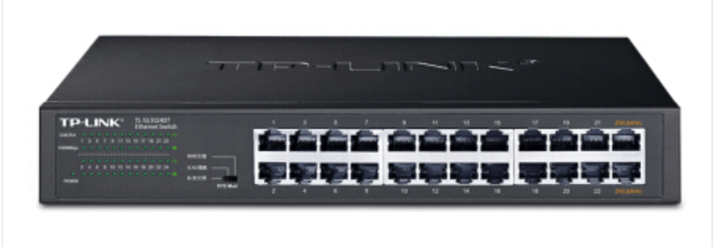


```
头部信息：xxx
数据：你好
```

```
头部信息：xxx
数据：收到
```


#### 1.1.2 路由器

多个宿舍之间想想要组建一个相互可以通信网络，此时需要【二层交换机】和【企业路由器】配合组建稍微大一点的局域网（同时也可缓解广播风暴）。

```
划分好网络结构之后，其实会给各宿舍的电脑分配IP和网关，例如：
   宿舍A：
		- 电脑1：192.168.10.1  网关：192.168.10.254
		- 电脑2：192.168.10.2  网关：192.168.10.254
		- 电脑3：192.168.10.3  网关：192.168.10.254
		- 电脑4：192.168.10.4  网关：192.168.10.254
   宿舍B
		- 电脑1：192.168.20.1  网关：192.168.20.254
		- 电脑2：192.168.20.2  网关：192.168.20.254
		- 电脑3：192.168.20.3  网关：192.168.20.254
		- 电脑4：192.168.20.4  网关：192.168.20.254

然后再在路由器中配置路由表（包含网段和路由器上的接口的对应关系），例如：
	 接口             IP
     eth0   	  192.168.10.254（192.168.10网段）
     eth1   	  192.168.20.254（192.168.20网段）
    
想与外部网络通信，需要配置网关，网关就是路由表中配置的指向此网段的IP。其实就类似于贸易出口都需要经过海关。
```

```python
数据通信的过程结合了APR协议和IP协议，例如：宿舍A的电脑1向宿舍B的电脑3发送消息（目标IP：192.168.20.3）。

简化过程：
	- 宿舍A的电脑1，通过广播或单播将数据发送到网管（路由器）
    - 路由器接收到数据之后，再通过对应的接口把数据通过广播的形式发送到宿舍B。
注意：各自局域网内通过学习并记录相关mac地址后，就可以不再使用广播形式，而是使用单播来发送消息了。
```


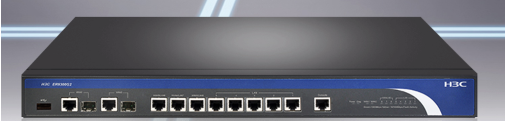

#### 1.1.3 三层交换机

三层交换机集成了 交换机 & 路由器的功能（大部分路由器功能），上述的三个设备其实可以用一个三层交换机就可以搞定。

```python
按照下图，在三层交换机上分别做如下几件事：

1. 划分两个vlan，模拟出来路由器的两个接口。
2. 将交换机的接口划分给指定的vlan，例如：
	接口1、2、3划分给一个vlan，相当于交换机连接上了路由器。
    接口4、5、6划分给一个vlan，相当于交换机连接上了路由器。
3. 电脑连接上交换机。
4. 进行相应的配置。
	宿舍A（左边）电脑配置：
    	- 电脑1：192.168.10.1  网关：192.168.10.254	对应交换机接口：1
		- 电脑2：192.168.10.2  网关：192.168.10.254	对应交换机接口：2
		- 电脑3：192.168.10.3  网关：192.168.10.254	对应交换机接口：3
	宿舍B（右边）电脑配置：
		- 电脑1：192.168.20.1  网关：192.168.20.254	对应交换机接口：4
		- 电脑2：192.168.20.2  网关：192.168.20.254	对应交换机接口：5
		- 电脑3：192.168.20.3  网关：192.168.20.254	对应交换机接口：6
	
    交换机中的路由配置：
    	  接口               IP
         左vlan   	  192.168.10.254（192.168.10网段）
         右vlan   	  192.168.20.254（192.168.20网段）
        
通过上述的配置之后，就可以实现宿舍A和宿舍B的网络通信了。
```


#### 1.1.4 小型企业基础网络架构

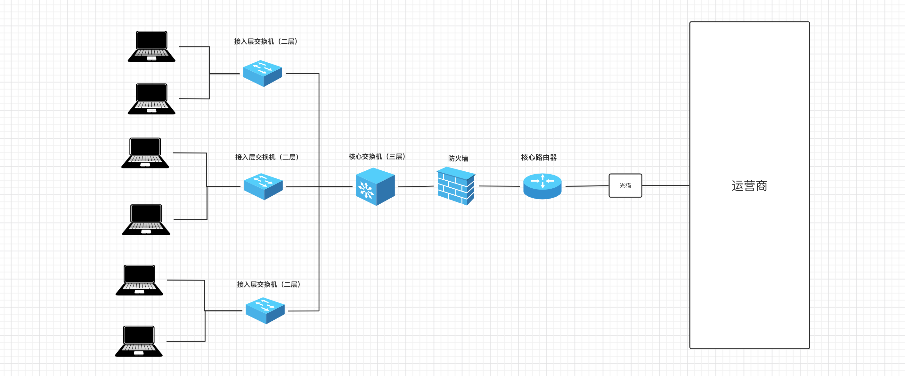


#### 1.1.5 家庭网络架构

家用路由器集成了是交换机和路由的功能（性能差、价格便宜）。


#### 1.1.6 互联网


### 1.2 网络核心词汇


#### 1.2.1 子网掩码和IP


之前说过，接入网络设备后，需要一个IP来代指次电脑，例如：192.168.10.1 。


IP其是一个32位的二进制，为了便于记忆就将它分为4组，每组8位，由小数点分开，例如：

```
二进制表示：00000000.10010111.11111111.00001111
十进制表示：251.151.255.15

0~255
192.178.11.211
192.178.11.311
```

在网络中的每台电脑都会有一个IP与之绑定，这样通过IP就可以找到相应的电脑。


一个IP地址可以划分为两个部分，即：网络地址 + 主机地址。

- 问题1：如何确定网络地址和主机地址呢？

  ```
  通过子网掩码就可以确定IP的网络地址和主机地址。
  
  示例1：
      	IP：192.168.1.199      11000000.10101000.00000001.11000111
  	子网掩码：255.255.255.0     11111111.11111111.11111111.00000000
  此时，网络地址就是前24位 + 主机地址是后8位。你可能见过有些IP这样写 192.168.1.199/24，意思也是前24位是网络地址。
  
  
  示例2：
      	IP：192.168.99.254     11000000.10101000.01100011.11111110
  	子网掩码：255.255.240.0     11111111.11111111.11111100.00000000
  此时，网络地址就是前22位 + 主机地址是后10位。你可能见过有些IP这样写 192.168.99.254/22，意思也是前22位是网络地址。
  ```

- 问题2：划分 网络地址 + 主机地址 的意义是什么？

  ```
  网络地址相同的IP，也称为属于同一个网段。
  在局域网内只有同一个网段的IP才能相互通信，不同网段IP想要通信需要借助路由的转发才能通信。
  
  当了解子网掩码之后，其实就可以确定某个网段可以容纳的主机个数，例如：
  【IP: 192.168.10.2  掩码：255.255.255.0】 和 【192.168.10.251 掩码：255.255.255.0】 数据同一个网段。
  
  	示例网段的主机范围：11000000.10101000.00001010. 00000001  ~  11000000.10101000.00001010.  11111110
  	                 --------------------------              --------------------------
  	                          网络地址                                   网络地址
  				           192.168.10.1                 ~           192.168.10.254
                             
  【IP: 192.168.8.1  掩码：255.255.240.0】 和 【192.168.11.254 掩码：255.255.240.0】 数据同一个网段。
  	子网掩码：255.255.240.0
  	示例网段的主机范围：11000000.10101000.000010 00.00000001  ~  11000000.10101000.000010 11.11111110
  	                 11111111.11111111.111111 00.00000000
  	                 ------------------------                 ------------------------
  	                          网络地址                                   网络地址
  				           192.168.8.1                 ~           192.168.11.254
  				           
  【IP: 192.168.96.1  掩码：255.255.240.0】 和 【192.168.99.254  掩码：255.255.240.0】 数据同一个网段。
  	示例网段的主机范围：11000000.10101000.011000 00.00000001  ~  11000000.10101000.011000 11.11111110
  	         
  	                 ------------------------                 ------------------------
  	                          网络地址                                   网络地址
  				           192.168.96.1                 ~           192.168.99.254    
  ```

  
  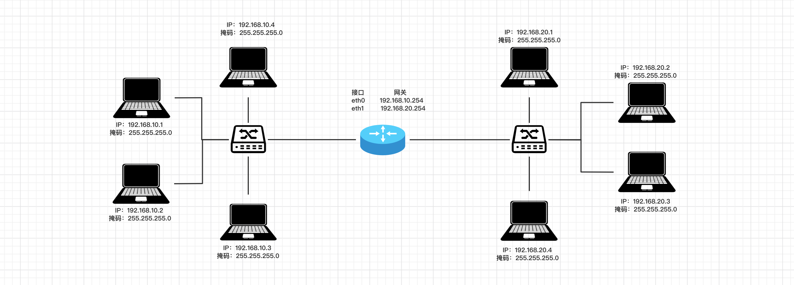


#### 1.2.2 DHCP

在一个局域网内想要给某台电脑分配IP有两种方式：

- 手动设置，打开指定菜单栏在里面输入相应的IP信息。

- 自动获取

  ```python
  - 在电脑端，IP地址获取方式设置为自动。
  - 在路由器或三层交换机，开启DHCP服务，并设置IP地址池。（家用路由器上也是基于DHCP服务自动分配的IP）
  
  这样，电脑只要连接只该网络，DHCP服务就会为它自动分配IP、子网掩码、网关。
  ```


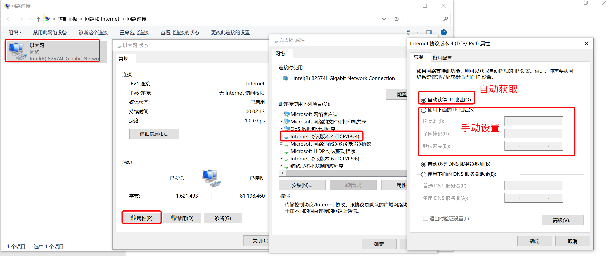


#### 1.2.3 内网和公网IP

```
一般情况下，内网IP都用这些（潜规则）：
	- 10.0.0.0 到 10.255.255.255
	- 172.16.0.0 到172.31.255.255
	- 192.168.0.0 到192.168.255.255
```

之前我们自己在一个局域网内为电脑分配的IP都称为`内网IP`，基于内网IP可以在一个局域网内进行相互通信（也需要相关的配置）。

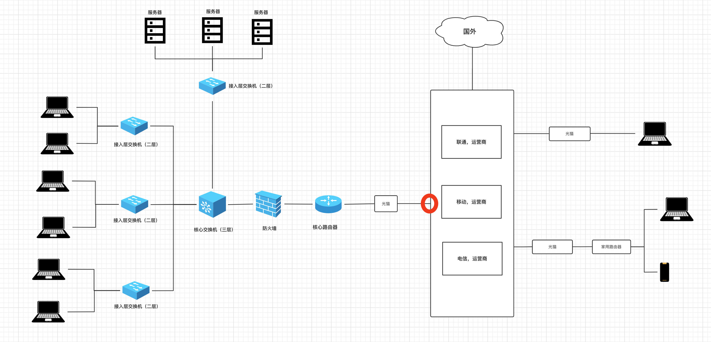


如果想要通过互联网进行通信，就必须借助公网IP。例如，右边家庭电脑想访问左边某公司服务器上的部署的网站：

- 第一步：左边公司，去运营商申请公网的固定IP（办理专线宽带时运营商会分配至少1个固定的IP地址），其实运营商就是将你拉的这个专线和固定IP创建绑定关系。（假设公网IP：123.206.15.88）
- 第二步：配置公网IP与指定服务器的转发规则。
- 第二步：右边家庭，如果想要访问某个公司服务器上的网网站，只需要执行指定IP：123.206.15.88，运营商就会根据IP找到与之关联的公司专线，并通过公司路由器、防火墙等设备找到指定的服务器。


按理说，每个从运营商接入网的用户都可以有一个外网IP，但由于全球用户太多而IP根本就不够分配，所以，运营商网络会进行划分，让多个家庭宽带用户共用一个公网IP（动态，可能每次上网公网IP都不一样）。

让家庭用户想要通过网络访问访问其他IP时，先发给运营商由运营商向外转发到其他IP。

注意：外部用户想要访问家庭宽带的IP时，运营商不会把请求转发到我们的电脑。

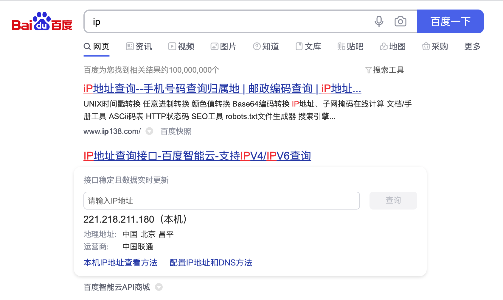


所以，以后如果你想开发一个网站供全球的用户访问，那你就需要做以下几件事：

- 拉专线，申请固定公网IP
- 买一台服务器（就是性能好的电脑）
- 公网IP绑定至此服务器
- 将写好的代码放在服务器上并运行起来

这样就可以搞定了...


**扩展**：IPv4和IPv6

```python
IPv4，长度为 32 位（4 个字节）， 格式：A.B.C.D
IPv6，长度为 128 位（16 个字节），用":"分成8段，格式：XXXX:XXXX:XXXX:XXXX:XXXX:XXXX:XXXX:XXXX（每个X是一个16进制数）。
```


#### 1.2.4 云服务器


大家可能之前听说过：阿里云、腾讯云、亚马逊aws等之类的平台都在搞云服务器，那是个啥？

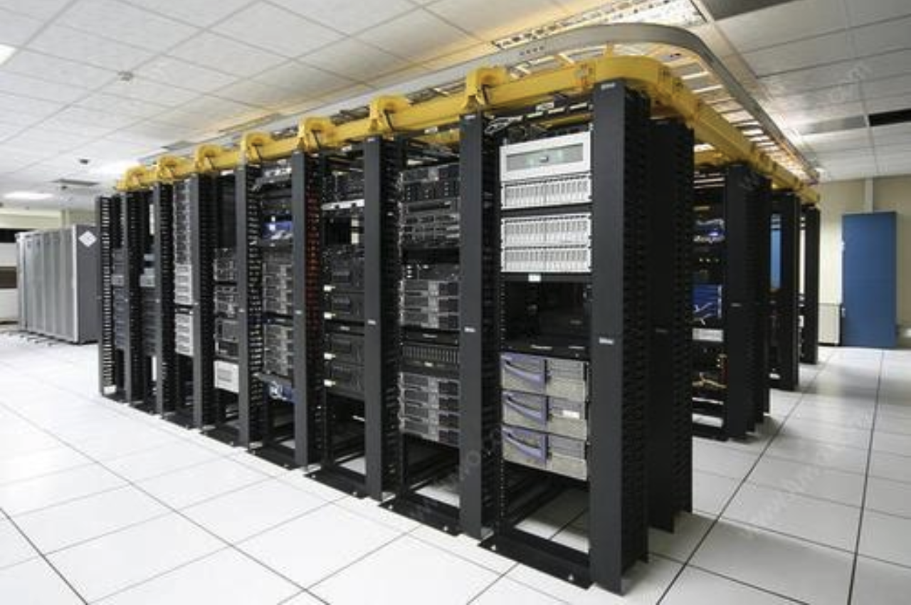


简单的说：他们造了一个机房（网吧），买了很多很多的服务器（高性能电脑），然后将他们放在机房，然后通电+通网，主要对外去租赁这些服务器资源，让用户不必再自己  拉专线+配置网络+买服务器。


假设，你想要在腾讯云租一台服务器，就可以根据自己的需求去选择配置，腾讯云会根据配置在他的物理机上虚拟出一个服务器，并进行相应的环境初始化并绑定公网固定IP，这样你就可以快速拥有一台可以被大家访问的服务器了。

注意：一台性能非常高的物理机虚拟出很多虚拟机，类似于你在自己电脑上通过vmware、parallel等搞出多个虚拟机。


#### 1.2.5 端口


假设，你在腾讯租了一台云服务器（外网IP:123.206.15.88），然后又开发了 2 个网站运行在服务器上。

那么问题来了，用户在自己的电脑或手机上如何来分别访问同一台服务器上两个程序呢？

其实，在计算机中有一个 `端口` 的概念，每个程序想要通过网络进行通讯都必须要指定一个端口，例如：

- 网站A：使用8001端口，那么用户在自己电脑上或手机上访问时指定 IP和端口 即可，如： `123.206.15.88:8001` 
- 网站B：使用8002端口，那么用户在自己电脑上或手机上访问时指定 IP和端口 即可，如： `123.206.15.88:8002` 

注意：端口的取值范围：0 ~ 65535，很多端口在计算机的内部已被使用，我们平时自定义时尽量选择5000之后的端口。


示例：访问百度

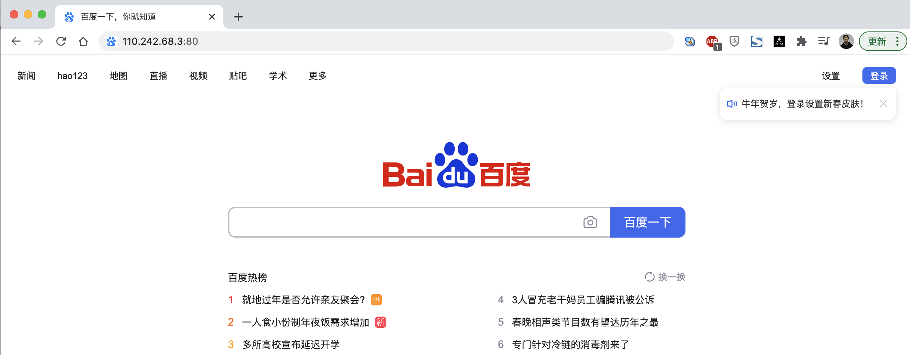


提示：如果在浏览器上只写IP不写端口，则默认是80端口。


#### 1.2.6 域名

假设你创业开发了一个网站，用户很难记住你的公网IP：`123.206.15.88:80`   ``123.206.15.88`。

所以，域名就诞生了，让域名和IP创建对应关系，用户只需要记住域名就可以了，例如：

```
www.baidu.com   -->  110.242.68.3
www.taobao.com  --> 121.18.239.232
...
```

注意：域名只是和IP创建了对应关系，与端口无关 `www.baidu.com:80`。


在用户在自己的电脑或手机上输入域名去访问时，其实要执行两个步骤：

- 根据域名寻找IP。（寻找IP）
- 获得IP之后，再通过IP再去访问指定服务器。


在电脑上属如域名后，寻找IP的过程如下：

- 第一步：在自己电脑的DNS缓存记录中寻找 域名对应的IP，如果未命中，则执行下一步。

- 第二步：在自己电脑的hosts文件中寻找，如果未命中，则执行下一步。

  ```
  - mac系统：/etc/hosts 文件中
  - win系统：C:\Windows\System32\drivers\etc\hosts 文件中
  ```

  ```python
  # 内容示例
  127.0.0.1	localhost
  255.255.255.255	broadcasthost
  127.0.0.1 kubernetes.docker.internal
  192.168.1.55 www.pythonav.com
  ```

- 第三步：在自己电脑上找到DNS配置的地址（本地域名服务器），去这个地址寻找域名对应的IP，如果未命中，则执行下一步。
  

  ```python
  常见的DNS服务器地址：
  	114.114.114.114（114 DNS）
      223.5.5.5（阿里 AliDNS）
      8.8.8.8（Google DNS，随着Google在中国的没落和国内官方的限制，已经不是太好用了）
      ...
      各大运营商也有相应的DNS服务器...
      
  如果你选择的是自动获得DNS，那么就会使用本地运营商的DNS服务器了。
  ```

- 第四步：去根域名服务器中询问（全球共13台根域名服务器，距离中国最近的一台是在日本）

  

  


<span style="color:red;">**问题来了**</span>

了解域名是怎么回事之后？现在你如果想要让自己的网站通过域名来访问，应该怎么办呢？【目前了解即可】

- 租一个域名

  ```
  ICANN，域名的总管理者（美国一个非营利机构），它仅制定域名政策，注册业务它会授权给一些顶级注册商。
  顶级注册商，可以对外销售域名，但要受国家 互联网络信息中心的管理。例如：中国万网(阿里云收购），中国新网，新网互联，商务中国，中国频道等。
  代理注册商，顶级注册上可以再招一些代理帮助他们卖域名。
  ```

  

- 备案

  ```
  现在国内注册域名后，需要进行备案（提交一些网站、个人或企业 等信息）后才能使用。
  注册成功后，可按照引导备案：https://beian.aliyun.com/
  
  注意：国外的域名无需备案就能使用。
  ```

- 域名解析

  ```
  让域名和IP创建关联关系，并将关系同步到相关：本地域名服务器 和 根域名服务器（含顶级和二级域名服务器）。
  ```

  

  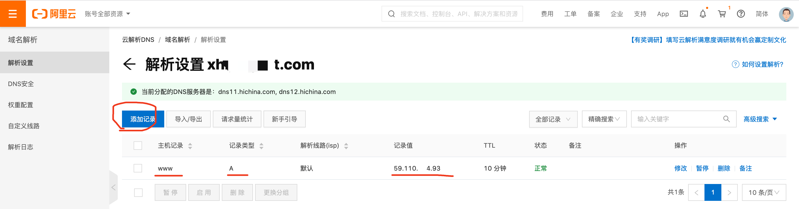


## 2. 网络编程


Python中内置了一个socket模块，可以快速实现网络之间进行传输数据。例如：

- 服务端，放在左边云服务器中（有固定IP）

  ```python
  import socket
  
  # 1.监听本机的IP和端口
  sock = socket.socket(socket.AF_INET, socket.SOCK_STREAM)
  sock.bind(('123.206.15.88', 8001)) # IP,端口
  sock.listen(5) # 支持排队等待5人
  
  while True:
      # 2.等待，有人来连接（阻塞）
      conn, addr = sock.accept() # 等待客户端来连接（阻塞）
  
      # 3.等待，连接者发送消息（阻塞）
      client_data = conn.recv(1024) # 等待接收客户端发来数据
      print(client_data.decode('utf-8')) # 字节
  
      # 4.给连接者回复消息
      conn.sendall("hello world".encode('utf-8'))
  
      # 5.关闭连接
      conn.close()
  
  # 6.停止服务端程序
  sock.close()
  ```

- 客户端，放在右边用户电脑上

  ```python
  import socket
  
  # 1. 向指定IP发送连接请求
  client = socket.socket()
  client.connect(('123.206.15.88', 8001)) # 向服务端发起连接（阻塞）10s
  
  # 2. 连接成功之后，发送消息
  client.sendall('hello'.encode('utf-8'))
  
  # 3. 等待，消息的回复（阻塞）
  reply = client.recv(1024)
  print(reply)
  
  # 4. 关闭连接
  client.close()
  ```

  

上述示例需要借助于互联网，你至少需要租一台云服务器才能通信。

为了节省学习成本，大家可以在自己电脑上模拟【服务端】和【客户端】，等以后项目开发完毕后，再租服务器并部署到服务器上。

注意：在自己本地运行上述代码时，要监听和连接时的IP地址。


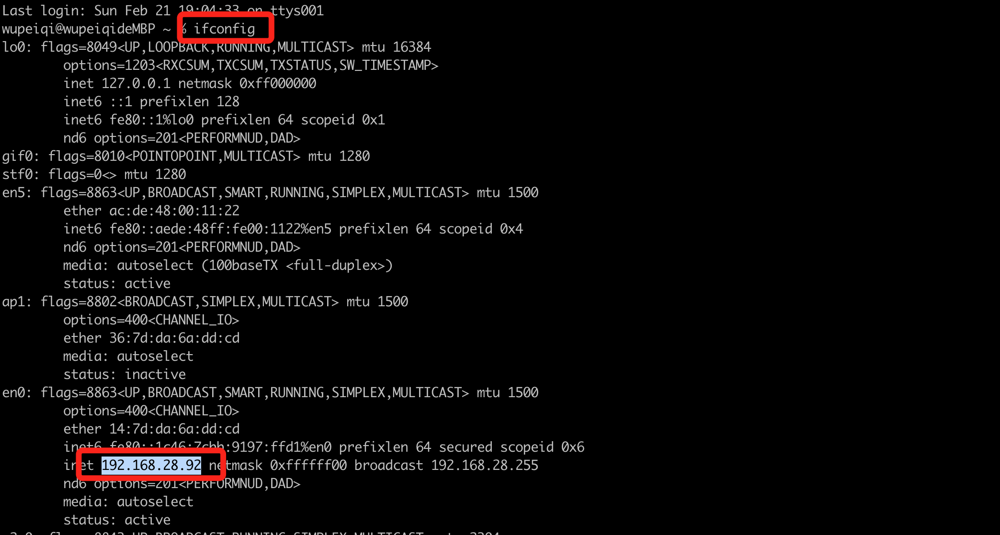


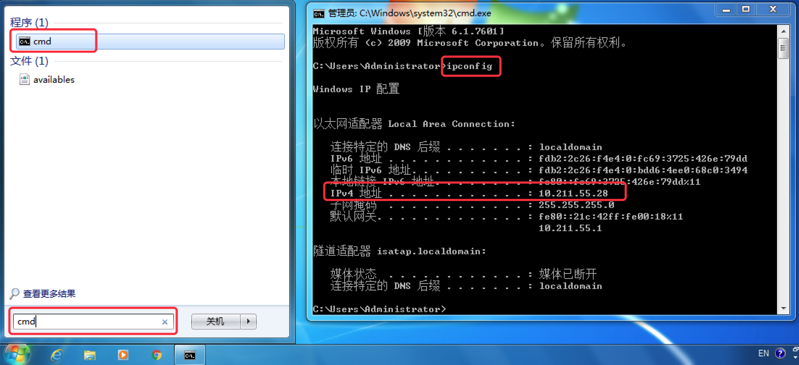

当然，你也可以把在自己的局域网内找两台电脑，A作为服务端，B作为客户端，这样两者也可以通信。

```python
服务端的代码需修改：监听的IP修改为A的IP地址。
客户端的代码需修改：连接的IP修改为A的IP地址（客户端要去找到服务端，并与服务端创建连接）。
```


注意事项：

- 本机：

  ```
  服务端IP：127.0.0.1  / 192.168.28.92（局域网IP）
  ```

- 局域网：

  ```python
  服务端IP：192.168.28.92（局域网IP）    
  ```

- 互联网

  ```python
  服务端IP：123.206.15.88（外网IP）
  ```

  

### 案例：智障客服

- 服务端

  ```python
  import socket
  
  # 1.监听本机的IP和端口
  sock = socket.socket(socket.AF_INET, socket.SOCK_STREAM)
  sock.bind(('127.0.0.1', 8001))  # 127.0.0.1 或 查看自己局域网本地IP地址
  sock.listen(5)
  
  while True:
      # 2.等待，有人来连接（阻塞）
      conn, addr = sock.accept()
      print("有人来连接了...")
  
      # 3.连接成功后立即发送
      conn.sendall("欢迎使用xx系统，请输入您想要办理的业务！".encode("utf-8"))
  
      while True:
          # 3.等待接受信息
          data = conn.recv(1024)
          if not data:
              break
          data_string = data.decode("utf-8")
  
          # 4.回复消息
          conn.sendall("你说啥？".encode("utf-8"))
      print("断开连接了")
      # 5.关闭与此人的连接
      conn.close()
  
  # 6.停止服务端程序
  sock.close()
  
  ```

- 客户端

  ```python
  import socket
  
  # 1. 向指定IP发送连接请求
  client = socket.socket(socket.AF_INET, socket.SOCK_STREAM)
  client.connect(('127.0.0.1', 8001))
  
  # 2.连接成功后，获取系统登录信息
  message = client.recv(1024)
  print(message.decode("utf-8"))
  
  while True:
      content = input("请输入(q/Q退出)：")
      if content.upper() == 'Q':
          break
      client.sendall(content.encode("utf-8"))
  
      # 3. 等待，消息的回复
      reply = client.recv(1024)
      print(reply.decode("utf-8"))
  
  # 关闭连接，关闭连接时会向服务端发送空数据。
  client.close()
  ```


### 案例：文件上传

- 服务端

  ```python
  import socket
  
  sock = socket.socket(socket.AF_INET, socket.SOCK_STREAM)
  sock.bind(('127.0.0.1', 8001))  # 127.0.0.1 或 查看自己局域网本地IP地址
  sock.listen(5)
  
  conn, addr = sock.accept()
  
  # 接收文件大小
  data = conn.recv(1024)
  total_file_size = int(data.decode('utf-8'))
  
  # 接收文件内容
  file_object = open('xxx.png', mode='wb')
  recv_size = 0
  while True:
      # 每次最多接收1024字节
      data = conn.recv(1024)
      file_object.write(data)
      file_object.flush()
  
      recv_size += len(data)
      # 上传完成
      if recv_size == total_file_size:
          break
  
  # 接收完毕，关闭连接
  conn.close()
  sock.close()
  
  ```

- 客户端

  ```python
  import time
  import os
  import socket
  
  client = socket.socket()
  client.connect(('127.0.0.1', 8001))
  
  file_path = input("请输入要上传的文件：")
  
  # 先发送文件大小
  file_size = os.stat(file_path).st_size
  client.sendall(str(file_size).encode('utf-8'))
  
  print("准备...")
  time.sleep(2)
  print("开始上传..")
  file_object = open(file_path, mode='rb')
  read_size = 0
  while True:
      chunk = file_object.read(1024) # 每次读取1024字节
      client.sendall(chunk)
      read_size += len(chunk)
      if read_size == file_size:
          break
  
  client.close()
  ```

  

## 3. B/S和C/S架构


平时在开发或与人沟通时，经常会有人提到b/s和c/s架构，他们是啥意思呢？

- C/S架构，是Client和Server的简称。开发这种架构的程序意味着你即需要开发客户端也需要开发服务端。

  ```python
  例如：你电脑的上QQ、百度网盘、钉钉、QQ音乐 等安装在电脑上的软件。
  
  服务端：互联网公司会开发一个程序放在他们的服务器上，用于给客户端提供数据支持。
  客户端：大家在电脑安装的相关程序，内部会连接服务端进行收发数据并提供 交互和展示的功能。
  ```

- B/S架构，是Browser和Server的简称。开发这种架构的程序意味着你开发服务端即可，客户端用用户电脑上的浏览器来代替。

  ```
  例如：淘宝、京东等网站。
  
  服务端：互联网公司开发一个网站，放在他们的服务器上。
  客户端：不需要开发，用现成的浏览器即可。
  ```

简而言之，B/S架构就是开发网站；C/S架构就是开发安装在电脑的软件。


## 总结

1. 了解常见设备和网络架构。
2. 掌握常见网络词汇的意思。
3. 了解B/S和C/S架构的区别。
4. 基于Python的socket模块实现网络编程。


## 作业

1. 简述 二层交换机 & 路由器 & 三层交换机 的作用。

2. 简述常见词：IP、子网掩码、DHCP、公网IP、端口、域名的作用。

3. 实现远程用户认证系统。

   ```python
   客户端：
   	1. 运行程序，连接服务端并获取服务端发送的欢迎使用xx系统信息。
       2. 输入用户名和密码，并将用户名和密码发送到服务端去校验。
       3. 登录失败，重试（Q退出）。
       4. 登录成功，进入系统，提示登录成功
   服务端：
   	1. 客户端连接上服务端，返回 欢迎使用xx系统信息。
       2. 等待客户端发送用户名和密码进行校验（用户名和密码在文件中）
       3. 登录失败，返回错误信息。
       4. 登录成功，返回成功提示的内容。
   ```

   


