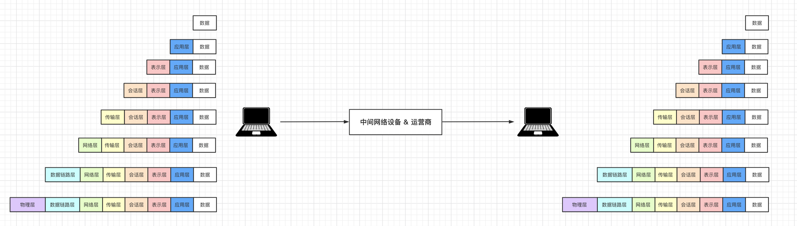

# day21 网络编程

今日概要：

- OSI7层模型
- TCP和UDP
- 粘包


## 1. OSI 7层模型

OSI的7层模型对于大家来说可能不太好理解，所以我们通过一个案例来讲解：


假设，你在浏览器上输入了一些关键字，内部通过DNS找到对应的IP后，再发送数据时内部会做如下的事：

- 应用层：规定数据的格式。

  ```python
  "GET /s?wd=你好 http1.1\r\nHost:www.baidu.com\r\n\r\n"
  ```

- 表示层：对应用层数据的编码、压缩（解压缩）、分块、加密（解密）等任务。

  ```python
  "GET /s?wd=你好 http1.1\r\nHost:www.baidu.com\r\n\r\n你好".encode('utf-8')
  ```

- 会话层：负责与目标建立、中断连接。

  ```
  在发送数据之前，需要会先发送 “连接” 的请求，与远程建立连接后，再发送数据。当然，发送完毕之后，也涉及中断连接的操作。
  ```

- 传输层：建立端口到端口的通信，其实就确定双方的端口信息。

  ```
  数据："GET /s?wd=你好 http1.1\r\nHost:www.baidu.com\r\n\r\n你好".encode('utf-8')
  端口：
  	- 目标：80
  	- 本地：6784
  ```

- 网络层：标记目标IP信息（IP协议层）

  ```
  数据："GET /s?wd=你好 http1.1\r\nHost:www.baidu.com\r\n\r\n你好".encode('utf-8')
  端口：
  	- 目标：80
  	- 本地：6784
  IP：
  	- 目标IP：110.242.68.3（百度）
  	- 本地IP：192.168.10.1
  ```

- 数据链路层：对数据进行分组并设置源和目标mac地址

  ```
  数据："POST /s?wd=你好 http1.1\r\nHost:www.baidu.com\r\n\r\n你好".encode('utf-8')
  端口：
  	- 目标：80
  	- 本地：6784
  IP：
  	- 目标IP：110.242.68.3（百度）
  	- 本地IP：192.168.10.1
  MAC：
  	- 目标MAC：FF-FF-FF-FF-FF-FF 
  	- 本机MAC：11-9d-d8-1a-dd-cd
  ```

- 物理层：将二进制数据在物理媒体上传输。

  ```
  通过网线将二进制数据发送出去
  ```




每一层各司其职，最终保证数据呈现在到用户手中。

简单的可以理解为发快递：将数据外面套了7个箱子，最终用户收到箱子时需要打开7个箱子才能拿到数据。而在运输的过程中有些箱子是会被拆开并替换的，例如：

```
最终运送目标：上海 ~ 北京（中途可能需要中转站），在中转站会会打开箱子查看信息，在进行转发。
	- 对于二级中转站（二层交换机）：拆开数据链路层的箱子，查看mac地址信息。
	- 对于三级中转站（路由器或三层交换机）：拆开网络层的箱子，查看IP信息。
```


在开发过程中其实只能体现：应用层、表示层、会话层、传输层，其他层的处理都是在网络设备中自动完成的。

```python
import socket

client = socket.socket(socket.AF_INET, socket.SOCK_STREAM)
key = "你好"

# 应用层
content = "GET /s?wd={} http1.1\r\nHost:www.baidu.com\r\n\r\n".format(key)
# 表示层
content = content.encode("utf-8")

# 会话层 & 传输层
client.connect(('110.242.68.3', 80))

client.sendall(content)
result = client.recv(8196)
print(result.decode('utf-8'))

# 会话层 & 传输层
client.close()
```


## 2. UDP和TCP协议

协议，其实就是规定 连接、收发数据的一些规定。

在OSI的传输层除了定义端口信息以外，常见的还可以指定UDP或TCP的协议，协议不同连接和传输数据的细节也会不同。

- UDP（User Data Protocol）用户数据报协议， 是⼀个⽆连接的简单的⾯向数据报的传输层协议。 UDP不提供可靠性， 它只是把应⽤程序传给IP层的数据报发送出去， 但是并不能保证它们能到达⽬的地。 由于UDP在传输数据报前不⽤在客户和服务器之间建⽴⼀个连接， 且没有超时重发等机制， 故⽽传输速度很快。

  ```
  常见的有：语音通话、视频通话、实时游戏画面 等。
  ```

- TCP（Transmission Control Protocol，传输控制协议）是面向连接的协议，也就是说，在收发数据前，必须和对方建立可靠的连接，然后再进行收发数据。

  ```
  常见有：网站、手机APP数据获取等。
  ```

  

### 2.1 UDP和TCP 示例代码

UDP示例如下：

- 服务端

  ```python
  import socket
  
  server = socket.socket(socket.AF_INET, socket.SOCK_DGRAM)
  server.bind(('127.0.0.1', 8002))
  
  while True:
      data, (host, port) = server.recvfrom(1024)
      print(data, host, port)
      server.sendto("好的".encode('utf-8'), (host, port))
  ```

- 客户端

  ```python
  import socket
  
  client = socket.socket(socket.AF_INET, socket.SOCK_DGRAM)
  while True:
      text = input("请输入要发送的内容：")
      if text.upper() == 'Q':
          break
      client.sendto(text.encode('utf-8'), ('127.0.0.1', 8002))
      data, (host, port) = client.recvfrom(1024)
      print(data.decode('utf-8'))
  
  client.close()
  ```

  

TCP示例如下：

- 服务端

  ```python
  import socket
  
  # 1.监听本机的IP和端口
  sock = socket.socket(socket.AF_INET, socket.SOCK_STREAM)
  sock.bind(('127.0.0.1', 8001))
  sock.listen(5)
  
  while True:
      # 2.等待，有人来连接（阻塞）
      conn, addr = sock.accept()
  
      # 3.等待，连接者发送消息（阻塞）
      client_data = conn.recv(1024)
      print(client_data)
  
      # 4.给连接者回复消息
      conn.sendall(b"hello world")
  
      # 5.关闭连接
      conn.close()
  
  # 6.停止服务端程序
  sock.close()
  ```

- 客户端

  ```python
  import socket
  
  # 1. 向指定IP发送连接请求
  client = socket.socket()
  client.connect(('127.0.0.1', 8001))
  
  # 2. 连接成功之后，发送消息
  client.sendall(b'hello')
  
  # 3. 等待，消息的回复（阻塞）
  reply = client.recv(1024)
  print(reply)
  
  # 4. 关闭连接
  client.close()
  ```


### 2.2 TCP三次握手和四次挥手

这是一个常见的面试题。


```
    0                   1                   2                   3
    0 1 2 3 4 5 6 7 8 9 0 1 2 3 4 5 6 7 8 9 0 1 2 3 4 5 6 7 8 9 0 1
   +-+-+-+-+-+-+-+-+-+-+-+-+-+-+-+-+-+-+-+-+-+-+-+-+-+-+-+-+-+-+-+-+
   |          Source Port          |       Destination Port        |
   +-+-+-+-+-+-+-+-+-+-+-+-+-+-+-+-+-+-+-+-+-+-+-+-+-+-+-+-+-+-+-+-+
   |                        Sequence Number                        |
   +-+-+-+-+-+-+-+-+-+-+-+-+-+-+-+-+-+-+-+-+-+-+-+-+-+-+-+-+-+-+-+-+
   |                    Acknowledgment Number                      |
   +-+-+-+-+-+-+-+-+-+-+-+-+-+-+-+-+-+-+-+-+-+-+-+-+-+-+-+-+-+-+-+-+
   |  Data |           |U|A|P|R|S|F|                               |
   | Offset| Reserved  |R|C|S|S|Y|I|            Window             |
   |       |           |G|K|H|T|N|N|                               |
   +-+-+-+-+-+-+-+-+-+-+-+-+-+-+-+-+-+-+-+-+-+-+-+-+-+-+-+-+-+-+-+-+
   |           Checksum            |         Urgent Pointer        |
   +-+-+-+-+-+-+-+-+-+-+-+-+-+-+-+-+-+-+-+-+-+-+-+-+-+-+-+-+-+-+-+-+
   |                    Options                    |    Padding    |
   +-+-+-+-+-+-+-+-+-+-+-+-+-+-+-+-+-+-+-+-+-+-+-+-+-+-+-+-+-+-+-+-+
   |                             data                              |
   +-+-+-+-+-+-+-+-+-+-+-+-+-+-+-+-+-+-+-+-+-+-+-+-+-+-+-+-+-+-+-+-+
```

网络中的双方想要基于TCP连接进行通信，必须要经过：

- 创建连接，客户端和服务端要进行三次握手。

  ```python
  # 服务端
  import socket
  
  sock = socket.socket(socket.AF_INET, socket.SOCK_STREAM)
  sock.bind(('127.0.0.1', 8001))
  sock.listen(5)
  
  while True:
      conn, addr = sock.accept() # 等待客户端连接
      ...
  ```

  ```python
  # 客户端
  import socket
  client = socket.socket()
  client.connect(('127.0.0.1', 8001)) # 发起连接
  ```

  ```
        客户端                                                服务端
  
    1.  SYN-SENT    --> <seq=100><CTL=SYN>               --> SYN-RECEIVED
  
    2.  ESTABLISHED <-- <seq=300><ack=101><CTL=SYN,ACK>  <-- SYN-RECEIVED
  
    3.  ESTABLISHED --> <seq=101><ack=301><CTL=ACK>       --> ESTABLISHED
  
        
  At this point, both the client and server have received an acknowledgment of the connection. The steps 1, 2 establish the connection parameter (sequence number) for one direction and it is acknowledged. The steps 2, 3 establish the connection parameter (sequence number) for the other direction and it is acknowledged. With these, a full-duplex communication is established.
  ```

- 传输数据

  ```
  在收发数据的过程中，只有有数据的传送就会有应答（ack），如果没有ack，那么内部会尝试重复发送。
  ```

- 关闭连接，客户端和服务端要进行4次挥手。

  ```python
  import socket
  
  sock = socket.socket(socket.AF_INET, socket.SOCK_STREAM)
  sock.bind(('127.0.0.1', 8001))
  sock.listen(5)
  while True:
      conn, addr = sock.accept()
  	...
      conn.close() # 关闭连接
  sock.close()
  ```

  ```python
  import socket
  
  client = socket.socket()
  client.connect(('127.0.0.1', 8001))
  ...
  client.close() # 关闭连接
  ```

  ```
         TCP A                                                TCP B
  
    1.  FIN-WAIT-1  --> <seq=100><ack=300><CTL=FIN,ACK>  --> CLOSE-WAIT
  
    2.  FIN-WAIT-2  <-- <seq=300><ack=101><CTL=ACK>      <-- CLOSE-WAIT
  
    3.  TIME-WAIT   <-- <seq=300><ack=101><CTL=FIN,ACK>  <-- LAST-ACK
  
    4.  TIME-WAIT   --> <seq=101><ack=301><CTL=ACK>      --> CLOSED
  ```

  


## 3.粘包


