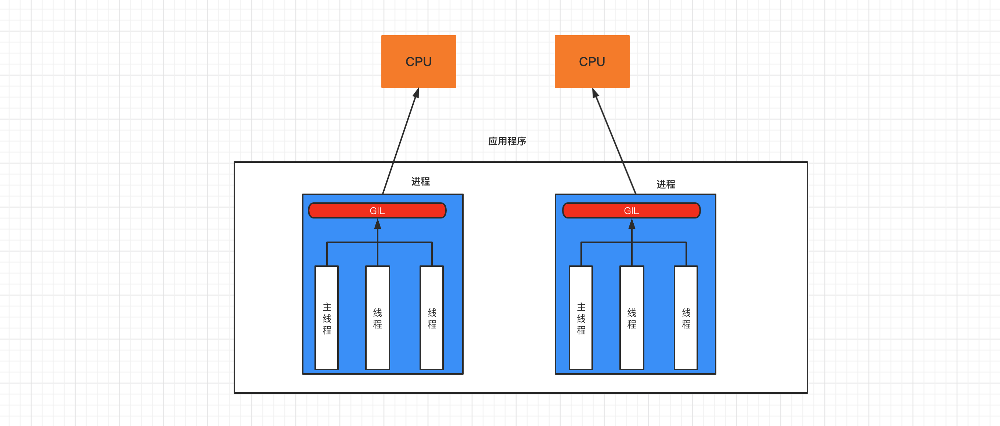

# day22 并发编程（上）


**网络编程**，了解网络相关的**知识点**并且要知道几乎所有网络的通信本质上都是通过socket模块实现。例如：网站、网络爬虫。

**并发编程**，提升代码执行的效率。原来代码执行需要20分钟，学习并发编程后可以加快到1分钟执行完毕。


今日课程目标：初步了解进程和线程并可以基于线程实现并发编程。

今日概要：

- 初识进程和线程
- 多线程开发
- 线程安全
- 线程锁
- 死锁
- 线程池


## 1. 进程和线程

先来了解下进程和线程。

类比：

- 一个**工厂**，至少有一个**车间**，一个车间中至少有一个**工人**，最终是工人在工作。

- 一个**程序**，至少有一个**进程**，一个进程中至少有一个**线程**，最终是线程在工作。

  ```
  上述串行的代码示例就是一个程序，在使用python xx.py 运行时，内部就创建一个进程（主进程），在进程中创建了一个线程（主线程），由线程逐行运行代码。
  ```

进程和线程：

```
线程，是计算机中可以被cpu调度的最小单元(真正在工作）。
进程，是计算机资源分配的最小单元（进程为线程提供资源）。

一个进程中可以有多个线程,同一个进程中的线程可以共享此进程中的资源。
```


以前我们开发的程序中所有的行为都只能通过串行的形式运行，排队逐一执行，前面未完成，后面也无法继续。例如：

```python
import time
result = 0
for i in range(100000000):
    result += i
print(result)
```

```python
import time
import requests

url_list = [
    ("东北F4模仿秀.mp4", "https://aweme.snssdk.com/aweme/v1/playwm/?video_id=v0300f570000bvbmace0gvch7lo53oog"),
    ("卡特扣篮.mp4", "https://aweme.snssdk.com/aweme/v1/playwm/?video_id=v0200f3e0000bv52fpn5t6p007e34q1g"),
    ("罗斯mvp.mp4", "https://aweme.snssdk.com/aweme/v1/playwm/?video_id=v0200f240000buuer5aa4tij4gv6ajqg")
]

print(time.time())
for file_name, url in url_list:
    res = requests.get(url)
    with open(file_name, mode='wb') as f:
        f.write(res.content)
    print(file_name, time.time())
```

通过 **进程** 和 **线程** 都可以将 `串行` 的程序变为`并发`，对于上述示例来说就是同时下载三个视频，这样很短的时间内就可以下载完成。


### 1.1 多线程

基于多线程对上述串行示例进行优化：

- 一个**工厂**，创建一个**车间**，这个车间中创建 **3个工人**，并行处理任务。
- 一个**程序**，创建一个**进程**，这个进程中创建 **3个线程**，并行处理任务。

```python
import time
import requests

url_list = [
    ("东北F4模仿秀.mp4", "https://aweme.snssdk.com/aweme/v1/playwm/?video_id=v0300f570000bvbmace0gvch7lo53oog"),
    ("卡特扣篮.mp4", "https://aweme.snssdk.com/aweme/v1/playwm/?video_id=v0200f3e0000bv52fpn5t6p007e34q1g"),
    ("罗斯mvp.mp4", "https://aweme.snssdk.com/aweme/v1/playwm/?video_id=v0200f240000buuer5aa4tij4gv6ajqg")
]

for file_name, url in url_list:
    res = requests.get(url)
    with open(file_name, mode='wb') as f:
        f.write(res.content)
```


```python
import time
import requests
import threading
"""
def func(a1,a2,a3):
    pass

t = threaing.Thread(target=func,args=(11,22,33))
t.start()
"""

url_list = [
    ("东北F4模仿秀.mp4", "https://aweme.snssdk.com/aweme/v1/playwm/?video_id=v0300f570000bvbmace0gvch7lo53oog"),
    ("卡特扣篮.mp4", "https://aweme.snssdk.com/aweme/v1/playwm/?video_id=v0200f3e0000bv52fpn5t6p007e34q1g"),
    ("罗斯mvp.mp4", "https://aweme.snssdk.com/aweme/v1/playwm/?video_id=v0200f240000buuer5aa4tij4gv6ajqg")
]


def task(file_name, video_url):
    res = requests.get(video_url)
    with open(file_name, mode='wb') as f:
        f.write(res.content)
    print(time.time())


for name, url in url_list:
    # 创建线程，让每个线程都去执行task函数（参数不同）
    t = threading.Thread(target=task, args=(name, url))
    t.start()
```


### 1.2 多进程

基于多进程对上述串行示例进行优化：

- 一个**工厂**，创建 **三个车间**，每个车间 **一个工人（共3人）**，并行处理任务。
- 一个**程序**，创建 **三个进程**，每个进程 **一个线程（共3人）**，并行处理任务。

```python
import time
import requests
import multiprocessing

# 进程创建之后，在进程中还会创建一个线程。
# t = multiprocessing.Process(target=函数名, args=(name, url))
# t.start()
    
    

url_list = [
    ("东北F4模仿秀.mp4", "https://aweme.snssdk.com/aweme/v1/playwm/?video_id=v0300f570000bvbmace0gvch7lo53oog"),
    ("卡特扣篮.mp4", "https://aweme.snssdk.com/aweme/v1/playwm/?video_id=v0200f3e0000bv52fpn5t6p007e34q1g"),
    ("罗斯mvp.mp4", "https://aweme.snssdk.com/aweme/v1/playwm/?video_id=v0200f240000buuer5aa4tij4gv6ajqg")
]


def task(file_name, video_url):
    res = requests.get(video_url)
    with open(file_name, mode='wb') as f:
        f.write(res.content)
    print(time.time())


if __name__ == '__main__':
    print(time.time())
    for name, url in url_list:
        t = multiprocessing.Process(target=task, args=(name, url))
        t.start()
```


综上所述，大家会发现 **多进程** 的开销比 **多线程** 的开销大。哪是不是使用多线程要比多进程更好呀？

接下来，给大家再来介绍一个Python内置的GIL锁的知识，然后再根据 进程 和 线程 各自的特点总结各自适合应用场景。


### 1.3 GIL锁

GIL， 全局解释器锁（Global Interpreter Lock），是CPython解释器特有一个玩意，让一个进程中同一个时刻只能有一个线程可以被CPU调用。




如果程序想利用 计算机的多核优势，让CPU同时处理一些任务，适合用多进程开发（即使资源开销大）。


如果程序不利用 计算机的多核优势，适合用多线程开发。


常见的程序开发中，计算操作需要使用CPU多核优势，IO操作不需要利用CPU的多核优势，所以，就有这一句话：

- 计算密集型，用多进程，例如：大量的数据计算【累加计算示例】。
- IO密集型，用多线程，例如：文件读写、网络数据传输【下载抖音视频示例】。


累加计算示例（计算密集型）：

- 串行处理

  ```python
  import time
  
  start = time.time()
  
  result = 0
  for i in range(100000000):
      result += i
  print(result)
  
  end = time.time()
  
  print("耗时：", end - start) # 耗时： 9.522780179977417
  ```

- 多进程处理

  ```python
  import time
  import multiprocessing
  
  
  def task(start, end, queue):
      result = 0
      for i in range(start, end):
          result += i
      queue.put(result)
  
  
  if __name__ == '__main__':
      queue = multiprocessing.Queue()
  
      start_time = time.time()
  
      p1 = multiprocessing.Process(target=task, args=(0, 50000000, queue))
      p1.start()
  
      p2 = multiprocessing.Process(target=task, args=(50000000, 100000000, queue))
      p2.start()
  
      v1 = queue.get(block=True)
      v2 = queue.get(block=True)
      print(v1 + v2)
  
      end_time = time.time()
  
      print("耗时:", end_time - start_time) # 耗时: 2.6232550144195557
  ```

  

当然，在程序开发中 多线程 和 多进程 是可以结合使用，例如：创建2个进程（建议与CPU个数相同），每个进程中创建3个线程。

```python
import multiprocessing
import threading


def thread_task():
    pass


def task(start, end):
    t1 = threading.Thread(target=thread_task)
    t1.start()

    t2 = threading.Thread(target=thread_task)
    t2.start()

    t3 = threading.Thread(target=thread_task)
    t3.start()


if __name__ == '__main__':
    p1 = multiprocessing.Process(target=task, args=(0, 50000000))
    p1.start()

    p2 = multiprocessing.Process(target=task, args=(50000000, 100000000))
    p2.start()
```


## 2. 多线程开发

```python
import threading

def task(arg):
	pass


# 创建一个Thread对象（线程），并封装线程被CPU调度时应该执行的任务和相关参数。
t = threading.Thread(target=task,args=('xxx',))
# 线程准备就绪（等待CPU调度），代码继续向下执行。
t.start()

print("继续执行...") # 主线程执行完所有代码，不结束（等待子线程）
```


线程的常见方法：

- `t.start()`，当前线程准备就绪（等待CPU调度，具体时间是由CPU来决定）。

  ```python
  import threading
  
  loop = 10000000
  number = 0
  
  def _add(count):
      global number
      for i in range(count):
          number += 1
  
  t = threading.Thread(target=_add,args=(loop,))
  t.start()
  
  print(number)
  ```

- `t.join()`，等待当前线程的任务执行完毕后再向下继续执行。

  ```python
  import threading
  
  number = 0
  
  def _add():
      global number
      for i in range(10000000):
          number += 1
  
  t = threading.Thread(target=_add)
  t.start()
  
  t.join() # 主线程等待中...
  
  print(number)
  ```

  ```python
  import threading
  
  number = 0
  
  
  def _add():
      global number
      for i in range(10000000):
          number += 1
  
  
  def _sub():
      global number
      for i in range(10000000):
          number -= 1
  
  
  t1 = threading.Thread(target=_add)
  t2 = threading.Thread(target=_sub)
  t1.start()
  t1.join()  # t1线程执行完毕,才继续往后走
  t2.start()
  t2.join()  # t2线程执行完毕,才继续往后走
  
  print(number)
  
  ```

  ```python
  import threading
  
  loop = 10000000
  number = 0
  
  
  def _add(count):
      global number
      for i in range(count):
          number += 1
  
  
  def _sub(count):
      global number
      for i in range(count):
          number -= 1
  
  
  t1 = threading.Thread(target=_add, args=(loop,))
  t2 = threading.Thread(target=_sub, args=(loop,))
  t1.start()
  t2.start()
  
  t1.join()  # t1线程执行完毕,才继续往后走
  t2.join()  # t2线程执行完毕,才继续往后走
  
  print(number)
  ```

- `t.setDaemon(布尔值)` ，守护线程（必须放在start之前）

  - `t.setDaemon(True)`，设置为守护线程，主线程执行完毕后，子线程也自动关闭。
  - `t.setDaemon(False)`，设置为非守护线程，主线程等待子线程，子线程执行完毕后，主线程才结束。（默认）

  ```python
  import threading
  import time
  
  def task(arg):
      time.sleep(5)
      print('任务')
  
  t = threading.Thread(target=task, args=(11,))
  t.setDaemon(True) # True/False
  t.start()
  
  print('END')
  ```

- 线程名称的设置和获取

  ```python
  import threading
  
  
  def task(arg):
      # 获取当前执行此代码的线程
      name = threading.current_thread().getName()
      print(name)
  
  
  for i in range(10):
      t = threading.Thread(target=task, args=(11,))
      t.setName('日魔-{}'.format(i))
      t.start()
  ```

- 自定义线程类，直接将线程需要做的事写到run方法中。

  ```python
  import threading
  
  
  class MyThread(threading.Thread):
      def run(self):
          print('执行此线程', self._args)
  
  
  t = MyThread(args=(100,))
  t.start()
  ```

  ```python
  import requests
  import threading
  
  
  class DouYinThread(threading.Thread):
      def run(self):
          file_name, video_url = self._args
          res = requests.get(video_url)
          with open(file_name, mode='wb') as f:
              f.write(res.content)
  
  
  url_list = [
      ("东北F4模仿秀.mp4", "https://aweme.snssdk.com/aweme/v1/playwm/?video_id=v0300f570000bvbmace0gvch7lo53oog"),
      ("卡特扣篮.mp4", "https://aweme.snssdk.com/aweme/v1/playwm/?video_id=v0200f3e0000bv52fpn5t6p007e34q1g"),
      ("罗斯mvp.mp4", "https://aweme.snssdk.com/aweme/v1/playwm/?video_id=v0200f240000buuer5aa4tij4gv6ajqg")
  ]
  for item in url_list:
      t = DouYinThread(args=(item[0], item[1]))
      t.start()
  
  ```

  


## 3. 线程安全

一个进程中可以有多个线程，且线程共享所有进程中的资源。

多个线程同时去操作一个"东西"，**可能**会存在数据混乱的情况，例如：

- 示例1

  ```python
  import threading
  
  loop = 10000000
  number = 0
  
  
  def _add(count):
      global number
      for i in range(count):
          number += 1
  
  
  def _sub(count):
      global number
      for i in range(count):
          number -= 1
  
  
  t1 = threading.Thread(target=_add, args=(loop,))
  t2 = threading.Thread(target=_sub, args=(loop,))
  t1.start()
  t2.start()
  
  t1.join()  # t1线程执行完毕,才继续往后走
  t2.join()  # t2线程执行完毕,才继续往后走
  
  print(number)
  ```

  ```python
  import threading
  
  lock_object = threading.RLock()
  
  loop = 10000000
  number = 0
  
  
  def _add(count):
      lock_object.acquire() # 加锁
      global number
      for i in range(count):
          number += 1
      lock_object.release() # 释放锁
  
  
  def _sub(count):
      lock_object.acquire() # 申请锁（等待）
      global number
      for i in range(count):
          number -= 1
      lock_object.release() # 释放锁
  
  
  t1 = threading.Thread(target=_add, args=(loop,))
  t2 = threading.Thread(target=_sub, args=(loop,))
  t1.start()
  t2.start()
  
  t1.join()  # t1线程执行完毕,才继续往后走
  t2.join()  # t2线程执行完毕,才继续往后走
  
  print(number)
  
  ```

  

- 示例2：

  ```python
  import threading
  
  num = 0
  
  def task():
      global num
      for i in range(1000000):
          num += 1
      print(num)
  
  
  for i in range(2):
      t = threading.Thread(target=task)
      t.start()
  ```

  ```python
  import threading
  
  num = 0
  lock_object = threading.RLock()
  
  
  def task():
      print("开始")
      lock_object.acquire()  # 第1个抵达的线程进入并上锁，其他线程就需要再此等待。
      global num
      for i in range(1000000):
          num += 1
      lock_object.release()  # 线程出去，并解开锁，其他线程就可以进入并执行了
      print(num)
  
  
  for i in range(2):
      t = threading.Thread(target=task)
      t.start()
  ```

  ```python
  import threading
  
  num = 0
  lock_object = threading.RLock()
  
  
  def task():
      print("开始")
      with lock_object: # 基于上下文管理，内部自动执行 acquire 和 release
          global num
          for i in range(1000000):
              num += 1
      print(num)
  
  
  for i in range(2):
      t = threading.Thread(target=task)
      t.start()
  ```

  


在开发的过程中要注意有些操作默认都是 线程安全的（内部集成了锁的机制），我们在使用的时无需再通过锁再处理，例如：

```python
import threading

data_list = []

lock_object = threading.RLock()


def task():
    print("开始")
    for i in range(1000000):
        data_list.append(i)
    print(len(data_list))


for i in range(2):
    t = threading.Thread(target=task)
    t.start()
```


所以，要多注意看一些开发文档中是否标明线程安全。


## 4. 线程锁

在程序中如果想要自己手动加锁，一般有两种：Lock 和 RLock。


- Lock，同步锁。

  ```python
  import threading
  
  num = 0
  lock_object = threading.Lock()
  
  
  def task():
      print("开始")
      lock_object.acquire()  # 第1个抵达的线程进入并上锁，其他线程就需要再此等待。
      global num
      for i in range(1000000):
          num += 1
      lock_object.release()  # 线程出去，并解开锁，其他线程就可以进入并执行了
      
      print(num)
  
  
  for i in range(2):
      t = threading.Thread(target=task)
      t.start()
  
  ```

- RLock，递归锁。

  ```python
  import threading
  
  num = 0
  lock_object = threading.RLock()
  
  
  def task():
      print("开始")
      lock_object.acquire()  # 第1个抵达的线程进入并上锁，其他线程就需要再此等待。
      global num
      for i in range(1000000):
          num += 1
      lock_object.release()  # 线程出去，并解开锁，其他线程就可以进入并执行了
      print(num)
  
  
  for i in range(2):
      t = threading.Thread(target=task)
      t.start()
  ```

  

RLock支持多次申请锁和多次释放；Lock不支持。例如：

```python
import threading
import time

lock_object = threading.RLock()


def task():
    print("开始")
    lock_object.acquire()
    lock_object.acquire()
    print(123)
    lock_object.release()
    lock_object.release()


for i in range(3):
    t = threading.Thread(target=task)
    t.start()
```

```python
import threading
lock = threading.RLock()

# 程序员A开发了一个函数，函数可以被其他开发者调用，内部需要基于锁保证数据安全。
def func():
	with lock:
		pass
        
# 程序员B开发了一个函数，可以直接调用这个函数。
def run():
    print("其他功能")
    func() # 调用程序员A写的func函数，内部用到了锁。
    print("其他功能")
    
# 程序员C开发了一个函数，自己需要加锁，同时也需要调用func函数。
def process():
    with lock:
		print("其他功能")
        func() # ----------------> 此时就会出现多次锁的情况，只有RLock支持（Lock不支持）。
		print("其他功能")
```


## 5.死锁

死锁，由于竞争资源或者由于彼此通信而造成的一种阻塞的现象。

```python
import threading

num = 0
lock_object = threading.Lock()


def task():
    print("开始")
    lock_object.acquire()  # 第1个抵达的线程进入并上锁，其他线程就需要再此等待。
    lock_object.acquire()  # 第1个抵达的线程进入并上锁，其他线程就需要再此等待。
    global num
    for i in range(1000000):
        num += 1
    lock_object.release()  # 线程出去，并解开锁，其他线程就可以进入并执行了
    lock_object.release()  # 线程出去，并解开锁，其他线程就可以进入并执行了
    
    print(num)


for i in range(2):
    t = threading.Thread(target=task)
    t.start()


```

```python
import threading
import time 

lock_1 = threading.Lock()
lock_2 = threading.Lock()


def task1():
    lock_1.acquire()
    time.sleep(1)
    lock_2.acquire()
    print(11)
    lock_2.release()
    print(111)
    lock_1.release()
    print(1111)


def task2():
    lock_2.acquire()
    time.sleep(1)
    lock_1.acquire()
    print(22)
    lock_1.release()
    print(222)
    lock_2.release()
    print(2222)


t1 = threading.Thread(target=task1)
t1.start()

t2 = threading.Thread(target=task2)
t2.start()
```


## 6.线程池

Python3中官方才正式提供线程池。

线程不是开的越多越好，开的多了可能会导致系统的性能更低了，例如：如下的代码是不推荐在项目开发中编写。


**不建议**：无限制的创建线程。

```python
import threading


def task(video_url):
    pass

url_list = ["www.xxxx-{}.com".format(i) for i in range(30000)]

for url in url_list:
    t = threading.Thread(target=task, args=(url,))
    t.start()

# 这种每次都创建一个线程去操作，创建任务的太多，线程就会特别多，可能效率反倒降低了。
```

**建议**：使用线程池

示例1：

```python
import time
from concurrent.futures import ThreadPoolExecutor

# pool = ThreadPoolExecutor(100)
# pool.submit(函数名,参数1，参数2，参数...)


def task(video_url,num):
    print("开始执行任务", video_url)
    time.sleep(5)

# 创建线程池，最多维护10个线程。
pool = ThreadPoolExecutor(10)

url_list = ["www.xxxx-{}.com".format(i) for i in range(300)]

for url in url_list:
    # 在线程池中提交一个任务，线程池中如果有空闲线程，则分配一个线程去执行，执行完毕后再将线程交还给线程池；如果没有空闲线程，则等待。
    pool.submit(task, url,2)
    
print("END")
```


示例2：等待线程池的任务执行完毕。

```python
import time
from concurrent.futures import ThreadPoolExecutor


def task(video_url):
    print("开始执行任务", video_url)
    time.sleep(5)


# 创建线程池，最多维护10个线程。
pool = ThreadPoolExecutor(10)

url_list = ["www.xxxx-{}.com".format(i) for i in range(300)]
for url in url_list:
    # 在线程池中提交一个任务，线程池中如果有空闲线程，则分配一个线程去执行，执行完毕后再将线程交还给线程池；如果没有空闲线程，则等待。
    pool.submit(task, url)

print("执行中...")
pool.shutdown(True)  # 等待线程池中的任务执行完毕后，在继续执行
print('继续往下走')
```


示例3：任务执行完任务，再干点其他事。

```python
import time
import random
from concurrent.futures import ThreadPoolExecutor, Future


def task(video_url):
    print("开始执行任务", video_url)
    time.sleep(2)
    return random.randint(0, 10)


def done(response):
    print("任务执行后的返回值", response.result())


# 创建线程池，最多维护10个线程。
pool = ThreadPoolExecutor(10)

url_list = ["www.xxxx-{}.com".format(i) for i in range(15)]

for url in url_list:
    # 在线程池中提交一个任务，线程池中如果有空闲线程，则分配一个线程去执行，执行完毕后再将线程交还给线程池；如果没有空闲线程，则等待。
    future = pool.submit(task, url)
    future.add_done_callback(done) # 是子主线程执行
    
# 可以做分工，例如：task专门下载，done专门将下载的数据写入本地文件。
```


示例4：最终统一获取结果。

```python
import time
import random
from concurrent.futures import ThreadPoolExecutor,Future


def task(video_url):
    print("开始执行任务", video_url)
    time.sleep(2)
    return random.randint(0, 10)


# 创建线程池，最多维护10个线程。
pool = ThreadPoolExecutor(10)

future_list = []

url_list = ["www.xxxx-{}.com".format(i) for i in range(15)]
for url in url_list:
    # 在线程池中提交一个任务，线程池中如果有空闲线程，则分配一个线程去执行，执行完毕后再将线程交还给线程池；如果没有空闲线程，则等待。
    future = pool.submit(task, url)
    future_list.append(future)
    
pool.shutdown(True)
for fu in future_list:
    print(fu.result())
```


案例：基于线程池下载豆瓣图片。

```csv
26044585,Hush,https://hbimg.huabanimg.com/51d46dc32abe7ac7f83b94c67bb88cacc46869954f478-aP4Q3V
19318369,柒十一,https://hbimg.huabanimg.com/703fdb063bdc37b11033ef794f9b3a7adfa01fd21a6d1-wTFbnO
15529690,Law344,https://hbimg.huabanimg.com/b438d8c61ed2abf50ca94e00f257ca7a223e3b364b471-xrzoQd
18311394,Jennah·,https://hbimg.huabanimg.com/4edba1ed6a71797f52355aa1de5af961b85bf824cb71-px1nZz
18009711,可洛爱画画,https://hbimg.huabanimg.com/03331ef39b5c7687f5cc47dbcbafd974403c962ae88ce-Co8AUI
30574436,花姑凉~,https://hbimg.huabanimg.com/2f5b657edb9497ff8c41132e18000edb082d158c2404-8rYHbw
17740339,小巫師,https://hbimg.huabanimg.com/dbc6fd49f1915545cc42c1a1492a418dbaebd2c21bb9-9aDqgl
18741964,桐末tonmo,https://hbimg.huabanimg.com/b60cee303f62aaa592292f45a1ed8d5be9873b2ed5c-gAJehO
30535005,TANGZHIQI,https://hbimg.huabanimg.com/bbd08ee168d54665bf9b07899a5c4a4d6bc1eb8af77a4-8Gz3K1
31078743,你的老杨,https://hbimg.huabanimg.com/c46fbc3c9a01db37b8e786cbd7174bbd475e4cda220f4-F1u7MX
25519376,尺尺寸,https://hbimg.huabanimg.com/ee29ee198efb98f970e3dc2b24c40d89bfb6f911126b6-KGvKes
21113978,C-CLong,https://hbimg.huabanimg.com/7fa6b2a0d570e67246b34840a87d57c16a875dba9100-SXsSeY
24674102,szaa,https://hbimg.huabanimg.com/0716687b0df93e8c3a8e0925b6d2e4135449cd27597c4-gWdv24
30508507,爱起床的小灰灰,https://hbimg.huabanimg.com/4eafdbfa21b2f300a7becd8863f948e5e92ef789b5a5-1ozTKq
12593664,yokozen,https://hbimg.huabanimg.com/cd07bbaf052b752ed5c287602404ea719d7dd8161321b-cJtHss
16899164,一阵疯,https://hbimg.huabanimg.com/0940b557b28892658c3bcaf52f5ba8dc8402100e130b2-G966Uz
847937,卩丬My㊊伴er彎,https://hbimg.huabanimg.com/e2d6bb5bc8498c6f607492a8f96164aa2366b104e7a-kWaH68
31010628,慢慢即漫漫,https://hbimg.huabanimg.com/c4fb6718907a22f202e8dd14d52f0c369685e59cfea7-82FdsK
13438168,海贼玩跑跑,https://hbimg.huabanimg.com/1edae3ce6fe0f6e95b67b4f8b57c4cebf19c501b397e-BXwiW6
28593155,源稚生,https://hbimg.huabanimg.com/626cfd89ca4c10e6f875f3dfe1005331e4c0fd7fd429-9SeJeQ
28201821,合伙哼哼,https://hbimg.huabanimg.com/f59d4780531aa1892b80e0ec94d4ec78dcba08ff18c416-769X6a
28255146,漫步AAA,https://hbimg.huabanimg.com/3c034c520594e38353a039d7e7a5fd5e74fb53eb1086-KnpLaL
30537613,配䦹,https://hbimg.huabanimg.com/efd81d22c1b1a2de77a0e0d8e853282b83b6bbc590fd-y3d4GJ
22665880,日后必火,https://hbimg.huabanimg.com/69f0f959979a4fada9e9e55f565989544be88164d2b-INWbaF
16748980,keer521521,https://hbimg.huabanimg.com/654953460733026a7ef6e101404055627ad51784a95c-B6OFs4
30536510,“西辞”,https://hbimg.huabanimg.com/61cfffca6b2507bf51a507e8319d68a8b8c3a96968f-6IvMSk
30986577,艺成背锅王,https://hbimg.huabanimg.com/c381ecc43d6c69758a86a30ebf72976906ae6c53291f9-9zroHF
26409800,CsysADk7,https://hbimg.huabanimg.com/bf1d22092c2070d68ade012c588f2e410caaab1f58051-ahlgLm
30469116,18啊全阿,https://hbimg.huabanimg.com/654953460733026a7ef6e101404055627ad51784a95c-B6OFs4
17473505,椿の花,https://hbimg.huabanimg.com/0e38d810e5a24f91ebb251fd3aaaed8bb37655b14844c-pgNJBP
19165177,っ思忆゜♪,https://hbimg.huabanimg.com/4815ea0e4905d0f3bb82a654b481811dadbfe5ce2673-vMVr0B
16059616,格林熊丶,https://hbimg.huabanimg.com/8760a2b08d87e6ed4b7a9715b1a668176dbf84fec5b-jx14tZ
30734152,sCWVkJDG,https://hbimg.huabanimg.com/f31a5305d1b8717bbfb897723f267d316e58e7b7dc40-GD3e22
24019677,虚无本心,https://hbimg.huabanimg.com/6fdfa9834abe362e978b517275b06e7f0d5926aa650-N1xCXE
16670283,Y-雨后天空,https://hbimg.huabanimg.com/a3bbb0045b536fc27a6d2effa64a0d43f9f5193c177f-I2vHaI
21512483,汤姆2,https://hbimg.huabanimg.com/98cc50a61a7cc9b49a8af754ffb26bd15764a82f1133-AkiU7D
16441049,笑潇啸逍小鱼,https://hbimg.huabanimg.com/ae8a70cd85aff3a8587ff6578d5cf7620f3691df13e46-lmrIi9
24795603,⁢⁢⁢⁢⁢v,https://hbimg.huabanimg.com/a7183cc3a933aa129d7b3230bf1378fd8f5857846cc5-3tDtx3
29819152,妮玛士珍多,https://hbimg.huabanimg.com/ca4ecb573bf1ff0415c7a873d64470dedc465ea1213c6-RAkArS
19101282,陈勇敢❤,https://hbimg.huabanimg.com/ab6d04ebaff3176e3570139a65155856871241b58bc6-Qklj2E
28337572,爱意随风散,https://hbimg.huabanimg.com/117ad8b6eeda57a562ac6ab2861111a793ca3d1d5543-SjWlk2
17342758,幸运instant,https://hbimg.huabanimg.com/72b5f9042ec297ae57b83431123bc1c066cca90fa23-3MoJNj
18483372,Beau染,https://hbimg.huabanimg.com/077115cb622b1ff3907ec6932e1b575393d5aae720487-d1cdT9
22127102,栽花的小蜻蜓,https://hbimg.huabanimg.com/6c3cbf9f27e17898083186fc51985e43269018cc1e1df-QfOIBG
13802024,LoveHsu,https://hbimg.huabanimg.com/f720a15f8b49b86a7c1ee4951263a8dbecfe3e43d2d-GPEauV
22558931,白驹过隙丶梨花泪う,https://hbimg.huabanimg.com/e49e1341dfe5144da5c71bd15f1052ef07ba7a0e1296b-jfyfDJ
11762339,cojoy,https://hbimg.huabanimg.com/5b27f876d5d391e7c4889bc5e8ba214419eb72b56822-83gYmB
30711623,雪碧学长呀,https://hbimg.huabanimg.com/2c288a1535048b05537ba523b3fc9eacc1e81273212d1-nr8M4t
18906718,西霸王,https://hbimg.huabanimg.com/7b02ad5e01bd8c0a29817e362814666a7800831c154a6-AvBDaG
31037856,邵阳的小哥哥,https://hbimg.huabanimg.com/654953460733026a7ef6e101404055627ad51784a95c-B6OFs4
26830711,稳健谭,https://hbimg.huabanimg.com/51547ade3f0aef134e8d268cfd4ad61110925aefec8a-NKPEYX
```

```python
import os
import requests
from concurrent.futures import ThreadPoolExecutor


def download(file_name, image_url):
    res = requests.get(
        url=image_url,
        headers={
            "User-Agent": "Mozilla/5.0 (Macintosh; Intel Mac OS X 10_15_7) AppleWebKit/537.36 (KHTML, like Gecko) Chrome/87.0.4280.88 Safari/537.36"
        }
    )
    # 检查images目录是否存在？不存在，则创建images目录
    if not os.path.exists("images"):
        # 创建images目录
        os.makedirs("images")
    file_path = os.path.join("images", file_name)
    # 2.将图片的内容写入到文件
    with open(file_path, mode='wb') as img_object:
        img_object.write(res.content)


# 创建线程池，最多维护10个线程。
pool = ThreadPoolExecutor(10)

with open("mv.csv", mode='r', encoding='utf-8') as file_object:
    for line in file_object:
        nid, name, url = line.split(",")
        file_name = "{}.png".format(name)
        pool.submit(download, file_name, url)
```

```python
import os
import requests
from concurrent.futures import ThreadPoolExecutor


def download(image_url):
    res = requests.get(
        url=image_url,
        headers={
            "User-Agent": "Mozilla/5.0 (Macintosh; Intel Mac OS X 10_15_7) AppleWebKit/537.36 (KHTML, like Gecko) Chrome/87.0.4280.88 Safari/537.36"
        }
    )
    return res


def outer(file_name):
    def save(response):
        res = response.result()
        # 写入本地
        # # 检查images目录是否存在？不存在，则创建images目录
        if not os.path.exists("images"):
            # 创建images目录
            os.makedirs("images")

        file_path = os.path.join("images", file_name)

        # # 2.将图片的内容写入到文件
        with open(file_path, mode='wb') as img_object:
            img_object.write(res.content)

    return save


# 创建线程池，最多维护10个线程。
pool = ThreadPoolExecutor(10)

with open("mv.csv", mode='r', encoding='utf-8') as file_object:
    for line in file_object:
        nid, name, url = line.split(",")
        file_name = "{}.png".format(name)
        fur = pool.submit(download, url)
        fur.add_done_callback(outer(file_name))
```


## 7.单例模式（扩展）


面向对象 + 多线程相关的一个面试题（以后项目和源码中会用到）。


之前写一个类，每次执行 `类()` 都会实例化一个类的对象。

```python
class Foo:
    pass

obj1 = Foo()

obj2 = Foo()
print(obj1,obj2)
```


以后开发会遇到单例模式，每次实例化类的对象时，都是最开始创建的那个对象，不再重复创建对象。


- 简单的实现单例模式

  ```python
  class Singleton:
      instance = None
  
      def __init__(self, name):
          self.name = name
          
      def __new__(cls, *args, **kwargs):
          # 返回空对象
          if cls.instance:
              return cls.instance
          cls.instance = object.__new__(cls)
          return cls.instance
  
  obj1 = Singleton('alex')
  obj2 = Singleton('SB')
  
  print(obj1,obj2)
  ```

- 多线程执行单例模式，有BUG

  ```python
  import threading
  import time
  
  
  class Singleton:
      instance = None
  
      def __init__(self, name):
          self.name = name
  
      def __new__(cls, *args, **kwargs):
          if cls.instance:
              return cls.instance
          time.sleep(0.1)
          cls.instance = object.__new__(cls)
          return cls.instance
  
  
  def task():
      obj = Singleton('x')
      print(obj)
  
  
  for i in range(10):
      t = threading.Thread(target=task)
      t.start()
  
  ```

- 加锁解决BUG

  ```python
  import threading
  import time
  class Singleton:
      instance = None
      lock = threading.RLock()
  
      def __init__(self, name):
          self.name = name
          
      def __new__(cls, *args, **kwargs):
          with cls.lock:
              if cls.instance:
                  return cls.instance
              time.sleep(0.1)
              cls.instance = object.__new__(cls)
          return cls.instance
  
  def task():
      obj = Singleton('x')
      print(obj)
  
  for i in range(10):
      t = threading.Thread(target=task)
      t.start()
  ```

- 加判断，提升性能

  ```python
  import threading
  import time
  class Singleton:
      instance = None
      lock = threading.RLock()
  
      def __init__(self, name):
          self.name = name
          
      def __new__(cls, *args, **kwargs):
  
          if cls.instance:
              return cls.instance
          with cls.lock:
              if cls.instance:
                  return cls.instance
              time.sleep(0.1)
              cls.instance = object.__new__(cls)
          return cls.instance
  
  def task():
      obj = Singleton('x')
      print(obj)
  
  for i in range(10):
      t = threading.Thread(target=task)
      t.start()
  
  # 执行1000行代码
  
  data = Singleton('asdfasdf')
  print(data)
  ```


## 总结

1. 进程和线程的区别和应用场景。
2. 什么是GIL锁
3. 多线程和线程池的使用。
4. 线程安全 & 线程锁 & 死锁
5. 单例模式


## 作业

1. 简述进程和线程的区别以及应用场景。

2. 什么是GIL锁

3. 手写单例模式

4. 程序从flag a执行到falg b的时间大致是多少秒？

   ```python
   import threading
   import time
   def _wait():
   	time.sleep(60)
   # flag a
   t = threading.Thread(target=_wait)
   t.setDaemon(False)
   t.start()
   # flag b
   ```

5. 程序从flag a执行到falg b的时间大致是多少秒？

   ```python
   import threading
   import time
   def _wait():
   	time.sleep(60)
   # flag a
   t = threading.Thread(target=_wait)
   t.setDaemon(True)
   t.start()
   # flag b
   ```

6. 程序从flag a执行到falg b的时间大致是多少秒？

   ```python
   import threading
   import time
   def _wait():
   	time.sleep(60)
   # flag a
   t = threading.Thread(target=_wait)
   t.start()
   t.join()
   # flag b
   ```

7. 读程序，请确认执行到最后number是否一定为0

   ```python
   import threading
   loop = int(1E7)
   def _add(loop = 1):
   	global number
   	for _ in range(loop):
   		number += 1
   def _sub(loop = 1):
   	global number
   	for _ in range(loop):
   		number -= 1
   number = 0
   ta = threading.Thread(target=_add,args=(loop,))
   ts = threading.Thread(target=_sub,args=(loop,))
   ta.start()
   ta.join()
   ts.start()
   ts.join()
   ```

8. 读程序，请确认执行到最后number是否一定为0

   ```python
   import threading
   loop = int(1E7)
   number = 0
   
   def _add(loop = 1):
   	global number
   	for _ in range(loop):
   		number += 1
   def _sub(loop = 1):
   	global number
   	for _ in range(loop):
   		number -= 1
   
   ta = threading.Thread(target=_add,args=(loop,))
   ts = threading.Thread(target=_sub,args=(loop,))
   ta.start()
   ts.start()
   ta.join()
   ts.join()
   ```

9. data.txt 文件中共有 10000 条数据，请为每 100行 数据创建一个线程，并在线程中把当前100条数据的num列相加并打印。

   ```
   subscription_id,erotic,num
   ASDFOKASDJF423KASDFJASDF,5,1
   FSD23R23SFSDF4DFGDFGDFGDF,5,99
   ASDDSFGWERTCERT44GFGDSFG,5,2
   FFFFFFSDSVFG5RTFGDDFFFFA,5,11
   ASDFASDF3234XCVWEGDFGSAF,5,1
   ...
   ```

   


